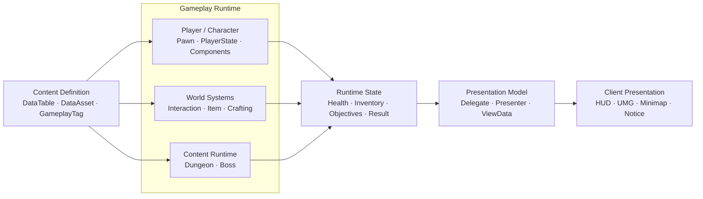

# 02. Gameplay Architecture

Sonheim은 **상태의 소유권과 수명, 기능 간 의존 방향, gameplay와 presentation의 경계**를 먼저 정한 뒤 각 시스템을 배치합니다.

핵심 원칙은 다음과 같습니다.

1. **Player·World·Content 상태를 실제 수명에 맞는 UE 계층에 둡니다.**
2. **독립적으로 바뀌는 기능은 ActorComponent로 분리하고, 서로 다른 Actor의 공통 행동은 Interface로 연결합니다.**
3. **정적 정의(Data)와 실행 중 상태(Runtime State)를 분리합니다.**
4. **Gameplay 상태와 UI가 소비하는 Presentation State를 분리합니다.**
5. **멀티플레이 동기화는 이 경계 위에서 필요한 범위에만 적용합니다.**

---

## Architecture at a Glance



이 그림은 네트워크 호출 순서가 아니라 **정의 → 실행 → 상태 → 표현**으로 책임을 나눈 구조를 나타냅니다.

---

## 1. Lifetime — 상태가 얼마나 오래 살아야 하는가

UE Gameplay Framework의 객체 수명에 맞춰 데이터를 배치합니다.

| 상태/기능 | 배치 | 이유 |
|---|---|---|
| 이동·Mesh·Animation | Pawn | 현재 World body에 종속 |
| Inventory·Stat | PlayerState | Pawn 교체와 분리할 Player data |
| 입력·UI bootstrap | PlayerController | Player connection과 입력 수명에 종속 |
| 현재 Dungeon Run | WorldSubsystem | 현재 World에서만 존재하는 콘텐츠 runtime |
| Dungeon shared state | GameState | 여러 Client가 같은 현재 상태를 소비 |
| Dungeon asset / progress | GameInstanceSubsystem | World보다 긴 수명과 Save/asset 책임 |
| Dungeon UI / Notice | LocalPlayerSubsystem | 특정 LocalPlayer 화면 수명에 종속 |

### Pawn과 PlayerState를 나눈 이유

Inventory와 Stat을 Pawn에 두면 죽음·재빙의와 같은 Pawn lifecycle에 같이 묶입니다.  
반대로 이동·Animation을 PlayerState에 두면 월드의 실제 body와 데이터 수명이 뒤섞입니다.

```text
Player identity에 가까운 Data → PlayerState
World body에 가까운 State    → Pawn
```

처럼 수명 기준으로 분리했습니다.

---

## 2. Composition — 기능 단위로 조합한다

`AAreaObject`는 Player/Monster 공통 gameplay facade이고, 실제 기능은 component가 소유합니다.

```text
AAreaObject
 ├─ HealthComponent
 ├─ StaminaComponent
 ├─ ConditionComponent
 ├─ LevelComponent
 ├─ SkillComponent
 └─ Move / Rotate Utility
```

외부 시스템은 `DecreaseHP()`, `AddCondition()`, `CastSkill()` 같은 일관된 API를 사용하고, 내부 상태 변경은 각 component에 위임합니다.

상속 계층으로 `CanAttack`, `HasInventory`, `CanCapture` 같은 기능 조합을 표현하기보다 **독립적으로 바뀌는 기능을 필요한 Actor에 조합**하는 쪽을 선택했습니다.

### 선택 비용

Component 수가 늘면 orchestration과 의존 관계를 별도로 관리해야 합니다.  
그래서 모든 로직을 component로 쪼개기보다 **독립적인 상태/수명을 갖고 재사용되는 기능**을 중심으로 분리합니다.

---

## 3. Interface — Actor 종류보다 Capability에 의존한다

Item, Container, Crafting Station, Lever, Portal은 서로 다른 class지만 Player의 Interaction 흐름에서는 모두 `IInteractableInterface`를 사용합니다.

```text
InteractionComponent
        ↓
IInteractableInterface
        ├─ Item
        ├─ Container
        ├─ Crafting Station
        ├─ Lever
        └─ Dungeon Portal
```

각 대상이:

- 상호작용 가능 여부
- Prompt
- Hold 시간
- 취소 가능 여부
- 실제 Interact 동작

을 제공합니다.

Player 입력이나 UI가 concrete class마다 `if Item ... else if Lever ...` 분기를 늘리지 않고, **동일한 입력 흐름에서 대상별 기능을 실행**할 수 있습니다.

---

## 4. Data와 Runtime State를 분리한다

Skill이나 Dungeon은 “무엇인지 정의하는 데이터”와 “지금 어떤 상태인지”가 다릅니다.

예를 들어 Skill은:

```text
FSkillData
→ Skill의 정적 정의

FSonheimSkillSpecItem
→ 현재 Casting / Cooldown 등 Runtime State

UBaseSkill
→ 실제 실행 Logic
```

으로 나뉩니다.

Dungeon도:

```text
UDungeonDefinitionDataAsset
→ Stage / Rule / Transition 정의

FDungeonStageRuntimeState
→ 현재 Run의 Stage / Objective / Boss / Result 상태
```

로 분리합니다.

정적 정의를 runtime object에 직접 섞지 않아 같은 콘텐츠 정의를 반복 실행하거나 Editor에서 검증하기 쉬워집니다.

---

## 5. Gameplay State와 Presentation을 분리한다

Health처럼 단순한 값은 RepNotify/Delegate를 통해 HUD가 갱신됩니다.

반면 Dungeon처럼 여러 상태가 함께 화면을 구성하는 경우에는:

```text
Runtime State
   ↓
Presenter
   ↓
ViewData
   ↓
UMG
```

를 사용합니다.

Widget이 GameplayTag, Stage transition, Item lookup을 직접 해석하지 않고 **화면에 필요한 데이터 형태만 소비**하도록 합니다.

### 선택 비용

Presenter/ViewData layer는 mapping code를 추가합니다.  
따라서 단순 HP bar까지 같은 구조로 만들지 않고, Dungeon처럼 **여러 gameplay state를 조합하고 UI가 재생성될 수 있는 화면**에 한정해 적용합니다.

---

## 6. 시스템 간 변화 전달

상태 성격에 따라 연결 방식을 나눕니다.

### 독립 상태

Health, Inventory, Equipment처럼 owner가 명확한 값:

```text
State Change
 → Delegate
 → Subscriber / UI
```

### 복합 콘텐츠 상태

Stage, Objective, Boss, Result가 함께 현재 콘텐츠 상태를 구성하는 Dungeon:

```text
Dungeon Runtime
 → Runtime Snapshot
 → Presenter
 → ViewData
```

### 일회성 Presentation

Level Up, Capture Failure, Crafting Complete처럼 저장할 “현재 상태”가 아닌 메시지:

```text
Gameplay Event
 → NoticeSubsystem
 → Banner / Title
```

모든 변화를 하나의 Event Bus나 하나의 UI 패턴으로 통일하지 않고 **필요한 복구 가능성과 수명에 맞춰 구분**합니다.

---

## 7. 실제 확장에서 확인된 재사용

- `IInteractableInterface` — Item/Container/Crafting에서 Dungeon Portal/Lever까지 재사용
- Monster death/capture event — Dungeon Objective progress에 연결
- Inventory API — Dungeon Reward 지급에 재사용
- Pal Capture — Guardian Exhaust Capture에 재사용
- Combat `FAttackData` — Boss Strike에서도 재사용
- Dungeon 전용 Toast — 공용 `UNoticeSubsystem`으로 일반화

새 콘텐츠에서 기존 경계를 재사용하기 어려운 경우에는 추상화를 유지하기보다 책임 위치를 다시 조정했습니다.

---

## 설계 선택 요약

| 문제 | 선택 | 비용 | 선택 이유 |
|---|---|---|---|
| Player data와 Pawn lifecycle 분리 | **PlayerState / Pawn 역할 분리** | 초기화·재연결 코드 필요 | 지속 데이터와 월드 body의 수명이 다름 |
| 여러 Actor의 공통 기능 | **ActorComponent** | component orchestration 필요 | 기능을 상속 계층과 무관하게 조합 |
| 서로 다른 Actor의 공통 행동 | **Interface** | contract가 커질 수 있음 | concrete class 분기 없이 입력/UI 재사용 |
| 정적 콘텐츠와 실행 상태 | **Data / Runtime 분리** | type과 mapping 증가 | 반복 실행·검증·authoring 용이 |
| 복잡한 UI | **Presenter / ViewData** | mapping layer 추가 | gameplay와 UMG lifecycle 분리 |

멀티플레이에서 이 구조를 어떻게 동기화했는지는 [[12. Multiplayer Synchronization|12_Multiplayer_Synchronization]]에서 별도로 설명합니다.

---

## 연관 문서

- [[3. Data & Content Architecture|03_Data_Content_Architecture]] — DataTable / DataAsset / GameplayTag 역할
- [[4. Player & Character Systems|04_Player_Character_Systems]] — Pawn / PlayerState / Component 구조
- [[6. World Interaction Systems|06_World_Interaction_Systems]] — Interface 기반 Interaction
- [[9. Branching Dungeon Runtime|09_Branching_Dungeon_Runtime]] — Definition과 Runtime State의 실제 콘텐츠 적용
- [[11. Client State & Presentation Pipeline|11_Client_State_Presentation_Pipeline]] — Runtime State를 UI로 변환하는 구조
- [[12. Multiplayer Synchronization|12_Multiplayer_Synchronization]] — RPC / Replication / Prediction의 적용 범위

---

## 관련 코드

- [AreaObject](https://github.com/chungheonLee0325/Sonheim/tree/main/Sonheim/Source/Sonheim/AreaObject)
- [SonheimPlayerState](https://github.com/chungheonLee0325/Sonheim/blob/main/Sonheim/Source/Sonheim/AreaObject/Player/SonheimPlayerState.h)
- [InteractionComponent](https://github.com/chungheonLee0325/Sonheim/blob/main/Sonheim/Source/Sonheim/AreaObject/Player/Utility/InteractionComponent.h)
- [DungeonStageRuntimeSubsystem](https://github.com/chungheonLee0325/Sonheim/blob/main/Sonheim/Source/Sonheim/GameManager/Dungeon/DungeonStageRuntimeSubsystem.h)
