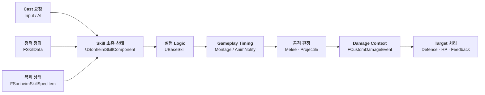

# 05. Combat, Skill & Animation

Sonheim의 전투는 **Skill Definition → Runtime State → Skill Logic → Animation Timing → Hit Detection → Damage Context**를 분리해 구성했습니다.

공격 종류가 늘어나도 Input 코드나 Character class에 판정 로직을 계속 추가하지 않고, Skill Data와 실행 객체를 조합해 근접 공격·투사체·장비 Skill을 같은 흐름에서 처리합니다.

---

## 전체 실행 흐름



핵심은 **Skill의 정의·현재 상태·실행 코드·Animation timing을 서로 다른 책임으로 둔 것**입니다.

---

## 1. Skill을 Data / State / Logic으로 분리

### 정적 정의 — `FSkillData`

```cpp
struct FSkillData : public FTableRowBase
{
    int SkillID = 0;
    TSubclassOf<UBaseSkill> SkillClass;

    TArray<FSkillStaminaCost> StaminaCosts;
    TArray<FSkillItemCost> ItemCosts;

    float CastRange = 0.f;
    float CoolTime = 0.f;

    UAnimMontage* Montage = nullptr;
    TArray<FAttackData> AttackData;

    TSubclassOf<ABaseElement> ElementClass;
    int NextSkillID = 0;
};
```

한 Skill row가 다음을 연결합니다.

- 어떤 `UBaseSkill` 파생 로직을 사용할지
- 언제 어떤 Cost를 소모할지
- 어느 거리에서 사용할 수 있는지
- 어떤 Montage를 재생할지
- 몇 개의 `FAttackData`를 사용할지
- Combo가 다음 Skill로 이어지는지

Skill마다 별도 Character 코드를 추가하기보다 **Data가 실행 로직과 공격 데이터를 선택**합니다.

### Runtime State — `FSonheimSkillSpecItem`

```cpp
struct FSonheimSkillSpecItem : public FFastArraySerializerItem
{
    int32 SkillId = 0;
    int32 Level = 1;
    bool bIsCasting = false;
    float CooldownEndTime = 0.f;
};
```

Client에 필요한 것은 `UBaseSkill*` 자체가 아니라:

- 어떤 Skill을 사용할 수 있는지
- 현재 Casting 중인지
- Cooldown이 언제 끝나는지

같은 작은 상태입니다.

### 실행 Logic — `UBaseSkill`

```cpp
virtual bool Activate(AAreaObject* Caster, AAreaObject* Target);
virtual bool Fire();
virtual bool Complete();
virtual void Cancel();
```

공통 lifecycle은 `UBaseSkill`이 제공하고, Melee / Projectile 같은 차이는 파생 class가 구현합니다.

---

## 2. Skill Logic은 필요할 때 생성

보유 가능한 모든 Skill UObject를 시작 시점에 미리 만들지 않습니다.

```cpp
UBaseSkill* USonheimSkillComponent::EnsureSkillInstance(int32 SkillId)
{
    if (TObjectPtr<UBaseSkill>* Found = SkillInstances.Find(SkillId))
        if (IsValid(*Found))
            return *Found;

    FSkillData* Data = GI->GetDataSkill(SkillId);
    if (!Data)
        return nullptr;

    UBaseSkill* Skill =
        NewObject<UBaseSkill>(OwnerArea, Data->SkillClass);

    Skill->InitSkill(Data);
    SkillInstances.Add(SkillId, Skill);
    return Skill;
}
```

Skill Spec과 Data는 먼저 존재할 수 있지만 실행 UObject는 실제 사용 시점에 만들어 cache합니다.

---

## 3. Skill 소유권은 Grant Source를 추적

장비·Buff·Skill Tree처럼 여러 Source가 같은 Skill을 부여할 수 있습니다.

단순히 `AddSkill / RemoveSkill`로 처리하면 한 Source가 해제될 때 다른 Source가 제공한 Skill까지 사라질 수 있습니다.

```cpp
TMap<FGuid, TArray<int32>> GrantsById;
TMap<int32, int32> GrantRefCounts;
```

예:

```text
Weapon A ─┐
          ├─ Skill 101   RefCount = 2
Buff B  ──┘

Weapon A 해제
→ RefCount = 1
→ Skill 유지

Buff B 해제
→ RefCount = 0
→ Skill 회수
```

무기 교체는 `ReplaceGrant()`를 사용해 **해당 장비 Source가 부여한 Skill set만 교체**합니다.

Inventory/Equipment와 Combat이 연결되는 실제 경계입니다.

---

## 4. Cast는 공통 Lifecycle을 따른다

```text
Ready
  ↓ Activate
Casting
  ↓ Fire
PostCasting
  ↓ Complete / Cancel
CoolTime
  ↓
Ready
```

Client 입력이 들어와도 최종 실행 조건은 authoritative path에서 다시 검사합니다.

```text
Input
  ↓
TryCastSkillById
  ↓
Skill Allowed / CanCast
  ↓
EnsureSkillInstance
  ↓
Activate
  ↓
Montage
```

RPC / FastArray를 포함한 동기화 방식 자체는 [[12. Multiplayer Synchronization|12_Multiplayer_Synchronization]]에서 분리해 설명합니다.

---

## 5. Cost는 실행 Phase에 연결

Skill은 Stamina / Item Cost를 특정 시점에 소모할 수 있습니다.

```cpp
enum class ESkillCostPhase : uint8
{
    OnActivate,
    OnFire,
    OnComplete,
};
```

예를 들어:

- 행동을 시작할 때 Stamina 소모
- 실제 발사 시점에 Ammo 소모
- 완료 시점에 후속 Cost 적용

같은 구성이 가능합니다.

`CheckCosts()`는 상태를 바꾸지 않고 사용 가능 여부만 판단하고, `ApplyCosts()`가 실제 상태를 변경합니다.

### 현재 rollback 범위

Item Cost를 여러 개 차감하다 중간에 실패하면 이미 차감된 **Item은 복원**합니다.

다만 먼저 소비된 Stamina까지 포함해 전체 Cost transaction을 되돌리지는 않습니다.

따라서 현재 구현은 **Item 부분 실패에 대한 rollback은 지원하지만 전체 Cost의 완전한 atomic transaction은 아닙니다.**

---

## 6. Gameplay Timing은 Animation Timeline에 둔다

공격 판정을 C++의 고정 Delay로 실행하면 Montage 길이·PlayRate·Animation 수정과 실제 타격 시점이 어긋날 수 있습니다.

그래서 주요 gameplay timing을 AnimNotify에 연결합니다.

| Notify | Gameplay 역할 |
|---|---|
| `USkillFireNotify` | Skill `Fire()` 실행 |
| `UMeleeAttackNotifyState` | 근접 판정이 활성화되는 구간 |
| `USetPlayerStateNotify` | ACTION / CANACTION / NORMAL 전환 |
| `UAddConditionNotify` | Invincible 등 Condition 적용 |

```text
Montage
 ├─ Wind-up
 ├─ SkillFireNotify
 ├─ MeleeAttackNotifyState
 ├─ CANACTION
 └─ NORMAL
```

Animation이 **언제 실행할지**, Skill Logic이 **무엇을 실행할지** 담당합니다.

---

## 7. Action / Cancel Window를 Animation에서 직접 조정

ARPG 전투에서는 “공격 중인가” 하나보다 **행동 도중 언제부터 무엇을 다시 허용할지**를 세밀하게 조정해야 합니다.

Sonheim은 이 시점을 별도 C++ Timer로 맞추지 않고 Montage의 `USetPlayerStateNotify` 위치로 조정합니다.

```text
ACTION
  │  이동 / 새 Action 제한
  │
  ├─ Attack Notify Window
  │
  ├─ CANACTION
  │    ├─ 다음 Combo 입력
  │    ├─ Dodge Cancel
  │    └─ 필요한 경우 방향 전환 허용
  │
  └─ NORMAL
       └─ 일반 이동 / 회전 복귀
```

Notify 위치를 Animation timeline에서 직접 보며 조정하기 때문에 공격별로 다음과 같은 구간을 서로 다르게 튜닝할 수 있습니다.

- **행동 Cancel 가능 시점** — 공격 후딜 중 언제 Dodge나 다음 Action을 허용할지
- **Combo 입력 가능 시점** — 다음 Skill로 이어지는 입력 window를 어디에 둘지
- **이동 가능 시점** — Root Motion이나 공격 동작이 끝나기 전에 이동을 풀지 여부
- **방향 전환 시점** — 공격 모션 중 어느 구간까지 Character의 회전을 제한하거나 다시 허용할지

즉 AnimNotify를 Hit 발생 시점만 지정하는 용도로 쓰지 않고, **공격 모션과 Player control rule을 같은 timeline에서 맞추는 authoring point**로 사용합니다.

Player state와 `FActionRestrictions` 자체는 [[04. Player & Character Systems|04_Player_Character_Systems]]에서 설명합니다.

---

## 8. `FAttackData`가 판정과 Damage Context를 함께 전달

```cpp
struct FAttackData
{
    float HealthDamageAmountMin = 0.f;
    float HealthDamageAmountMax = 0.f;
    float StaminaDamageAmount = 0.f;

    EAttackType AttackType;
    EElementalAttribute AttackElementalAttribute;

    FHitBoxData HitBoxData;

    bool bEnableHitStop = false;
    float HitStopDuration = 0.1f;

    float KnockBackForce = 0.f;
    FVector KnockBackDirection;
};
```

Attack 하나가:

- 판정 Shape / Socket
- Damage
- Element
- Hit Stop
- Knockback
- VFX / SFX

context를 함께 가집니다.

한 Skill은 여러 `FAttackData`를 가질 수 있고, `UMeleeAttackNotifyState::AttackDataIndex`로 각 타격 Window와 연결합니다.

```text
3 Hit Combo

Notify #1 → AttackData[0]
Notify #2 → AttackData[1]
Notify #3 → AttackData[2]
```

하나의 `UMeleeAttack` 로직으로 Combo 각 타격의 판정과 성격을 다르게 설정할 수 있습니다.

---

## 9. Hit Shape를 Data로 선택

`FHitBoxData`는 공통 Melee Logic이 사용할 판정을 정의합니다.

```cpp
struct FHitBoxData
{
    EHitDetectionType DetectionType;

    FName MeshComponentTag;
    FName StartSocketName;
    FName EndSocketName;

    float Radius = 15.f;
    float HalfHeight = 30.f;
    FVector BoxExtent = FVector(15.f);

    bool bUseInterpolation = false;
    int32 InterpolationSteps = 4;
};
```

지원하는 판정:

- Line
- Sphere
- Capsule
- Box

`MeshComponentTag`를 이용해 Character Mesh뿐 아니라 Weapon SkeletalMesh의 Socket도 같은 판정 로직에서 사용할 수 있습니다.

---

## 10. 빠른 Melee의 Frame 누락을 보간

빠른 무기 Swing은 한 frame 사이에 Target을 통과할 수 있습니다.

현재 Socket 위치에서 한 번만 Sweep하면 다음과 같은 구간이 비게 됩니다.

```text
Frame N                     Frame N+1
Socket ● -----------------------> ●
              Target X
```

`bUseInterpolation`이 켜진 공격은 previous/current socket transform 사이를 나누어 중간 Sweep을 추가합니다.

```text
Previous ●──●──●──● Current
           ↑  ↑
        추가 Sweep
```

`InterpolationSteps`로 공격별 보간 밀도를 조절합니다.

---

## 11. 보간으로 생기는 중복 Hit을 두 단계에서 제거

여러 Sweep을 수행하면 같은 Actor가 반복 검출될 수 있습니다.

- `ProcessedActors` — 현재 `ProcessHitDetection()` 호출 안에서 중복 제거
- `AttackCollision.HitActors` — 현재 Notify Window 전체에서 이미 맞은 Actor 제거

따라서 interpolation step을 늘려도 한 공격 Window에서 같은 Target에 의도하지 않은 다단 Damage가 들어가지 않습니다.

---

## 12. Socket 판정 때문에 Animation Tick 정확성을 우선

Server의 Melee 판정이 AnimNotify와 Bone/Socket Transform에 의존합니다.

Off-screen Character의 Animation update가 생략되면 gameplay 판정까지 달라질 수 있어 `AAreaObject`는:

```cpp
VisibilityBasedAnimTickOption =
    EVisibilityBasedAnimTickOption::AlwaysTickPoseAndRefreshBones;
```

를 사용합니다.

또 Melee 판정 Window에서는 source mesh의 높은 LOD를 사용해 Socket 위치를 안정적으로 유지하고, Window가 끝나면 원래 설정으로 복원합니다.

이는 **CPU 비용보다 Server hit correctness를 우선한 선택**입니다.

---

## 13. Damage Event로 공격 Context를 Target까지 전달

단순 `float Damage`만 전달하면 Target에서 Element, Knockback, Weak Point, HitStop 정보를 복원하기 어렵습니다.

```cpp
struct FCustomDamageEvent : public FPointDamageEvent
{
    FAttackData AttackData;
};
```

Damage 처리 흐름:

```text
Hit
 ↓
FCustomDamageEvent
 ↓
IFF / Dead / Invincible / Hidden
 ↓
Defense
 ↓
Weak Point
 ↓
Element Multiplier
 ↓
HP / Stamina
 ↓
Death
 ↓
Hit Stop / Knockback / Feedback
```

공격자는 Target 종류마다 별도 Damage 함수를 호출하지 않고, Target이 자신의 방어/상태 규칙을 적용합니다.

Boss도 같은 `FAttackData`를 Strike 내부에서 재사용합니다.

---

## 설계 선택과 비용

| 선택 | 얻은 것 | 비용 / 제약 |
|---|---|---|
| **Data / State / Logic 분리** | Skill 정의·네트워크 상태·실행 객체의 수명 분리 | 타입과 mapping 증가 |
| **Lazy Skill Instance** | 실제 사용하는 Skill Logic만 생성 | 최초 사용 시 생성 경로 필요 |
| **Grant + RefCount** | 여러 Source가 같은 Skill을 안전하게 공유 | Grant lifecycle 관리 필요 |
| **AnimNotify 기반 timing** | Motion과 실제 판정/Cancel 시점 일치 | Server Animation/Bone update 비용 증가 |
| **Interpolated Melee Sweep** | 빠른 Swing의 frame 누락 감소 | Sweep 횟수와 중복 제거 비용 증가 |
| **AttackData 기반 Damage Context** | Combat/Boss에서 동일 Damage semantics 재사용 | 데이터 자유도가 높아 잘못된 Socket/Index 검증 필요 |

---

## 현재 한계

- Cost rollback은 Stamina까지 포함한 완전한 transaction이 아닙니다.
- `FSkillData`가 Cost / Animation / Attack을 함께 가져 프로젝트 규모가 커질수록 더 세분화할 여지가 있습니다.
- Socket / AttackDataIndex 같은 authoring 오류는 Dungeon/Boss 수준만큼 자동 Validation이 강화되어 있지 않습니다.

---

## 연관 문서

- [[04. Player & Character Systems|04_Player_Character_Systems]] — Action State / Stat / Equipment
- [[07. Inventory & Crafting|07_Inventory_Crafting]] — Equipment 변경과 Skill Grant 연결
- [[10. Boss Encounter Runtime|10_Boss_Encounter_Runtime]] — 같은 AttackData를 사용하는 Boss Pattern
- [[12. Multiplayer Synchronization|12_Multiplayer_Synchronization]] — Skill Spec / RPC 동기화

---

## 관련 코드

- [SonheimGameType.h](https://github.com/chungheonLee0325/Sonheim/blob/main/Sonheim/Source/Sonheim/ResourceManager/SonheimGameType.h)
- [SonheimSkillComponent](https://github.com/chungheonLee0325/Sonheim/blob/main/Sonheim/Source/Sonheim/AreaObject/Skill/SonheimSkillComponent.h)
- [BaseSkill](https://github.com/chungheonLee0325/Sonheim/blob/main/Sonheim/Source/Sonheim/AreaObject/Skill/Base/BaseSkill.cpp)
- [MeleeAttack](https://github.com/chungheonLee0325/Sonheim/blob/main/Sonheim/Source/Sonheim/AreaObject/Skill/Common/MeleeAttack.cpp)
- [Animation Notify](https://github.com/chungheonLee0325/Sonheim/tree/main/Sonheim/Source/Sonheim/Animation)
- [AreaObject Damage](https://github.com/chungheonLee0325/Sonheim/blob/main/Sonheim/Source/Sonheim/AreaObject/Base/AreaObject.cpp)
