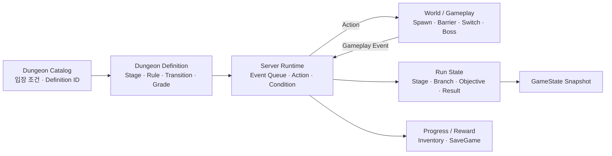

# 09. Branching Dungeon Runtime

Dungeon은 Stage별 C++ 분기문으로 진행 순서를 고정하지 않고, **Event / Condition / Action / Transition을 데이터로 정의하고 Server Runtime이 해석하는 콘텐츠 시스템**으로 구현했습니다.

분기, 제한시간, 보상, 실패 조건이 추가되어도 World Actor가 전체 진행 순서를 알 필요가 없고, 동일한 Runtime이 다른 Definition을 실행할 수 있습니다.

---

## 전체 구조



- **Definition**은 콘텐츠 규칙을 소유합니다.
- **Runtime**은 현재 Run에서 Event를 처리하고 다음 Stage를 결정합니다.
- **World Actor**는 자신의 상호작용이나 전투 결과만 Event로 전달합니다.
- **Run State**는 현재 진행 결과를 보관하고 Client/World가 소비할 수 있게 발행됩니다.

---

## 1. Catalog와 Definition의 역할을 분리

입구에서 필요한 정보와 Dungeon 전체 그래프를 한 데이터에 넣지 않습니다.

```cpp
struct FDungeonCatalogRow : public FTableRowBase
{
    FGameplayTag DungeonId;
    int32 DungeonNumber = 0;
    FPrimaryAssetId DefinitionAssetId;
    int32 RequiredLevel = 1;
};
```

Catalog는 다음만 담당합니다.

- 어떤 Dungeon인지
- 어떤 Definition을 Load할지
- 입장 요구 Level
- SaveGame에서 사용할 stable numeric key

실제 Stage graph는 `UDungeonDefinitionDataAsset`이 소유합니다.

```cpp
class UDungeonDefinitionDataAsset : public UPrimaryDataAsset
{
    FGameplayTag DungeonId;
    FGameplayTag StartStageId;
    TSoftObjectPtr<UDungeonPresentationDataAsset> Presentation;

    TArray<FDungeonStageDefinition> Stages;
    TArray<FDungeonGradeRule> GradeRules;
};
```

---

## 2. Stage 진행을 Event Rule로 표현

Stage 하나는 “다음 Stage”만 갖지 않습니다.  
**어떤 Event가 들어왔을 때 무엇을 실행하고, 어떤 조건에서 어디로 이동하는지**를 Rule로 정의합니다.

핵심 구조는 다음과 같습니다.

```cpp
struct FDungeonStageEventRule
{
    EDungeonStageEvent Event;
    FGameplayTag SourceId;
    bool bOnce = false;

    TArray<FDungeonStageAction> Actions;
    TArray<FDungeonStageTransition> Transitions;
};

struct FDungeonStageTransition
{
    FName TransitionId;
    TArray<FDungeonStageCondition> Conditions;

    FGameplayTag NextStageId;
    FGameplayTag BranchId;
};
```

예를 들어 Shortcut Lever를 사용한 경우 World Actor는 “Shortcut route로 이동하라”를 직접 실행하지 않습니다.

```text
Lever Interact
   ↓
ActorInteracted(SourceId)
   ↓
현재 Stage의 EventRule 검색
   ↓
Action 실행
   ├─ SetRunTag
   └─ 기타 Gameplay Action
   ↓
Transition Conditions 평가
   ↓
NextStageId / BranchId 선택
```

**진행 규칙은 Definition, 상호작용 구현은 World Actor**가 담당합니다.

---

## 3. Action과 Condition을 작은 Building Block으로 유지

현재 Runtime이 해석하는 주요 요소:

### Event

- `StageEntered`
- `WaveCompleted`
- `BossDefeated`
- `ActorInteracted`
- `StageTimeout`
- `AreaEntered`
- `MonsterCaptured`

### Condition

- `Always`
- `HasRunTag`
- `SpawnGroupCompleted`

### Action

- `SpawnGroup`
- `SetRunTag`
- `ClearRunTag`
- `EmitEvent`
- `GrantReward`

콘텐츠마다 전용 C++ 명령을 추가하기보다, 작은 규칙을 조합해 Stage 흐름을 구성합니다.

---

## 4. Runtime은 Event Queue를 순서대로 처리

World callback 안에서 바로 Stage를 재귀적으로 바꾸지 않고 Event Queue를 사용합니다.

```cpp
void UDungeonStageRuntimeSubsystem::QueueEvent(
    EDungeonStageEvent Event,
    const FGameplayTag& Source)
{
    if (!IsAuthority() ||
        State.RunStatus != EDungeonRunStatus::Running)
        return;

    Queue.Add({State.RunId, Event, Source});

    if (!bProcessing)
        ProcessQueue();
}
```

`ProcessQueue()`에서는:

1. Event가 현재 `RunId`에 속하는지 확인
2. 현재 Stage의 EventRule 검색
3. `bOnce` Rule 중복 실행 차단
4. Action 순서대로 실행
5. Transition Condition 평가
6. 첫 번째 만족 Transition으로 Stage 전환
7. 변경된 State 발행

을 수행합니다.

### stale event 차단

Queue entry가 생성된 뒤 Run이 바뀌어도 이전 Run의 Event가 새 Run에 적용되지 않도록 `RunId`를 함께 저장합니다.

### event cascade 제한

Action이 다시 Event를 발생시킬 수 있기 때문에 무한 event chain을 막기 위해 한 처리 사이클에 budget을 둡니다.

```cpp
int32 Budget = 128;

while (!Queue.IsEmpty())
{
    if (--Budget < 0)
    {
        Fail(EDungeonFailReason::Error,
             TEXT("Event cascade limit exceeded."));
        break;
    }

    ...
}
```

데이터 기반 흐름이 잘못 작성되더라도 Runtime이 무한 루프에 빠지지 않도록 방어합니다.

---

## 5. Stage 진입 시 World 상태와 Timer를 한 번에 갱신

`EnterStage()`는 Stage 전환 시 다음 상태를 설정합니다.

- 현재 `StageId`
- `SealedBarriers`
- Stage 시작 Server Time
- Stage Deadline
- Terminal Success / Failure
- `StageEntered` Event

제한시간은 Server Timer가 실제 실패 Event를 발생시키고, 같은 deadline을 Run State에도 기록합니다.

```text
Stage Definition.TimeLimitSeconds
        ↓
Server Timer
        ├─ 만료 → StageTimeout Event
        └─ Deadline → Run State → Client UI
```

게임 규칙과 UI countdown이 서로 다른 시간을 계산하지 않도록 **같은 Server 기준 deadline**을 사용합니다.

---

## 6. 분기 결과는 Run State에 한 번만 저장

Forgotten Ruins의 Shortcut / ExtraWave 선택은:

- `SelectedBranchId`
- `RunTags`

에 기록합니다.

이후 같은 선택 결과를:

- 다음 Transition
- Barrier
- Objective
- HUD
- Result

가 공유합니다.

분기 여부를 각 Actor나 UI가 별도 bool로 관리하지 않습니다.

---

## 7. Objective는 Spawn 결과를 추적

`SpawnGroup` Action이 Monster를 생성하면 `UDungeonObjectiveTracker`에 해당 Group을 등록합니다.

각 Group은:

- Spawned
- Defeated
- Captured

를 집계합니다.

```text
SpawnGroup
   ↓
ObjectiveTracker.RegisterGroup
   ↓
Monster Death / Capture
   ↓
Group Tally 갱신
   ↓
WaveCompleted / BossDefeated
   ↓
Dungeon Event Queue
```

Capture된 Monster도 전투에서 영구 이탈하므로 **Defeat와 함께 Group completion에 반영**합니다.

기존 Combat/Capture 시스템의 결과가 Dungeon 진행 Event로 연결되는 지점입니다.

---

## 8. Barrier 규칙은 World Actor가 아니라 Stage가 소유

현재 Stage에서 어떤 문이 닫혀야 하는지는:

```cpp
struct FDungeonStageDefinition
{
    FGameplayTag StageId;
    float TimeLimitSeconds = 0.f;

    TArray<FGameplayTag> SealedBarriers;
    TArray<FDungeonStageEventRule> EventRules;
};
```

의 `SealedBarriers`로 정의합니다.

```text
Stage Definition
   ↓
Run State.SealedBarriers
   ↓
GameState
   ↓
각 ADungeonBarrier
```

Barrier Actor가 Stage 이름을 직접 검사하지 않기 때문에 Stage 구성이나 경로가 바뀌어도 World Actor 코드를 수정할 필요가 없습니다.

---

## 9. 실패와 Terminal Stage를 동일한 Run Lifecycle에서 처리

실패는 예외적인 UI 처리로 분리하지 않고 Run State의 결과로 기록합니다.

```cpp
enum class EDungeonFailReason : uint8
{
    None,
    TimeOut,
    OwnerDown,
    OwnerLeft,
    TargetLost,
    Error
};
```

예:

- Server Timer 만료 → `TimeOut`
- Run Owner HP 0 → `OwnerDown`
- Owner가 Portal로 Dungeon 이탈 → `OwnerLeft`
- 추적 중인 Monster가 비정상 제거 → `TargetLost`

Terminal Stage에 도달하거나 `Fail()`이 호출되면:

- elapsed 계산
- record 저장
- 최종 State 발행
- 다음 tick에 runtime asset/objective cleanup

순서로 종료합니다.

Cleanup을 즉시 하지 않고 다음 tick으로 미뤄 현재 Event Rule이나 Delegate callback이 모두 빠져나간 뒤 정리합니다.

---

## 10. Reward와 Record도 같은 Runtime에서 정산

`GrantReward` Action은 참가 Player의 기존 Inventory API를 사용합니다.

```text
Dungeon Action
   ↓
Inventory.AddItem
   ↓
기존 stacking / replication
```

Dungeon 전용 Item 지급 구조를 따로 만들지 않습니다.

Run 종료 시에는:

- Clear / Fail
- elapsed
- selected branch
- defeated / captured
- reward
- clear count
- best time

을 정리하고 `UDungeonProgressSubsystem`에 기록합니다.

SaveGame key에는 rename 가능한 GameplayTag 대신 안정적인 `DungeonNumber`를 사용합니다.

---

## 11. Runtime State는 실행 결과만 발행

Definition 전체를 Client가 실행하지 않습니다.

Server Runtime이 계산한 결과를 `FDungeonStageRuntimeState`에 모아 GameState에 발행합니다.

대표 상태:

| 영역 | Runtime State |
|---|---|
| 진행 | StageId, Revision, RunStatus |
| 목표 | Group tally, Current/Required count |
| 분기 | SelectedBranchId, RunTags |
| 시간 | RunStartedServerTime, StageDeadlineServerTime |
| World | SealedBarriers |
| 결과 | Rewards, Elapsed, ClearCount, BestSeconds |
| 참가자 | Participants, OwnerPlayer |
| Boss | Health, Action, Phase, Vulnerable, Break |

이 Snapshot을 Client UI로 변환하는 과정은 [[11. Client State & Presentation Pipeline|11_Client_State_Presentation_Pipeline]]에서 분리해 설명합니다.

---

## 설계 선택과 비용

| 선택 | 얻은 것 | 비용 / 제약 |
|---|---|---|
| **Event/Condition/Action 기반 Definition** | Stage별 C++ 수정 없이 분기와 규칙 조합 | 잘못된 데이터 조합을 막기 위한 Validation 필요 |
| **Event Queue** | callback 중 Stage 전환/연쇄 Event를 순서대로 처리 | cascade와 stale event를 별도로 방어해야 함 |
| **RunTags / BranchId 공유 상태** | World·UI·Result가 같은 분기 결과 사용 | Tag namespace와 authoring 규칙 관리 필요 |
| **Stage가 Barrier 규칙 소유** | World Actor와 콘텐츠 흐름 분리 | Definition 작성 시 World의 BarrierId와 일치해야 함 |
| **Runtime Snapshot 발행** | World/UI가 현재 상태를 다시 구성 가능 | State 구조와 presentation mapping이 추가됨 |

---

## 연관 문서

- [[03. Data & Content Architecture|03_Data_Content_Architecture]] — Catalog / PrimaryDataAsset / GameplayTag 구성
- [[10. Boss Encounter Runtime|10_Boss_Encounter_Runtime]] — Boss Stage 내부의 전투 Runtime
- [[11. Client State & Presentation Pipeline|11_Client_State_Presentation_Pipeline]] — Run State를 HUD/Minimap/Result로 변환
- [[13. Content Authoring & Validation|13_Content_Authoring_Validation]] — Definition의 잘못된 조합을 Editor에서 검사

---

## 관련 코드

- [DungeonDefinitionDataAsset.h](https://github.com/chungheonLee0325/Sonheim/blob/main/Sonheim/Source/Sonheim/GameObject/Dungeon/DungeonDefinitionDataAsset.h)
- [DungeonStageDefinition.h](https://github.com/chungheonLee0325/Sonheim/blob/main/Sonheim/Source/Sonheim/GameObject/Dungeon/DungeonStageDefinition.h)
- [DungeonStageRuntimeTypes.h](https://github.com/chungheonLee0325/Sonheim/blob/main/Sonheim/Source/Sonheim/GameManager/Dungeon/DungeonStageRuntimeTypes.h)
- [DungeonStageRuntimeSubsystem.cpp](https://github.com/chungheonLee0325/Sonheim/blob/main/Sonheim/Source/Sonheim/GameManager/Dungeon/DungeonStageRuntimeSubsystem.cpp)
