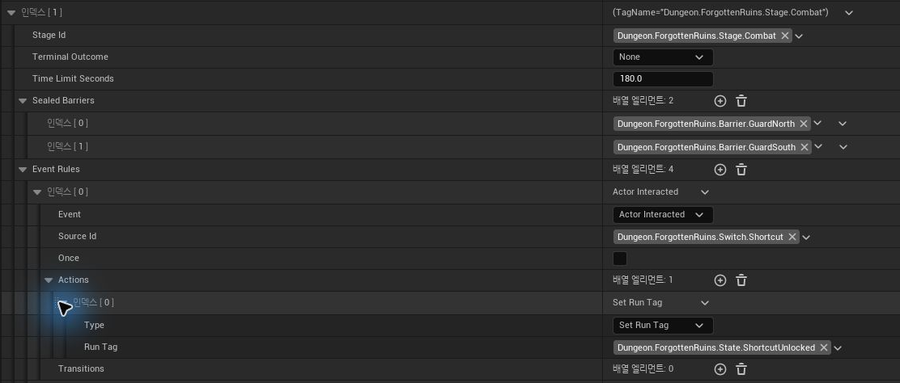
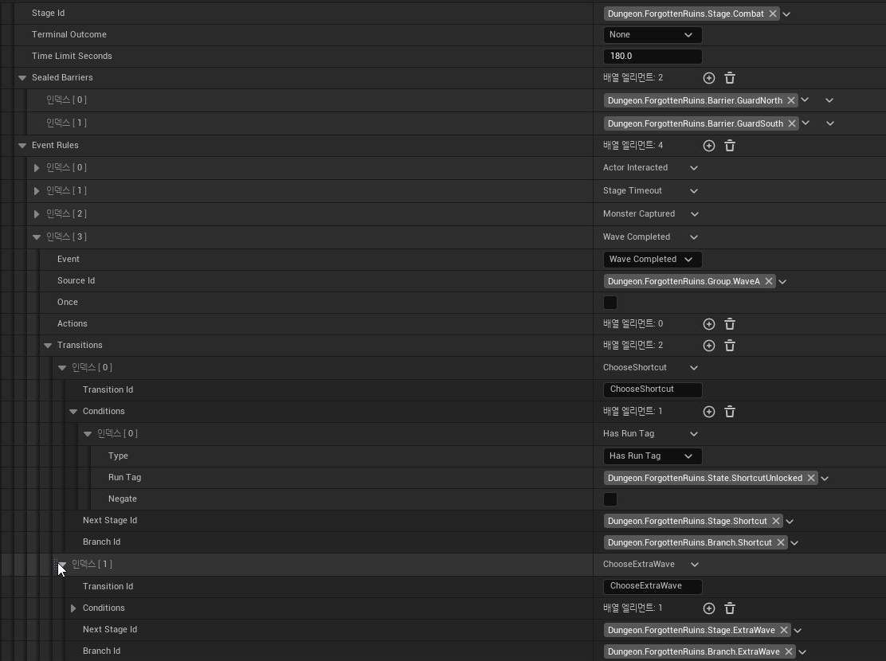
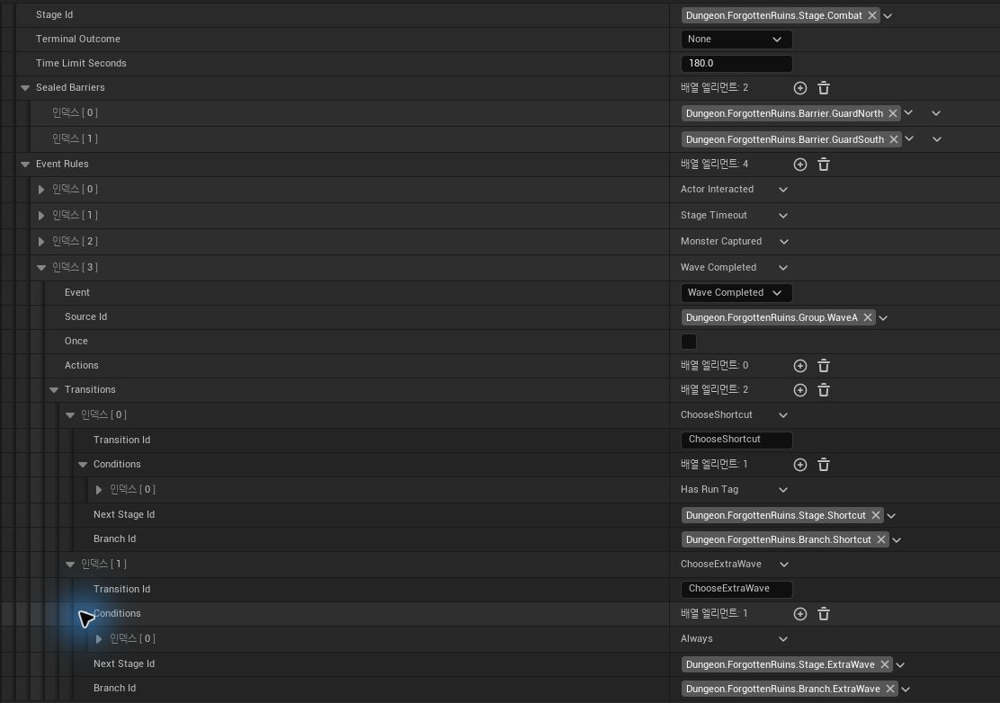

# 09. Branching Dungeon Runtime

Dungeon은 **Stage graph를 데이터로 정의하고, Server Runtime이 Event를 받아 현재 Stage의 Rule을 해석하는 콘텐츠 시스템**으로 구현했습니다.

## 요약

- Dungeon Definition이 Stage / Event Rule / Transition / Grade를 소유하고 Server Runtime이 이를 해석합니다.
- Event / Condition / Action / Transition을 building block으로 조합해 분기·목표·Barrier·실패 조건을 구성합니다.
- Runtime은 Event Queue, <code>RunId</code> stale-event guard, cascade budget으로 Stage mutation 순서를 관리합니다.
- Branch / Objective / Barrier는 현재 Run State에 기록되고 GameState Snapshot으로 Client에 전달됩니다.
- Reward / Grade / Best Record까지 같은 Run lifecycle에서 정산합니다.

## 목차

- [Dungeon Flow](#dungeon-flow)
- [Definition & Identity](#definition--identity)
- [Event-driven Runtime](#event-driven-runtime)
- [World State & Objectives](#world-state--objectives)
- [Terminal / Progress / Replication](#terminal--progress--replication)
- [Trade-offs](#trade-offs)

---

## Dungeon Flow

아래 Stage Graph는 **Dungeon Definition의 `BuildStageGraph()`에서 생성한 결과**입니다.

~~~mermaid
flowchart TD
  %% Dungeon.ForgottenRuins, start Stage.Enter
  %% Stage_Enter time limit 120s
  %% Stage_Enter on AreaEntered Zone.GuardRoom: SpawnGroup Group.WaveA
  Stage_Enter -->|"AreaEntered Zone.GuardRoom / Always"| Stage_Combat
  Stage_Enter -->|"StageTimeout / Always"| Stage_Failed
  %% Stage_Combat time limit 180s
  %% Stage_Combat seals Barrier.GuardNorth, Barrier.GuardSouth
  %% Stage_Combat on ActorInteracted Switch.Shortcut: SetRunTag State.ShortcutUnlocked
  Stage_Combat -->|"StageTimeout / Always"| Stage_Failed
  %% Stage_Combat on MonsterCaptured Group.WaveA: GrantReward 15 x1
  Stage_Combat -->|"WaveCompleted Group.WaveA / HasRunTag State.ShortcutUnlocked => Branch.Shortcut"| Stage_Shortcut
  Stage_Combat -->|"WaveCompleted Group.WaveA / Always => Branch.ExtraWave"| Stage_ExtraWave
  Stage_Shortcut -->|"StageEntered / Always"| Stage_Boss
  %% Stage_ExtraWave seals Barrier.StoreEast
  %% Stage_ExtraWave on StageEntered: SpawnGroup Group.WaveB
  %% Stage_ExtraWave on WaveCompleted Group.WaveB: GrantReward 10 x5
  Stage_ExtraWave -->|"WaveCompleted Group.WaveB / Always"| Stage_Boss
  %% Stage_Boss seals Barrier.Treasure
  %% Stage_Boss on AreaEntered Zone.BossHall: SpawnGroup Group.Boss
  %% Stage_Boss on MonsterCaptured Group.Boss: GrantReward 15 x2
  %% Stage_Boss on BossDefeated Group.Boss: GrantReward 15 x3
  Stage_Boss -->|"BossDefeated Group.Boss / SpawnGroupCompleted Group.Boss"| Stage_Result
  Stage_Result[["Stage.Result 성공"]]
  Stage_Failed[["Stage.Failed 실패"]]
~~~

[Stage Graph 원본 (.mmd)](../Media/Wiki/09_Branching_Dungeon_Runtime/09_dungeon_stage_graph.mmd)

레버 상호작용은 이 Graph에서 바로 Stage edge로 나타나지 않습니다. 레버는 Combat Stage에서 `ShortcutUnlocked` RunTag만 기록하고, **실제 Shortcut / ExtraWave 분기는 Wave A 완료 Event에서 Transition 조건을 평가할 때 결정**됩니다.

Runtime 관점에서 구현된 범위는 다음과 같습니다.

| 영역 | 구현 |
|---|---|
| **입장 / 참가자** | 요구 Level, Run Owner, Participants, Portal 이동 |
| **Stage 진행** | Entry, Combat, Branch, Boss, Terminal Stage |
| **목표** | Spawn Group, Defeat/Capture count, Main/Optional Objective |
| **분기** | Lever interaction, RunTag, BranchId, Shortcut / ExtraWave |
| **World 제어** | Stage별 Barrier, Trigger Zone, Shortcut Gate, Reward Chest |
| **시간 / 실패** | Stage timeout, Owner down/leave, target lost |
| **Boss** | Boss Objective, Phase/Break/Exhaust/Capture state 연동 |
| **정산** | Reward, elapsed time, Grade, best record, clear count |
| **Client 표현** | HUD 목표 추적, Party 상태, Minimap/Marker, Boss HUD, Result |

마지막 Client 표현은 Dungeon Runtime이 직접 Widget을 조작하지 않고 Snapshot을 통해 [[11. UI Architecture & Client Presentation|11_Client_State_Presentation_Pipeline]]으로 전달합니다.

---

## Definition & Identity

### Event / Condition / Action / Transition

이 네 요소는 각각 다른 질문에 답합니다.

| 요소 | 의미 | 예 |
|---|---|---|
| **Event** | **무슨 일이 발생했는가?** | StageEntered, WaveCompleted, ActorInteracted, MonsterCaptured |
| **Condition** | **현재 상태에서 이 경로를 선택할 수 있는가?** | Always, HasRunTag, SpawnGroupCompleted |
| **Action** | **Event를 처리하면서 무엇을 바꿀 것인가?** | SpawnGroup, SetRunTag, GrantReward |
| **Transition** | **조건을 만족하면 다음 어디로 이동할 것인가?** | NextStageId + BranchId |

데이터 관계는 다음과 같습니다.

~~~mermaid
flowchart TB
    DEF["<b>Dungeon Definition</b><br/>UDungeonDefinitionDataAsset"]
    STAGE["<b>Stage</b><br/>FDungeonStageDefinition[]"]
    RULE["<b>Event Rule</b><br/>FDungeonStageEventRule[]"]
    EVENT["<b>Trigger</b><br/>EDungeonStageEvent + SourceId"]
    ACTION["<b>State / World 변경</b><br/>FDungeonStageAction[]"]
    TRANS["<b>다음 경로 후보</b><br/>FDungeonStageTransition[]"]
    COND["<b>Transition 조건</b><br/>FDungeonStageCondition[]"]
    NEXT["<b>결과</b><br/>NextStageId · BranchId"]

    DEF --> STAGE
    STAGE --> RULE
    RULE --> EVENT
    RULE --> ACTION
    RULE --> TRANS
    TRANS --> COND
    TRANS --> NEXT
~~~

Shortcut Lever는 “지름길 Stage로 이동”을 직접 실행하지 않습니다. 실제 흐름은 **상태 기록과 분기 평가가 서로 다른 Event Rule에서 분리**되어 있습니다.

~~~text
Lever Interact
   ↓
ActorInteracted(Switch.Shortcut)
   ↓
Action: SetRunTag(State.ShortcutUnlocked)
   ↓
Combat Stage 유지
~~~



Wave A가 완료된 뒤 별도의 `WaveCompleted` Rule이 분기를 평가합니다.

~~~text
WaveCompleted(Group.WaveA)
   ├─ HasRunTag(State.ShortcutUnlocked)
   │    → Stage.Shortcut / Branch.Shortcut
   │
   └─ Always
        → Stage.ExtraWave / Branch.ExtraWave
~~~



World Actor는 **무슨 일이 발생했는지**만 전달하고, 진행 규칙과 실제 분기 결정은 Definition이 소유합니다.

<details>
<summary><b>실제 C++ 데이터 스키마 요약 보기</b></summary>

~~~cpp
struct FDungeonStageDefinition
{
    FGameplayTag StageId;
    float TimeLimitSeconds;
    TArray<FGameplayTag> SealedBarriers;
    TArray<FDungeonStageEventRule> EventRules;
};

struct FDungeonStageEventRule
{
    EDungeonStageEvent Event;
    FGameplayTag SourceId;
    bool bOnce;

    TArray<FDungeonStageAction> Actions;
    TArray<FDungeonStageTransition> Transitions;
};

struct FDungeonStageTransition
{
    FName TransitionId;
    TArray<FDungeonStageCondition> Conditions;

    FGameplayTag NextStageId;
    FGameplayTag BranchId;
};
~~~

</details>

---

### GameplayTag Identity

Dungeon에서는 Stage 하나만 식별하면 끝나지 않습니다.

~~~text
Dungeon.ForgottenRuins.Stage.*
Dungeon.ForgottenRuins.Group.*
Dungeon.ForgottenRuins.Branch.*
Dungeon.ForgottenRuins.PointSet.*
Dungeon.ForgottenRuins.Zone.*
Dungeon.ForgottenRuins.Switch.*
Dungeon.ForgottenRuins.Barrier.*
~~~

이 ID들은 Definition, placed Actor, Runtime State, UI Presentation이 서로 참조합니다.

GameplayTag를 사용하면:

- **계층형 namespace**로 어느 Dungeon의 Stage/Group/Barrier인지 드러나고
- Editor field에서 <code>Categories="Dungeon"</code>로 선택 범위를 제한할 수 있으며
- Validation에서 다른 Dungeon의 Tag가 섞였는지 검사할 수 있고
- 새 Stage/Branch를 추가할 때 전역 C++ enum을 계속 수정하지 않아도 됩니다.

반대로 모든 이름을 GameplayTag로 만들지는 않습니다.

<code>TransitionId</code>는 log와 generated graph에서만 해당 transition을 식별하고 다른 시스템이 참조하지 않으므로 <code>FName</code>으로 유지합니다.

또 SaveGame record key는 rename 가능한 GameplayTag와 분리해 stable <code>DungeonNumber</code>를 사용합니다.

즉 ID의 사용 범위에 따라 **GameplayTag / FName / stable numeric key를 구분**합니다.

더 넓은 데이터 선택 기준은 [[03. Data & Content Architecture|03_Data_Content_Architecture]]에서 설명합니다.

---

## Event-driven Runtime

### Runtime Architecture

~~~mermaid
flowchart LR
    C["<b>입장 Index</b><br/>FDungeonCatalogRow"]
    D["<b>콘텐츠 규칙</b><br/>UDungeonDefinitionDataAsset"]
    R["<b>Server Interpreter</b><br/>UDungeonStageRuntimeSubsystem"]
    W["<b>World / Gameplay</b><br/>Spawn · Barrier · Switch · Boss"]
    S["<b>현재 Run 상태</b><br/>FDungeonStageRuntimeState"]
    G["<b>Client 공유 상태</b><br/>ASonheimGameState"]
    P["<b>정산</b><br/>Inventory · Progress Save"]

    C --> D
    D --> R
    W -->|"Gameplay Event"| R
    R -->|"Action"| W
    R --> S
    S --> G
    R --> P
~~~

- **Definition** — 콘텐츠 규칙
- **Runtime** — 현재 Run에서 Event 처리와 Stage 전환
- **World Actor** — 상호작용·전투 결과의 producer
- **Run State** — 현재 진행 결과의 snapshot
- **GameState** — Client가 소비할 shared state

---

### Catalog / Definition

입구에서 조회하는 Catalog와 Dungeon 전체 Stage graph를 소유하는 Definition을 분리합니다.

```cpp
struct FDungeonCatalogRow : public FTableRowBase
{
    FGameplayTag DungeonId;
    int32 DungeonNumber = 0;
    FPrimaryAssetId DefinitionAssetId;
    int32 RequiredLevel = 1;
};
```

Catalog는 다음만 담당합니다.

- 어떤 Dungeon인지
- 어떤 Definition을 Load할지
- 입장 요구 Level
- SaveGame에서 사용할 stable numeric key

실제 Stage graph는 `UDungeonDefinitionDataAsset`이 소유합니다.

```cpp
class UDungeonDefinitionDataAsset : public UPrimaryDataAsset
{
    FGameplayTag DungeonId;
    FGameplayTag StartStageId;
    TSoftObjectPtr<UDungeonPresentationDataAsset> Presentation;

    TArray<FDungeonStageDefinition> Stages;
    TArray<FDungeonGradeRule> GradeRules;
};
```



*실제 Definition DataAsset에서 Stage별 EventRule·Action·Transition을 authoring하는 화면.*

---

### Stage Event Rules

Stage는 **Event가 들어왔을 때 실행할 Action과, 조건을 만족했을 때 이동할 Transition**을 Rule로 정의합니다.

핵심 구조는 다음과 같습니다.

```cpp
struct FDungeonStageEventRule
{
    EDungeonStageEvent Event;
    FGameplayTag SourceId;
    bool bOnce = false;

    TArray<FDungeonStageAction> Actions;
    TArray<FDungeonStageTransition> Transitions;
};

struct FDungeonStageTransition
{
    FName TransitionId;
    TArray<FDungeonStageCondition> Conditions;

    FGameplayTag NextStageId;
    FGameplayTag BranchId;
};
```

Shortcut Lever의 `ActorInteracted` Rule은 `SetRunTag(State.ShortcutUnlocked)`만 실행하고 Transition을 갖지 않습니다.

이후 Wave A가 완료되면 `WaveCompleted(Group.WaveA)` Rule이 두 Transition을 순서대로 평가합니다.

~~~text
HasRunTag(State.ShortcutUnlocked)
→ Stage.Shortcut / Branch.Shortcut

조건 불충족
→ Always
→ Stage.ExtraWave / Branch.ExtraWave
~~~

즉 **상호작용은 분기 조건을 만들고, Objective 완료 Event가 실제 Stage 전환을 결정**합니다.

### Runtime 분기 시연

https://github.com/user-attachments/assets/29858da6-7d13-4297-9d71-41f53272a952
  전투 중 레버를 사용해 `ShortcutUnlocked`를 기록한 뒤 마지막 Wave A 적을 처치하면 Shortcut Branch가 선택되고 북쪽 경로가 열립니다.

https://github.com/user-attachments/assets/af8228c3-f403-41e1-947b-ba3f3d3f5da6
  레버를 사용하지 않은 상태에서 같은 Wave A를 완료하면 fallback Transition이 선택되고 추가 Wave가 새로운 Objective로 생성됩니다.

**진행 규칙은 Definition, 상호작용 구현은 World Actor**가 담당합니다.

---

### Building Blocks

현재 Runtime이 해석하는 주요 요소:

#### Event

- `StageEntered`
- `WaveCompleted`
- `BossDefeated`
- `ActorInteracted`
- `StageTimeout`
- `AreaEntered`
- `MonsterCaptured`

#### Condition

- `Always`
- `HasRunTag`
- `SpawnGroupCompleted`

#### Action

- `SpawnGroup`
- `SetRunTag`
- `ClearRunTag`
- `EmitEvent`
- `GrantReward`

콘텐츠마다 전용 C++ 명령을 추가하기보다, 작은 규칙을 조합해 Stage 흐름을 구성합니다.

---

### Event Queue

World callback 안에서 바로 Stage를 재귀적으로 바꾸지 않고 Event Queue를 사용합니다.

```cpp
void UDungeonStageRuntimeSubsystem::QueueEvent(
    EDungeonStageEvent Event,
    const FGameplayTag& Source)
{
    if (!IsAuthority() ||
        State.RunStatus != EDungeonRunStatus::Running)
        return;

    Queue.Add({State.RunId, Event, Source});

    if (!bProcessing)
        ProcessQueue();
}
```

`ProcessQueue()`에서는:

1. Event가 현재 `RunId`에 속하는지 확인
2. 현재 Stage의 EventRule 검색
3. `bOnce` Rule 중복 실행 차단
4. Action 순서대로 실행
5. Transition Condition 평가
6. 첫 번째 만족 Transition으로 Stage 전환
7. 변경된 State 발행

을 수행합니다.

#### Stale Event Guard

Queue entry가 생성된 뒤 Run이 바뀌어도 이전 Run의 Event가 새 Run에 적용되지 않도록 `RunId`를 함께 저장합니다.

#### Event Cascade Budget

Action이 다시 Event를 발생시킬 수 있기 때문에 무한 event chain을 막기 위해 한 처리 사이클에 budget을 둡니다.

```cpp
int32 Budget = 128;

while (!Queue.IsEmpty())
{
    if (--Budget < 0)
    {
        Fail(EDungeonFailReason::Error,
             TEXT("Event cascade limit exceeded."));
        break;
    }

    ...
}
```

데이터 기반 흐름이 잘못 작성되더라도 Runtime이 무한 루프에 빠지지 않도록 방어합니다.

---

### Stage Entry

`EnterStage()`는 Stage 전환 시 다음 상태를 설정합니다.

- 현재 `StageId`
- `SealedBarriers`
- Stage 시작 Server Time
- Stage Deadline
- Terminal Success / Failure
- `StageEntered` Event

제한시간은 Server Timer가 실제 실패 Event를 발생시키고, 같은 deadline을 Run State에도 기록합니다.

```text
Stage Definition.TimeLimitSeconds
        ↓
Server Timer
        ├─ 만료 → StageTimeout Event
        └─ Deadline → Run State → Client UI
```

게임 규칙과 UI countdown이 서로 다른 시간을 계산하지 않도록 **같은 Server 기준 deadline**을 사용합니다.

---

## World State & Objectives

### Branch State

Forgotten Ruins의 Shortcut / ExtraWave 선택은:

- `SelectedBranchId`
- `RunTags`

에 기록합니다.

이후 같은 선택 결과를:

- 다음 Transition
- Barrier
- Objective
- HUD
- Result

가 공유합니다.

분기 여부를 각 Actor나 UI가 별도 bool로 관리하지 않습니다.

---

### Objective Tracking

`SpawnGroup` Action이 Monster를 생성하면 `UDungeonObjectiveTracker`에 해당 Group을 등록합니다.

각 Group은:

- Spawned
- Defeated
- Captured

를 집계합니다.

```text
SpawnGroup
   ↓
ObjectiveTracker.RegisterGroup
   ↓
Monster Death / Capture
   ↓
Group Tally 갱신
   ↓
WaveCompleted / BossDefeated
   ↓
Dungeon Event Queue
```

Capture된 Monster도 전투에서 영구 이탈하므로 **Defeat와 함께 Group completion에 반영**합니다.

기존 Combat/Capture 시스템의 결과가 Dungeon 진행 Event로 연결되는 지점입니다.

---

### Barrier Ownership

현재 Stage에서 어떤 문이 닫혀야 하는지는:

```cpp
struct FDungeonStageDefinition
{
    FGameplayTag StageId;
    float TimeLimitSeconds = 0.f;

    TArray<FGameplayTag> SealedBarriers;
    TArray<FDungeonStageEventRule> EventRules;
};
```

의 `SealedBarriers`로 정의합니다.

```text
Stage Definition
   ↓
Run State.SealedBarriers
   ↓
GameState
   ↓
각 ADungeonBarrier
```

Barrier Actor가 Stage 이름을 직접 검사하지 않기 때문에 Stage 구성이나 경로가 바뀌어도 World Actor 코드를 수정할 필요가 없습니다.

---

## Terminal / Progress / Replication

### Failure / Terminal Stage

실패는 예외적인 UI 처리로 분리하지 않고 Run State의 결과로 기록합니다.

```cpp
enum class EDungeonFailReason : uint8
{
    None,
    TimeOut,
    OwnerDown,
    OwnerLeft,
    TargetLost,
    Error
};
```

예:

- Server Timer 만료 → `TimeOut`
- Run Owner HP 0 → `OwnerDown`
- Owner가 Portal로 Dungeon 이탈 → `OwnerLeft`
- 추적 중인 Monster가 비정상 제거 → `TargetLost`

Terminal Stage에 도달하거나 `Fail()`이 호출되면:

- elapsed 계산
- record 저장
- 최종 State 발행
- 다음 tick에 runtime asset/objective cleanup

순서로 종료합니다.

Cleanup을 즉시 하지 않고 다음 tick으로 미뤄 현재 Event Rule이나 Delegate callback이 모두 빠져나간 뒤 정리합니다.

---

### Reward / Record

`GrantReward` Action은 참가 Player의 기존 Inventory API를 사용합니다.

```text
Dungeon Action
   ↓
Inventory.AddItem
   ↓
기존 stacking / replication
```

Dungeon 전용 Item 지급 구조를 따로 만들지 않습니다.

Run 종료 시에는:

- Clear / Fail
- elapsed
- selected branch
- defeated / captured
- reward
- clear count
- best time

을 정리하고 `UDungeonProgressSubsystem`에 기록합니다.

SaveGame key에는 rename 가능한 GameplayTag 대신 안정적인 `DungeonNumber`를 사용합니다.

---

### Runtime Snapshot

Definition 전체를 Client가 실행하지 않습니다.

Server Runtime이 계산한 결과를 `FDungeonStageRuntimeState`에 모아 GameState에 발행합니다.

대표 상태:

| 영역 | Runtime State |
|---|---|
| 진행 | StageId, Revision, RunStatus |
| 목표 | Group tally, Current/Required count |
| 분기 | SelectedBranchId, RunTags |
| 시간 | RunStartedServerTime, StageDeadlineServerTime |
| World | SealedBarriers |
| 결과 | Rewards, Elapsed, ClearCount, BestSeconds |
| 참가자 | Participants, OwnerPlayer |
| Boss | Health, Action, Phase, Vulnerable, Break |

이 Snapshot을 Client UI로 변환하는 과정은 [[11. UI Architecture & Client Presentation|11_Client_State_Presentation_Pipeline]]에서 분리해 설명합니다.

---

## Trade-offs

| 선택 | 얻은 것 | 비용 / 제약 |
|---|---|---|
| **Event/Condition/Action 기반 Definition** | Stage별 C++ 수정 없이 분기와 규칙 조합 | 잘못된 데이터 조합을 막기 위한 Validation 필요 |
| **Event Queue** | callback 중 Stage 전환/연쇄 Event를 순서대로 처리 | cascade와 stale event를 별도로 방어해야 함 |
| **RunTags / BranchId 공유 상태** | World·UI·Result가 같은 분기 결과 사용 | Tag namespace와 authoring 규칙 관리 필요 |
| **Stage가 Barrier 규칙 소유** | World Actor와 콘텐츠 흐름 분리 | Definition 작성 시 World의 BarrierId와 일치해야 함 |
| **Runtime Snapshot 발행** | World/UI가 현재 상태를 다시 구성 가능 | State 구조와 presentation mapping이 추가됨 |

---

## 연관 문서

- [[03. Data & Content Architecture|03_Data_Content_Architecture]] — Catalog / PrimaryDataAsset / GameplayTag 구성
- [[10. Boss Encounter Runtime|10_Boss_Encounter_Runtime]] — Boss Stage 내부의 전투 Runtime
- [[11. UI Architecture & Client Presentation|11_Client_State_Presentation_Pipeline]] — Run State를 HUD/Minimap/Result로 변환
- [[13. Content Authoring & Validation|13_Content_Authoring_Validation]] — Definition의 잘못된 조합을 Editor에서 검사

---

## 관련 코드

- [DungeonDefinitionDataAsset.h](https://github.com/chungheonLee0325/Sonheim/blob/main/Sonheim/Source/Sonheim/GameObject/Dungeon/DungeonDefinitionDataAsset.h)
- [DungeonStageDefinition.h](https://github.com/chungheonLee0325/Sonheim/blob/main/Sonheim/Source/Sonheim/GameObject/Dungeon/DungeonStageDefinition.h)
- [DungeonStageRuntimeTypes.h](https://github.com/chungheonLee0325/Sonheim/blob/main/Sonheim/Source/Sonheim/GameManager/Dungeon/DungeonStageRuntimeTypes.h)
- [DungeonStageRuntimeSubsystem.cpp](https://github.com/chungheonLee0325/Sonheim/blob/main/Sonheim/Source/Sonheim/GameManager/Dungeon/DungeonStageRuntimeSubsystem.cpp)
