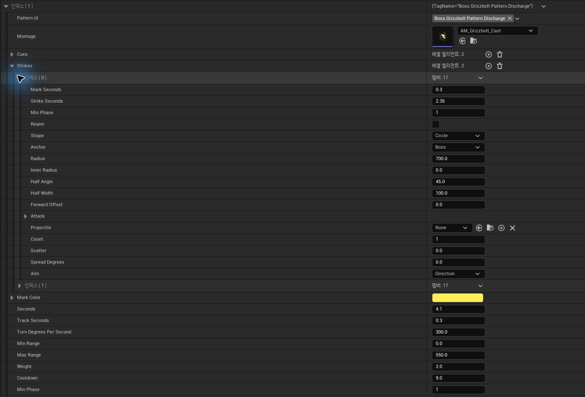
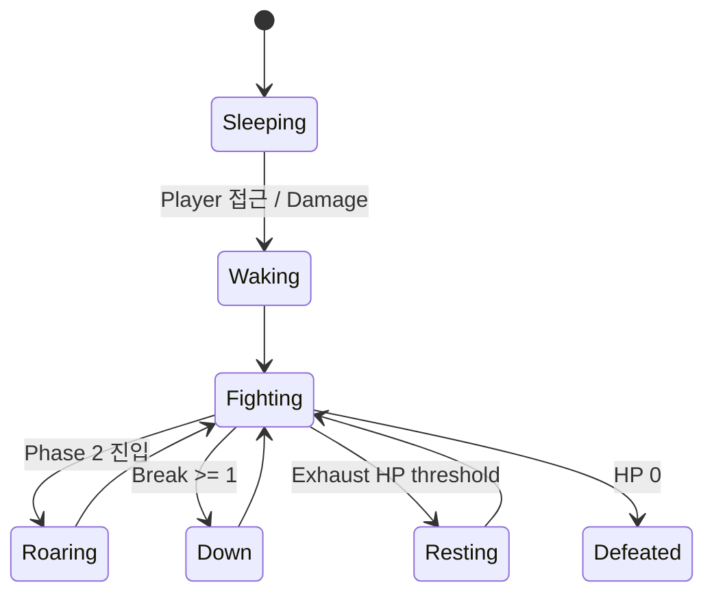

# 10. Boss Encounter Runtime

Guardian Boss는 <code>ABaseMonster</code> 기반 위에 **<code>UBossFSM</code>, <code>UBossPatternDataAsset</code>, <code>FBossStatus</code>**를 추가해 Encounter Runtime을 구성합니다.

## 요약

- Boss Actor / FSM은 기존 Monster 기반을 유지하고 Encounter state만 전용 계층으로 확장합니다.
- Pattern Data가 Range / Phase / Cooldown / Weight와 Timeline / Strike를 정의합니다.
- 하나의 Pattern Clock이 Tracking, Telegraph, Strike, Leap, Recovery timing을 조율합니다.
- Break / Down / Exhaust / Capture Window를 서로 다른 encounter state로 관리합니다.
- 실제 Hit 이후의 Damage semantics는 기존 <code>FAttackData → FCustomDamageEvent</code> pipeline을 재사용합니다.

## 목차

- [Encounter Architecture](#encounter-architecture)
- [Pattern Model](#pattern-model)
- [FSM & Pattern Selection](#fsm--pattern-selection)
- [Pattern Execution & Telegraph](#pattern-execution--telegraph)
- [Phase / Break / Capture](#phase--break--capture)
- [Combat & Replication](#combat--replication)
- [Trade-offs](#trade-offs)

---

## Encounter Architecture

Boss는 기존 Character/Monster 기반을 유지하고, Encounter에 필요한 상태와 Pattern 실행만 전용 계층으로 확장합니다.

~~~mermaid
flowchart TB
    subgraph COMMON["Common Gameplay Foundation"]
        CHAR["<b>UE Character</b><br/>ACharacter"]
        AREA["<b>공통 Gameplay Actor</b><br/>AAreaObject"]
        MON["<b>공통 Monster</b><br/>ABaseMonster"]
        AICOMP["<b>UE AI Component 기반</b><br/>UActorComponent"]
        AIFSM["<b>공통 Monster FSM</b><br/>UBaseAiFSM"]
        ATTACK["<b>공통 Combat Data</b><br/>FAttackData · FCustomDamageEvent"]

        CHAR --> AREA --> MON
        AICOMP --> AIFSM
    end

    subgraph BOSS["Guardian Encounter"]
        ACTOR["<b>Boss Actor</b><br/>ABossMonster : ABaseMonster"]
        FSM["<b>Boss Encounter FSM</b><br/>UBossFSM : UBaseAiFSM"]
        DATA["<b>Pattern Definition</b><br/>UBossPatternDataAsset"]
        RUN["<b>Pattern Runtime</b><br/>Track · Mark · Strike · Recovery"]
        STATUS["<b>Replicated Boss Status</b><br/>Action · Phase · Break · Vulnerable"]
    end

    VIEW["<b>Client Presentation</b><br/>Telegraph · VFX · Boss HUD"]

    MON --> ACTOR
    AIFSM --> FSM
    DATA --> FSM
    FSM --> RUN
    RUN --> ATTACK
    FSM --> STATUS
    RUN --> STATUS
    STATUS --> VIEW
~~~

역할을 나누면 다음과 같습니다.

- **기존 Monster/Combat 기반** — Health, Damage 처리, Capture ownership, 기본 Actor lifecycle
- **Boss 전용 FSM** — Wake/Fighting/Roaring/Down/Resting 상태와 Pattern 선택
- **Pattern Data** — 거리·Phase·Cooldown·Weight, Montage/Cue, Strike/Telegraph timing
- **Replicated Boss Status** — Client가 현재 Action/Phase/Break/Capture 가능 상태를 표현할 최소 상태

Boss Runtime은 **언제 어떤 공격을 선택하고 어디에 어떤 타격을 발생시킬지**를 담당합니다. 실제 타격이 발생한 뒤의 **Health/Stamina Damage, Element, Knockback, HitStop, Feedback 처리**는 기존 <code>FAttackData → FCustomDamageEvent → AAreaObject::TakeDamage</code> 흐름을 그대로 사용합니다.

---

## Pattern Model

### Pattern Definition

<code>FBossPattern</code>은 **선택 조건 + 실행 시간 + Strike 목록 + 이동/추적 규칙**을 하나의 행동 단위로 묶습니다.

```cpp
struct FBossPattern
{
    FGameplayTag PatternId;
    TObjectPtr<UAnimMontage> Montage;

    TArray<FBossSectionCue> Cues;
    TArray<FBossStrike> Strikes;

    float Seconds = 3.f;
    float TrackSeconds = 0.5f;
    float TurnDegreesPerSecond = 300.f;

    float MinRange = 0.f;
    float MaxRange = 1500.f;
    float Weight = 1.f;
    float Cooldown = 0.f;
    int32 MinPhase = 1;

    float RootMotionScale = 1.f;

    float LeapStartSeconds = 0.f;
    float LeapEndSeconds = 0.f;
    float LeapHeight = 300.f;
};
```

따라서 Pattern 추가/튜닝은 다음 값을 조합하는 문제로 바뀝니다.

- 어떤 거리에서 선택 가능한가
- Phase 몇부터 사용할 수 있는가
- 선택 Weight / Cooldown은 얼마인가
- 얼마 동안 Target을 Tracking할 것인가
- Montage의 어떤 Section을 언제 전환할 것인가
- 어떤 Strike를 어떤 시점에 실행할 것인가

### 실제 Pattern Definition

아래는 `Boss.Grizzbolt.Pattern.Discharge`의 실제 설정입니다. Pattern 선택 조건과 전체 실행 시간, Strike의 Mark/Hit timing과 공격 범위를 같은 Definition에서 확인할 수 있습니다.



---

### Strike Definition

`FBossStrike`는 공격의 warning과 hit을 같은 데이터로 묶습니다.

```cpp
struct FBossStrike
{
    float MarkSeconds = 0.f;
    float StrikeSeconds = 1.f;

    int32 MinPhase = 1;
    bool bReaim = false;

    EBossAreaShape Shape = EBossAreaShape::Circle;
    EBossAreaAnchor Anchor = EBossAreaAnchor::Boss;

    float Radius = 400.f;
    float InnerRadius = 0.f;
    float HalfAngle = 45.f;
    float HalfWidth = 100.f;
    float ForwardOffset = 0.f;

    FAttackData Attack;

    TSubclassOf<ABaseElement> Projectile;
    int32 Count = 1;
    float Scatter = 0.f;
    float SpreadDegrees = 0.f;
};
```

같은 Strike가:

- Telegraph Shape
- Warning 시간
- Anchor 위치
- 실제 Damage 범위
- Projectile
- Damage / Element / Knockback / HitStop

을 함께 결정합니다.

**보여주는 영역과 실제 맞는 영역의 source를 하나로 유지**하기 위한 구조입니다.

https://github.com/user-attachments/assets/cd81b345-d192-4374-9573-904b561f40bd

영상에서는 Telegraph가 먼저 표시되고, 같은 범위를 기준으로 실제 Strike가 이어집니다.

---

## FSM & Pattern Selection

### Encounter FSM

Boss 상태는 다음과 같이 구분합니다.

```cpp
enum class EBossStage : uint8
{
    Sleeping,
    Waking,
    Fighting,
    Roaring,
    Resting,
    Down,
    Defeated,
};
```

Encounter FSM은 Wake, Fighting, Phase 전환, Down, Resting, Defeated 상태를 관리합니다.



### Down과 Resting을 분리

- **Down** — 누적 Break damage로 발생하는 knockdown. 공격 기회이지만 Capture는 불가합니다.
- **Resting / Exhaust** — 특정 HP threshold를 통과할 때 발생하며, 이때만 Boss Capture가 가능합니다.

**Down은 공격 기회, Resting은 Capture 가능 상태**로 서로 다른 의미를 가집니다.

---

### Pattern Selection

Pattern이 끝나면 Target과 현재 상태를 기준으로 candidate를 만듭니다.

```cpp
if (Pattern.MinPhase > Phase) continue;
if (Pattern.Weight <= 0.f) continue;
if (!Pattern.Montage) continue;

if (Distance < Pattern.MinRange ||
    Distance > Pattern.MaxRange)
    continue;

if (const double* Ready = ReadyAt.Find(Pattern.PatternId);
    Ready && *Ready > Time)
    continue;
```

후보 중 Weight 기반으로 하나를 선택합니다.

가능한 다른 Pattern이 있을 때는 **직전에 사용한 Pattern을 우선 제외**하고, 대안이 없을 때만 반복을 허용합니다.

```text
Phase / Range / Cooldown
        ↓
Candidate Set
        ↓
직전 Pattern 제외 시도
        ↓
Weighted Random
        ↓
Selected Pattern
```

Pattern Data의 Range / Phase / Cooldown / Weight가 candidate 선택 조건을 제공합니다.

---

## Pattern Execution & Telegraph

### Pattern Clock

Pattern 시작 시:

- Target 고정
- Pattern Clock 초기화
- Cue / Strike runtime state 생성
- Root Motion scale 적용
- Montage 재생
- Boss Action status 갱신

을 수행합니다.

이후 `RunPattern()`이 Pattern Clock을 진행시키며:

1. Tracking
2. Montage Section Cue
3. Telegraph Mark
4. Strike
5. Leap
6. Recovery 종료

를 같은 timeline에서 처리합니다.

```text
0.0s        Track
0.4s        Telegraph Mark
0.8s        Montage Section Cue
1.2s        Strike
...         Recovery
3.0s        Pattern End
```

Animation Cue, Telegraph, 실제 Hit은 하나의 Pattern Clock을 기준으로 실행됩니다.

https://github.com/user-attachments/assets/fbee5e3c-767d-4b20-b18a-8dffa4c8cc4c

위 DataAsset에서 확인한 `Discharge` Pattern이 실제로 **Tracking → Telegraph → Strike → Recovery** 순서로 실행되는 장면입니다.

---

### Telegraph Anchor

`EBossAreaAnchor`로 mark 기준을 나눕니다.

### Boss Anchor

Boss 발밑 기준 Telegraph는 Strike 순간까지 Boss Transform을 따라갑니다.

예:

- 근거리 원형 공격
- 전방 Cone / Line

### Target Anchor

Target 위치를 기준으로 하는 공격은 **Mark가 생긴 순간의 위치를 저장**하고 이후 움직이지 않습니다.

예:

- Player 위치에 떨어지는 범위 공격
- Ground-target projectile

즉 Telegraph를 본 뒤 Player가 피할 수 있게 **warning 이후 공격 위치가 고정되는 공격**을 표현할 수 있습니다.

---

### Tracking / Re-aim

Pattern 전체에서 Target을 끝까지 추적하면 Telegraph를 보고 피하는 의미가 없어집니다.

반대로 Pattern 시작 순간에 방향을 완전히 고정하면 지나치게 쉽게 빗나갈 수 있습니다.

그래서:

- `TrackSeconds` — Pattern 시작 후 일정 시간 동안 Target 추적
- `bReaim` — Combo 중 이전 Strike가 끝난 뒤 다음 Strike 전까지 다시 추적

을 사용합니다.

```text
Track
 ↓
Mark
 ↓ 방향 고정
Strike
 ↓
bReaim이면 다시 Track
 ↓
다음 Mark
```

Tracking의 종료 시점 자체를 Pattern tuning 값으로 둡니다.

Pattern이 Target을 추적하는 구간과 Telegraph가 기준 위치를 유지하는 구간을 분리해, 경고를 본 뒤 회피할 수 있는 시간을 확보합니다.

<details>
<summary><b>Tracking / Anchor Runtime 시연</b></summary>

https://github.com/user-attachments/assets/91dbe45d-4a18-4934-ba9e-d732858faa88

</details>

---

### Montage Section Cue

Pattern이 항상 Montage를 처음부터 끝까지 그대로 재생하지는 않습니다.

```cpp
struct FBossSectionCue
{
    float Seconds = 0.f;
    FName Section;
};
```

예를 들어 Charge loop 이후 특정 시점에 Release Section으로 이동할 수 있습니다.

Boss 공용 상태 Montage도 convention을 사용합니다.

- Wake Montage — `Sleep / Wake / Roar`
- Down Montage — `Fall / Down / GetUp`
- Leap / Hop — `Land`

Animation asset의 Section 구조와 Runtime 상태 전환을 연결합니다.

---

## Phase / Break / Capture

### Phase Transition

HP가 `PhaseTwoHealth` 이하가 되면 Pattern 사이에서 Phase 2로 전환합니다.

대표 tuning:

```cpp
float PhaseTwoHealth = 0.6f;
float RoarSeconds = 1.8f;
float PhaseTwoTempo = 1.2f;
int32 PhaseTwoExtraCount = 2;
```

Phase 2에서는:

- Pattern tempo 증가
- 일부 Strike의 projectile / area count 증가
- Phase 2 전용 Strike 활성화
- Rage VFX / Overlay
- HUD Phase 표시

가 같은 Phase state를 기준으로 적용됩니다.

https://github.com/user-attachments/assets/00111f16-35b0-451a-af2c-4cdb72f506f5

HP threshold를 통과하면 현재 공격을 바로 Phase 2로 덮어쓰는 대신, **Roaring 상태를 거쳐 Phase가 전환된 뒤** 다음 Pattern부터 Phase 2 설정을 적용합니다.

---

### Break / Down / Exhaust

Boss가 Fighting 중 Damage를 받으면 Break를 누적합니다.

```text
Damage
  ↓
Break += Damage / (MaxHP × DownAfterDamage)
  ↓
Break >= 1
  ↓
Down
```

Down, Waking, Resting 중 받은 Damage는 다음 Knockdown으로 이어지는 Break에 누적하지 않습니다.

Down은 Break 누적으로 발생하는 일시적인 공격 기회이며, 이 상태 자체는 Capture Window가 아닙니다.

<details>
<summary><b>Break → Down → 전투 복귀 Runtime 시연</b></summary>

https://github.com/user-attachments/assets/7553e42f-54d6-4265-a445-17cba43a15d3

</details>

Exhaust는 Break와 별도로 HP threshold를 사용합니다.

```text
HP <= ExhaustHealth[n]
   ↓
현재 Pattern 중단
   ↓
Resting
   ↓
Capture 가능
```

한 번에 큰 Damage가 여러 threshold를 지나더라도 현재 Exhaust 진입은 한 번만 발생하고, 통과한 threshold는 소비된 것으로 기록합니다.

---

### Capture Window

Boss FSM은 **Capture가 가능한 상태인지**만 결정합니다.

`FBossStatus::IsVulnerable()`:

```cpp
bool IsVulnerable() const
{
    return Stage == EBossStage::Resting;
}
```

실제 Capture 확률 판정, Reveal, ownership 적용은 기존 Pal Capture 시스템으로 연결합니다.

https://github.com/user-attachments/assets/46026e10-a197-4c98-b244-260dd2fe42d3

영상에서는 낮은 HP threshold에서 Boss가 `Resting`으로 전환되고 Capture 안내가 활성화된 뒤, 기존 Pal Capture 흐름을 통해 실제 포획까지 이어집니다.

Boss 전용 Capture 결과 처리 코드를 별도로 만들지 않았습니다.

---

## Combat & Replication

### Combat Pipeline Reuse

Boss Strike에는 별도 Boss Damage 구조체 대신:

```cpp
FAttackData Attack;
```

을 사용합니다.

따라서 일반 Combat과 동일한:

- Health / Stamina Damage
- Element
- Hit Stop
- Knockback
- VFX / SFX

context가 그대로 `FCustomDamageEvent`로 전달됩니다.

Boss Runtime은 **언제·어디서 공격을 발생시킬지**를 결정하고, Hit 이후의 방어·속성·HP/Stamina 감소·Knockback·HitStop 처리는 기존 Combat pipeline에 맡깁니다.

---

### Replicated Boss Status

Boss 자체의 실행 FSM을 Client가 다시 돌리지 않습니다.

```cpp
struct FBossStatus
{
    EBossStage Stage;
    int32 Phase = 1;

    FGameplayTag ActionId;
    double ActionStartServerTime = 0;
    double ActionEndServerTime = 0;

    float Break = 0.f;
};
```

이 상태를 통해 Client는:

- 현재 행동
- Action progress
- Phase
- Break
- Capture 가능 여부

를 표현합니다.

Dungeon Runtime은 Boss status를 다시 Run Snapshot에 반영해 HUD가 `UBossFSM`을 직접 참조하지 않도록 합니다.

---

## Trade-offs

| 선택 | 얻은 것 | 비용 / 제약 |
|---|---|---|
| **Boss 전용 FSM** | Wake/Phase/Down/Exhaust/Pattern을 한 Encounter state로 표현 | 일반 Skill system 외에 별도 Runtime 유지 필요 |
| **Pattern / Strike DataAsset** | 공격 추가와 tuning을 C++ 분기에서 분리 | 데이터 조합이 많아 Validation 필요 |
| **Telegraph와 Hit geometry 공유** | 화면 경고와 실제 공격 범위의 기준 일치 | Shape data가 presentation과 gameplay 모두에 영향을 줌 |
| **Pattern Clock 기반 실행** | Montage/Cue/Mark/Strike timing을 한 timeline에서 조율 | Pattern timing과 animation asset convention을 함께 관리해야 함 |
| **Replicated Boss Status** | Client가 FSM을 재실행하지 않고 HUD/VFX 복구 가능 | Client presentation용 status mapping 필요 |

---

## 연관 문서

- [[05. Combat, Skill & Animation|05_Combat_Skill_Animation]] — Boss Strike가 재사용하는 Attack/Damage Pipeline
- [[08. Pal Capture & Partner Lifecycle|08_Pal_Capture_Partner_Lifecycle]] — Exhaust 상태에서 연결되는 기존 Capture 처리
- [[09. Branching Dungeon Runtime|09_Branching_Dungeon_Runtime]] — Boss가 Dungeon Stage의 Objective로 연결되는 과정
- [[11. UI Architecture & Client Presentation|11_Client_State_Presentation_Pipeline]] — Boss Status를 HUD로 변환하는 과정
- [[13. Content Authoring & Validation|13_Content_Authoring_Validation]] — Pattern / Timing 데이터 검증

---

## 관련 코드

- [BossPatternDataAsset.h](https://github.com/chungheonLee0325/Sonheim/blob/main/Sonheim/Source/Sonheim/AreaObject/Monster/Boss/BossPatternDataAsset.h)
- [BossFSM.cpp](https://github.com/chungheonLee0325/Sonheim/blob/main/Sonheim/Source/Sonheim/AreaObject/Monster/Boss/BossFSM.cpp)
- [BossMonster.h](https://github.com/chungheonLee0325/Sonheim/blob/main/Sonheim/Source/Sonheim/AreaObject/Monster/Boss/BossMonster.h)
- [BossTelegraph.h](https://github.com/chungheonLee0325/Sonheim/blob/main/Sonheim/Source/Sonheim/AreaObject/Monster/Boss/BossTelegraph.h)
