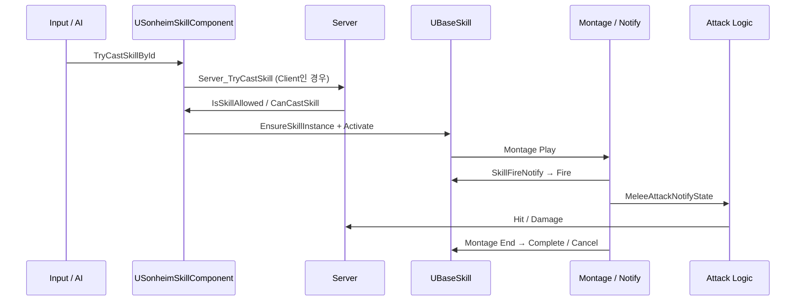

# 10. Combat, Skill & Animation

> **이 문서가 답하는 질문**
>
> 1. Sonheim에서 “Skill 하나”는 실제로 어떤 데이터와 객체로 구성되는가?
> 2. Client 입력이 어떻게 Server 검증을 거쳐 실제 공격으로 이어지는가?
> 3. 공격 타이밍을 왜 C++ Timer가 아니라 Animation Notify에 맡겼는가?
> 4. 빠른 근접 공격의 판정 누락과 중복 Hit을 어떻게 처리했는가?
> 5. Hit 이후 Element / Weak Point / Knockback / Hit Stop 정보는 어떻게 전달되는가?

처음 읽는다면 먼저 아래 한 장의 흐름만 기억하면 됩니다.

```text
Input / AI
   ↓
USonheimSkillComponent
   ↓
FSkillData + FSonheimSkillSpecItem
   ↓
UBaseSkill
   ↓
Montage / AnimNotify
   ↓
UMeleeAttack / Projectile / 기타 Skill Logic
   ↓
FCustomDamageEvent
   ↓
AAreaObject::TakeDamage
   ↓
HP / Condition / Feedback
```


> **코드 표기:** 아래 코드 블록은 `main`의 실제 선언/함수에서 문서 이해에 필요한 부분을 발췌한 것입니다. `UPROPERTY` metadata나 보조 필드는 일부 생략될 수 있으며, 전체 구현은 하단 Source 링크에서 확인할 수 있습니다.
---

## Part 1. Skill 하나를 어떻게 표현하는가

### 1.1 세 층으로 분리한다

Sonheim의 Skill은 하나의 거대한 replicated object가 아닙니다.

| 역할 | 타입 | 의미 |
|---|---|---|
| **정적 정의** | `FSkillData` | 어떤 Skill인지 |
| **복제 상태** | `FSonheimSkillSpecItem` | 지금 사용 중인지, Cooldown은 언제 끝나는지 |
| **실행 로직** | `UBaseSkill` 파생 객체 | 실제로 어떻게 동작하는지 |

이 세 층을 분리하면 “Skill의 정의”와 “현재 네트워크 상태”와 “실행 코드”를 서로 다른 수명으로 관리할 수 있습니다.

---

### 1.2 실제 `FSkillData`

아래는 현재 `SonheimGameType.h`의 실제 정의입니다.

```cpp
USTRUCT(BlueprintType)
struct FSkillData : public FTableRowBase
{
    GENERATED_USTRUCT_BODY()

    UPROPERTY(EditAnywhere, BlueprintReadWrite)
    int SkillID = 0;

    UPROPERTY(EditAnywhere, BlueprintReadWrite)
    TSubclassOf<UBaseSkill> SkillClass = nullptr;

    UPROPERTY(EditAnywhere, BlueprintReadWrite)
    TArray<FSkillStaminaCost> StaminaCosts;

    UPROPERTY(EditAnywhere, BlueprintReadWrite)
    TArray<FSkillItemCost> ItemCosts;

    UPROPERTY(EditAnywhere, BlueprintReadWrite)
    float CastRange = 0.0f;

    UPROPERTY(EditAnywhere, BlueprintReadWrite)
    float CoolTime = 0.0f;

    UPROPERTY(EditAnywhere, BlueprintReadWrite)
    float FireInvokeTime = -1.0f;

    UPROPERTY(EditAnywhere, BlueprintReadWrite)
    float PostDelayTime = -1.0f;

    UPROPERTY(EditAnywhere, BlueprintReadWrite)
    UAnimMontage* Montage = nullptr;

    UPROPERTY(EditAnywhere, BlueprintReadWrite)
    TArray<FAttackData> AttackData;

    UPROPERTY(EditAnywhere, BlueprintReadWrite)
    TSubclassOf<ABaseElement> ElementClass = nullptr;

    UPROPERTY(EditAnywhere, BlueprintReadWrite)
    int NextSkillID = 0;
};
```

#### 이 구조를 어떻게 읽어야 하는가

- `SkillClass`  
  데이터가 어떤 실행 로직 클래스를 사용할지 결정합니다.  
  예: `UMeleeAttack`, Shotgun, Rocket 등.

- `StaminaCosts / ItemCosts`  
  단순 “소모량 1개”가 아니라 **OnActivate / OnFire / OnComplete** 시점별 비용을 가질 수 있습니다.

- `CastRange`  
  AI와 Skill 사용 가능 거리 판단에 사용합니다.

- `CoolTime`  
  Server가 Cooldown 종료 시각을 계산해 Skill Spec에 반영합니다.

- `Montage`  
  Skill의 표현뿐 아니라 실제 Gameplay timing의 기준이 됩니다.

- `AttackData`  
  한 Skill 안에서 여러 타격을 정의할 수 있습니다.  
  3연타라면 각 타격이 서로 다른 `FAttackData`를 사용할 수 있습니다.

- `NextSkillID`  
  Combo처럼 다음 Skill로 이어지는 연결을 표현합니다.

현재 주요 Gameplay timing은 Montage / AnimNotify 기반입니다. 따라서 `FireInvokeTime`, `PostDelayTime` 같은 필드는 schema에 남아 있지만 핵심 실행 경로를 이해할 때는 Notify 기반 흐름을 먼저 보는 편이 정확합니다.

---

### 1.3 실제 복제 상태: `FSonheimSkillSpecItem`

Skill Logic UObject 전체를 복제하지 않고 Client가 알아야 할 작은 상태만 FastArray에 넣습니다.

```cpp
USTRUCT(BlueprintType)
struct FSonheimSkillSpecItem : public FFastArraySerializerItem
{
    GENERATED_BODY()

    UPROPERTY(EditAnywhere, BlueprintReadOnly)
    int32 SkillId = 0;

    UPROPERTY(EditAnywhere, BlueprintReadOnly)
    int32 Level = 1;

    UPROPERTY(VisibleAnywhere, BlueprintReadOnly)
    bool bIsCasting = false;

    UPROPERTY(VisibleAnywhere, BlueprintReadOnly)
    float CooldownEndTime = 0.0f;
};
```

```cpp
USTRUCT(BlueprintType)
struct FSonheimSkillSpecContainer : public FFastArraySerializer
{
    GENERATED_BODY()

    UPROPERTY()
    TArray<FSonheimSkillSpecItem> Items;

    bool NetDeltaSerialize(FNetDeltaSerializeInfo& DeltaParms)
    {
        return FFastArraySerializer::FastArrayDeltaSerialize<
            FSonheimSkillSpecItem,
            FSonheimSkillSpecContainer>(Items, DeltaParms, *this);
    }
};
```

즉 Client에게 필요한 것은 “어떤 `UBaseSkill*` 주소를 갖는가”가 아니라:

- 어떤 Skill을 보유하는가
- 지금 Casting 중인가
- Cooldown은 언제 끝나는가

입니다.

---

### 1.4 실행 객체: `UBaseSkill`

`UBaseSkill`은 실제 동작을 담당합니다.

핵심 lifecycle:

```cpp
virtual bool Activate(AAreaObject* Caster, AAreaObject* Target);
virtual bool Fire();
virtual bool Complete();
virtual void Cancel();

bool CheckCosts(...);
bool ApplyCosts(...);
void BindMontageDelegates(UAnimInstance* AnimInstance, UAnimMontage* Montage);
```

Skill별 차이는 이 실행 객체의 파생 클래스에 둡니다.

---

## Part 2. Skill은 언제 생성되고 누가 소유하는가

### 2.1 필요할 때 Logic Instance를 만든다

현재 코드는 모든 `UBaseSkill`을 시작 시점에 생성하지 않습니다.

```cpp
UBaseSkill* USonheimSkillComponent::EnsureSkillInstance(int32 SkillId)
{
    if (TObjectPtr<UBaseSkill>* Found = SkillInstances.Find(SkillId))
        if (IsValid(*Found)) return *Found;

    if (FSkillData* Data = GI->GetDataSkill(SkillId))
    {
        UBaseSkill* NewSkill =
            NewObject<UBaseSkill>(OwnerArea, Data->SkillClass);

        NewSkill->InitSkill(Data);
        SkillInstances.Add(SkillId, NewSkill);
        return NewSkill;
    }
    return nullptr;
}
```

정적 Data와 replicated Spec은 먼저 존재할 수 있지만 실제 Logic UObject는 필요해질 때 만들어 cache합니다.

---

### 2.2 장비/Buff가 Skill을 부여할 때

Skill을 단순 bool 보유 상태로 두면 두 Source가 같은 Skill을 줄 때 문제가 생깁니다.

예:

```text
Weapon A ─┐
          ├─ Skill 101
Buff B  ──┘
```

Weapon A가 해제됐다고 Skill 101을 바로 제거하면 Buff B의 권한까지 사라집니다.

그래서 `USonheimSkillComponent`는:

```cpp
TMap<FGuid, TArray<int32>> GrantsById;
TMap<int32, int32> GrantRefCounts;
```

를 갖습니다.

- Source별 `GrantId`
- Skill별 reference count

를 나눠 관리합니다.

무기 교체는 `ReplaceGrant`로 같은 source identity의 Skill set만 교체합니다.

---

## Part 3. 한 번의 Cast가 실행되는 과정

### 3.1 전체 Sequence



---

### 3.2 Server가 최종 Cast를 결정한다

핵심 흐름은 다음과 같습니다.

```cpp
bool USonheimSkillComponent::TryCastSkillById(
    int32 SkillId,
    AAreaObject* Target)
{
    if (!IsSkillAllowed(SkillId))
        return false;

    if (!GetOwner()->HasAuthority())
    {
        Server_TryCastSkill(SkillId, Target);
        return true;
    }

    EnsureSkillInstance(SkillId);

    UBaseSkill* Skill = GetSkillById(SkillId);
    if (!Skill || !OwnerArea->CanCastSkill(Skill, Target))
        return false;

    if (!Skill->Activate(OwnerArea, Target))
        return false;

    OnServerSkillActivated(SkillId);
    OwnerArea->MultiCast_CastSkill(SkillId, Target);
    return true;
}
```

Client의 요청이 곧 결과가 되지 않습니다.

Server가 다시:

- 허용 Skill인가
- Target이 유효한가
- Range/상태 조건을 만족하는가
- 비용을 낼 수 있는가

를 판단합니다.

---

## Part 4. 비용과 Phase

### 4.1 Phase

```text
Ready
  ↓ Activate
Casting
  ↓ Fire
PostCasting
  ↓ Complete / Cancel
CoolTime
  ↓
Ready
```

`FSkillStaminaCost`, `FSkillItemCost`는 비용이 어느 phase에 발생하는지 포함합니다.

```cpp
enum class ESkillCostPhase : uint8
{
    OnActivate,
    OnFire,
    OnComplete,
};
```

예를 들어 탄약은 실제 발사 Notify가 발생했을 때 `OnFire`로 소모할 수 있습니다.

---

### 4.2 Check와 Apply를 분리한다

- `CheckCosts`: 상태를 변경하지 않는 검사
- `ApplyCosts`: Authority에서 실제 소모

현재 `ApplyCosts`는 Item 여러 개를 차감하다 중간 실패하면 이미 차감된 **Item cost를 환불**합니다.

다만 Stamina를 먼저 소비한 뒤 Item 단계에서 실패하면 Stamina까지 복구하지는 않습니다.

따라서 현재 구현을 “전체 비용이 완전히 atomic하다”고 표현하지 않습니다.

---

## Part 5. Animation이 실제 Gameplay Timing을 결정한다

### 5.1 왜 Timer 대신 Notify인가

공격 효과가 C++의 `Delay(0.3f)`에 묶여 있으면:

- Montage 길이 변경
- PlayRate 변경
- Animation 수정

때마다 실제 타격 시점과 화면이 어긋날 수 있습니다.

그래서 실제 timing을 animation timeline에서 지정합니다.

| Notify | 역할 |
|---|---|
| `USkillFireNotify` | Skill `Fire()` |
| `UMeleeAttackNotifyState` | 근접 판정 구간 |
| `USetPlayerStateNotify` | ACTION / CANACTION / NORMAL |
| `UAddConditionNotify` | Invincible 등 상태 적용 |

---

### 5.2 Server Authority와 Notify

Animation은 각 machine에서 재생되지만 최종 Gameplay 판정은 Authority가 담당합니다.

`SkillFireNotify`는 실행 위치에 따라:

- Authority → `Skill->Fire()`
- Client → Server Notify RPC

로 연결됩니다.

Melee 판정 NotifyState는 Authority에서 실제 hit detection window를 시작합니다.

---

## Part 6. 실제 근접 공격 데이터

### 6.1 `FHitBoxData`

```cpp
USTRUCT(BlueprintType)
struct FHitBoxData
{
    GENERATED_BODY()

    EHitDetectionType DetectionType = EHitDetectionType::Line;
    FName MeshComponentTag = NAME_None;

    FName StartSocketName;
    FName EndSocketName;

    float Radius = 15.0f;
    float HalfHeight = 30.0f;
    FVector BoxExtent = FVector(15.0f);

    bool bUseInterpolation = false;
    int32 InterpolationSteps = 4;
};
```

한 데이터 구조로:

- Line
- Sphere
- Capsule
- Box

판정을 선택합니다.

`MeshComponentTag`가 없으면 Character Mesh, 값이 있으면 해당 tag의 Weapon Mesh를 찾습니다.

---

### 6.2 `FAttackData`

실제 `FAttackData`는 판정 정보뿐 아니라 Damage와 Feedback context를 함께 갖습니다.

```cpp
USTRUCT(BlueprintType)
struct FAttackData
{
    GENERATED_USTRUCT_BODY()

    float HealthDamageAmountMin = 0.0f;
    float HealthDamageAmountMax = 0.0f;
    float StaminaDamageAmount = 0.0f;

    EAttackType AttackType = EAttackType::Normal;
    EElementalAttribute AttackElementalAttribute = EElementalAttribute::None;

    FHitBoxData HitBoxData;

    bool bEnableHitStop = false;
    float HitStopDuration = 0.1f;

    float KnockBackForce = 0.0f;
    bool bUseCustomKnockBackDirection = false;
    FVector KnockBackDirection = FVector::ForwardVector;

    // Fire / Hit VFX, SFX fields...
};
```

즉 “어디를 때리는가”와 “맞았을 때 어떤 전투 context를 전달하는가”가 한 공격 단위에 묶입니다.

---

### 6.3 AttackDataIndex

하나의 Skill은 `TArray<FAttackData>`를 갖습니다.

Animation의 `UMeleeAttackNotifyState`가 `AttackDataIndex`를 지정합니다.

```text
3-hit Montage

Notify Window #1 → AttackData[0]
Notify Window #2 → AttackData[1]
Notify Window #3 → AttackData[2]
```

따라서 한 `UMeleeAttack` class로도 각 타격의:

- Socket
- Shape
- Element
- Damage
- Knockback

을 다르게 만들 수 있습니다.

---

## Part 7. Melee 판정의 실제 문제 해결

### 7.1 빠른 Swing에서 Hit이 빠지는 문제

현재 frame 위치에서 한 번만 sweep하면 무기가 한 frame 사이에 Target을 지나칠 수 있습니다.

그래서 `bUseInterpolation`이 true인 경우:

```text
Previous ──•──•──•── Current
           ↑  ↑  ↑
       중간 위치에서도 Sweep
```

을 수행합니다.

`InterpolationSteps`만큼 previous/current socket transform 사이를 보간해 각각 collision check합니다.

---

### 7.2 보간하면 중복 Hit이 늘어난다

여러 sweep에서 같은 Actor가 반복 검출되므로 두 단계로 제거합니다.

- `ProcessedActors`  
  현재 `ProcessHitDetection` 호출 안의 중복 제거

- `AttackCollision.HitActors`  
  현재 Notify Window 전체에서 이미 Hit한 Actor 제거

Interpolation 정밀도를 높여도 한 window에서 의도치 않은 다단 damage가 생기지 않게 합니다.

---

### 7.3 Socket 기반 판정과 Animation Optimization 충돌

Gameplay 판정이 bone/socket 위치에 의존하면 off-screen animation optimization이 correctness에 영향을 줄 수 있습니다.

`AAreaObject`는:

```cpp
GetMesh()->VisibilityBasedAnimTickOption =
    EVisibilityBasedAnimTickOption::AlwaysTickPoseAndRefreshBones;
```

를 사용합니다.

또한 Melee 판정 window 동안 source mesh에 최고 LOD를 강제하고 종료 시 복원합니다.

이 선택은 CPU 비용과 Server 판정 정확성 사이의 trade-off입니다.

---

## Part 8. Hit 이후 Damage Pipeline

### 8.1 float Damage만 전달하지 않는다

Sonheim 공격은 단순 damage 값 외에도 다음 정보가 필요합니다.

- Element
- Attack Type
- Weak Point 판단용 Hit
- Knockback
- Hit Stop
- VFX / SFX

그래서 Unreal의 Damage Event를 확장합니다.

```cpp
USTRUCT(BlueprintType)
struct FCustomDamageEvent : public FPointDamageEvent
{
    GENERATED_BODY()

    UPROPERTY()
    FAttackData AttackData;
};
```

---

### 8.2 Server의 `TakeDamage` 흐름

```text
Hit
 ↓
FCustomDamageEvent
 ↓
CanAttack / Dead / Invincible / Hidden 검사
 ↓
Defence 계산
 ↓
Weak Point
 ↓
Element multiplier
 ↓
HP / Stamina 감소
 ↓
Death
 ↓
Hit Stop / Knockback / Multicast Feedback
```

피격 Target이 자신의 방어/상태 규칙을 적용하기 때문에 공격자는 Target 종류별 branch를 계속 추가할 필요가 없습니다.

---

## Part 9. Player Cancel Window

Player의 행동 가능 여부는 `EPlayerState`와 `FActionRestrictions`로 관리합니다.

Animation에서:

```text
ACTION
  ↓
Attack Window
  ↓
CANACTION   ← Combo / Dodge 허용
  ↓
NORMAL      ← 이동까지 복귀
```

처럼 Notify를 배치합니다.

이렇게 Combat timing과 Input restriction timing을 같은 animation timeline에서 조정합니다.

자세한 Player state 구조는 [[11. Player & Character Systems|11_Player_Character_Systems]]에서 설명합니다.

---

## Trade-offs / 현재 한계

### Animation-driven gameplay
Gameplay timing과 motion은 잘 맞지만 Server에서도 필요한 animation/bone update 비용이 생깁니다.

### 높은 Data 자유도
Socket, Mesh Tag, AttackDataIndex가 잘못 설정되면 runtime 문제로 이어질 수 있어 validation을 더 강화할 여지가 있습니다.

### Cost transaction
Item partial rollback은 있지만 Stamina까지 포함한 전체 transaction rollback은 아닙니다.

### 하나의 `FSkillData`가 많은 책임을 갖는다
프로젝트 규모가 더 커지면 Cost / Presentation / Attack Definition을 별도 nested type이나 asset으로 분리할 여지가 있습니다.

---

## 이 문서 다음에 읽기

- Player action/state가 궁금하면 → [[11. Player & Character Systems|11_Player_Character_Systems]]
- Capture가 Combat 위에 어떻게 얹히는지 → [[9. Pal Capture & Partner Lifecycle|9_Pal_Capture_Partner_Lifecycle]]
- Boss가 이 전투 기반을 어떻게 확장하는지 → [[7. Boss Encounter Runtime|7_Boss_Encounter_Runtime]]

---

## 관련 코드

- [SonheimGameType.h](https://github.com/chungheonLee0325/Sonheim/blob/main/Sonheim/Source/Sonheim/ResourceManager/SonheimGameType.h)
- [SonheimSkillComponent](https://github.com/chungheonLee0325/Sonheim/blob/main/Sonheim/Source/Sonheim/AreaObject/Skill/SonheimSkillComponent.h)
- [BaseSkill](https://github.com/chungheonLee0325/Sonheim/blob/main/Sonheim/Source/Sonheim/AreaObject/Skill/Base/BaseSkill.cpp)
- [MeleeAttack](https://github.com/chungheonLee0325/Sonheim/blob/main/Sonheim/Source/Sonheim/AreaObject/Skill/Common/MeleeAttack.cpp)
- [Animation Notify](https://github.com/chungheonLee0325/Sonheim/tree/main/Sonheim/Source/Sonheim/Animation)
- [AreaObject Damage](https://github.com/chungheonLee0325/Sonheim/blob/main/Sonheim/Source/Sonheim/AreaObject/Base/AreaObject.cpp)
