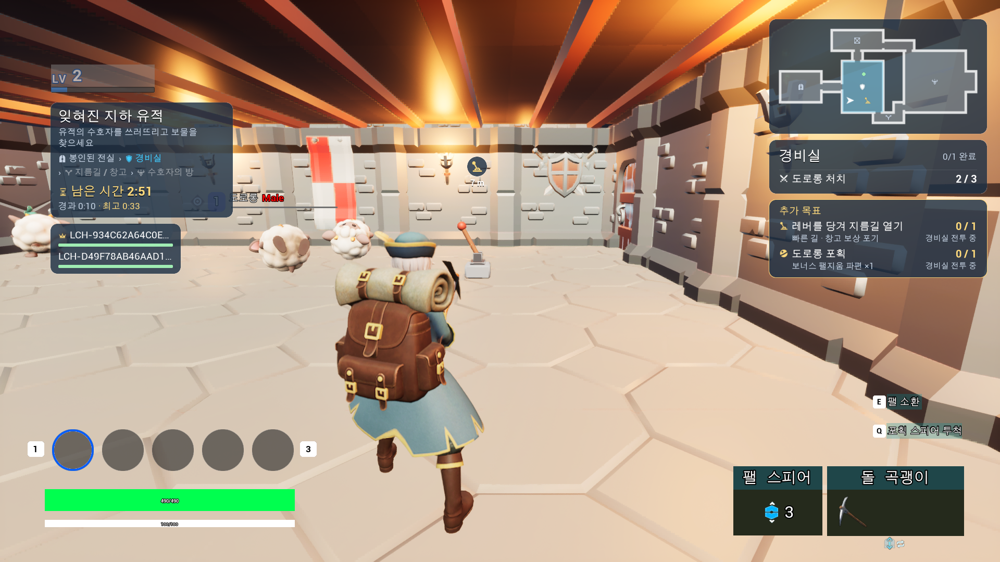
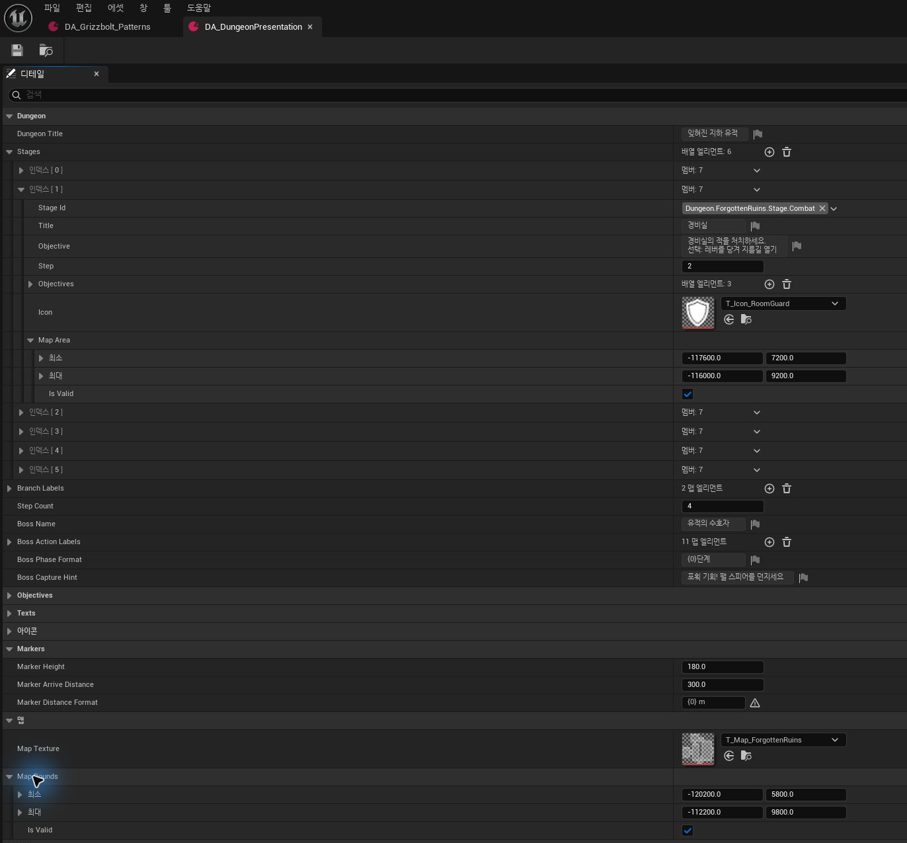
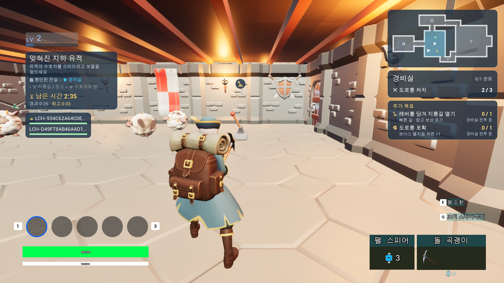
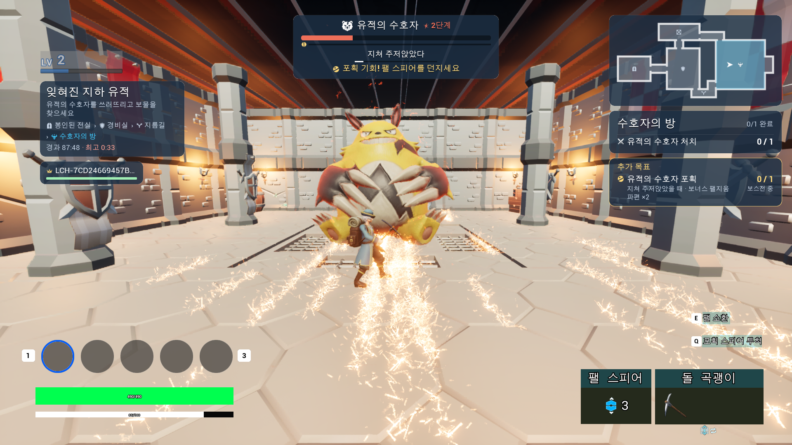
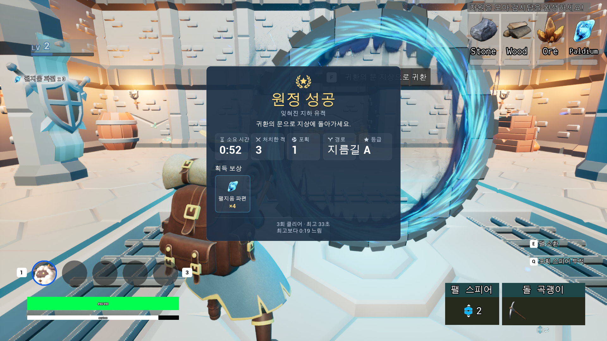

# 11. UI Architecture & Client Presentation

Sonheim UI는 **Persistent HUD, Interaction Screen, Transient Notice, Complex Content UI**의 네 흐름으로 구성됩니다.

## 요약

- Persistent HUD는 Health/Stamina/Level 같은 독립 state를 Component Delegate로 구독합니다.
- Inventory/Container/Crafting은 PlayerController와 Screen Widget이 state와 static definition을 조합합니다.
- <code>UNoticeSubsystem</code>이 Banner/Title의 queue, channel, style을 LocalPlayer 단위로 관리합니다.
- Dungeon UI는 Snapshot → Presenter → ViewData → UI Router로 복합 gameplay state를 화면 모델로 변환합니다.
- UI Router가 async Widget load, state reconstruction, 기존 HUD visibility 등 content UI lifecycle을 관리합니다.

## Runtime Demo

### Notice / Toast

https://github.com/user-attachments/assets/bc9e4305-62f6-43bb-b1fa-2b109a06eb5b

*Lever 상호작용과 Wave 완료/Branch 변경에서 발생한 Dungeon Banner가 `ShortcutUnlocked → GroupClear → Branch.Shortcut` 순으로 표시되는 `TakeTurns` queue 시연.*

## 목차

- [Runtime Demo](#runtime-demo)
- [System Overview](#system-overview)
- [Base HUD & Interaction Screen](#base-hud--interaction-screen)
- [Notice / Toast](#notice--toast)
- [Complex Content UI — Dungeon](#complex-content-ui--dungeon)
- [UI Lifecycle & Reuse](#ui-lifecycle--reuse)
- [Trade-offs](#trade-offs)

---

## System Overview

~~~mermaid
flowchart TB
    subgraph SOURCE["Gameplay / State"]
        COMP["<b>독립 Gameplay State</b> Health · Stamina · Inventory · Equipment"]
        WORLD["<b>상호작용 State</b> Container · Crafting Station"]
        EVENT["<b>Transient Event</b> Level · Capture · Crafting · Region"]
        SNAP["<b>복합 Content State</b> FDungeonStageRuntimeState"]
    end

    subgraph PRESENT["Client Presentation"]
        CTRL["<b>Persistent / Screen Lifetime</b> ASonheimPlayerController"]
        NOTICE["<b>Notice Queue</b> UNoticeSubsystem : ULocalPlayerSubsystem"]
        PRESENTER["<b>Content Adapter</b> UDungeonStagePresenter"]
        ROUTER["<b>Content UI Routing</b> UDungeonUIRouterSubsystem"]
    end

    subgraph UMG["UMG"]
        HUD["<b>Persistent HUD</b> Player Status"]
        SCREEN["<b>Interaction Screen</b> Inventory · Container · Crafting"]
        POPUP["<b>Local Popup</b> UConfirmWidget"]
        TOAST["<b>Notice / Toast</b> Banner · Title"]
        CONTENT["<b>Complex Content UI</b> Dungeon HUD · Minimap · Result"]
    end

    COMP --> CTRL --> HUD
    COMP --> SCREEN
    WORLD --> SCREEN
    SCREEN --> POPUP
    EVENT --> NOTICE --> TOAST
    SNAP --> PRESENTER --> ROUTER --> CONTENT
~~~

| UI 종류 | 상태/수명 관리 | 주요 데이터 source |
|---|---|---|
| Player HUD | PlayerController + Widget | Component / PlayerState Delegate |
| Inventory / Stat | PlayerController | Inventory / PlayerState |
| Container | ContainerInteractionWidget | Player Inventory + Container |
| Crafting | CraftingStation + CraftingWidget | Recipe + Inventory + ActiveWork |
| Confirm Popup | InventoryWidget | ItemID / Count / Action mode |
| Notice / Toast | UNoticeSubsystem | FNoticeData + Slot / Channel |
| Dungeon HUD / Result | Presenter + UI Router | Run Snapshot + Presentation Data + 기존 Component/World State |

---

## Base HUD & Interaction Screen

### C++ Widget Contract와 Widget Blueprint

C++ Widget class는 **데이터 연결·입력 처리·BindWidget 계약**을 담당하고, Widget Blueprint는 **layout·style·animation**을 구성합니다.

예를 들어 <code>UInventoryWidget</code>은:

- <code>BindWidget</code>으로 SlotGrid / Equipment Slot / Trash Zone 계약 정의
- Inventory / Equipment delegate 처리
- Drag & Drop 요청
- ItemID → ItemData 변환

을 담당합니다.

~~~text
C++ Widget
 ├─ BindWidget Contract
 ├─ Data Binding
 └─ Input / Request
        ↓
Widget Blueprint
 ├─ Layout
 ├─ Art / Style
 └─ Animation
~~~

AgentMcp의 UMG toolset도 이 계약을 기준으로 C++ <code>BindWidget</code>과 Widget Tree를 함께 검사하며 Widget Blueprint를 생성·수정합니다.

### Persistent HUD

Health / Stamina / Level처럼 owner와 lifecycle이 명확한 값은 component delegate를 직접 구독합니다.

~~~text
HealthComponent.OnHealthChanged ─┐
StaminaComponent.OnChanged      ├─→ UPlayerStatusWidget
LevelComponent.OnLevelChanged   ┘
~~~

HUD는 gameplay object를 Tick으로 polling하지 않고 상태 owner가 발생시키는 변경 event를 반영합니다.

### Inventory

PlayerController가 Inventory Screen을 열고 <code>UInventoryWidget</code>에 <code>UInventoryComponent</code>를 연결합니다.

~~~mermaid
flowchart LR
    INV["<b>Runtime State</b> UInventoryComponent"]
    EVENT["<b>Change Event</b> Inventory / Equipment Delegate"]
    DATA["<b>Static Definition</b> FItemData"]
    WIDGET["<b>Screen Logic</b> UInventoryWidget"]
    SLOT["<b>Reusable Item View</b> USlotWidget"]

    INV --> EVENT --> WIDGET
    DATA --> WIDGET
    WIDGET --> SLOT
~~~

Widget은:

1. Inventory의 ItemID / Count를 읽고
2. GameInstance의 <code>FItemData</code>에서 이름·아이콘·rarity 같은 정적 정보를 조회한 뒤
3. <code>USlotWidget</code>에 화면용 값을 전달합니다.

원본 Item state는 <code>UInventoryComponent</code>가 유지합니다.

### Container

<code>UContainerInteractionWidget</code>은 Player Inventory와 Container Inventory를 한 화면에 배치합니다.

~~~text
ContainerInteractionWidget
 ├─ PlayerInventoryWidget
 └─ ContainerWidget
~~~

Player Inventory의 Slot/Drag & Drop 구조를 Container 화면에서도 재사용하고, 양쪽 state 사이의 이동 요청만 추가합니다.

### Crafting

Crafting UI는 세 source를 결합합니다.

~~~text
Recipe DataTable
 + Player Inventory
 + Crafting Station ActiveWork
        ↓
UCraftingWidget / CraftingQueueWidget
~~~

Recipe가 바뀔 때는 결과 Item·Icon·Material Row 같은 구조를 갱신하고, Inventory 수량이나 Work progress가 바뀔 때는 필요한 값만 갱신합니다.

Required Material Row는 부모 Widget이 pool을 소유해 필요한 수만 활성화하고 나머지는 <code>Collapsed</code> 상태로 재사용합니다.

세부 Item/Crafting 흐름은 [[07. Inventory & Crafting|07_Inventory_Crafting]]에서 설명합니다.

### Local Confirm Popup

Item Drop / Discard처럼 추가 확인이 필요한 동작은 <code>UInventoryWidget</code>이 <code>UConfirmWidget</code>을 생성해 처리합니다.

~~~text
Drop / Discard Request
      ↓
UInventoryWidget
      ↓
UConfirmWidget
  ItemID · MaxCount · Mode
      ↓ OnConfirm
UInventoryWidget
      ↓
ServerDrop / ServerDiscard
~~~

Confirm Widget은 gameplay mutation을 직접 수행하지 않고 결과를 부모 화면으로 전달합니다.

현재 Inventory/Stat menu의 cursor와 gameplay input은 PlayerController가 관리하고, Container/Crafting은 각 interaction screen의 open/close lifecycle에서 cursor와 종료 처리를 관리합니다.

---

## Notice / Toast

Level Up, Capture 결과, Crafting 완료, Region Title, Dungeon 진행처럼 **현재 상태를 저장할 필요 없이 짧게 전달하는 정보**는 <code>UNoticeSubsystem</code>이 관리합니다.

<code>UNoticeSubsystem : ULocalPlayerSubsystem</code>은 LocalPlayer 수명에 맞춰 생성되며 gameplay producer는 <code>FNoticeData</code>만 전달합니다.

~~~text
Gameplay Producer
  Level / Capture / Crafting / Region / Dungeon
        ↓
FNoticeData
        ↓
Slot + Channel
        ↓
UNoticeSubsystem
        ↓
UNoticeWidget
~~~

### Notice Data와 Style

<code>FNoticeData</code>는 다음 정보를 담습니다.

- Category
- Title
- Detail
- Symbol / Icon
- Tone

실제 Widget class와 style, queue 크기, ZOrder는 Slot 설정이 결정합니다.

~~~cpp
struct FNoticeSlotSettings
{
    TSoftClassPtr<UNoticeWidget> WidgetClass;
    TSoftObjectPtr<UNoticeStyle> Style;

    int32 ZOrder;
    ENoticeOrder Order;
    int32 MaxWaiting;
};
~~~

### Slot과 Queue Policy

현재 대표 Slot은:

- **Banner** — 진행/완료/경고 카드
- **Title** — Region / Room title

입니다.

Queue policy는:

- **TakeTurns** — 현재 Notice 종료 후 waiting queue를 순서대로 표시
- **ReplaceShowing** — 새 Notice가 들어오면 현재/대기 내용을 최신 값으로 교체

를 사용합니다.

실제 `TakeTurns` 동작은 상단 Runtime Demo에서 확인할 수 있습니다.

### Channel

같은 Banner Slot에서도 producer별 channel을 유지합니다.

~~~text
Banner
 ├─ Level
 ├─ Capture
 ├─ Crafting
 └─ Dungeon

Title
 ├─ Region
 └─ Dungeon
~~~

Dungeon Run 종료 시:

~~~cpp
Notices->Clear(TEXT("Dungeon"));
~~~

처럼 Dungeon이 만든 showing/waiting notice만 회수할 수 있습니다.

### Notice Widget

<code>UNoticeWidget</code>은 gameplay component를 직접 참조하지 않고 전달받은 ViewData와 <code>UNoticeStyle</code>로:

- fade in
- hold
- fade out
- accent / icon
- lifetime progress

를 표현합니다.

Item 직접 획득 feedback은 기존 Player HUD의 별도 popup 경로도 사용합니다.

~~~text
Inventory.OnItemAdded
      ↓
PlayerController Client RPC
      ↓
PlayerStatusWidget.DisplayItemPopup
~~~

<code>OnInventoryChanged</code>와 <code>OnItemAdded</code>가 분리되어 있어 Slot Swap이나 장비 해제가 Item 획득 popup으로 표시되지 않습니다.

---

## Complex Content UI — Dungeon

Dungeon UI는 Stage, Objective, Party, Boss, Minimap, Reward 등 여러 gameplay state를 한 화면에서 조합합니다.

- Stage / Main & Optional Objective
- Branch / Route
- Party
- Timer
- Boss
- Minimap / Marker
- Reward / Result

그래서 Runtime Snapshot을 Widget에 직접 넘기지 않고 다음 계층을 사용합니다.

~~~mermaid
flowchart LR
    R["<b>Server Content State</b> UDungeonStageRuntimeSubsystem"]
    G["<b>Replicated Snapshot</b> ASonheimGameState FDungeonStageRuntimeState"]
    P["<b>Client Adapter</b> UDungeonStagePresenter"]
    D["<b>Presentation Definition</b> UDungeonPresentationDataAsset"]
    V["<b>View Model</b> FDungeonStageViewData"]
    U["<b>Widget Lifecycle</b> UDungeonUIRouterSubsystem"]
    W["<b>UMG</b> HUD · Minimap · Result"]

    R --> G --> P
    D --> P
    P --> V --> U --> W
~~~

위 화면은 같은 Run의 **Stage / Main·Optional Objective / Timer / Party / World Marker / Minimap**을 한 Client 화면에 조합한 결과입니다. Dungeon progression은 Snapshot에서, Party HP는 기존 replicated `HealthComponent`에서, text·icon·room 영역은 Presentation Asset에서 가져옵니다.

### Presenter

Presenter는 Runtime ID와 Presentation Data를 결합합니다.

~~~text
StageId
= Dungeon.ForgottenRuins.Stage.GuardRoom

Objective Group
= Dungeon.ForgottenRuins.Group.Guards

Runtime Count
= 2 / 4
        ↓
Presenter
        ↓
"경비실"
"경비병을 처치하세요"
2 / 4
Room Icon
World Marker
~~~

Widget은 GameplayTag, ItemID, Stage transition을 해석하지 않고 화면용 ViewData를 소비합니다.

### Presentation Definition

Runtime Snapshot에는 화면 문구나 Map texture를 직접 넣지 않습니다. `UDungeonPresentationDataAsset`이 Stage title/objective/icon, room 영역, marker와 전체 map bounds 같은 presentation 정의를 소유합니다.

Presenter는 Snapshot의 `StageId`와 Objective 상태를 이 정의에 결합해 ViewData를 만듭니다. 같은 gameplay state를 유지하면서도 화면 표현을 asset에서 조정할 수 있도록 분리한 구조입니다.

### Snapshot Revision

같은 Run의 오래된 Snapshot이 화면을 되돌리지 않도록 <code>Revision</code>을 비교합니다.

~~~cpp
if (Snapshot.RunId == Latest.RunId &&
    Snapshot.Revision <= Latest.Revision)
{
    return;
}
~~~

새 Run에서는 새로운 기준으로 시작하고, 같은 Run에서는 더 높은 Revision만 반영합니다.

### 기존 Component State 병행

Party HP처럼 이미 독립적으로 복제되는 값은 Dungeon Snapshot에 중복 저장하지 않습니다.

~~~text
Dungeon Snapshot
 └─ Participants
        ↓
Participant Pawn
 └─ HealthComponent
        ↓
OnHealthChanged
        ↓
Presenter Refresh
~~~

Dungeon progression은 Snapshot, Health는 기존 Component/Delegate 경로를 사용합니다.

### Minimap / Marker

Minimap은 **Presentation 정의와 현재 world state를 함께 사용**합니다.

Presentation Data는:

- Map Texture
- World Bounds
- Stage Room Rect
- Marker icon / kind

을 정의하고, Presenter는 Current Stage와 열린 Objective의 Marker target을 ViewData로 구성합니다. Local/remote Player 위치와 local camera 방향처럼 매 frame 변하는 값은 Minimap Widget이 실제 Pawn/PlayerState에서 읽어 map 좌표로 투영합니다.

위 화면에서는 Current Stage room highlight, Local Player arrow, Remote Player dot, Lever Objective marker와 room icon이 동시에 표시됩니다. Bounds 밖 Player는 edge로 clamp하지 않고 표시 대상에서 제외합니다.

https://github.com/user-attachments/assets/fa7c4755-16dd-47fb-a558-80b74aa536b2

영상에서는 remote Player의 Dungeon 밖 이동/복귀, 두 Player의 위치 변화와 local camera 회전에 따른 arrow 방향 갱신을 확인할 수 있습니다.

### Server Time 기반 Progress

Stage countdown과 Boss action progress는 Snapshot의:

- RunStartedServerTime
- StageDeadlineServerTime
- BossActionStartServerTime
- BossActionEndServerTime

을 synchronized server clock과 비교해 계산합니다.

HUD가 늦게 생성되거나 재생성돼도 같은 현재 progress를 복원합니다.

### Widget 재생성과 상태 복구

Widget 자체는 Dungeon Run의 상태 owner가 아닙니다. 진행 중 HUD를 제거해도 Presenter와 Snapshot은 유지되고, 이후 UI 갱신이 발생하면 Router가 **새 Widget instance**를 만들어 Latest ViewData를 적용합니다.

https://github.com/user-attachments/assets/6c4f9601-8fbe-4957-87d4-d4ad230f3211

촬영에서는 기존 HUD를 `RemoveFromParent`한 뒤 새 instance가 생성됐고, 같은 RunId / Stage / Objective 2/3 / Optional Objective / Minimap 상태를 다시 구성했습니다. Countdown과 elapsed time도 Widget 생성 시점에서 다시 시작하지 않고 기존 `StageDeadlineServerTime` / `RunStartedServerTime`과 synchronized server clock을 계속 사용했습니다.

### Boss Status

Boss FSM 자체를 Widget이 직접 참조하지 않고, Snapshot에 반영된 **Action / Phase / Break / Capture 가능 상태**를 Presenter가 화면용 정보로 변환합니다.

위 화면에서는 Phase 2, Break 상태, Exhaust 상태와 Capture 안내가 하나의 HUD에서 함께 표현됩니다. 같은 Runtime state를 Boss HUD와 Dungeon Objective가 각각 필요한 형태로 소비합니다.

### Result

Run 종료 시 최종 Snapshot의:

- Reward
- Elapsed
- Defeated / Captured
- Branch
- Grade
- Best Record
- Fail Reason

을 Result ViewData로 변환합니다.

~~~text
Running Snapshot
→ Dungeon HUD

Terminal Snapshot
→ Result
~~~

진행 HUD와 Result는 같은 Run State의 서로 다른 presentation입니다.

위 결과 화면은 진행 HUD와 **같은 Run**의 terminal Snapshot을 사용합니다. 실제 최종 state의 elapsed time, defeated/captured count, 선택 branch, reward, grade와 기존 best record를 Result ViewData로 변환해 표시합니다.

---

## UI Lifecycle & Reuse

### LocalPlayer UI Router

<code>UDungeonUIRouterSubsystem : ULocalPlayerSubsystem</code>은:

- HUD / Result Widget 선택
- Widget class async load
- 최신 ViewData cache
- 현재 Widget 교체
- Dungeon 중 기존 HUD hide / restore
- Dungeon Notice channel cleanup

을 담당합니다.

Async load 완료 시점이 현재 UI lifecycle과 달라질 수 있으므로 <code>Generation</code> 값을 사용합니다.

~~~text
Attach : Generation N
   ↓ Async Load

Detach / Reattach : Generation N+1
   ↓

Old Callback
Expected N != Current N+1
→ Ignore
~~~

### 기존 HUD Visibility 복원

Dungeon Run 동안 숨긴 Widget은 원래 <code>ESlateVisibility</code> 값을 저장합니다.

Run 종료 시 일괄 <code>Visible</code>로 설정하는 대신 저장한 상태를 복원합니다.

Run 도중 새로 생성된 대상 Widget도 update 시 다시 확인해 숨깁니다.

### Widget 재사용

- **USlotWidget** — Inventory / Equipment / Container / Crafting Item 표현
- **Crafting Material Row** — 부모 Widget의 local pool
- **Floating Damage** — 전투 중 반복 생성량이 큰 global actor pool

각 UI의 생성 빈도와 수명에 맞춰 재사용 단위를 다르게 적용합니다.

### 현재 Screen / Popup Input 관리

현재 구현에서 input/cursor ownership은 다음 위치에 있습니다.

| 화면 | 관리 위치 |
|---|---|
| Inventory / Stat | PlayerController |
| Container | Container interaction screen |
| Crafting | Crafting interaction screen / Station state |
| Confirm Popup | InventoryWidget |
| Dungeon HUD / Result | Dungeon UI Router / Registry |

Dungeon Registry는 <code>Screen / Modal / HUD</code> layer와 <code>GameOnly / GameAndUI / UIOnly</code> input policy를 표현할 수 있고, 현재 Dungeon HUD/Result는 gameplay input과 함께 동작하도록 GameOnly 경로를 사용합니다.

---

## Trade-offs

| 구조 | 적용 위치 | 이유 |
|---|---|---|
| **Delegate Binding** | HP / Stamina / Inventory | owner가 명확한 독립 state 변경 |
| **C++ Widget + WBP** | 기본 Screen / HUD | 데이터 계약과 visual authoring 분리 |
| **LocalPlayer NoticeSubsystem** | Banner / Title | transient event의 queue / channel / style 관리 |
| **Presenter → ViewData** | Dungeon | Snapshot·Presentation 정의·기존 Component state를 하나의 화면 모델로 조합 |
| **LocalPlayer UI Router** | Dungeon HUD / Result | async widget load와 content UI lifecycle 관리 |
| **Local Popup Ownership** | Inventory Confirm | 부모 screen context 안에서 확인/결과 반환 |

---

## 연관 문서

- [[02. Gameplay Architecture|02_Gameplay_Architecture]] — Gameplay / Presentation 책임 경계
- [[06. World Interaction Systems|06_World_Interaction_Systems]] — Context Prompt와 Interaction UI
- [[07. Inventory & Crafting|07_Inventory_Crafting]] — Inventory/Container/Crafting의 상태와 UI 흐름
- [[09. Branching Dungeon Runtime|09_Branching_Dungeon_Runtime]] — Dungeon Snapshot의 원본 Runtime
- [[10. Boss Encounter Runtime|10_Boss_Encounter_Runtime]] — Boss Status의 원본
- [[12. Multiplayer Synchronization|12_Multiplayer_Synchronization]] — Client state 동기화

---

## 관련 코드

- [SonheimPlayerController.cpp](https://github.com/chungheonLee0325/Sonheim/blob/main/Sonheim/Source/Sonheim/AreaObject/Player/SonheimPlayerController.cpp)
- [InventoryWidget.cpp](https://github.com/chungheonLee0325/Sonheim/blob/main/Sonheim/Source/Sonheim/UI/Widget/Player/Inventory/InventoryWidget.cpp)
- [ConfirmWidget.h](https://github.com/chungheonLee0325/Sonheim/blob/main/Sonheim/Source/Sonheim/UI/Widget/Player/Inventory/ConfirmWidget.h)
- [ContainerInteractionWidget.cpp](https://github.com/chungheonLee0325/Sonheim/blob/main/Sonheim/Source/Sonheim/UI/Widget/GameObject/ContainerInteractionWidget.cpp)
- [CraftingWidget.cpp](https://github.com/chungheonLee0325/Sonheim/blob/main/Sonheim/Source/Sonheim/UI/Widget/GameObject/Crafting/CraftingWidget.cpp)
- [NoticeSubsystem.cpp](https://github.com/chungheonLee0325/Sonheim/blob/main/Sonheim/Source/Sonheim/UI/Notice/NoticeSubsystem.cpp)
- [NoticeWidget.h](https://github.com/chungheonLee0325/Sonheim/blob/main/Sonheim/Source/Sonheim/UI/Notice/NoticeWidget.h)
- [DungeonStagePresenter.cpp](https://github.com/chungheonLee0325/Sonheim/blob/main/Sonheim/Source/Sonheim/UI/Dungeon/DungeonStagePresenter.cpp)
- [DungeonUIRouterSubsystem.cpp](https://github.com/chungheonLee0325/Sonheim/blob/main/Sonheim/Source/Sonheim/UI/Dungeon/DungeonUIRouterSubsystem.cpp)
- [DungeonUIRegistryDataAsset.h](https://github.com/chungheonLee0325/Sonheim/blob/main/Sonheim/Source/Sonheim/UI/Dungeon/DungeonUIRegistryDataAsset.h)
