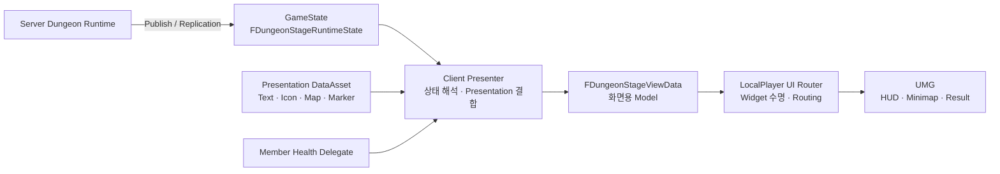

# 11. Client State & Presentation Pipeline

Dungeon UI는 Server Runtime의 상태를 Widget이 직접 읽지 않고, **Authoritative Snapshot → Presenter → ViewData → LocalPlayer UI Router → UMG** 순서로 변환합니다.

이 계층을 둔 이유는 복합적인 gameplay state와 Widget lifecycle을 분리하고, HUD가 늦게 생성되거나 다시 만들어져도 **현재 상태에서 화면을 재구성할 수 있게 하기 위해서**입니다.

---

## 전체 구조



- **Runtime Snapshot** — 현재 Run에서 실제로 일어난 결과
- **Presentation Data** — 제목, 아이콘, 지도, 문구처럼 화면 표현에 필요한 정적 정보
- **Presenter** — 두 정보를 결합해 화면용 모델 생성
- **UI Router** — LocalPlayer 기준으로 HUD/Result Widget의 생성과 교체를 관리
- **Widget** — 이미 가공된 ViewData를 그리는 역할에 집중

---

## 1. Gameplay State와 화면용 Data를 분리

Server가 발행하는 `FDungeonStageRuntimeState`는 화면 구조를 알지 않습니다.

대표적으로 다음 정보를 가집니다.

| Runtime 영역 | 예 |
|---|---|
| Run | RunId, RunStatus, Revision |
| 진행 | StageId, Objective count |
| 분기 | SelectedBranchId, RunTags |
| 시간 | RunStartedServerTime, StageDeadlineServerTime |
| World | SealedBarriers |
| Party | Participants, OwnerPlayer |
| Boss | Health, ActionId, Phase, Break, Vulnerable |
| 결과 | Rewards, Elapsed, ClearCount, BestSeconds |

반면 Widget이 받는 `FDungeonStageViewData`는 이미 화면 언어로 변환된 상태입니다.

```cpp
struct FDungeonStageViewData
{
    FText DungeonTitle;
    FText Title;
    FText Objective;

    TArray<FDungeonStepViewData> Steps;
    TArray<FDungeonObjectiveViewData> Objectives;
    TArray<FDungeonObjectiveViewData> OptionalObjectives;

    TArray<FDungeonMarkerViewData> Markers;
    UTexture2D* MapTexture;
    TArray<FDungeonMapRoomViewData> MapRooms;

    TArray<FDungeonMemberViewData> Members;

    FText BossName;
    FText BossActionText;
    FText BossPhaseText;
    float BossHealth = 0.f;
    float BossBreak = 0.f;

    TArray<FDungeonRewardViewData> Rewards;
    TArray<FDungeonStatViewData> Stats;

    EDungeonRunStatus Status;
    int32 Revision = 0;
};
```

Widget이 GameplayTag, ItemId, Stage transition을 직접 해석하지 않습니다.

---

## 2. Presenter가 Runtime을 화면 언어로 변환

예를 들어 Runtime에는 다음 값이 있다고 가정합니다.

```text
StageId          = Dungeon.ForgottenRuins.Stage.GuardRoom
ObjectiveGroupId = Dungeon.ForgottenRuins.Group.Guards
CurrentCount     = 2
RequiredCount    = 4
```

Presenter는 Definition / Presentation Data를 조합해 다음처럼 변환합니다.

```text
StageId            → "경비실"
ObjectiveGroupId   → "경비병을 처치하세요"
2 / 4              → Objective Count
StageId            → Route Step / Room Icon
MarkerTarget       → World Marker
```

즉 Presenter는 **게임 상태를 화면에서 사용할 수 있는 정보로 해석하는 Adapter** 역할을 합니다.

---

## 3. Snapshot 변경은 Revision으로 순서를 보장

Client가 이미 더 최신 Snapshot을 처리했다면 오래된 update를 다시 적용하지 않습니다.

```cpp
void UDungeonStagePresenter::OnSnapshot(
    const FDungeonStageRuntimeState& Snapshot)
{
    if (Snapshot.RunId == Latest.RunId &&
        Snapshot.Revision <= Latest.Revision)
        return;

    Latest = Snapshot;
    ...
    Present();
}
```

새 Run에서는 이전 Run과 비교하지 않고 새 기준으로 시작하고, 같은 Run 안에서는 `Revision`이 증가한 상태만 반영합니다.

---

## 4. Definition / Presentation Asset은 Snapshot에 맞춰 Load

Snapshot에는 현재 Run이 사용하는 `DefinitionAssetId`가 포함됩니다.

Presenter는 이 ID가 바뀌면 필요한 Definition을 Load하고, Load가 완료됐을 때 **여전히 같은 Definition을 기다리고 있는지 확인한 뒤** 화면을 다시 생성합니다.

```text
Snapshot.DefinitionAssetId 변경
        ↓
기존 Request 해제
        ↓
Async Load
        ↓
Expected ID 확인
        ↓
Definition 연결
        ↓
Present()
```

Gameplay Runtime과 UI가 같은 UObject lifetime을 공유하지 않아도 현재 Run이 가리키는 데이터로 presentation을 구성할 수 있습니다.

---

## 5. Objective는 Runtime Tally와 Presentation Rule을 결합

Objective 문구를 Server Snapshot에 그대로 넣지 않습니다.

Presentation Data에는:

- Label
- Main / Optional
- Goal type
- GroupId / RunTag
- Marker target
- Icon

을 정의하고, Presenter가 Runtime Tally와 결합합니다.

예:

```text
Goal = Group
GroupId = Guards
        +
Runtime Tally
Spawned  = 4
Defeated = 2
Captured = 0
        ↓
"경비병을 처치하세요  2 / 4"
```

Capture된 Monster도 Objective에서는 Defeated와 함께 완료 수에 포함합니다.

---

## 6. Optional Objective는 Stage를 떠난 뒤 결과를 잠시 유지

Optional Objective가 종료되는 순간 바로 사라지면 성공/실패 여부를 확인하기 어렵습니다.

Presenter는 Stage 전환 직전에 이전 Stage의 Optional Objective를 평가해:

- `Done`
- `Missed`

로 바꾸고 일정 시간 화면에 유지합니다.

```text
Optional Objective Open
        ↓ Stage Transition
최종 상태 판정
        ↓
Done / Missed
        ↓
몇 초 후 제거
```

Gameplay state를 바꾸는 것이 아니라 presentation layer에서 **완료 피드백의 수명만 별도로 관리**합니다.

---

## 7. Minimap과 World Marker도 ViewData로 만든다

Widget이 World Actor를 직접 검색하지 않습니다.

Presenter가 현재 열린 Objective의 `MarkerTarget`을 기준으로:

- Trigger Zone
- Shortcut Switch

를 찾고 `FDungeonMarkerViewData`로 변환합니다.

Marker에는:

- World Location
- Arrival bounds
- Icon
- Main / Optional kind
- Room 여부

가 들어갑니다.

Minimap도 Presentation Data의:

- Map Texture
- World Bounds
- Stage별 Room Rect

을 이용해 `FDungeonMapRoomViewData`를 만듭니다.

현재 Stage의 방만 `bCurrent`로 표시합니다.

---

## 8. 모든 상태를 Snapshot에 중복하지 않는다

Party HP는 이미 각 Player의 `UHealthComponent`가 자신의 replicated state와 delegate를 갖습니다.

Dungeon Snapshot에 Player HP를 다시 복제하지 않고 Presenter가 참가자의 Health delegate를 구독합니다.

```text
Dungeon Snapshot
 → Participants

Participant Pawn
 → HealthComponent
 → OnHealthChanged
 → Presenter.Present()
```

즉:

- **Dungeon progression** → Snapshot
- **이미 독립적으로 복제되는 Actor 상태** → 기존 component/delegate

를 사용합니다.

복합 화면을 위해 모든 데이터를 하나의 거대한 Snapshot에 중복하지 않습니다.

---

## 9. Timer는 Server Time을 기준으로 표시

Stage countdown이나 Boss Action progress를 Client 수신 시각부터 새로 세지 않습니다.

Snapshot에는 다음 Server Time이 포함됩니다.

- `RunStartedServerTime`
- `StageDeadlineServerTime`
- `BossActionStartServerTime`
- `BossActionEndServerTime`

Widget은 synchronized server clock과 비교해 현재 progress를 계산합니다.

```text
Server Deadline
   ↓ Replication
Client Server Clock
   ↓
Remaining Time / Progress
```

HUD가 재생성되거나 packet 도착 시간이 달라도 같은 기준으로 표시됩니다.

---

## 10. Result 화면도 같은 Snapshot에서 생성

Run이 끝나면 별도 Result RPC payload를 만들지 않습니다.

최종 Snapshot의:

- Rewards
- Elapsed
- Defeated / Captured
- Selected Branch
- Clear Count
- Best Seconds
- Start Best Seconds
- Fail Reason

을 Presenter가 화면용 데이터로 바꿉니다.

Presentation Data와 Definition의 Grade Rule을 조합해:

- Reward Item 이름 / Icon
- Time
- Kill / Capture
- Route
- Grade
- New Best
- Fail Reason

을 생성합니다.

진행 HUD와 Result가 **같은 Run State의 다른 presentation**입니다.

---

## 11. LocalPlayer UI Router가 Widget 수명을 관리

`UDungeonUIRouterSubsystem : ULocalPlayerSubsystem`은 gameplay 내용을 해석하지 않고 **어떤 화면을 언제 생성할지**를 담당합니다.

주요 책임:

- Dungeon HUD / Result 선택
- LocalPlayer participant 여부 반영
- Widget async load
- 최신 ViewData cache
- 기존 화면 hide / restore
- Dungeon Notice channel cleanup

```text
Running
 → UI.Dungeon.HUD

Succeeded / Failed
 → UI.Dungeon.Result

Idle
 → Dungeon Widget 제거
```

Gameplay Runtime은 UMG class나 input mode를 알지 않습니다.

---

## 12. Async Widget Load의 stale callback을 방어

Router가 detach되거나 다른 화면으로 전환되는 동안 이전 async load가 늦게 완료될 수 있습니다.

`Generation` 값을 이용해 오래된 callback을 무시합니다.

```text
Attach
 Generation = N
   ↓
Async Widget Load

Detach / Reattach
 Generation = N + 1

이전 callback 도착
   ↓
Expected != Generation
   ↓
무시
```

UI asset loading이 늦게 끝나도 이전 lifecycle의 Widget을 다시 생성하지 않습니다.

---

## 13. Dungeon 중 기존 HUD를 숨겼다가 원래 상태로 복원

Dungeon HUD가 표시될 때 Registry의 `HiddenDuringRun` 화면을 찾아 숨기고, 각 Widget의 기존 `ESlateVisibility`를 저장합니다.

Run 종료 시 단순히 `Visible`로 바꾸는 것이 아니라 **원래 visibility를 복원**합니다.

또 Run 도중 새로 생성된 화면도 다음 update에서 다시 검사해 숨깁니다.

Dungeon 화면이 다른 UI의 상태를 영구적으로 덮어쓰지 않도록 한 처리입니다.

---

## 14. Notice는 Snapshot과 분리된 transient presentation

Room Title, Group Clear, Branch 선택 같은 메시지는 “현재 상태”가 아니라 일시적 피드백입니다.

Presenter가 Snapshot의 이전/현재 값을 비교해 새로 발생한 변화만 `UNoticeSubsystem`에 전달합니다.

예:

- 새 RunTag 획득
- Group Clear
- Branch 선택
- 새 Objective 시작

Dungeon 전용 Channel을 사용해 Run 종료 시 대기 중인 Notice까지 정리합니다.

---

## 설계 선택과 비용

| 선택 | 얻은 것 | 비용 / 제약 |
|---|---|---|
| **Snapshot → Presenter → ViewData** | Gameplay schema와 UMG 분리, UI 재생성 가능 | mapping code와 ViewData type 증가 |
| **Presentation Data 분리** | Text/Icon/Map을 gameplay rule과 독립적으로 수정 | Definition과 Presentation의 ID 대응 관리 필요 |
| **Component Delegate 병행** | HP처럼 이미 복제되는 상태를 Snapshot에 중복하지 않음 | Presenter가 여러 data source를 조합해야 함 |
| **LocalPlayer UI Router** | 화면 수명·async load·hide/restore를 gameplay에서 분리 | UI lifecycle 관리 코드가 별도 subsystem에 생김 |
| **Server Time 기반 progress** | latency/HUD recreation과 무관한 동일 기준 | Client가 synchronized server clock을 사용해야 함 |

---

## 연관 문서

- [[09. Branching Dungeon Runtime|09_Branching_Dungeon_Runtime]] — Snapshot을 만드는 Server Runtime
- [[10. Boss Encounter Runtime|10_Boss_Encounter_Runtime]] — Boss Action / Phase / Break 상태의 출처
- [[03. Data & Content Architecture|03_Data_Content_Architecture]] — Definition과 Presentation Data의 역할 분리
- [[12. Multiplayer Synchronization|12_Multiplayer_Synchronization]] — Snapshot / Replication을 포함한 네트워크 동기화

---

## 관련 코드

- [DungeonStageRuntimeTypes.h](https://github.com/chungheonLee0325/Sonheim/blob/main/Sonheim/Source/Sonheim/GameManager/Dungeon/DungeonStageRuntimeTypes.h)
- [DungeonStagePresenter.cpp](https://github.com/chungheonLee0325/Sonheim/blob/main/Sonheim/Source/Sonheim/UI/Dungeon/DungeonStagePresenter.cpp)
- [DungeonViewData.h](https://github.com/chungheonLee0325/Sonheim/blob/main/Sonheim/Source/Sonheim/UI/Dungeon/DungeonViewData.h)
- [DungeonUIRouterSubsystem.cpp](https://github.com/chungheonLee0325/Sonheim/blob/main/Sonheim/Source/Sonheim/UI/Dungeon/DungeonUIRouterSubsystem.cpp)
