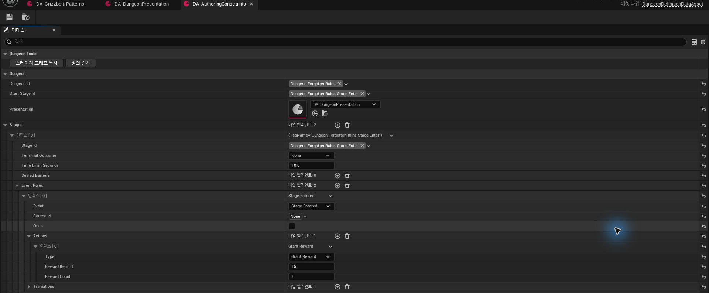
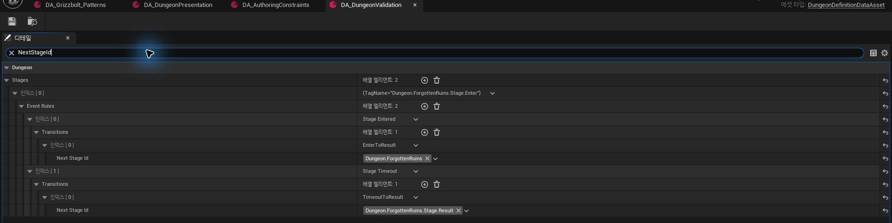
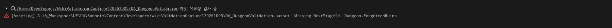
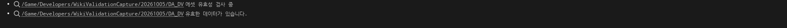
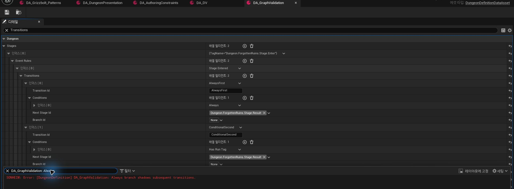
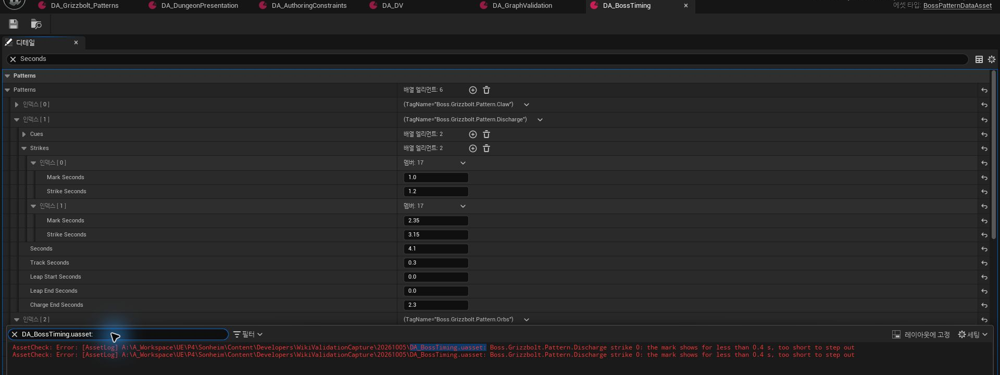
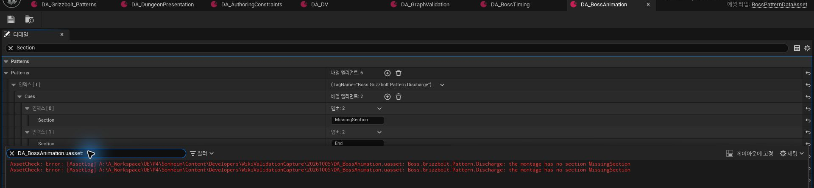

# 13. Content Authoring & Validation

Dungeon/Boss 콘텐츠가 DataAsset으로 확장되면서 **field 단위 검사만으로는 잘못된 reference, transition 순서, cycle/reachability, producer precedence, timing/animation contract 오류를 잡기 어려워졌습니다.**

검증 흐름은 다음 네 단계로 구성합니다.

1. **Editor 입력 제한** — 잘못된 field 조합을 줄임
2. **Structural / Graph Validation** — Stage/Transition/Producer 관계 검사
3. **Generated Stage Graph** — 실제 Definition에서 흐름 시각화
4. **Runtime Entry Validation** — 실행 전 핵심 구조 재검사

---

## 전체 Authoring 흐름

~~~mermaid
flowchart LR
    AUTHOR["<b>Editor Authoring</b> EditCondition · Tag Filter · Clamp"]
    CORE["<b>Shared Structural Validation</b>"]
    EDITOR["<b>Editor Data Validation</b> Dependency Check"]
    GRAPH["<b>Generated Stage Graph</b>"]
    RUNTIME["<b>Runtime Entry Validation</b>"]
    PLAY["<b>Playable Content</b>"]

    AUTHOR --> CORE
    CORE --> EDITOR
    CORE --> GRAPH
    CORE --> RUNTIME
    EDITOR --> PLAY
    RUNTIME --> PLAY
~~~

Validation rule은 실제 Definition 코드에 두고 Editor와 Runtime에서 같은 core 검사를 호출합니다.

---

## 1. 잘못된 입력을 먼저 Editor UI에서 줄인다

Dungeon Action은 Type마다 필요한 field가 다릅니다.

~~~cpp
struct FDungeonStageAction
{
    EDungeonStageAction Type;

    UPROPERTY(meta=(
        EditCondition=
          "Type == EDungeonStageAction::SpawnGroup",
        EditConditionHides,
        Categories="Dungeon"))
    FGameplayTag GroupId;

    UPROPERTY(meta=(
        EditCondition=
          "Type == EDungeonStageAction::SpawnGroup",
        EditConditionHides))
    TSoftObjectPtr<UDungeonSpawnRuleDataAsset> SpawnRule;

    UPROPERTY(meta=(
        EditCondition=
          "Type == EDungeonStageAction::GrantReward",
        EditConditionHides,
        ClampMin="1"))
    int32 RewardItemId;
};
~~~

예를 들어 <code>SpawnGroup</code>을 작성하는데 Reward field까지 모두 노출하지 않습니다.

사용한 주요 metadata:

- <code>EditCondition / EditConditionHides</code>
- <code>TitleProperty</code>
- <code>Categories="Dungeon"</code>
- <code>ClampMin / ClampMax</code>

EditCondition·Category·Clamp metadata로 Type별 필요한 field만 노출하고 입력 범위를 제한합니다.

위 화면에서는 `GrantReward` Action에 필요한 Reward field만 노출되고, 상단의 **정의 검사 / 스테이지 그래프 복사** 도구도 같은 DataAsset에서 사용할 수 있습니다. 숫자 범위 제한과 structural validation은 역할이 다르며, metadata는 잘못된 입력 자체를 줄이는 첫 단계입니다.

---

## 2. GameplayTag 입력 범위와 Definition 소속을 함께 검사

GameplayTag picker는 `Categories="Dungeon"` metadata로 작성 UI의 선택 범위를 줄입니다.

Structural validation에서는 역할별 `.Stage`, `.Group`, `.Barrier` namespace를 일괄 강제하는 대신, 사용된 Tag가 현재 Definition의 `DungeonId`와 같거나 그 하위 root에 속하는지 검사합니다.

~~~text
Dungeon.ForgottenRuins
 ├─ Stage.*
 ├─ Group.*
 ├─ Branch.*
 └─ Barrier.*

다른 Dungeon root의 Tag
→ Validation Error
~~~

Stage reference처럼 역할 자체가 중요한 값은 별도 검사를 추가합니다. 예를 들어 `NextStageId`는 같은 Dungeon root에 속하는 것만으로 충분하지 않고 **실제 `Stages` 배열에 존재해야 합니다.**

## 3. Editor와 Runtime이 같은 핵심 Validation을 사용

<code>UDungeonDefinitionDataAsset</code>의 구조 검사 진입점은 하나입니다.

~~~cpp
bool ValidateDefinition(
    TArray<FString>& Errors,
    TArray<FString>& Warnings) const;

#if WITH_EDITOR
virtual EDataValidationResult
IsDataValid(FDataValidationContext& Context) const override;

UFUNCTION(CallInEditor)
void ValidateNow();
#endif
~~~

- <code>ValidateNow()</code> — 작성 중 수동 structural 검사
- <code>IsDataValid()</code> — 같은 core + Editor에서 soft dependency 검사
- Runtime asset entry — 같은 core + 실제 loaded reference/class 확인

세 경로가 **같은 structural core를 공유**하지만 전체 검사 범위가 완전히 같지는 않습니다. Editor는 authoring 시점에 load 가능한 dependency를 더 확인하고, Runtime은 실제 load가 끝난 asset/class 상태를 추가로 확인합니다.

---

## 4. Stage Graph의 실행 가능성 검사

Dungeon Validation에서 실제로 검사하는 범위는 크게 네 단계입니다.

### 4.1 Identity / Field

- DungeonId 존재
- StartStage가 실제 Stage인지
- Presentation reference 존재
- StageId 중복/누락
- BarrierId 중복
- Reward Item / Count 범위
- Spawn Action 필수 field
- Transition의 NextStage가 실제 Stages에 존재하는지

아래는 `NextStageId`를 Dungeon root tag인 `Dungeon.ForgottenRuins`로 잘못 지정한 임시 Definition입니다. Tag 자체는 같은 Dungeon root에 있지만 실제 Stage 목록에는 없으므로 유효한 전환 대상이 아닙니다.

Unreal Data Validation은 같은 값에 대해 실제 `Missing NextStageId` 오류를 반환합니다.

해당 reference를 실제 Result Stage로 수정한 뒤 같은 Data Validation 경로를 다시 실행하면 정상 데이터로 통과합니다.

### 4.2 Event / Action 조합

Event 종류에 따라 SourceId가 필요한지 검사합니다.

예:

~~~text
StageEntered / StageTimeout
→ Stage 자체가 발생시키므로 SourceId가 있으면 오류

ActorInteracted / AreaEntered / MonsterCaptured
→ 실제 producer를 식별해야 하므로 SourceId가 없으면 오류
~~~

<code>EmitEvent</code>도 임의의 전투/상호작용 사실을 만들어낼 수 없도록 현재는 <code>StageEntered</code>만 허용합니다.

실제 gameplay fact는 Monster / Interaction 같은 trusted producer에서 들어오게 합니다.

---

## 5. Transition의 논리 오류를 검사

Transition은 reference 존재 여부와 함께 실행 순서·도달 가능성을 검사합니다.

대표적으로:

- TransitionId 중복
- NextStage 누락
- Condition 없는 Transition
- 유효하지 않은 RunTag / GroupId
- 항상 참인 <code>Always</code>가 뒤 Transition을 가리는 경우
- non-terminal Stage인데 나가는 Transition이 하나도 없는 경우
- terminal Stage에 실행되지 않을 EventRule이 남아 있는 경우

를 확인합니다.

예:

~~~text
Transition[0] = Always
Transition[1] = HasRunTag(Shortcut)

→ Transition[1]은 절대 도달하지 못함
→ Validation Error
~~~

Data는 문법적으로 유효해도 **Transition 평가 순서상 뒤 규칙이 실행될 수 없는 구성**을 잡습니다.

위 예시는 첫 Transition이 `Always`이기 때문에 뒤의 `HasRunTag` Transition이 평가될 수 없는 구성입니다. 실제 validator는 이를 `Always branch shadows subsequent transitions` 오류로 처리합니다.

---

## 6. 전체 Graph의 Cycle / Reachability를 검사

Definition의 Transition을 edge로 만들고 graph traversal을 수행합니다.

~~~text
StartStage
   ↓
Reachable Stage 계산
   ↓
Cycle 검사
   ↓
도달 불가능 Stage 경고
~~~

실제 검사:

- self / cyclic transition → Error
- StartStage에서 도달할 수 없는 Stage → Warning
- disconnected 영역 안의 cycle도 별도 검사

StartStage 기준 reachability와 cycle을 graph traversal로 계산합니다. 이 검사는 정적으로 구성된 Stage graph의 연결 관계를 확인하는 것이며, 모든 runtime condition의 실현 가능성을 형식적으로 증명하는 검사는 아닙니다.

---

## 7. Objective가 “생기기 전에 완료를 기다리는” 오류까지 검사

<code>SpawnGroupCompleted(GroupId)</code> Condition이나 <code>WaveCompleted</code> Event가 있으려면 그 Group을 실제로 Spawn하는 producer가 앞선 경로에 있어야 합니다.

Validation은 Group producer와 Stage graph를 함께 분석합니다.

~~~text
Stage A
  SpawnGroup(Guards)
      ↓
Stage B
  Wait WaveCompleted(Guards)

→ valid

Stage B
  Wait WaveCompleted(UnknownGroup)

→ producer 없음
→ Validation Error
~~~

Group reference와 함께 **reachable graph 상에서 Producer가 Consumer보다 앞선 경로에 존재할 수 있는지**를 확인합니다. `WaveCompleted`, `BossDefeated`, `MonsterCaptured`처럼 producer 유형이 중요한 event는 group type도 함께 검사합니다.

다만 이 검사는 graph path와 producer precedence를 정적으로 확인하는 범위입니다. 모든 조건 조합이 실제 플레이에서 반드시 실현 가능한지까지 증명하지는 않습니다.

---

## 8. Time Limit도 Failure Path와 함께 검사

<code>TimeLimitSeconds > 0</code>인데 <code>StageTimeout</code> Rule이 없으면 Server Timer가 만료되어도 콘텐츠가 대응할 방법이 없습니다.

반대로 Time Limit이 없는데 Timeout Rule만 있는 것도 실행되지 않는 규칙입니다.

그래서 두 값을 함께 검사합니다.

~~~text
TimeLimit > 0
 + StageTimeout Rule 없음
→ Error

TimeLimit == 0
 + StageTimeout Rule 존재
→ Error
~~~

TimeLimit과 Timeout Rule처럼 **서로 연관된 field의 의미 조합**도 함께 검사합니다.

---

## 9. Grade Rule은 반드시 모든 성공 Run을 처리

Grade는 순서대로 평가하므로 마지막 Rule은 어떤 성공 Run도 받을 수 있는 fallback이어야 합니다.

~~~text
마지막 Grade Rule

MaxClearSeconds = 0
RequiredOptionalObjectives = 0
~~~

이 조건을 만족하지 않으면 Validation Error로 처리합니다.

콘텐츠가 정상적으로 Clear됐는데 Result에 Grade가 없는 상태를 작성 단계에서 차단합니다.

---

## 10. Editor에서만 가능한 Dependency 검사도 분리

핵심 <code>ValidateDefinition()</code>은 graph와 field 구조를 검사합니다.

Editor Data Validation에서는 추가로 soft reference를 실제 load해:

- SpawnRule 존재
- MonsterClass 존재
- Spawn Count 범위

같은 dependency까지 확인합니다.

~~~text
Shared Structural Validation
        ↓
Editor
 └─ Soft Asset Dependency까지 검사

Runtime
 └─ 실행 전 구조 검사
~~~

Runtime Validation 때문에 Editor-only dependency를 무조건 load하지 않도록 범위를 나눕니다. Runtime asset load 경로에서는 structural core를 통과한 뒤 실제로 로드된 Presentation, SpawnRule, MonsterClass 같은 실행 dependency를 다시 확인합니다.

---

## 11. Stage Graph를 Definition에서 직접 생성

Flow chart를 사람이 따로 작성하면 Definition이 바뀐 뒤 문서가 쉽게 낡습니다.

그래서 <code>BuildStageGraph()</code>가 실제 Stage / Event / Condition / Transition을 읽어 Mermaid를 생성합니다.

~~~cpp
UFUNCTION(BlueprintCallable, Category="Dungeon Tools")
FString BuildStageGraph() const;
~~~

생성 결과에는:

- Stage
- Event
- Action
- Transition Condition
- Branch
- Time Limit / Barrier 정보
- Validation Error / Warning count

가 반영됩니다.

~~~text
Dungeon Definition
      ↓
BuildStageGraph()
      ↓
Mermaid Text
      ↓
Review / Wiki / PR
~~~

**문서용 Graph의 source도 Definition 자체**로 유지합니다.

현재 Forgotten Ruins의 Stage Graph는 [[09. Branching Dungeon Runtime|09_Branching_Dungeon_Runtime]]에서 실제 `BuildStageGraph()` 출력으로 사용하고 있으며, 원본 Mermaid도 [동일한 Definition에서 생성된 .mmd](../Media/Wiki/09_Branching_Dungeon_Runtime/09_dungeon_stage_graph.mmd)로 보존합니다.

---

## 12. Boss Pattern은 Timing과 Animation Contract를 검사

Boss Pattern은 Dungeon graph와 다른 종류의 오류가 발생합니다.

<code>UBossPatternDataAsset::Validate()</code>에서는 실제로 다음을 검사합니다.

### Strike Timing

모든 Strike는 기본 시간 순서를 검사합니다.

~~~text
0 <= MarkSeconds <= StrikeSeconds <= Pattern.Seconds
~~~

추가로 **Area Telegraph를 사용하는 Strike**는 실제 회피 시간을 확보하기 위해 다음 최소 간격을 요구합니다.

~~~text
StrikeSeconds - MarkSeconds >= 0.4s
~~~

위 임시 Pattern은 `Mark=1.0`, `Strike=1.2`로 0.2초밖에 확보하지 않아 실제 Data Validation Error가 발생합니다. `Shape=None`인 projectile-only 분기까지 동일한 0.4초 규칙이 적용된다고 확대해서 설명하지 않습니다.

### Area Geometry

- Radius > 0
- Ring InnerRadius < Radius
- Cone HalfAngle 범위
- Line HalfWidth > 0
- 여러 Area를 Scatter할 경우 Target Anchor 필요

### Animation Contract

- Pattern Montage 존재
- Section Cue가 실제 Montage Section인지
- Leap Pattern에는 <code>Land</code> Section 필요
- Wake Montage에는 <code>Sleep / Wake / Roar</code>
- Down Montage에는 <code>Fall / Down / GetUp</code>

위 예시는 Cue의 `Section=MissingSection`을 실제 Montage와 대조해 존재하지 않는 Section을 Editor validation에서 검출한 사례입니다.

### Special Behavior

- Leap 시간이 Pattern 안에 들어오는지
- Charge Effect / Socket / Release timing이 모두 있는지
- 첫 Strike에 의미 없는 <code>bReaim</code>이 설정되지 않았는지
- Exhaust HP threshold가 올바른 순서인지

Boss Data가 많아질수록 “에디터에서 값은 입력됐지만 실제 encounter에서는 성립하지 않는 조합”을 줄이기 위한 검사입니다.

현재 Boss `Validate()`가 반환하는 문제는 Unreal Data Validation에서 모두 **Error**로 전달합니다. 반면 balance 자체나 Montage 실제 길이, 모든 projectile behavior까지 검증하는 것은 아닙니다.

---

## 설계 선택과 비용

| 선택 | 얻은 것 | 비용 / 제약 |
|---|---|---|
| **Editor Metadata Constraint** | 잘못된 field 입력 자체 감소 | 복잡한 관계는 metadata만으로 막을 수 없음 |
| **Shared Validation Core** | Editor와 Runtime 규칙 불일치 감소 | Validation 코드도 콘텐츠 schema와 함께 유지해야 함 |
| **Graph-level Validation** | Cycle / Reachability / Transition order / Producer precedence 탐지 | 모든 runtime 조건의 실현 가능성까지 증명하지는 않음 |
| **Generated Stage Graph** | 문서와 실제 Definition의 drift 감소 | Graph 가독성을 위한 naming/tag discipline 필요 |
| **Boss timing validation** | Telegraph와 Animation 계약 오류를 실행 전에 탐지 | Pattern schema가 바뀌면 검사 규칙도 함께 갱신 필요 |

---

## 연관 문서

- [[03. Data & Content Architecture|03_Data_Content_Architecture]] — DataTable / PrimaryDataAsset / GameplayTag 선택 기준
- [[09. Branching Dungeon Runtime|09_Branching_Dungeon_Runtime]] — Validation 대상인 Dungeon 실행 구조
- [[10. Boss Encounter Runtime|10_Boss_Encounter_Runtime]] — Pattern / Strike 데이터의 실제 실행
- [[14. Unreal Editor Automation & Verification|14_Unreal_Editor_Automation_Verification]] — Authoring Validation 이후 PIE / scenario 검증

---

## 관련 코드

- [DungeonStageDefinition.h](https://github.com/chungheonLee0325/Sonheim/blob/main/Sonheim/Source/Sonheim/GameObject/Dungeon/DungeonStageDefinition.h)
- [DungeonDefinitionDataAsset.cpp](https://github.com/chungheonLee0325/Sonheim/blob/main/Sonheim/Source/Sonheim/GameObject/Dungeon/DungeonDefinitionDataAsset.cpp)
- [BossPatternDataAsset.cpp](https://github.com/chungheonLee0325/Sonheim/blob/main/Sonheim/Source/Sonheim/AreaObject/Monster/Boss/BossPatternDataAsset.cpp)
