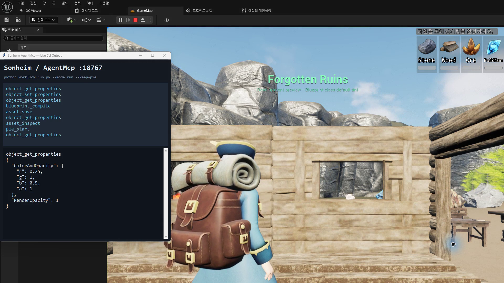

# 14. Unreal Editor Automation & Verification

[AgentMcp](https://github.com/chungheonLee0325/AgentMcp)는 **Unreal Engine 5.8의 실험적 MCP/toolset과 Agent Skill 개념을 참고해 UE 5.5용으로 재구현한 Editor MCP plugin**입니다.

## 요약

- Coding agent가 Unreal Editor의 Blueprint/UMG/Data/Animation state를 inspect하고 수정할 수 있게 합니다.
- Dynamic <code>SKILL.md</code>와 UMG/<code>BindWidget</code> 특화 tool을 제공합니다.
- Editor write 이후 Read-back → Compile → PIE → Log/Viewport까지 같은 workflow에서 검증합니다.
- Sonheim에서는 UI/Animation/Data authoring과 gameplay scenario verification에 사용했습니다.

---

## AgentMcp

~~~mermaid
flowchart LR
    AGENT["<b>Coding Agent</b> Codex · Claude Code"]
    MCP["<b>Editor Tool Interface</b> AgentMcp"]
    EDITOR["<b>Unreal Editor</b> Blueprint · UMG · Data · Animation"]
    BUILD["<b>Build / Run</b> Compile · Save · PIE"]
    VERIFY["<b>Verification</b> Read-back · Log · Viewport"]

    AGENT --> MCP --> EDITOR --> BUILD --> VERIFY
    VERIFY --> AGENT
~~~

### Dynamic Agent Skills

Plugin / project의 <code>SKILL.md</code>를 Editor가 connected agent에 제공합니다.

- skill file 변경을 Editor 재시작 없이 다음 호출부터 반영
- project skill이 plugin 기본 skill을 override
- 프로젝트별 authoring / verification rule을 agent context에 제공

### UMG / Editor Authoring

AgentMcp는 일반 property 수정 외에 Unreal Editor 작업에 필요한 tool을 제공합니다.

- Widget Tree / Named Slot inspect
- C++ <code>BindWidget / BindWidgetOptional</code> contract 검사
- Widget Blueprint 생성과 subtree 편집
- Blueprint Class Default read / write
- DataAsset / DataTable / StringTable 편집
- Animation Blueprint / Montage / BlendSpace authoring
- Compile / Save / PIE
- Editor log / viewport capture

Sonheim에서는 Dungeon HUD/Result와 UMG 작성·검증, Animation asset 구성, Blueprint default/DataAsset/StringTable 편집에 사용했습니다.

*AgentMcp tool 실행 내역과 UE Editor/PIE 결과를 같은 작업 흐름에서 확인한 예시.*

---

## Closed-loop Editor Verification

Editor write 이후 결과를 다시 읽고 Runtime까지 확인합니다.

~~~text
Inspect
  ↓
Edit
  ↓
Independent Read-back
  ↓
Compile / Save
  ↓
PIE
  ↓
Runtime Read-back / Log
  ↓
Viewport Capture
~~~

대표 workflow에서는 Blueprint class default를 대상으로:

1. Class Default를 inspect
2. property를 수정
3. 별도 read-back으로 실제 값 확인
4. Blueprint compile / save
5. PIE 실행
6. runtime instance 값을 다시 확인
7. log와 viewport를 capture

하는 순서를 한 agent session에서 수행했습니다.

### Editor Automation Demo

https://github.com/user-attachments/assets/e61d53e3-c94b-4062-99dc-be11dd261ea5

AgentMcp로 **Inspect → Edit → Read-back → Compile / Save → PIE → Runtime Verify → Viewport Capture**까지 수행한 실제 UE Editor workflow입니다.

---

## Scenario Verification

Editor authoring 검증과 gameplay scenario 검증을 분리합니다.

- **Authoring Validation** — Stage graph, dependency, Boss timing/section contract  
  → [[13. Content Authoring & Validation|13_Content_Authoring_Validation]]
- **Runtime Scenario** — Branch, failure path, Boss state, Remote Client, HUD/Result
- **Visual Review** — Telegraph, Montage timing, Minimap/Marker, Result layout

Boss scenario helper는 Wake, Pattern/Telegraph, Hop/Facing, Re-aim, Down, Phase 2, Exhaust/Capture 같은 encounter 흐름을 반복 실행해 regression을 확인합니다.

---

## Application Scope

AgentMcp는 **Editor authoring / verification plugin**으로 Sonheim의 runtime module과 분리되어 있습니다.

| 적용 | 역할 |
|---|---|
| **UMG / Blueprint / Data / Animation authoring** | 코드 밖의 Editor asset 작업 |
| **Read-back / Compile / PIE** | 변경 결과 확인 |
| **Log / Viewport capture** | Runtime / visual 결과 확인 |
| **Scenario helper** | 반복 gameplay path 검증 |

Gameplay 결과는 Data Validation, scenario verification, visual review를 함께 사용해 확인합니다.

---

## 관련 문서 / 저장소

- [[11. UI Architecture & Client Presentation|11_Client_State_Presentation_Pipeline]] — UMG / Client Presentation 구조
- [[13. Content Authoring & Validation|13_Content_Authoring_Validation]] — 실행 전 Data / Graph Validation
- [[15. Development History & Retrospective|15_Development_History_Retrospective]] — Editor automation이 추가된 개발 흐름
- [AgentMcp](https://github.com/chungheonLee0325/AgentMcp) — UE 5.5 Editor MCP plugin
