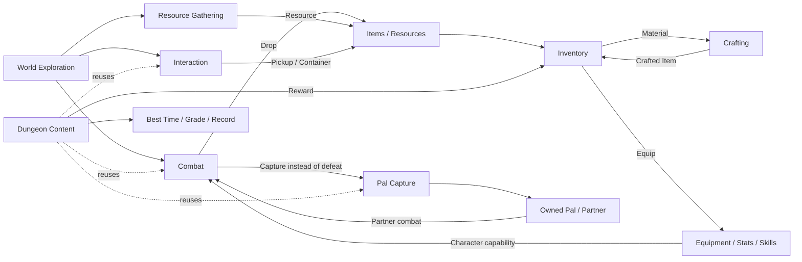
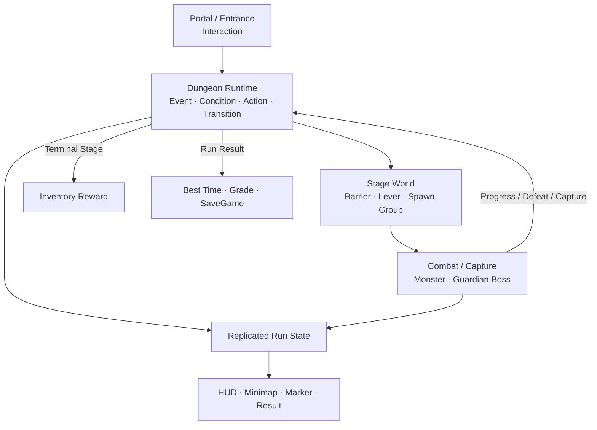

# 1. Project Overview

Sonheim은 **Unreal Engine 5.5 / C++ 기반 서버 권위 멀티플레이 액션 어드벤처** 프로젝트입니다.

전투, 자원 수집, 포획, 인벤토리, 장비, 제작을 각각 독립 기능으로 구현하는 데서 끝내지 않고, 서로의 결과가 다음 시스템의 입력이 되도록 연결했습니다. 이후 이 기반 시스템을 재사용해 **분기형 Dungeon Vertical Slice**까지 확장했습니다.

---

## Gameplay System Loop

Sonheim의 gameplay는 한 방향으로 끝나는 선형 진행보다, **전투·수집·성장·제작·포획이 서로 다시 다음 행동에 영향을 주는 순환 구조**에 가깝습니다.

- **실선**은 실제 gameplay 결과가 다음 시스템의 입력으로 이어지는 흐름입니다.
- **점선**은 Dungeon이 Combat·Interaction·Capture를 별도 구현하지 않고 기존 시스템을 재사용하는 관계입니다.

### 시스템이 연결되는 방식

- **전투 결과 → Inventory**  
  Monster Drop과 Dungeon Reward는 같은 Item/Inventory 흐름으로 들어갑니다.

- **Inventory → Stat / Skill**  
  장비 교체는 슬롯 변경으로 끝나지 않고 Stat modifier와 Skill Grant를 함께 갱신합니다.

- **전투 → Capture → Partner**  
  Monster를 처치하는 대신 포획하면 Pal Inventory로 이동하고, 이후 같은 Actor를 Partner로 소환해 전투에 다시 참여시킬 수 있습니다.

- **Inventory → Crafting → Inventory**  
  Crafting은 Inventory의 재료를 서버에서 검증·소모하고 완성된 Item을 다시 Inventory에 지급합니다.

- **Interaction → 다양한 World 기능**  
  Item 획득, 상자 열기, 제작대 사용, Dungeon Portal, Shortcut Lever가 같은 `IInteractableInterface` 기반 입력/UI 흐름을 사용합니다.

- **Dungeon → 기존 시스템 재사용**  
  Dungeon은 별도 게임 규칙을 다시 만드는 대신 Interaction, Combat, Capture, Inventory, UI 시스템을 조합해 하나의 콘텐츠 흐름으로 구성합니다.

---

## 핵심 구현과 적용 위치

| 기술적 선택 | 실제 적용 | 구현 목적 |
|---|---|---|
| **ActorComponent + Interface** | Health, Skill, Capture, Interaction | 기능을 Actor 종류와 분리해 Player·Monster·World Object에서 조합하고 재사용 |
| **DataTable** | Item, Skill, AreaObject, Level, Resource | 같은 schema의 gameplay 데이터를 ID 기반으로 관리 |
| **PrimaryDataAsset + GameplayTag** | Dungeon Definition, Boss Pattern | 콘텐츠 구조와 식별자를 코드 분기에서 분리하고 Editor에서 authoring |
| **Animation-driven Gameplay** | Skill Fire, Melee Window, Cancel Window | 공격 motion과 실제 판정 시점을 같은 Animation timeline에서 조정 |
| **Delegate / Presenter / ViewData** | 일반 HUD, Dungeon HUD, Minimap, Result | gameplay state와 UMG를 직접 결합하지 않고 화면에 필요한 형태로 전달 |
| **Server Authority + RPC / Replication** | Combat, Inventory, Crafting, Capture, Dungeon | Client 요청과 authoritative state 변경을 분리 |
| **FastArray / Prediction / Reconciliation** | Inventory, Skill Spec, Pal Slot | 변경이 잦은 상태의 동기화와 입력 반응성을 보완 |
| **Editor Validation / Authoring Tool** | Dungeon Definition, Boss Pattern | 잘못된 Transition·필수 데이터·timing을 플레이 이전에 확인 |
| **AgentMcp** | Blueprint/Animation/UMG/DataAsset, PIE·Viewport 검증 | Coding agent가 C++뿐 아니라 Unreal Editor 작업과 결과 확인까지 수행 |

---

## Dungeon Vertical Slice

Forgotten Ruins Dungeon은 위 시스템들이 실제 콘텐츠 하나에서 함께 동작하는 구현 사례입니다.

이 Vertical Slice에서 구현한 범위:

- **분기 진행** — Shortcut / ExtraWave 선택을 Runtime state와 GameplayTag로 유지
- **Objective / Failure** — 처치·포획·Area 진입·시간 초과·Owner 이탈을 같은 Stage Runtime에서 처리
- **World State** — 현재 Stage Definition에 따라 Barrier, Lever, Spawn Group 상태 변경
- **Boss Encounter** — Telegraph, Pattern, Phase, Down/Exhaust, Capture Window
- **Client Presentation** — Runtime Snapshot을 HUD, Party, Boss, Minimap, Marker, Result로 변환
- **Result / Persistence** — Reward 지급, Best Time, Grade, Clear/Fail Record를 SaveGame에 저장
- **Authoring / Validation** — Definition 검사와 Stage Graph 생성으로 콘텐츠 흐름을 Editor에서 검토

---

## 연관 문서

- [[2. Gameplay Architecture|2_Gameplay_Architecture]] — 서버 권위, 객체 수명, Replication 범위와 시스템 경계를 정한 기준
- [[3. Data & Content Architecture|3_Data_Content_Architecture]] — DataTable / DataAsset / GameplayTag의 역할 분리
- [[9. Branching Dungeon Runtime|9_Branching_Dungeon_Runtime]] — Dungeon Definition을 실제 Server Runtime으로 실행하는 구조
- [[5. Combat, Skill & Animation|5_Combat_Skill_Animation]] — Skill Data에서 Damage까지 이어지는 전투 실행 흐름
- [[7. Inventory & Crafting|7_Inventory_Crafting]] — 개인/공유 Item 상태의 서로 다른 네트워크 처리
- [[8. Pal Capture & Partner Lifecycle|8_Pal_Capture_Partner_Lifecycle]] — Capture에서 Partner AI까지 이어지는 lifecycle
- [[6. World Interaction Systems|6_World_Interaction_Systems]] — 하나의 Interaction contract로 서로 다른 World 기능을 연결한 구조

---

## Source

- [Main Repository](https://github.com/chungheonLee0325/Sonheim)
- [Source-only Mirror](https://github.com/chungheonLee0325/Sonheim.Source)
