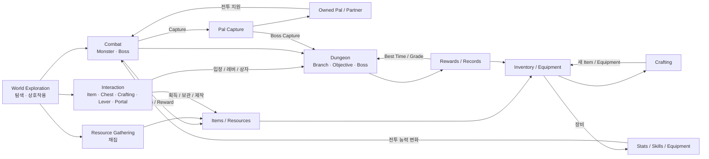
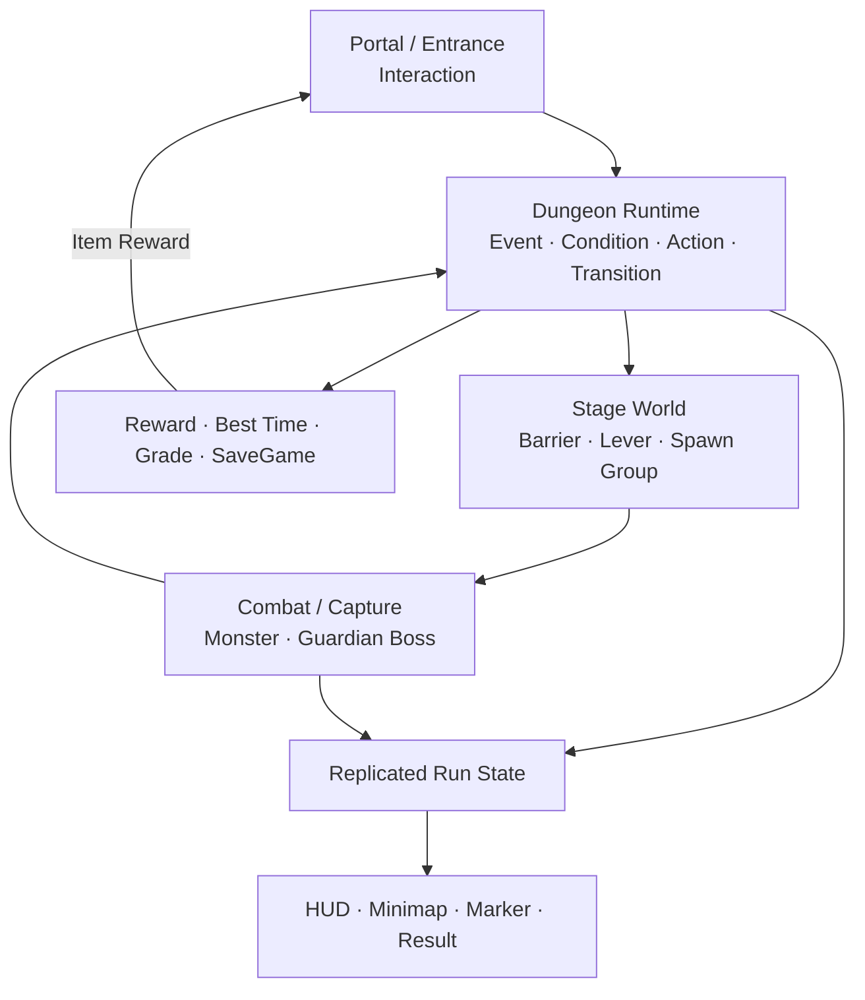

# 1. Project Overview

Sonheim은 **Unreal Engine 5.5 / C++ 기반 서버 권위 멀티플레이 액션 어드벤처** 프로젝트입니다.

전투, 자원 수집, 포획, 인벤토리, 장비, 제작을 각각 독립 기능으로 구현하는 데서 끝내지 않고, 서로의 결과가 다음 시스템의 입력이 되도록 연결했습니다. 이후 이 기반 시스템을 재사용해 **분기형 Dungeon Vertical Slice**까지 확장했습니다.

---

## Gameplay System Loop

Sonheim의 gameplay는 한 방향으로 끝나는 선형 진행보다, **전투·수집·성장·제작·포획이 서로 다시 다음 행동에 영향을 주는 순환 구조**에 가깝습니다.

### 시스템이 연결되는 방식

- **전투 결과 → Inventory**  
  Monster Drop과 Dungeon Reward는 같은 Item/Inventory 흐름으로 들어갑니다.

- **Inventory → Stat / Skill**  
  장비 교체는 슬롯 변경으로 끝나지 않고 Stat modifier와 Skill Grant를 함께 갱신합니다.

- **전투 → Capture → Partner**  
  Monster를 처치하는 대신 포획하면 Pal Inventory로 이동하고, 이후 같은 Actor를 Partner로 소환해 전투에 다시 참여시킬 수 있습니다.

- **Inventory → Crafting → Inventory**  
  Crafting은 Inventory의 재료를 서버에서 검증·소모하고 완성된 Item을 다시 Inventory에 지급합니다.

- **Interaction → 다양한 World 기능**  
  Item 획득, 상자 열기, 제작대 사용, Dungeon Portal, Shortcut Lever가 같은 `IInteractableInterface` 기반 입력/UI 흐름을 사용합니다.

- **Dungeon → 기존 시스템 재사용**  
  Dungeon은 별도 게임 규칙을 다시 만드는 대신 Interaction, Combat, Capture, Inventory, UI 시스템을 조합해 하나의 콘텐츠 흐름으로 구성합니다.

---

## 핵심 구현과 적용 위치

| 기술적 선택 | 실제 적용 | 구현 목적 |
|---|---|---|
| **Server Authority + RPC / Replication 분리** | Skill 사용, Inventory 변경, Crafting, Capture, Dungeon 진행 | Client는 행동을 요청하고, 최종 gameplay state는 Server가 확정하도록 구성 |
| **FastArray + Owner-only Replication** | Player Inventory, Skill Spec | 변경이 잦은 배열에서 변경 entry 중심으로 복제하고 개인 데이터는 소유자에게만 전달 |
| **Client Prediction / Reconciliation** | Inventory Slot Swap, Pal Slot 변경 | 서버 판정을 유지하면서 Drag & Drop이나 Slot 전환의 입력 반응성을 보완 |
| **Subscriber-based Replication** | Shared Container | 아무도 열지 않은 Container의 Item 목록은 복제하지 않고, viewer가 있을 때만 활성화 |
| **DataTable** | Item, Skill, AreaObject, Level, Resource | 같은 schema를 가진 대량의 gameplay row를 ID 기반으로 관리 |
| **PrimaryDataAsset + GameplayTag** | Dungeon Definition, Boss Pattern | 콘텐츠 단위 dependency와 분기/Stage/Pattern 식별자를 코드 분기문과 분리 |
| **ActorComponent + Interface** | Health, Skill, Inventory, Capture, Interaction | Player/Monster/World Actor에 필요한 기능을 조합하고, concrete class 의존을 줄임 |
| **Delegate / RepNotify** | Health, Inventory, Equipment, 일반 HUD | 독립 상태의 변경을 gameplay code가 Widget class를 직접 알지 않고 전달 |
| **Replicated Snapshot + Presenter/ViewData** | Dungeon HUD, Boss UI, Minimap, Result | 복합적인 콘텐츠 상태를 Client가 다시 구성할 수 있게 하고 UMG와 runtime을 분리 |
| **Editor Validation / Authoring Tool** | Dungeon Definition, Boss Pattern | 잘못된 Transition, 필수 데이터 누락, timing 오류를 플레이 이전에 확인 |
| **AgentMcp** | Blueprint/Animation/UMG/DataAsset 편집, PIE·Viewport 검증 | Coding agent가 C++ 수정뿐 아니라 Unreal Editor 작업과 실행 결과 확인까지 이어서 수행 |

---

## Dungeon Vertical Slice

Forgotten Ruins Dungeon은 위 시스템들이 실제 콘텐츠 하나에서 함께 동작하는 구현 사례입니다.

이 Vertical Slice에서 구현한 범위:

- **분기 진행** — Shortcut / ExtraWave 선택을 Runtime state와 GameplayTag로 유지
- **Objective / Failure** — 처치·포획·Area 진입·시간 초과·Owner 이탈을 같은 Stage Runtime에서 처리
- **World State** — 현재 Stage Definition에 따라 Barrier, Lever, Spawn Group 상태 변경
- **Boss Encounter** — Telegraph, Pattern, Phase, Down/Exhaust, Capture Window
- **Multiplayer UI** — 서버 Snapshot을 HUD, Party, Boss, Minimap, Marker, Result로 변환
- **Result / Persistence** — Reward 지급, Best Time, Grade, Clear/Fail Record를 SaveGame에 저장
- **Authoring / Validation** — Definition 검사와 Stage Graph 생성으로 콘텐츠 흐름을 Editor에서 검토

---

## 연관 문서

- [[2. Architecture Overview|2_Architecture_Overview]] — 서버 권위, 객체 수명, Replication 범위와 시스템 경계를 정한 기준
- [[3. Data & Content Architecture|3_Data_Content_Architecture]] — DataTable / DataAsset / GameplayTag의 역할 분리
- [[4. Branching Dungeon Runtime|4_Branching_Dungeon_Runtime]] — Dungeon Definition을 실제 Server Runtime으로 실행하는 구조
- [[10. Combat, Skill & Animation|10_Combat_Skill_Animation]] — Skill Data에서 Damage까지 이어지는 전투 실행 흐름
- [[8. Multiplayer Inventory & Crafting|8_Multiplayer_Inventory_Crafting]] — 개인/공유 Item 상태의 서로 다른 네트워크 처리
- [[9. Pal Capture & Partner Lifecycle|9_Pal_Capture_Partner_Lifecycle]] — Capture에서 Partner AI까지 이어지는 lifecycle
- [[12. World Interaction Systems|12_World_Interaction_Systems]] — 하나의 Interaction contract로 서로 다른 World 기능을 연결한 구조

---

## Source

- [Main Repository](https://github.com/chungheonLee0325/Sonheim)
- [Source-only Mirror](https://github.com/chungheonLee0325/Sonheim.Source)
