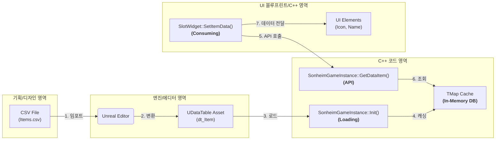

# 2.1. 데이터 주도 설계 (Data-Driven Design)

## 2.1.1. 설계 철학: "코드는 로직을, 데이터는 콘텐츠를"

Sonheim 프로젝트의 가장 핵심적인 설계 원칙은 **데이터 주도 아키텍처(Data-Driven Architecture)**입니다. 이는 게임의 '내용'(아이템, 스킬, 몬스터 스탯 등)을 코드에서 완전히 분리하여, 기획자가 프로그래머의 개입이나 재컴파일 없이 데이터 수정만으로 게임의 밸런스와 콘텐츠를 자유롭게 확장할 수 있도록 만드는 것을 목표로 합니다.

이러한 설계는 다음과 같은 명확한 목표를 달성하기 위해 채택되었습니다.

1.  **빠른 이터레이션과 협업:** 개발 및 밸런싱 속도를 극적으로 향상시키고, 엔지니어와 기획자 간의 역할을 명확히 분담하여 협업 효율을 극대화합니다.
2.  **로직과 콘텐츠의 분리:** 게임 로직("어떻게 동작하는가")과 게임 콘텐츠("무엇을 사용하는가")를 명확하게 분리하여 코드의 가독성과 유지보수성을 향상시킵니다.
3.  **중앙화된 데이터 관리:** 게임의 모든 핵심 데이터를 `GameInstance`라는 단일 지점에서 로드하고 캐싱하여 데이터 접근 경로를 일원화하고, 데이터의 일관성을 보장합니다.

---

## 2.1.2. 데이터 파이프라인

Sonheim의 데이터는 **`CSV 파일 -> UDataTable -> GameInstance 캐시 -> 게임 시스템`** 으로 이어지는 명확한 단방향 파이프라인을 통해 흐릅니다.



---

## 2.1.3. 핵심 구현

#### 1단계: 데이터 정의 (`FItemData`)

모든 데이터 주도 설계의 시작은 **데이터의 구조를 정의**하는 것입니다. Sonheim에서는 `SonheimGameType.h` 파일에 게임에 필요한 모든 데이터 구조체를 중앙 관리합니다. 아이템 데이터인 `FItemData`는 `FTableRowBase`를 상속받아 데이터 테이블의 한 행을 구성하며, 아이템의 모든 속성(이름, 아이콘, 스탯, 스택 가능 여부 등)을 변수로 포함합니다.

> [View on GitHub](https://github.com/chungheonLee0325/Sonheim/blob/main/Sonheim/Source/Sonheim/ResourceManager/SonheimGameType.h#L603)
```cpp
// Source/Sonheim/ResourceManager/SonheimGameType.h
USTRUCT(BlueprintType)
struct FItemData : public FTableRowBase
{
	GENERATED_USTRUCT_BODY()

	UPROPERTY(EditAnywhere, BlueprintReadWrite, Category="Data")
	int ItemID = 0;

	UPROPERTY(EditAnywhere, BlueprintReadWrite, Category="Data")
	TSubclassOf<ABaseItem> ItemClass = nullptr;
    
    // ... (이름, 아이콘, 카테고리, 장비 데이터 등 수많은 속성들) ...
};
```

#### 2단계: 데이터 로딩 및 캐싱 (`USonheimGameInstance`)

게임이 시작될 때, `USonheimGameInstance`의 `Init()` 함수는 에디터에 임포트된 모든 `UDataTable` 애셋을 로드하여, 런타임에 빠르게 접근할 수 있도록 `TMap` 형태의 메모리 캐시에 저장합니다. `GameInstance`는 게임 세션 내내 유지되는 싱글턴 객체이므로, 이 `TMap`이 바로 게임 세션 내내 유지되는 **인메모리 데이터베이스(In-Memory Database)** 역할을 수행합니다.

> [View on GitHub](https://github.com/chungheonLee0325/Sonheim/blob/main/Sonheim/Source/Sonheim/GameManager/SonheimGameInstance.cpp#L93)
```cpp
// Source/Sonheim/GameManager/SonheimGameInstance.cpp
// Item Data
UDataTable* ItemDataTable = LoadObject<UDataTable>(
	nullptr, TEXT("/Script/Engine.DataTable'/Game/_BluePrint/_DataTable/dt_Item.dt_Item'"));
if (nullptr != ItemDataTable)
{
	TArray<FName> RowNames = ItemDataTable->GetRowNames();

	for (const FName& RowName : RowNames)
	{
		FItemData* Row = ItemDataTable->FindRow<FItemData>(RowName, TEXT(""));
		if (nullptr != Row)
		{
			dt_Item.Add(Row->ItemID, *Row);
		}
	}
}
```

#### 3단계: 데이터 제공 API (`USonheimGameInstance`)

`GameInstance`는 `GetDataItem(ItemID)`와 같이, 게임 내 다른 시스템들이 중앙 데이터베이스에 안전하고 쉽게 접근할 수 있는 **표준화된 API**를 제공합니다. 이 함수는 `Init()`에서 미리 캐시해 둔 `TMap`에서 데이터를 `O(1)`의 시간 복잡도로 매우 빠르게 찾아 반환합니다.

> [View on GitHub](https://github.com/chungheonLee0325/Sonheim/blob/main/Sonheim/Source/Sonheim/GameManager/SonheimGameInstance.cpp#L215)
```cpp
// Source/Sonheim/GameManager/SonheimGameInstance.cpp
FItemData* USonheimGameInstance::GetDataItem(int ItemID)
{
	if (FItemData* data = dt_Item.Find(ItemID))
	{
		return data;
	}

	return nullptr;
}
```

#### 4단계: 데이터 소비 (`USlotWidget`)

UI 위젯과 같은 데이터 소비자는 `GameInstance`의 API를 통해 `ItemID`만으로 아이템의 모든 상세 정보를 얻고, 이를 바탕으로 자신의 시각적 표현을 업데이트합니다. `USlotWidget`의 `SetItemData` 함수는 `FItemData` 포인터를 받아, 아이콘, 배경색, 수량 텍스트 등 UI 요소들을 갱신하는 역할을 수행합니다.

> [View on GitHub](https://github.com/chungheonLee0325/Sonheim/blob/main/Sonheim/Source/Sonheim/UI/Widget/Player/Inventory/SlotWidget.cpp#L31)
```cpp
// Source/Sonheim/UI/Widget/Player/Inventory/SlotWidget.cpp
void USlotWidget::SetItemData(const FItemData* ItemData, int32 NewQuantity)
{
	// ... (수량, 무게 텍스트 설정) ...

	// 등급에 따른 배경색 변경
	if (IMG_BackGround)
	{
		IMG_BackGround->SetColorAndOpacity(USonheimUtility::GetRarityColor(ItemData->ItemRarity, 0.2f));
		IMG_BackGround->SetVisibility(ESlateVisibility::Visible);
	}

	IMG_Item->SetBrushFromTexture(ItemData->ItemIcon);
	IMG_Item->SetVisibility(ESlateVisibility::Visible);

	ItemID = ItemData->ItemID;
	Quantity = NewQuantity;
    
    // ... (툴팁 설정) ...
}
```

---

## 2.1.4. 설계의 이점

*   **압도적인 협업 효율성:** 기획자는 아이템의 공격력이나 이름을 바꾸기 위해 더 이상 프로그래머를 찾을 필요가 없습니다. 단지 `Items.csv` 파일의 숫자나 텍스트를 수정하고 에디터에서 다시 임포트하는 것만으로 모든 변경사항이 게임에 즉시 반영됩니다.
*   **유지보수성 및 확장성:** 게임 로직(코드)과 콘텐츠(데이터)가 완벽하게 분리되어 있습니다. 새로운 종류의 아이템 수백 개를 추가하더라도, `FItemData` 구조를 따르는 데이터를 CSV에 추가하기만 하면 되므로 코드 변경이 전혀 발생하지 않습니다.
*   **중앙화 및 일관성:** 모든 게임 데이터는 `GameInstance`라는 단일 출처(Single Source of Truth)를 통해 제공됩니다. 이는 데이터의 흐름을 추적하고 디버깅하기 쉽게 만들며, 게임 내 모든 시스템이 항상 일관된 데이터를 사용하도록 보장합니다.
*   **최적화된 성능:** 게임 시작 시 모든 데이터를 메모리에 캐싱하고 `TMap`을 통해 접근함으로써, 런타임 중 데이터 테이블을 반복적으로 검색하는 비용을 제거하고 O(1)의 매우 빠른 데이터 접근 속도를 보장합니다.

---

## 2.1.5. 고급 고려사항 및 개선 방안

#### 1. 데이터 무결성 확보: 데이터 유효성 검증 (Data Validation)
*   **문제점**: 프로젝트가 커지면서 데이터 간의 참조 관계가 복잡해질 경우, 제작 레시피에 필요한 재료의 ID가 실수로 아이템 테이블에서 삭제되는 등 데이터 오류가 발생할 위험이 있습니다.
*   **개선 방안**: `GameInstance::Init()` 단계에서 **데이터 유효성 검증 로직**을 추가합니다. 예를 들어, 모든 제작 레시피를 순회하며 레시피에 사용된 ItemID가 실제로 아이템 데이터 테이블에 존재하는지 확인하고, 존재하지 않을 경우 명확한 에러 로그를 출력하도록 하여 데이터 오류를 개발 단계 초기에 발견하고 수정할 수 있도록 시스템을 개선합니다.

#### 2. 성능 및 협업 효율성: 데이터 에셋(`UDataAsset`) 혼용
*   **문제점**: `UDataTable`은 모든 데이터를 메모리에 로드하며, 여러 사람이 동시에 작업할 때 버전 관리 시스템에서 충돌이 발생할 수 있습니다.
*   **개선 방안**: 아이템이나 스킬처럼 개수가 많고 개별적인 데이터는 별도의 **데이터 에셋(`UDataAsset`)** 파일로 만드는 것을 고려할 수 있습니다. 데이터 테이블은 이 데이터 에셋들을 가리키는 역할만 수행합니다.
*   **기대 효과**: 필요한 데이터 에셋만 선택적으로 로드하여 메모리 사용량을 최적화하고, 각 데이터가 개별 파일로 존재하므로 여러 사람이 동시에 다른 데이터를 작업할 때 버전 관리 충돌을 최소화할 수 있습니다.
