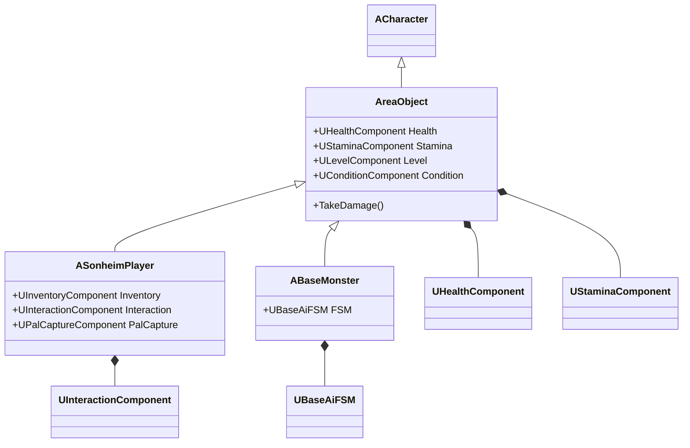

# 2.2. 컴포넌트 기반 설계 (Component-Based Design)

## 2.2.1. 설계 목표: "상속보다 조립(Composition over Inheritance)"

Sonheim 프로젝트는 "갓 클래스(God Class)"를 방지하고 장기적인 유지보수성과 확장성을 확보하기 위해 **컴포넌트 기반 설계**를 아키텍처의 핵심 원칙으로 삼습니다. 이는 거대한 단일 클래스가 모든 기능을 상속받아 구현하는 대신, 각 핵심 기능을 독립적인 `UActorComponent`로 분리하고, 액터는 이 컴포넌트들을 부품처럼 '조립'하여 완성하는 설계 방식입니다.

이러한 설계는 다음과 같은 명확한 목표를 달성하기 위해 채택되었습니다.

1.  **명확한 책임 분리 (Separation of Concerns):** 각 컴포넌트는 체력 관리, 상호작용, 인벤토리 등 단 하나의 명확한 책임만 갖습니다. 이를 통해 코드의 복잡도를 낮추고, 특정 기능을 수정하거나 디버깅할 때 작업 범위를 명확히 할 수 있습니다.
2.  **모듈성 및 재사용성:** [`UHealthComponent`](https://github.com/chungheonLee0325/Sonheim/blob/main/Source/Sonheim/AreaObject/Attribute/HealthComponent.h)나 [`UInteractionComponent`](https://github.com/chungheonLee0325/Sonheim/blob/main/Source/Sonheim/AreaObject/Player/Utility/InteractionComponent.h)와 같이 잘 만들어진 컴포넌트는 플레이어뿐만 아니라 몬스터, NPC, 심지어는 파괴 가능한 오브젝트에도 쉽게 부착하여 기능을 재사용할 수 있습니다.
3.  **유연한 확장성:** "낚시"와 같은 새로운 기능을 추가할 때, 기존의 복잡한 플레이어 클래스를 수정하는 대신 `UFishingComponent`라는 새로운 컴포넌트를 만들어 부착하기만 하면 됩니다. 이는 기존 코드의 안정성을 해치지 않으면서 시스템을 안전하게 확장할 수 있는 강력한 구조입니다.

---

## 2.2.2. 아키텍처: `AAreaObject`와 기능 컴포넌트

Sonheim의 컴포넌트 아키텍처는 공통 기반 클래스인 [`AAreaObject`](https://github.com/chungheonLee0325/Sonheim/blob/main/Source/Sonheim/AreaObject/Base/AreaObject.h)를 중심으로 구성됩니다.

#### 1. 공통 기반: `AAreaObject`
플레이어, 몬스터 등 월드에 존재하는 모든 '살아있는' 개체는 `AAreaObject`를 상속받습니다. `AAreaObject`는 `ACharacter`를 상속받아 기본적인 이동 기능을 갖추고 있으며, 모든 개체가 공통으로 가져야 할 핵심 기능 컴포넌트들을 '소유'하는 뼈대 역할을 합니다.

```cpp
// AreaObject.cpp - 생성자에서 핵심 컴포넌트 생성
// NOTE: 아래는 핵심 컴포넌트 생성 로직을 보여주기 위한 요약된 예시입니다.
// 실제 생성자에서는 더 많은 컴포넌트(Skill, Movement 등)를 초기화합니다.
AAreaObject::AAreaObject()
{
    // 어트리뷰트 컴포넌트 생성
    m_HealthComponent = CreateDefaultSubobject<UHealthComponent>(TEXT("HealthComponent"));
    m_StaminaComponent = CreateDefaultSubobject<UStaminaComponent>(TEXT("StaminaComponent"));
    m_LevelComponent = CreateDefaultSubobject<ULevelComponent>(TEXT("LevelComponent"));
    m_ConditionComponent = CreateDefaultSubobject<UConditionComponent>(TEXT("ConditionComponent"));
}
```

#### 2. 기능의 확장: 특화 컴포넌트
[`ASonheimPlayer`](https://github.com/chungheonLee0325/Sonheim/blob/main/Source/Sonheim/AreaObject/Player/SonheimPlayer.h)와 같은 자식 클래스는 `AAreaObject`로부터 공통 컴포넌트를 물려받는 동시에, 자신에게만 필요한 특화된 컴포넌트들을 추가로 소유하여 기능을 확장합니다.



이 구조에서 `ASonheimPlayer`는 각 기능의 구체적인 구현을 전문 컴포넌트에게 위임하고, 자신은 플레이어의 입력에 따라 어떤 컴포넌트의 기능을 호출할지 결정하는 **중앙 관리자(Central Manager)** 역할에 집중합니다.

---

## 2.2.3. 핵심 로직 및 패턴

#### 퍼사드 패턴(Facade Pattern)을 통한 API 제공
`AAreaObject`는 외부 시스템이 `HealthComponent`의 존재나 내부 구현을 알 필요 없이, 자신을 통해 안전하게 기능에 접근할 수 있도록 간단하고 통일된 API를 제공합니다. 이는 시스템 간의 결합도를 낮추는 중요한 역할을 합니다.

```cpp
// AreaObject.cpp - 체력 감소 함수 예시
// 외부에서는 이 함수를 호출할 뿐, 복잡한 내부 로직은 HealthComponent가 담당합니다.
float AAreaObject::DecreaseHP(float Delta)
{
    // 실제 체력 변경 로직은 HealthComponent에 위임합니다.
    m_HealthComponent->ModifyHP(-Delta);
    return m_HealthComponent->GetHP();
}
```

---

## 2.2.4. 구현 결과 및 문제 해결 경험

#### 1. 문제: 비대한 부모 클래스 (Fat Base Class)와 책임 분리
*   **상황:** 프로젝트 초기, AI 로직이나 플레이어 전용 인벤토리 관련 함수가 `AreaObject`에 포함되어 클래스의 역할이 모호해지고, 몬스터가 불필요한 플레이어 코드를 참조하는 문제가 발생했습니다.
*   **해결:** 명확한 책임 분리 원칙에 따라 `AreaObject`를 리팩토링했습니다. AI 관련 기능은 [`ABaseMonster`](https://github.com/chungheonLee0325/Sonheim/blob/main/Source/Sonheim/AreaObject/Monster/BaseMonster.h)와 [`UBaseAiFSM`](https://github.com/chungheonLee0325/Sonheim/blob/main/Source/Sonheim/AreaObject/Monster/AI/Base/BaseAiFSM.h)으로, 인벤토리 기능은 [`ASonheimPlayerState`](https://github.com/chungheonLee0325/Sonheim/blob/main/Source/Sonheim/AreaObject/Player/SonheimPlayerState.h)와 [`UInventoryComponent`](https://github.com/chungheonLee0325/Sonheim/blob/main/Source/Sonheim/AreaObject/Player/Utility/InventoryComponent.h)로 완전히 분리하여 이전했습니다. 그 결과, `AreaObject`는 이름 그대로 월드 개체의 '공통 기반'이라는 순수한 역할에만 집중하게 되었습니다.

#### 2. 문제: 컴포넌트 상호의존성 관리
*   **상황:** [`UStatBonusComponent`](https://github.com/chungheonLee0325/Sonheim/blob/main/Source/Sonheim/AreaObject/Attribute/StatBonusComponent.h)는 `UInventoryComponent`의 장비 변경이나 `ULevelComponent`의 레벨업 같은 다른 컴포넌트의 변화를 감지하고 스탯을 재계산해야 했습니다.
*   **해결:** 각 컴포넌트에 `OnHealthChanged`, `OnEquipmentChanged`와 같은 델리게이트(Delegate)를 만들었습니다. 다른 컴포넌트의 변화를 감지해야 하는 컴포넌트는, 해당 델리게이트에 자신의 함수를 바인딩합니다. 이를 통해 특정 이벤트가 발생했을 때, 다른 컴포넌트들이 직접적인 참조 없이도 반응할 수 있는 유연하고 낮은 결합도의 구조를 만들었습니다.

---

## 2.2.5. 관련 시스템

*   [1. 프로젝트 개요](./1_Project_Overview.md)
*   [2.3. 어트리뷰트 및 스탯 시스템](./2.3_Attribute_And_Stat_System.md)
*   [4.1. 플레이어 클래스 아키텍처](./4.1_Player_Class_Architecture.md)
*   [5.1. FSM 기반 AI](./5.1_FSM_based_AI.md)
