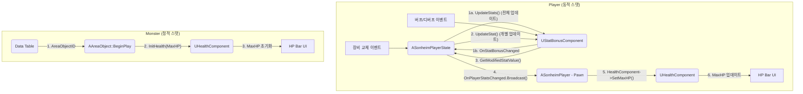

# 2.3. 어트리뷰트 및 스탯 시스템 (Attribute & Stat System)

## 2.3.1. 용어 정의 (Terminology)

이 문서에서는 시스템을 명확하게 이해하기 위해 다음과 같이 용어를 정의합니다.

*   **어트리뷰트 (Attribute):** 캐릭터의 특징을 나타내는 가장 광범위한 개념입니다. 수치화된 '스탯' 뿐만 아니라, '상태(Condition)'와 같이 비수치적인 특징도 모두 어트리뷰트에 포함됩니다.
*   **스탯 (Stat):** 공격력, 최대 HP, 이동 속도처럼 수치로 명확하게 표현되는 값입니다. 본 프로젝트에서는 `EAreaObjectStatType` 열거형으로 정의된 값들이 해당됩니다.
*   **컴포넌트 (Component):** `HealthComponent`, `StatBonusComponent`와 같이 특정 어트리뷰트를 게임 내에서 실제로 구현하고 관리하는 `ActorComponent` 기반의 기능 단위입니다.

---

## 2.3.2. 설계 목표

어트리뷰트 시스템은 플레이어, 몬스터 등 살아있는 모든 개체의 핵심 스탯(HP, 스태미나, 공격력 등)을 관리하는 기반 시스템입니다. 이 시스템은 다음과 같은 핵심 목표를 달성하기 위해 설계되었습니다.

1.  **상태 지속성 (State Persistence):** 플레이어가 죽었다 부활하더라도 레벨, 장비로 인한 스탯 보너스 등은 유지되어야 합니다. 이를 위해 언리얼 엔진의 철학에 따라, **Pawn**과 **PlayerState**의 역할을 명확히 구분하여 컴포넌트를 배치합니다.
2.  **모듈성 및 재사용성:** 각 스탯(HP, 스태미나 등)을 독립적인 `ActorComponent`로 구현하여, 필요한 개체에 원하는 스탯 기능만 선택적으로 부착할 수 있도록 합니다.
3.  **동적인 스탯 변화 (플레이어):** 플레이어의 행동(장비 교체, 버프/디버프)에 따라 모든 관련 스탯이 실시간으로 재계산되고, 게임플레이에 즉시 반영되어야 합니다.
4.  **이벤트 기반 반응형 구조:** 스탯에 변화가 생겼을 때, 다른 시스템이 해당 스탯을 직접 참조하지 않고도 `델리게이트`를 통해 변경 사실을 통지받아 '반응'하는 유연한 구조를 지향합니다.
5.  **서버 권위 및 효율적인 복제:** 모든 스탯 계산과 판정은 서버에서만 이루어지며, 그 결과는 클라이언트에 효율적으로 복제되어야 합니다.

---

## 2.3.3. 아키텍처: Pawn과 PlayerState의 역할 분리

Sonheim의 스탯 시스템은 **플레이어**와 **그 외 개체(몬스터 등)**를 구분하여, 각기 다른 방식으로 스탯을 관리합니다. 이 설계의 핵심은 언리얼 엔진의 `Pawn`과 `PlayerState`의 역할에 대한 이해입니다.

*   **Pawn (`ASonheimPlayer`):** 게임 월드에 실제 존재하는 물리적 아바타입니다. 따라서 캐릭터의 죽음과 함께 소멸되는 **일시적인 상태** (현재 HP, 현재 스태미나, 상태이상)를 관리하는 컴포넌트(`HealthComponent`, `StaminaComponent`, `ConditionComponent`)가 여기에 위치합니다.
*   **PlayerState (`ASonheimPlayerState`):** 플레이어의 연결 세션 동안 유지되는 추상적인 상태 정보입니다. 캐릭터가 죽어도 초기화되지 않아야 하는 **영구적인 상태** (레벨, 경험치, 인벤토리, 장비로 인한 스탯 보너스)를 관리하는 컴포넌트(`InventoryComponent`, `StatBonusComponent`)가 여기에 위치합니다.

이러한 역할 분리에 따라, 스탯이 결정되는 과정은 플레이어와 몬스터가 서로 다릅니다.



---

## 2.3.4. 핵심 구현

#### 1. 플레이어의 동적 스탯 계산 (PlayerState 중심)

플레이어의 스탯은 `ASonheimPlayerState`를 중재자로 하여 동적으로 계산됩니다. 장비 교체와 같이 모든 스탯에 영향을 주는 이벤트가 발생하면 `UpdateStats` 함수가, 버프/디버프처럼 특정 스탯만 변경될 때는 `UpdateStat` 함수가 호출되어 효율적으로 처리합니다.

> [View on GitHub (Stat Calculation)](https://github.com/chungheonLee0325/Sonheim/blob/main/Sonheim/Source/Sonheim/AreaObject/Player/SonheimPlayerState.cpp#L145)
```cpp
// Source/Sonheim/AreaObject/Player/SonheimPlayerState.cpp
void ASonheimPlayerState::UpdateStats()
{
	if (!HasAuthority())
		return;

	// 모든 기본 스탯에 대해 수정된 값을 계산
	for (const auto& StatPair : BaseStat)
	{
        // StatBonusComponent를 통해 최종 스탯 값을 가져온다.
		float ModifiedValue = m_StatBonusComponent->GetModifiedStatValue(StatPair.Key, StatPair.Value);
		ModifiedStat.Add(StatPair.Key, ModifiedValue);
        // 스탯 변경을 전파한다.
		OnPlayerStatsChanged.Broadcast(StatPair.Key, ModifiedValue);
	}
	// ...
}

void ASonheimPlayerState::UpdateStat(EAreaObjectStatType StatType)
{
	if (!HasAuthority()) return;
		
	if (const float* BaseValue = BaseStat.Find(StatType))
	{
		float ModifiedValue = m_StatBonusComponent->GetModifiedStatValue(StatType, *BaseValue);
		ModifiedStat.Add(StatType, ModifiedValue);
		OnPlayerStatsChanged.Broadcast(StatType, ModifiedValue);
		// ...
	}
}
```

#### 2. 스탯 변경 전파 및 적용 (Pawn의 역할)

`HealthComponent`와 같은 컴포넌트는 `PlayerState`의 델리게이트를 직접 구독하지 않습니다. 대신, **Pawn**(`ASonheimPlayer`)이 `PossessedBy` 함수에서 `PlayerState`가 유효해지는 시점에 `OnPlayerStatsChanged` 델리게이트를 구독하여 중재자 역할을 합니다.

> [View on GitHub (Delegate Binding)](https://github.com/chungheonLee0325/Sonheim/blob/main/Sonheim/Source/Sonheim/AreaObject/Player/SonheimPlayer.cpp#L283)
```cpp
// Source/Sonheim/AreaObject/Player/SonheimPlayer.cpp
void ASonheimPlayer::BindDelegates()
{
    // ...
	if (S_PlayerState)
	{
		S_PlayerState->OnPlayerStatsChanged.RemoveDynamic(this, &ASonheimPlayer::StatChanged);
		S_PlayerState->OnPlayerStatsChanged.AddDynamic(this, &ASonheimPlayer::StatChanged);
	}
}
```

`PlayerState`에서 스탯 변경 이벤트가 브로드캐스트되면, `ASonheimPlayer`에 바인딩된 `StatChanged` 함수가 호출됩니다. 이 함수는 스탯 종류를 확인하여 자신이 소유한 `HealthComponent`의 `SetMaxHP`를 호출하는 등 실제 액터를 변경하는 역할을 수행합니다.

> [View on GitHub (Stat Handling)](https://github.com/chungheonLee0325/Sonheim/blob/main/Sonheim/Source/Sonheim/AreaObject/Player/SonheimPlayer.cpp#L501)
```cpp
// Source/Sonheim/AreaObject/Player/SonheimPlayer.cpp
void ASonheimPlayer::StatChanged(EAreaObjectStatType StatType, float StatValue)
{
	if (!HasAuthority()) return;

	switch (StatType)
	{
	case EAreaObjectStatType::HP:
		if (m_HealthComponent)
		{
			m_HealthComponent->SetMaxHP(StatValue);
		}
		break;

	case EAreaObjectStatType::RunSpeed:
		if (GetCharacterMovement())
		{
			GetCharacterMovement()->MaxWalkSpeed = StatValue;
		}
		break;
    // ...
	}
}
```

#### 3. 효율적인 스탯 복제

스탯은 서버에서 계산된 후 클라이언트로 효율적으로 복제됩니다. `TMap`은 직접 리플리케이트할 수 없으므로, 서버에서 스탯 계산이 완료되면 `ModifiedStat`(TMap)의 내용이 `ReplicatedStats`(TArray) 변수에 복사됩니다. 클라이언트에서는 `OnRep_ReplicatedStats` 함수가 자동 호출되어 `ReplicatedStats`의 데이터를 다시 로컬 `ModifiedStat` 맵에 채워 넣고 UI 업데이트를 위한 델리게이트를 호출합니다.

> [View on GitHub (Replication Logic)](https://github.com/chungheonLee0325/Sonheim/blob/main/Sonheim/Source/Sonheim/AreaObject/Player/SonheimPlayerState.cpp#L172)
```cpp
// Source/Sonheim/AreaObject/Player/SonheimPlayerState.cpp
void ASonheimPlayerState::ConvertStatsToReplicatedArray()
{
    ReplicatedStats.Empty();
    for (const auto& StatPair : ModifiedStat)
    {
        ReplicatedStats.Add(FReplicatedStat(StatPair.Key, StatPair.Value));
    }
}

void ASonheimPlayerState::OnRep_ReplicatedStats()
{
    ModifiedStat.Empty();
    for (const FReplicatedStat& Stat : ReplicatedStats)
    {
        ModifiedStat.Add(Stat.StatType, Stat.Value);
        // 클라이언트에서 UI 업데이트 등을 위해 델리게이트 호출
        OnPlayerStatsChanged.Broadcast(Stat.StatType, Stat.Value);
    }
}
```

#### 4. 몬스터의 정적 스탯 초기화 (Data-Driven)

몬스터의 스탯은 게임 시작 시 **데이터 테이블**에서 직접 값을 읽어와 각 스탯 컴포넌트를 초기화하는 간단한 방식을 사용합니다. `AAreaObject::BeginPlay` 함수에서 자신의 `AreaObjectID`에 해당하는 데이터를 찾아 `HealthComponent`에 `InitHealth` 함수로 `MaxHP`를 직접 설정합니다.

> [View on GitHub (Monster Stat Init)](https://github.com/chungheonLee0325/Sonheim/blob/main/Sonheim/Source/Sonheim/AreaObject/Base/AreaObject.cpp#L173)
```cpp
// Source/Sonheim/AreaObject/Base/AreaObject.cpp
void AAreaObject::BeginPlay()
{
	Super::BeginPlay();

	// ...
	// 데이터 테이블에서 자신의 데이터 로드
	dt_AreaObject = m_GameInstance->GetDataAreaObject(m_AreaObjectID);

	// ...

	// 서버에서만 컴포넌트 초기화
	if (HasAuthority() && dt_AreaObject)
	{
		// 데이터 테이블의 값으로 HealthComponent를 직접 초기화
		m_HealthComponent->InitHealth(dt_AreaObject->HPMax);
		
        // StaminaComponent 등 다른 컴포넌트도 동일한 방식으로 초기화
		m_StaminaComponent->InitStamina(
			dt_AreaObject->StaminaMax,
			dt_AreaObject->StaminaRecoveryRate,
			dt_AreaObject->GroggyDuration
		);
		// ...
	}
    // ...
}
```

---

## 2.3.5. 설계의 이점

*   **올바른 상태 관리:** 언리얼의 `Pawn`/`PlayerState` 아키텍처를 올바르게 활용하여, 캐릭터의 죽음과 부활에도 플레이어의 핵심 성장 데이터가 안정적으로 유지됩니다.
*   **명확한 책임 분리:** 스탯 계산(`PlayerState`), 스탯 적용(`Pawn`), 스탯 관리(`Component`)의 역할이 명확히 분리되어 코드의 복잡성이 낮아지고 이해하기 쉬워졌습니다.
*   **유연성과 효율성의 양립:** 플레이어에게는 유연한 동적 시스템을, 몬스터에게는 가볍고 효율적인 정적 시스템을 각각 제공합니다.

---

## 2.3.6. 향후 개선 방안

현재 아키텍처는 버프/디버프와 같은 일시적인 스탯 변경을 효율적으로 처리할 수 있는 기반을 이미 갖추고 있습니다. (`UpdateStat` 함수 및 `StatBonusComponent` 활용)

향후에는 이 기반을 활용하여 다음과 같은 기능을 확장할 수 있습니다.

1.  **버프/디버프 시스템 확장:** `StatBonusComponent`에 시간 제한이 있는 보너스나 곱연산 보너스를 추가하는 기능을 구현합니다. 효과가 시작될 때 `AddStatBonus`를 호출하고, 타이머를 이용해 효과가 끝나면 `RemoveStatBonus`를 호출하여 스탯을 원상 복구시킬 수 있습니다.
2.  **몬스터 동적 스탯 적용:** 필요에 따라 몬스터에게도 `StatBonusComponent`를 추가하여, 플레이어와 동일한 버프/디버프 시스템의 혜택을 받도록 확장할 수 있습니다.

---

## 2.3.7. 관련 시스템

*   [2.2. 컴포넌트 기반 설계](./2.2_Component_Based_Design.md)
*   [7.1. 인벤토리 시스템](./7.1_Inventory_System.md)
*   [8.4. 이벤트 기반 UI 아키텍처](./8.4_Event-Driven_UI_Architecture.md)
