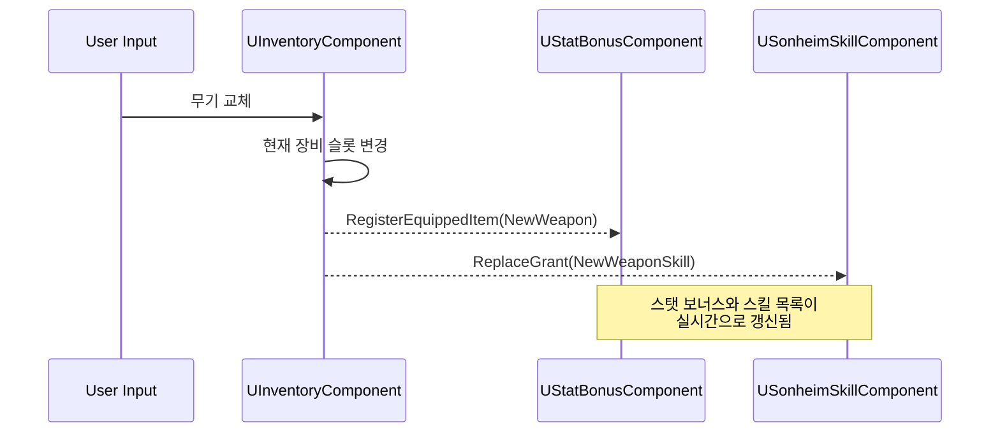

# 2.3. 어트리뷰트 및 스탯 시스템 (Attribute & Stat System)

## 2.3.1. 설계 목표

어트리뷰트 시스템은 플레이어, 몬스터 등 살아있는 모든 개체의 핵심 스탯(HP, 스태미나, 공격력 등)을 관리하는 기반 시스템입니다. 이 시스템은 다음과 같은 핵심 목표를 달성하기 위해 설계되었습니다.

1.  **모듈성 및 재사용성:** 각 스탯(HP, 스태미나 등)을 독립적인 `ActorComponent`로 구현하여, 플레이어와 몬스터가 동일한 스탯 관리 코드를 공유하고 필요한 개체에 원하는 스탯 기능만 선택적으로 부착할 수 있도록 합니다.
2.  **이벤트 기반의 반응형 구조:** 스탯에 변화가 생겼을 때(예: HP 감소, 장비 교체), UI나 다른 게임 시스템이 해당 스탯을 직접 참조하지 않고도 `델리게이트`나 `RepNotify`를 통해 변경 사실을 통지받아 '반응'하는 유연한 구조를 지향합니다.
3.  **서버 권위 및 효율적인 복제:** 모든 스탯 계산과 판정은 서버에서만 이루어져 데이터의 신뢰성을 보장하며, 그 결과는 `RepNotify`를 통해 클라이언트에 효율적으로 복제되어야 합니다.
4.  **의미 있는 동적 게임플레이:** 플레이어의 선택(예: 무기 교체)이 즉시 스탯과 스킬의 변화로 이어져, 아이템 파밍과 제작의 재미를 극대화하는 역동적인 경험을 제공해야 합니다.

---

## 2.3.2. 아키텍처

어트리뷰트 시스템은 [`AreaObject`](https://github.com/chungheonLee0325/Sonheim/blob/main/Source/Sonheim/AreaObject/Base/AreaObject.h)에 부착되는 여러 기능 컴포넌트들의 집합입니다. 기본 스탯은 각자의 컴포넌트([`UHealthComponent`](https://github.com/chungheonLee0325/Sonheim/blob/main/Source/Sonheim/AreaObject/Attribute/HealthComponent.h) 등)가 관리하며, 장비나 버프 등으로 인한 추가 스탯은 [`UStatBonusComponent`](https://github.com/chungheonLee0325/Sonheim/blob/main/Source/Sonheim/AreaObject/Attribute/StatBonusComponent.h)가 종합하여 최종 스탯을 결정합니다.

#### 시스템 흐름도 (장비 교체 시)



*   **기본 스탯 컴포넌트 ([`UHealthComponent`](https://github.com/chungheonLee0325/Sonheim/blob/main/Source/Sonheim/AreaObject/Attribute/HealthComponent.h), [`UStaminaComponent`](https://github.com/chungheonLee0325/Sonheim/blob/main/Source/Sonheim/AreaObject/Attribute/StaminaComponent.h) 등):** 각 스탯의 현재 값, 최대값, 회복/소모 등 핵심 로직을 담당합니다. 이 컴포넌트들은 `AreaObject`에 기본적으로 포함됩니다.
*   **스탯 보너스 컴포넌트 ([`UStatBonusComponent`](https://github.com/chungheonLee0325/Sonheim/blob/main/Source/Sonheim/AreaObject/Attribute/StatBonusComponent.h)):** 모든 장비, 버프, 패시브 스킬 등으로부터 오는 추가 스탯(고정값 증가, 비율 증가 등)을 종합하여 관리하는 중앙 허브입니다. [`PlayerState`](https://github.com/chungheonLee0325/Sonheim/blob/main/Source/Sonheim/AreaObject/Player/SonheimPlayerState.h)에 위치합니다.

---

## 2.3.3. 핵심 로직 및 구현

#### 1. 동적 스탯 계산 (`UStatBonusComponent`)

플레이어의 최종 스탯은 기본 스탯에 `UStatBonusComponent`가 집계한 모든 보너스를 합산하여 결정됩니다.

1.  **신호 감지:** [`UInventoryComponent`](https://github.com/chungheonLee0325/Sonheim/blob/main/Source/Sonheim/AreaObject/Player/Utility/InventoryComponent.h)에서 장비가 장착/해제되면 `UStatBonusComponent`의 `RegisterEquippedItem` 함수를 호출합니다.
2.  **보너스 등록:** `UStatBonusComponent`는 아이템 ID를 기반으로 데이터 테이블에서 해당 아이템의 스탯 보너스([`FEquipmentData`](https://github.com/chungheonLee0325/Sonheim/blob/main/Source/Sonheim/ResourceManager/SonheimGameType.h))를 읽어와 내부 `TMap`에 [`FStatModifier`](https://github.com/chungheonLee0325/Sonheim/blob/main/Source/Sonheim/AreaObject/Attribute/StatBonusComponent.h) 형태로 저장/제거합니다.
3.  **최종 스탯 계산:** 스탯이 필요한 시점(예: 데미지 계산)에 `GetModifiedStatValue` 함수가 호출되어, 기본값에 `TMap`에 저장된 모든 보너스를 합산 및 곱연산하여 최종 스탯을 반환합니다. `Override` 타입의 보너스가 있다면 다른 모든 계산을 무시하고 해당 값으로 덮어씁니다.

```cpp
// StatBonusComponent.cpp - 최종 스탯 계산 (실제 코드)
float UStatBonusComponent::GetModifiedStatValue(EAreaObjectStatType StatType, float BaseValue)
{
    if (!StatBonuses.Contains(StatType))
    {
        return BaseValue;
    }
    
    float FinalValue = BaseValue;
    float MultiplicativeTotal = 1.0f;
    bool bHasOverride = false;
    float OverrideValue = 0.0f;
    
    // 각 수정자 적용
    for (const FStatModifier& Mod : StatBonuses[StatType])
    {
        switch (Mod.ModifierType)
        {
        case EStatModifierType::Additive:
            FinalValue += Mod.Value;
            break;
            
        case EStatModifierType::Multiplicative:
            // 곱연산 보너스는 합산 후 마지막에 한 번만 적용
            MultiplicativeTotal += Mod.Value;
            break;
            
        case EStatModifierType::Override:
            // 덮어쓰기 수정자가 여러 개라면 마지막 값이 적용됨
            bHasOverride = true;
            OverrideValue = Mod.Value;
            break;
        }
    }
    
    // 곱하기 보너스 적용
    FinalValue *= MultiplicativeTotal;
    
    // 덮어쓰기가 있으면 모든 계산을 무시하고 그 값으로 설정
    if (bHasOverride)
    {
        return OverrideValue;
    }
    
    return FinalValue;
}
```

#### 2. 네트워크 복제 및 UI 업데이트 (`RepNotify`)

스탯 변수는 `ReplicatedUsing` (`RepNotify`)으로 지정되어, 서버에서의 변경이 클라이언트 UI에 자동으로 반영되도록 설계되었습니다.

1.  **서버에서 값 변경:** 서버의 `UHealthComponent`가 데미지를 받아 `m_HP` 변수를 변경합니다.
2.  **클라이언트로 복제:** 언리얼 엔진이 변경된 `m_HP` 값을 클라이언트로 복제합니다.
3.  **OnRep 함수 자동 호출:** 클라이언트에서 복제가 완료되는 순간, 지정된 `OnRep_HP` 함수가 자동으로 호출됩니다.
4.  **델리게이트 방송:** `OnRep_HP` 함수는 변경 전 값(`OldHP`)을 이용해 변화량을 계산하고, `OnHealthChanged` 델리게이트를 통해 **현재 체력, 변화량, 최대 체력**을 모두 방송(Broadcast)합니다.
5.  **UI 업데이트:** HUD의 체력 바 위젯은 미리 `OnHealthChanged` 델리게이트에 자신의 '체력 바 업데이트 함수'를 바인딩해두었기 때문에, 델리게이트가 방송되는 즉시 화면의 체력 바가 갱신됩니다.

```cpp
// HealthComponent.h (실제 코드)
UPROPERTY(ReplicatedUsing = OnRep_HP)
float m_HP = 100.0f;

UFUNCTION()
void OnRep_HP(float OldHP);

// 현재값, 변화량, 최대값을 모두 전달하는 델리게이트
DECLARE_DYNAMIC_MULTICAST_DELEGATE_ThreeParams(FOnHealthChangedDelegate, float, CurrentHP, float, Delta, float, MaxHP);
FOnHealthChangedDelegate OnHealthChanged;

// HealthComponent.cpp (실제 코드)
void UHealthComponent::OnRep_HP(float OldHP)
{
    // 변경 사실과 함께 변화량, 최대치 등 유용한 정보를 델리게이트로 전달
    float Delta = m_HP - OldHP;
    OnHealthChanged.Broadcast(m_HP, Delta, m_HPMax);
}
```
이 구조를 통해 `UHealthComponent`는 UI의 존재를 전혀 알 필요가 없으며, UI 역시 `UHealthComponent`의 내부 로직을 알 필요 없이 오직 이벤트에만 반응하므로, 시스템 간 결합도가 크게 낮아집니다.

#### 3. 효율적인 스태미나 관리 (`Timer`)

스태미나 회복처럼 지속적으로 이루어져야 하는 로직은 매 프레임 실행되는 `Tick` 함수 대신, `FTimerHandle`을 사용하여 효율적으로 구현했습니다. 스태미나 소모가 멈추면 회복 시작 타이머가 발동하고, 스태미나가 가득 차면 타이머가 스스로 중지되어 불필요한 연산을 방지합니다. 이는 `Tick` 사용을 최소화하여 성능을 최적화하는 좋은 사례입니다.

---

## 2.3.4. 관련 시스템

*   [2.2. 컴포넌트 기반 설계](./2.2_Component_Based_Design.md)
*   [6.2. 스킬 아키텍처](./6.2_Skill_Architecture.md)
*   [8.1. UI 아키텍처 및 이벤트 시스템](./8.1_UI_Architecture_and_Event_System.md)
