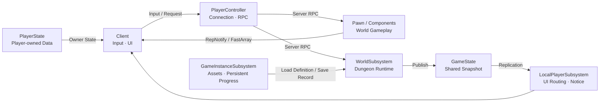

# 2. Architecture Overview

Sonheim의 아키텍처는 다음 다섯 가지 원칙으로 정리됩니다.

1. **공유 gameplay state의 최종 결정은 Server가 담당합니다.**
2. **Replication 방식은 데이터의 소비 범위와 변경 특성에 맞춰 다르게 선택합니다.**
3. **상태는 실제 수명에 맞는 UE Gameplay Framework 계층에 배치합니다.**
4. **기능은 Component / Interface로 분리하고, 시스템 간 변경 통지는 Delegate나 Snapshot으로 연결합니다.**
5. **복잡한 UI는 gameplay object를 직접 읽지 않고 별도의 presentation state를 통해 구성합니다.**

즉, 모든 시스템에 하나의 패턴을 적용한 것이 아니라 **Authority · Lifetime · Consumer Scope · Coupling**을 기준으로 구현 방식을 선택했습니다.

---

## Architecture at a Glance



이 구조의 핵심은 특정 클래스 이름이 아니라 **상태의 수명과 소비 범위가 달라질 때 책임 위치도 달라진다**는 점입니다.

---

## 1. Authority — Client는 요청하고 Server가 결과를 확정한다

공유 gameplay 결과는 Server에서 변경합니다.

| Gameplay | Client 역할 | Server 역할 |
|---|---|---|
| Skill | 사용 요청 | 사용 가능 여부·Cost·실제 발동 확정 |
| Inventory | Drag/Swap 요청, 일부 Prediction | 슬롯 변경 검증·최종 Item state 확정 |
| Crafting | Recipe/작업 요청 | 재료 검증·소모·진행·결과 지급 |
| Capture | 조준·연출 표시 | 성공 확률 판정·Ownership 적용 |
| Dungeon | Portal/Switch 상호작용 요청 | Stage 전이·Objective·Reward·Failure 확정 |

### 상태는 Replication, 행위는 RPC

- **Replication** — HP, Inventory, Skill Spec, Dungeon Snapshot처럼 나중에도 현재값을 복구해야 하는 정보
- **Server RPC** — Skill Cast, Item Swap, Crafting Start처럼 Client가 Server에 전달하는 의도
- **Client RPC** — Crafting UI Open처럼 특정 연결에 전달하는 명령
- **Multicast** — Capture Reveal, 일부 VFX/SFX처럼 현재 상태가 아니라 순간 presentation이 필요한 경우

이 구분은 late binding이나 relevancy 변화가 있어도 **현재 상태를 다시 구성할 수 있게 하기 위한 선택**입니다.

---

## 2. Replication Policy — 같은 데이터라도 누가 보느냐에 따라 다르게 복제한다

### Player Inventory: Owner-only FastArray

Inventory는:

- 변경이 자주 발생하고
- 배열 전체보다 일부 slot만 바뀌며
- 다른 Player가 볼 필요가 없습니다.

그래서 `FFastArraySerializer`와 `COND_OwnerOnly`를 사용합니다.

```text
Server Inventory
   ↓ Dirty Slot
FastArray
   ↓ Owner Only
Owning Client
```

### Shared Container: Subscriber-based Replication

Container는 World shared state라 owner-only로 처리할 수 없습니다.

대신 viewer가 있을 때만 Item FastArray replication을 활성화합니다.

```cpp
const bool bActive = Subscribers.Num() > 0;

DOREPLIFETIME_ACTIVE_OVERRIDE(
    UContainerComponent,
    RepContainerItems,
    bActive);
```

현재 구현은 **Subscriber가 하나라도 존재하면 property replication을 활성화**하는 방식입니다. Connection별 세밀한 필터링까지 수행하는 구조는 아닙니다.

---

## 3. Responsiveness — Server Authority가 필요한 곳과 Prediction이 필요한 곳을 분리한다

Server 응답을 기다리는 동안 사용감이 크게 떨어지는 조작에는 제한적으로 Prediction을 사용합니다.

Inventory Slot Swap:

```text
Client Drag
  ↓
Local Prediction
  ↓
ServerSwapItems
  ↓
Server Validation / Mutation
  ↓
FastArray Replication
  ↓
Client Reconciliation
```

Prediction은 Server Authority를 없애는 것이 아니라 **입력 피드백만 먼저 보여주고 최종 상태는 복제로 맞추는 방식**입니다.

같은 패턴을 Pal Slot 전환에도 적용합니다.

---

## 4. Lifetime — 상태가 얼마나 오래 살아야 하는지에 따라 위치를 정한다

| 상태/기능 | 배치 | 선택 이유 |
|---|---|---|
| 이동·Mesh·Animation | Pawn | 현재 World body에 종속 |
| Inventory·Stat | PlayerState | Pawn 교체와 분리할 Player data |
| 입력·Client RPC·HUD bootstrap | PlayerController | 연결 단위 책임 |
| Dungeon Run | WorldSubsystem | 현재 World에서만 존재하는 runtime |
| Dungeon Shared State | GameState | 참여 Client가 공유해야 하는 현재 run state |
| Dungeon Progress / Asset Load | GameInstanceSubsystem | World 이동보다 긴 수명과 Save/asset responsibility |
| Dungeon UI / Notice | LocalPlayerSubsystem | 특정 local player의 화면 수명에 종속 |

### PlayerState에 Inventory / Stat을 둔 이유

Inventory와 Stat을 Pawn에 두면 Pawn이 Destroy/Repossess되는 lifecycle과 같이 사라집니다.

반대로 이동이나 Animation을 PlayerState에 두면 World body와 동기화 책임이 불필요하게 복잡해집니다.

따라서:

```text
Player Identity에 가까운 Data → PlayerState
World Body에 가까운 State    → Pawn
```

으로 나눕니다.

---

## 5. Composition — 바뀌는 기능을 Component로 분리하고 외부 API는 단순하게 유지한다

`AAreaObject`는 Player/Monster의 공통 facade 역할을 하고 실제 기능은 Component가 소유합니다.

```text
AAreaObject
 ├─ HealthComponent
 ├─ StaminaComponent
 ├─ ConditionComponent
 ├─ LevelComponent
 ├─ SkillComponent
 └─ Move / Rotate Utility
```

외부 시스템은 `DecreaseHP()`, `AddCondition()`, `CastSkill()`처럼 AreaObject API를 사용할 수 있고, 실제 상태와 로직은 Component가 담당합니다.

이 구조를 선택한 이유는 상속 계층으로:

```text
CanAttack
HasInventory
CanCapture
CanInteract
...
```

같은 기능 조합을 표현하는 것보다, **서로 독립적으로 변하는 기능을 Actor에 조합하는 편이 재사용 범위가 넓었기 때문**입니다.

---

## 6. Interface — Concrete Class 대신 Capability에 의존한다

Interaction은 Item, Container, Crafting Station, Lever, Portal이 서로 다른 class지만 Player 입력 쪽에서는 모두 `IInteractableInterface`를 통해 다룹니다.

```text
Player InteractionComponent
        ↓
IInteractableInterface
        ├─ Item
        ├─ Container
        ├─ Crafting Station
        ├─ Lever
        └─ Dungeon Portal
```

Target이:

- 상호작용 가능 여부
- 표시 이름
- Hold 시간
- 실제 Interact 동작
- 취소 가능 여부

를 제공하므로 Player/UI가 concrete class별 분기문을 늘리지 않아도 됩니다.

---

## 7. State Propagation — Delegate와 Snapshot을 상태 성격에 맞게 나눈다

### 단일 상태 변화: Delegate / RepNotify

Health, Inventory, Equipment처럼 이미 명확한 owner가 있는 값은:

```text
Replicated Property
   ↓ OnRep
Delegate
   ↓
HUD / Subscriber
```

방식을 사용합니다.

### 복합 콘텐츠 상태: Replicated Snapshot

Dungeon은 Stage, Objective, Timer, Participant, Boss, Reward가 함께 한 시점의 상태를 구성합니다.

이 경우 개별 이벤트를 여러 RPC로 흩뿌리는 대신 `FDungeonStageRuntimeState`를 GameState에 publish합니다.

```text
Dungeon Runtime
   ↓
Runtime Snapshot
   ↓ GameState Replication
Presenter
   ↓
ViewData
   ↓
UMG
```

Widget이 재생성되거나 event를 놓쳐도 현재 state에서 화면을 다시 구성할 수 있습니다.

---

## 8. 설계 선택과 비용

| 문제 | 선택 | 대신 포기한 것 / 비용 | 선택 이유 |
|---|---|---|---|
| 공유 gameplay 결과의 일관성 | **Server Authority** | Client 단독 처리보다 round-trip이 생김 | Inventory, Crafting, Capture처럼 여러 Player가 영향을 받는 결과를 한 곳에서 확정 |
| 반응성이 필요한 UI 조작 | **제한적 Client Prediction** | Prediction/Server 로직을 함께 유지하고 reconciliation 필요 | Slot Swap처럼 Server 응답을 기다리면 조작감이 떨어지는 부분에만 적용 |
| 변경이 잦은 개인 배열 | **Owner-only FastArray** | Dirty entry 관리와 별도 local mirror가 필요 | Inventory/Skill Spec 전체 배열을 모든 Client에 반복 전달할 필요가 없음 |
| 공유 Container 내부 Item | **Subscriber 기반 활성화** | Viewer subscribe/unsubscribe lifecycle을 관리해야 함 | 아무도 사용하지 않는 Container의 내부 state는 전달할 필요가 없음 |
| Player 지속 데이터 | **PlayerState** | Pawn과 실제 runtime state를 다시 연결하는 초기화가 필요 | Inventory/Stat을 Pawn Destroy/Repossess lifecycle과 분리 |
| 기능 재사용 | **Component + Interface** | 작은 class/component 수가 늘고 orchestration이 필요 | Health/Skill/Interaction 같은 기능을 Player·Monster·World Actor에서 조합 가능 |
| Dungeon UI 동기화 | **Snapshot + Presenter/ViewData** | Runtime state와 presentation data 사이의 mapping code가 추가됨 | 여러 UI 요소가 같은 run state를 일관되게 소비하고 UI 재생성 시 복구 가능 |

이 선택들은 “복잡한 구조를 사용하는 것” 자체가 목적이 아니라, **각 문제에서 필요한 일관성·수명·재사용성·반응성의 우선순위가 달랐기 때문에 적용 범위를 나눈 결과**입니다.

---

## 실제 확장에서 확인된 재사용

- `IInteractableInterface` — Item/Container/Crafting에서 Dungeon Portal/Lever까지 확장
- Monster death/capture event — Dungeon Objective progress에 연결
- Inventory API — Dungeon Reward 지급에 재사용
- Pal Capture — Guardian Exhaust Capture에 재사용
- Combat `FAttackData` — Boss Strike에서도 재사용
- Dungeon 전용 Toast — 공용 `UNoticeSubsystem`으로 일반화

설계가 실제 새 콘텐츠에서 재사용되지 못한 경우에는 추상화를 유지하기보다 책임 위치를 다시 조정했습니다.

---

## 연관 문서

- [[8. Multiplayer Inventory & Crafting|8_Multiplayer_Inventory_Crafting]] — FastArray, Prediction, Subscriber replication의 실제 적용
- [[11. Player & Character Systems|11_Player_Character_Systems]] — Pawn / PlayerState / Component 책임
- [[12. World Interaction Systems|12_World_Interaction_Systems]] — Interface 기반 상호작용
- [[4. Branching Dungeon Runtime|4_Branching_Dungeon_Runtime]] — WorldSubsystem과 GameState Snapshot을 사용하는 콘텐츠 runtime
- [[5. Multiplayer State & UI Pipeline|5_Multiplayer_State_UI_Pipeline]] — Snapshot을 Client presentation으로 변환하는 구조

---

## 관련 코드

- [AreaObject](https://github.com/chungheonLee0325/Sonheim/tree/main/Sonheim/Source/Sonheim/AreaObject)
- [SonheimPlayerState](https://github.com/chungheonLee0325/Sonheim/blob/main/Sonheim/Source/Sonheim/AreaObject/Player/SonheimPlayerState.h)
- [SonheimGameState](https://github.com/chungheonLee0325/Sonheim/blob/main/Sonheim/Source/Sonheim/GameManager/SonheimGameState.h)
- [DungeonStageRuntimeSubsystem](https://github.com/chungheonLee0325/Sonheim/blob/main/Sonheim/Source/Sonheim/GameManager/Dungeon/DungeonStageRuntimeSubsystem.h)
- [InventoryComponent](https://github.com/chungheonLee0325/Sonheim/blob/main/Sonheim/Source/Sonheim/AreaObject/Player/Utility/InventoryComponent.h)
- [ContainerComponent](https://github.com/chungheonLee0325/Sonheim/blob/main/Sonheim/Source/Sonheim/GameObject/Buildings/Utility/ContainerComponent.h)
