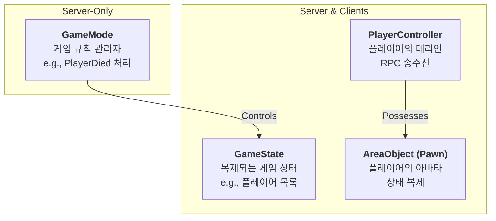

# 3.1. 서버 권한 아키텍처 (Server Authority Architecture)

## 3.1.1. 설계 목표

Sonheim은 멀티플레이어 경험을 핵심으로 하는 게임이므로, 안정적이고 일관된 네트워킹 환경을 구축하는 것이 무엇보다 중요합니다. 이를 위해 **서버 권위(Server-Authoritative)** 아키텍처를 채택했으며, 이는 다음 세 가지 핵심 목표를 달성하기 위함입니다.

1.  **보안 (Security):** 클라이언트에서의 임의 조작(치팅)을 원천적으로 방지하여 공정한 게임플레이 환경을 구축합니다. 모든 중요한 판정(데미지, 아이템 획득 등)은 오직 서버에서만 처리됩니다.
2.  **데이터 정합성 (Consistency):** "내 화면에서는 몬스터가 죽었는데, 친구 화면에서는 살아있다"와 같은 불일치가 발생하지 않도록, 모든 플레이어가 언제나 동일한 게임 월드 상태를 보도록 보장합니다.
3.  **반응성 (Responsiveness):** 네트워크 지연(Latency)이 있더라도 플레이어의 조작이 최대한 쾌적하게 느껴지도록, 클라이언트 예측과 같은 기법을 함께 사용하여 반응성과 서버 권위 사이의 균형을 맞춥니다.

---

## 3.1.2. 아키텍처 및 핵심 액터

Sonheim의 네트워킹은 언리얼 엔진의 Gameplay Framework를 기반으로 하며, 각 클래스는 멀티플레이어 환경에서 명확한 역할과 소유권을 가집니다.



*   **[`GameMode`](https://github.com/chungheonLee0325/Sonheim/blob/main/Source/Sonheim/GameManager/SonheimGameMode.h) (서버 전용):** 게임의 규칙 그 자체입니다. 플레이어의 접속, 스폰, 사망 규칙 등을 정의하며, 오직 서버에만 존재하여 클라이언트가 규칙에 직접 접근하는 것을 원천적으로 차단합니다.
*   **[`GameState`](https://github.com/chungheonLee0325/Sonheim/blob/main/Source/Sonheim/GameManager/SonheimGameState.h) (서버 및 모든 클라이언트에 복제):** 게임에 참여한 모든 플레이어가 알아야 하는 공통의 상태 정보(플레이어 목록, 게임 진행 시간 등)를 담는 방송국 역할을 합니다.
*   **[`PlayerController`](https://github.com/chungheonLee0325/Sonheim/blob/main/Source/Sonheim/AreaObject/Player/SonheimPlayerController.h) (클라이언트/서버 모두 존재):** 플레이어의 의지를 대변하는 대리인입니다. 클라이언트에서는 입력을 받아 서버에 작업을 요청하는 **RPC 송신** 역할을, 서버에서는 클라이언트의 요청을 검증하고 실제 액터에게 작업을 지시하는 **중계(Relay)** 역할을 합니다.
*   **[`AreaObject`](https://github.com/chungheonLee0325/Sonheim/blob/main/Source/Sonheim/AreaObject/Base/AreaObject.h) (Pawn, 클라이언트/서버 모두 존재):** 플레이어의 아바타입니다. 서버에서는 실제 위치, 체력 등 모든 권위 있는 상태를 가지며, 클라이언트에서는 서버로부터 복제된 데이터를 받아 애니메이션과 이펙트를 표현하는 '껍데기' 역할을 합니다.

---

## 3.1.3. 핵심 구현 패턴: RPC와 Replication의 의도적 분리

Sonheim의 네트워킹은 **RPC(Remote Procedure Call)**와 **변수 복제(Variable Replication)**의 역할을 명확히 분리하여, 각 상황에 가장 적합한 기술을 의도적으로 사용하는 것을 원칙으로 합니다.

*   **RPC (행위/이벤트):** 플레이어의 '행위'나 '일회성 이벤트'를 전달할 때 사용합니다. (예: "제작을 시작해라", "스킬을 사용했다")
*   **Replication (상태):** 행위의 결과로 변경된 '상태'를 지속적으로 동기화할 때 사용합니다. (예: "제작 진행률: 35%", "현재 HP: 80")

#### 1. RPC Relay 패턴: 안전한 상호작용

클라이언트가 월드의 다른 액터(e.g., 상자)와 상호작용할 때, 보안을 위해 직접 해당 액터를 제어하지 않고 `PlayerController`를 거치는 **RPC Relay 패턴**을 따릅니다.

1.  **[Client]** 플레이어가 상호작용 키를 누릅니다.
2.  **[Client]** `PlayerController`가 입력을 감지하고, 서버에 `Server_ContainerOperation` RPC를 호출합니다.
3.  **[Server]** 서버의 `PlayerController`가 RPC를 수신하고, 플레이어가 상자를 열 수 있는지 유효성을 검사합니다.
4.  **[Server]** 검사를 통과하면, 서버의 `PlayerController`가 실제 상자 액터의 `Open` 함수를 호출합니다.

이 패턴을 통해 모든 상호작용 요청은 서버의 `PlayerController`라는 단일 창구를 거치므로, 권한 검증 로직을 중앙에서 관리할 수 있습니다.

#### 2. OnRep을 활용한 효율적인 상태 동기화

위 과정에서 상자가 열리면, 상자 액터의 `bIsOpen`이라는 변수(상태)가 서버에서 변경됩니다. 이 변수는 `ReplicatedUsing=OnRep_...`으로 지정되어 있어, 변경 즉시 모든 클라이언트에 자동으로 복제됩니다. 그리고 각 클라이언트에서는 `OnRep_...` 함수가 자동으로 호출되어 상자가 열리는 비주얼과 UI를 표시합니다.

```mermaid
sequenceDiagram
    participant ClientA as Client A
    participant PC_A as PlayerController (Client A)
    participant Server
    participant Box as Box Actor (Server)
    participant ClientB as Client B

    ClientA->>PC_A: 상자 열기 버튼 클릭
    PC_A->>Server: Server_OpenBox() RPC 호출
    Server->>Box: Open() 함수 실행
    Note over Box: bIsOpen = true로 변경
    Server-->>PC_A: bIsOpen 변수 복제 (Replication)
    Server-->>ClientB: bIsOpen 변수 복제 (Replication)
    PC_A-->>ClientA: OnRep_bIsOpen() 호출, UI 갱신
    ClientB-->>ClientB: OnRep_bIsOpen() 호출, UI 갱신
```

이 방식은 상태가 바뀔 때마다 RPC를 계속 호출하여 물어보는 것보다 훨씬 효율적이며, 나중에 접속한 플레이어도 항상 정확한 최신 상태(`bIsOpen = true`)를 받아볼 수 있게 합니다.

---

## 3.1.4. 아키텍처 개선 과정 및 트러블슈팅

*   **초기 문제: 과도한 RPC 사용 (RPC-Hell)**
    프로젝트 초기에는 모든 동기화를 `NetMulticast` RPC로 처리하려 했습니다. 예를 들어, 제작 진행률이 바뀔 때마다 RPC를 호출하여 모든 클라이언트의 UI를 갱신했습니다. 이 방식은 구현은 직관적이었지만, 네트워크 부하가 심하고, 나중에 접속한 플레이어는 이전 RPC를 받지 못해 상태를 알 수 없는 심각한 데이터 정합성 문제를 야기했습니다.

*   **해결 과정: Replication 중심으로의 리팩토링**
    이 문제를 해결하기 위해, RPC는 '이벤트 전달' 용도로, Replication은 '상태 동기화' 용도로 역할을 명확히 재정의하고 시스템을 리팩토링했습니다. HP, 인벤토리, 제작 상태 등 모든 상태 변수를 `Replicated` 또는 `ReplicatedUsing`으로 변경하여, 네트워크 부하를 크게 줄이고 데이터 정합성 문제를 근본적으로 해결했습니다.

*   **추가 개선: 클라이언트 예측 (Client-Side Prediction)**
    인벤토리에서 아이템을 드래그 앤 드롭할 때, 서버의 응답을 기다리면 UI가 멈칫거리는 현상이 있었습니다. 이를 해결하기 위해, UI 변경은 즉시 클라이언트에서 예측 실행하고, 동시에 Server RPC로 서버에 실제 이동을 요청했습니다. 만약 서버가 요청을 거부하면 클라이언트는 원래 상태로 UI를 되돌리는 방식으로, 반응성과 서버 권위 사이의 균형을 맞췄습니다.

---

## 3.1.5. 발전 방향

현재 인벤토리 시스템은 `TArray`를 직접 복제하고 있습니다. 아이템이 매우 많아지거나 변경이 잦아질 경우, 배열 전체를 복제하는 비용이 부담될 수 있습니다. 향후에는 언리얼 엔진의 **Fast Array Serialization (`FNetSendArray`)**을 도입하여, 배열의 변경된 요소만 효율적으로 동기화하는 방식으로 최적화를 진행할 계획입니다.

---

## 3.1.6. 관련 시스템

*   [1. 프로젝트 개요](./1_Project_Overview.md)
*   [4.1. 플레이어 클래스 아키텍처](./4.1_Player_Class_Architecture.md)
*   [7.2. 제작 및 자원 수명 주기](./7.2_Crafting_and_Resource_Lifecycle.md)
