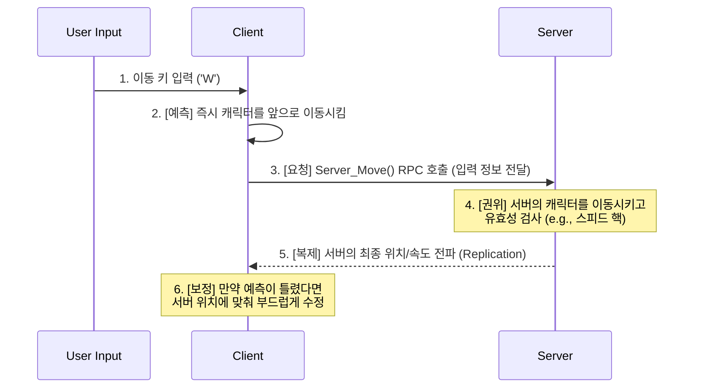
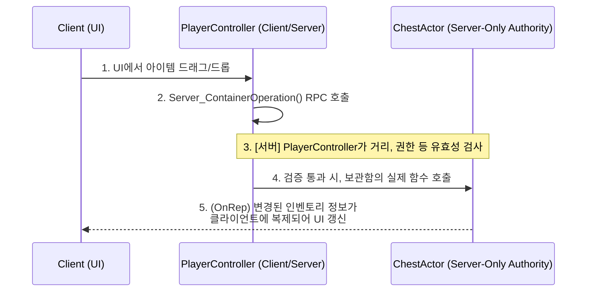

# 3.1. 서버 권위 아키텍처와 클라이언트 예측

## 3.1.1. 설계 목표: 반응성과 보안의 균형

Sonheim은 멀티플레이어 경험을 핵심으로 하는 게임이므로, 안정적이고 일관된 네트워킹 환경을 구축하는 것이 무엇보다 중요합니다. 이를 위해 **서버 권위(Server-Authoritative)** 아키텍처를 채택했으며, 이는 다음과 같은 핵심 목표를 달성하기 위함입니다.

1.  **보안 (Security):** 클라이언트에서의 임의 조작(치팅)을 원천적으로 방지하여 공정한 게임플레이 환경을 구축합니다. 모든 중요한 판정(데미지, 아이템 획득, 이동 가능 여부)은 오직 서버에서만 처리됩니다.
2.  **데이터 정합성 (Consistency):** "내 화면에서는 몬스터가 죽었는데, 친구 화면에서는 살아있다"와 같은 불일치가 발생하지 않도록, 모든 플레이어가 언제나 동일한 게임 월드 상태를 보도록 보장합니다.
3.  **반응성 (Responsiveness):** 네트워크 지연(Latency)이 있더라도 플레이어의 조작이 최대한 쾌적하게 느껴지도록, **클라이언트 예측(Client-Side Prediction)** 기법을 함께 사용하여 반응성과 서버 권위 사이의 균형을 맞춥니다.

이 문서는 가장 기본적이면서도 중요한 **캐릭터 이동**을 예시로, Sonheim이 어떻게 이 세 가지 목표의 균형을 맞추었는지 설명합니다.

---

## 3.1.2. 아키텍처: 클라이언트 예측과 서버 보정

캐릭터 이동은 "서버의 응답을 기다리면 랙(Lag)이 느껴지고, 클라이언트에서만 처리하면 핵(Hack)에 뚫린다"는 딜레마를 가집니다. Sonheim은 언리얼 엔진의 `UCharacterMovementComponent`가 제공하는 정교한 동기화 모델을 활용하여 이 문제를 해결합니다.

---

## 3.1.3. 고급 아키텍처: PlayerController를 통한 RPC 중계

캐릭터 이동과 달리, 플레이어가 월드의 다른 액터(예: 보관함)와 상호작용할 때는 더 복잡한 서버 권위 검증이 필요합니다. 클라이언트는 보관함 액터에 대한 소유권이 없으므로, 직접 보관함의 서버 함수를 호출할 수 없습니다. 

이 문제를 해결하기 위해, Sonheim은 **모든 클라이언트의 상호작용 요청을 자신의 `PlayerController`를 통해 중계**하는 패턴을 사용합니다. `PlayerController`는 클라이언트가 소유한 유일한 액터이므로, 서버 RPC를 호출할 수 있는 유효한 진입점 역할을 합니다.

이 패턴을 통해, 실제 로직을 처리하는 서버 액터(`ChestActor`)는 자신에게 도달한 모든 요청이 이미 `PlayerController`에 의해 1차적으로 검증되었음을 신뢰할 수 있으며, 모든 상호작용 요청의 진입점을 중앙화하여 관리할 수 있습니다.

---

## 3.1.4. 아키텍처 개선 과정 및 교훈

*   **초기 문제: 과도한 RPC 사용 (RPC-Hell)**
    프로젝트 초기에는 캐릭터의 모든 상태 변화(예: 달리기 시작)를 `NetMulticast` RPC로 모든 클라이언트에 전파하려 했습니다. 이 방식은 구현은 직관적이었지만, 네트워크 부하가 심하고, 나중에 접속한 플레이어는 이전 RPC를 받지 못해 상태를 알 수 없는 심각한 데이터 정합성 문제를 야기했습니다.

*   **해결 과정: Replication 중심으로의 리팩토링**
    이 문제를 해결하기 위해, RPC는 '일회성 이벤트 전달' 용도로, Replication은 '지속적인 상태 동기화' 용도로 역할을 명확히 재정의하고 시스템을 리팩토링했습니다. `bIsSprinting`과 같은 모든 상태 변수를 `Replicated` 또는 `ReplicatedUsing`으로 변경하여, 네트워크 부하를 크게 줄이고 데이터 정합성 문제를 근본적으로 해결했습니다.

*   **교훈: "행위는 RPC로, 상태는 Replication으로"**
    "달리기를 시작했다"는 **행위**는 RPC로 요청하되, "달리고 있는 중"이라는 **상태**는 변수 복제를 통해 동기화해야 한다는, 언리얼 네트워킹의 핵심 원칙을 체득했습니다. 이는 코드의 복잡도를 낮추고, 안정성과 확장성을 모두 확보하는 가장 중요한 설계 지침이 되었습니다.

---

## 3.1.5. 관련 시스템

*   [4.1. 플레이어 클래스 아키텍처](./4.1_Player_Class_Architecture.md)
*   [4.2. 네트워크 캐릭터 컨트롤](./4.2_Networked_Character_Control.md)
*   [7.4. 보관함 시스템 (UContainerComponent)](./7.4_Container_System.md)
