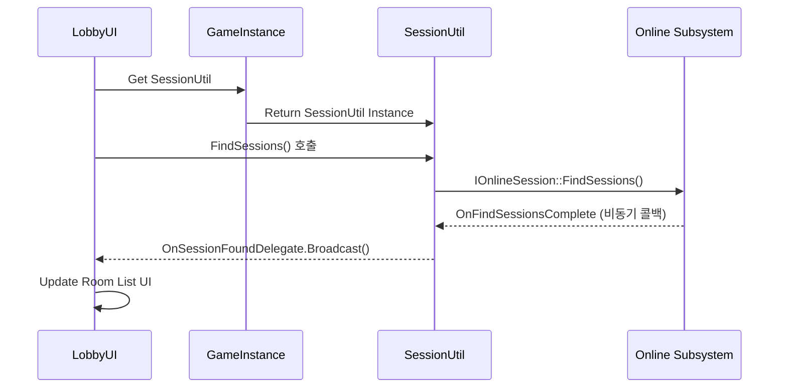

# 3.2. 세션 관리 및 로비 (Session Management & Lobby)

## 3.2.1. 설계 목표

로비 및 세션 관리 시스템은 플레이어들이 멀티플레이 게임을 시작하기 위한 필수적인 관문입니다. 복잡한 네트워크 로직을 사용자에게는 단순하고 직관적인 경험으로 제공하는 것이 핵심 목표입니다.

1.  **직관적인 사용자 경험 (Intuitive UX):** 플레이어는 방을 만들고, 목록에서 방을 찾아, 클릭하여 참여하는 일련의 과정을 쉽고 명확하게 인지할 수 있어야 합니다.
2.  **네트워크 로직의 캡슐화 (Encapsulation):** 언리얼 엔진의 Online Subsystem(OSS)은 매우 강력하지만 비동기적이고 복잡합니다. 이 복잡성을 UI 코드로부터 완전히 분리하여, UI는 오직 "방 만들어줘" 와 같은 단순한 요청만 보내면 되도록 설계합니다.
3.  **플랫폼 비종속적 설계 (Platform Agnostic):** 특정 플랫폼(Steam 등)의 SDK에 직접 의존하는 대신, 언리얼의 표준 인터페이스인 OSS를 사용하여 코드 수정 없이 다양한 플랫폼을 지원할 수 있는 확장성을 확보합니다.
4.  **UI 반응성 유지 (UI Responsiveness):** 세션 생성, 검색 등 모든 네트워크 작업은 비동기적으로 처리되어, 작업이 완료되기를 기다리는 동안 게임이 멈추는 현상을 방지하고 UI 조작이 항상 가능하도록 보장합니다.

---

## 3.2.2. 아키텍처: `SessionUtil` 패턴

이러한 목표를 달성하기 위해, 모든 Online Subsystem 관련 로직을 **[`USessionUtil`](https://github.com/chungheonLee0325/Sonheim/blob/main/Source/Sonheim/Utilities/SessionUtil.h)**이라는 단일 헬퍼 클래스에 캡슐화하는 설계를 채택했습니다. UI 위젯은 `GameInstance`를 통해 `USessionUtil`에 접근하여 간단한 함수를 호출하고, `USessionUtil`의 델리게이트를 통해 비동기 작업 결과를 통지받습니다.



*   **UI 위젯 ([`ULobbyUI`](https://github.com/chungheonLee0325/Sonheim/blob/main/Source/Sonheim/UI/Widget/Lobby/LobbyUI.h), [`UFindRoomUI`](https://github.com/chungheonLee0325/Sonheim/blob/main/Source/Sonheim/UI/Widget/Lobby/FindRoomUI.h), [`UMakeRoomUI`](https://github.com/chungheonLee0325/Sonheim/blob/main/Source/Sonheim/UI/Widget/Lobby/MakeRoomUI.h)):** 사용자 입력을 받고, `USessionUtil`에 작업을 요청하며, 결과를 받아 화면을 갱신하는 UI 위젯들입니다.
*   **`USonheimGameInstance`:** `USessionUtil` 객체를 소유하고 관리하며, UI가 세션 관리 기능에 접근할 수 있는 통로를 제공합니다.
*   **`USessionUtil`:** Online Subsystem과의 모든 상호작용을 전담하는 헬퍼 클래스입니다.

이 구조는 복잡한 비동기 네트워크 코드를 UI로부터 완벽하게 분리하여, UI는 화면을 그리는 책임에, `USessionUtil`은 세션 관리 책임에만 집중하는 **단일 책임 원칙(Single Responsibility Principle)**을 준수하는 깨끗하고 유지보수가 용이한 구조를 제공합니다.

---

## 3.2.3. 핵심 로직 워크플로우

#### 1. 세션 생성 (Create Session)
1.  **[UI]** 플레이어가 "방 만들기" 버튼을 클릭합니다.
2.  **[UI → SessionUtil]** `SessionUtil::CreateSession` 함수를 호출합니다.
3.  **[SessionUtil → OSS]** 내부적으로 `IOnlineSession::CreateSession`을 호출합니다.
4.  **[OSS → SessionUtil]** 작업이 완료되면 `OnCreateSessionComplete` 델리게이트가 호출됩니다.
5.  **[SessionUtil → Game]** 성공 시, `GetWorld()->ServerTravel("/Game/Maps/GameMap?listen")`을 호출하여 호스트로서 게임 맵으로 이동합니다.

#### 2. 세션 검색 및 참여 (Find & Join Session)
1.  **[UI]** 플레이어가 "게임 찾기" 버튼을 클릭합니다.
2.  **[UI → SessionUtil]** `SessionUtil::FindSessions` 함수를 호출합니다.
3.  **[SessionUtil → OSS]** 내부적으로 `IOnlineSession::FindSessions`를 호출합니다.
4.  **[OSS → SessionUtil]** 작업이 완료되면 `OnFindSessionsComplete` 델리게이트가 호출됩니다.
5.  **[SessionUtil → UI]** `SessionUtil`은 검색된 세션 정보를 가공하여 자신만의 `OnSessionFoundDelegate`를 방송하고, UI는 이 정보를 받아 방 목록을 갱신합니다.
6.  **[UI → SessionUtil]** 플레이어가 특정 방을 선택하고 "참여" 버튼을 누르면, `SessionUtil::JoinSession` 함수가 호출됩니다.
7.  **[SessionUtil → OSS]** 내부적으로 `IOnlineSession::JoinSession`을 호출합니다.
8.  **[OSS → SessionUtil]** 작업이 완료되면 `OnJoinSessionComplete` 델리게이트가 호출됩니다.
9.  **[SessionUtil → Game]** 성공 시, `PlayerController->ClientTravel(Address, ...)`를 호출하여 클라이언트로서 호스트의 주소로 접속합니다.

---

## 3.2.4. 구현 경험 및 트러블슈팅

#### 문제: "분명 다른 사람이 방을 만들었는데, 세션 검색 결과가 항상 비어있어요."

온라인 서브시스템, 특히 Steam 연동 시 세션 검색이 되지 않는 문제는 코드 자체의 논리적 오류보다는, 프로젝트 설정이나 외부 환경 요인에 의해 발생하는 경우가 매우 많습니다. 문제 발생 시 아래의 체크리스트를 체계적으로 점검하는 것이 효과적입니다.

*   **1. `DefaultEngine.ini` 설정 확인**
    *   Steam NetDriver가 올바르게 설정되었는지 확인합니다.
        ```ini
        [/Script/Engine.GameEngine]
        !NetDriverDefinitions=Clear
        +NetDriverDefinitions=(DefName="GameNetDriver",DriverClassName="OnlineSubsystemSteam.SteamNetDriver",DriverClassNameFallback="OnlineSubsystemUtils.IpNetDriver")
        ```
    *   OnlineSubsystem 및 OnlineSubsystemSteam이 활성화(`bEnabled=true`)되어 있는지 확인합니다.

*   **2. Steam AppID 확인**
    *   테스트 빌드에서는 개발자용 테스트 AppID인 **`480`**을 사용해야 합니다. `DefaultEngine.ini`의 `[OnlineSubsystemSteam]` 섹션에 `SteamDevAppId=480` 항목이 올바르게 설정되어 있는지 확인합니다. 이 ID가 없으면 Steamworks API가 제대로 초기화되지 않습니다.

*   **3. Steam 오버레이 및 로그인 상태**
    *   모든 테스트 클라이언트에서 Steam 클라이언트가 실행 중이고, 사용자가 로그인 상태이며, 게임 내 Steam 오버레이가 활성화되어 있는지 확인합니다. 오버레이가 비활성화되어 있으면 서브시스템이 정상적으로 동작하지 않는 경우가 많습니다.

*   **4. 방화벽 및 네트워크 문제**
    *   간혹 Windows 방화벽이나 공유기 설정이 Steam P2P 통신을 막는 경우가 있습니다. 테스트 클라이언트 간의 네트워크 연결 상태를 확인하고, 방화벽 예외 설정을 점검합니다.

*   **5. `bIsLANMatch` 설정 확인**
    *   `FindSessions` 호출 시, `FOnlineSessionSearch` 객체의 `bIsLANMatch` 변수 값을 확인해야 합니다. 이 값이 `true`로 설정되어 있으면 LAN 환경의 게임만 검색하므로, 인터넷을 통한 테스트 시에는 반드시 `false`로 설정해야 합니다.

---

## 3.2.5. 관련 시스템

*   [3.1. 서버 권한 아키텍처](./3.1_Server_Authority_Architecture.md)
*   [8.1. UI 아키텍처 및 이벤트 시스템](./8.1_UI_Architecture_and_Event_System.md)
