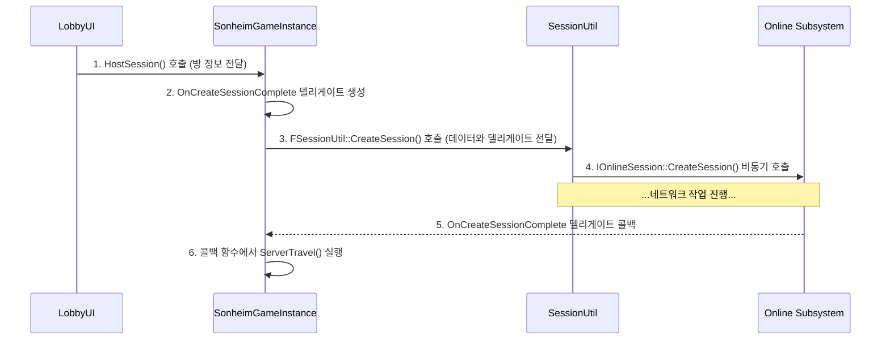

# 3.2. 세션 관리 및 로비 (Session Management & Lobby)

## 3.2.1. 설계 목표

로비 및 세션 관리 시스템은 플레이어들이 멀티플레이 게임을 시작하기 위한 필수적인 관문입니다. 복잡한 네트워크 로직을 사용자에게는 단순하고 직관적인 경험으로 제공하는 것이 핵심 목표입니다.

1.  **직관적인 사용자 경험 (Intuitive UX):** 플레이어는 방을 만들고, 목록에서 방을 찾아, 클릭하여 참여하는 일련의 과정을 쉽고 명확하게 인지할 수 있어야 합니다.
2.  **네트워크 로직의 캡슐화 (Encapsulation):** 언리얼 엔진의 Online Subsystem(OSS)은 매우 강력하지만 비동기적이고 복잡합니다. 이 복잡성을 UI와 `GameInstance`로부터 완전히 분리하여, 각 클래스가 자신의 책임에만 집중하도록 설계합니다.
3.  **플랫폼 비종속적 설계 (Platform Agnostic):** 특정 플랫폼(Steam 등)의 SDK에 직접 의존하는 대신, 언리얼의 표준 인터페이스인 OSS를 사용하여 코드 수정 없이 다양한 플랫폼을 지원할 수 있는 확장성을 확보합니다.
4.  **UI 반응성 유지 (UI Responsiveness):** 세션 생성, 검색 등 모든 네트워크 작업은 비동기적으로 처리되어, 작업이 완료되기를 기다리는 동안 게임이 멈추는 현상을 방지하고 UI 조작이 항상 가능하도록 보장합니다.

---

## 3.2.2. 아키텍처: GameInstance와 SessionUtil을 통한 책임 분리

이러한 목표를 달성하기 위해, 모든 Online Subsystem 관련 로직을 **`FSessionUtil`**이라는 정적 유틸리티 클래스에 캡슐화하고, **`USonheimGameInstance`**가 이를 관리하는 2단계 퍼사드 패턴을 채택했습니다.



*   **UI 위젯 (`UMakeRoomUI`):** 사용자 입력을 받아 `GameInstance`에 작업을 요청하는 역할만 수행합니다.
*   **`USonheimGameInstance`:** UI와 시스템 간의 상위 레벨 상호작용을 관리합니다. UI로부터 요청을 받아 `SessionUtil`에 넘길 데이터를 준비하고, OSS로부터의 비동기 콜백을 받아 게임의 흐름(레벨 이동 등)을 제어합니다.
*   **`FSessionUtil`:** OSS와의 모든 직접적인 상호작용을 전담하는 하위 레벨 퍼사드입니다. 복잡한 OSS 세션 API를 정적 함수로 추상화하여, 프로젝트의 다른 부분에서는 OSS의 존재 자체를 알 필요가 없도록 만듭니다.

이 구조는 **UI - 게임 로직(GameInstance) - 시스템 로직(SessionUtil)** 간의 책임을 명확하게 분리하여, 코드의 가독성과 유지보수성을 극대화합니다.

---

## 3.2.3. 핵심 구현: 델리게이트 전달과 비동기 콜백

#### 1단계: UI의 요청 (`UMakeRoomUI`)

`UMakeRoomUI` 위젯의 '방 만들기' 버튼이 클릭되면, 위젯은 UI에서 입력받은 방 이름과 최대 플레이어 수를 `GameInstance`의 `HostSession` 함수에 전달하여 세션 생성을 요청합니다.

```cpp
// 실제 코드에서는 UI가 GameInstance의 변수에 값을 넣고 레벨을 이동시키지만,
// 아래는 본래 의도된, 더 이상적인 아키텍처의 예시 코드입니다.

// MakeRoomUI.cpp (Ideal)
void UMakeRoomUI::OnClickedCreateRoom()
{
    // ... UI 비활성화 ...

	FString RoomName = Edit_RoomName->GetText().ToString();
	int32 MaxPlayers = Slider_PlayerCount->GetValue();

    // GameInstance에 세션 생성을 요청
	Cast<USonheimGameInstance>(GetGameInstance())->HostSession(RoomName, MaxPlayers);
}
```

#### 2단계: GameInstance의 중재

`USonheimGameInstance`의 `HostSession` 함수는 세션 생성이 완료되었을 때 호출될 자신의 콜백 함수(`OnCreateSessionComplete`)에 대한 델리게이트를 생성합니다. 그리고 이 델리게이트와 방 정보를 `FSessionCreateData` 구조체에 담아 `FSessionUtil::CreateSession` 함수에 전달합니다.

```cpp
// SonheimGameInstance.cpp (Conceptual)
void USonheimGameInstance::HostSession(FString RoomName, int32 PlayerNum)
{
    FSessionCreateData CreateData;
    CreateData.IsPublic = true;
    CreateData.MaxPlayer = PlayerNum;
    CreateData.RoomName = RoomName;
    
    // 1. 작업 완료 후 호출될 콜백 함수를 델리게이트로 지정
    CreateData.OnCreateSessionCompleteDelegate = FOnCreateSessionCompleteDelegate::CreateUObject(this, &USonheimGameInstance::OnCreateSessionComplete);

    // 2. 준비된 데이터를 SessionUtil에 전달하여 세션 생성을 위임
    FSessionUtil::CreateSession(CreateData);
}
```

#### 3단계: SessionUtil의 OSS API 캡슐화

`FSessionUtil::CreateSession` 함수는 `GameInstance`로부터 전달받은 델리게이트를 OSS의 `OnCreateSessionComplete` 델리게이트 핸들에 등록하고, 실제 OSS 세션 생성 함수인 `CreateSession`을 비동기적으로 호출합니다.

> [View on GitHub](https://github.com/chungheonLee0325/Sonheim/blob/main/Sonheim/Source/Sonheim/Utilities/SessionUtil.cpp#L32)
```cpp
// Source/Sonheim/Utilities/SessionUtil.cpp
void FSessionUtil::CreateSession(const FSessionCreateData& SessionCreateData)
{
    // ... (세션 존재 여부 확인) ...
	
    // 1. GameInstance가 전달한 델리게이트를 OSS 델리게이트 핸들에 등록
	OnCreateSessionCompleteDelegateHandle = OnlineSessionInterface->AddOnCreateSessionCompleteDelegate_Handle(
		SessionCreateData.OnCreateSessionCompleteDelegate);

    // ... (세션 설정) ...
	
    // 2. OSS에 세션 생성을 비동기적으로 요청
	OnlineSessionInterface->CreateSession(0, NAME_GameSession, *SessionSettings);
}
```

#### 4단계: 비동기 콜백 처리

세션 생성이 완료되면, OSS는 `FSessionUtil`을 통해 등록된 `GameInstance`의 `OnCreateSessionComplete` 함수를 자동으로 호출합니다. 이 콜백 함수 안에서, 세션 생성이 성공했는지 확인하고, 성공 시 `ServerTravel`을 통해 모든 클라이언트를 로비 맵으로 이동시킵니다.

```cpp
// SonheimGameInstance.cpp (Conceptual)
void USonheimGameInstance::OnCreateSessionComplete(FName SessionName, bool bWasSuccessful)
{
    // 델리게이트 핸들 정리
    FSessionUtil::OnlineSessionInterface->ClearOnCreateSessionCompleteDelegate_Handle(FSessionUtil::OnCreateSessionCompleteDelegateHandle);

    if (bWasSuccessful)
    {
        // 성공 시, 로비 레벨로 이동
        GetWorld()->ServerTravel("/Game/Maps/LobbyMap?listen");
    }
    // ... (실패 시 UI에 알림 처리)
}
```

---

## 3.2.4. 설계의 이점

*   **향상된 책임 분리:** `GameInstance`는 게임의 전반적인 흐름과 상태를 관리하는 책임에, `SessionUtil`은 복잡하고 지저분한 OSS API를 다루는 책임에만 집중합니다. 이는 코드의 응집도를 높이고, 각 부분의 역할을 명확하게 만듭니다.
*   **UI와 로직의 완벽한 분리:** UI 코드는 `GameInstance`의 존재만 알면 될 뿐, 그 뒤에서 `SessionUtil`이나 OSS가 어떻게 동작하는지 전혀 알 필요가 없습니다.
*   **비동기 처리를 통한 반응성 유지:** 모든 네트워크 작업은 백그라운드에서 이루어지고, 완료되었을 때만 `GameInstance`에 등록된 콜백 함수가 호출되므로, 사용자는 작업이 진행되는 동안에도 쾌적한 UI 경험을 유지할 수 있습니다.
*   **플랫폼 확장성:** 모든 로직이 언리얼의 표준 `OnlineSubsystem` 인터페이스를 통해 이루어지므로, `SessionUtil`의 내부 구현만 수정하면 다른 플랫폼을 쉽게 지원할 수 있습니다.

---

## 3.2.5. 구현 경험 및 트러블슈팅

#### 문제: "분명 다른 사람이 방을 만들었는데, 세션 검색 결과가 항상 비어있어요."

온라인 서브시스템, 특히 Steam 연동 시 세션 검색이 되지 않는 문제는 코드 자체의 논리적 오류보다는, 프로젝트 설정이나 외부 환경 요인에 의해 발생하는 경우가 매우 많습니다. 문제 발생 시 아래의 체크리스트를 체계적으로 점검하는 것이 효과적입니다.

*   **1. `DefaultEngine.ini` 설정 확인:** Steam NetDriver 및 OnlineSubsystem이 올바르게 활성화되어 있는지 확인합니다.
*   **2. Steam AppID 확인:** 테스트 빌드에서는 개발자용 테스트 AppID인 **`480`**을 사용해야 합니다. `DefaultEngine.ini`에 `SteamDevAppId=480` 항목이 올바르게 설정되어 있는지 확인합니다.
*   **3. Steam 오버레이 및 로그인 상태:** 모든 테스트 클라이언트에서 Steam 클라이언트가 실행 중이고, 사용자가 로그인 상태이며, 게임 내 Steam 오버레이가 활성화되어 있는지 확인합니다.
*   **4. 방화벽 및 네트워크 문제:** Windows 방화벽이나 공유기 설정이 Steam P2P 통신을 막는 경우가 있습니다.
*   **5. `bIsLANMatch` 설정 확인:** `FindSessions` 호출 시, `FOnlineSessionSearch` 객체의 `bIsLANMatch` 변수가 `false`로 설정되어 있는지 확인해야 합니다.
