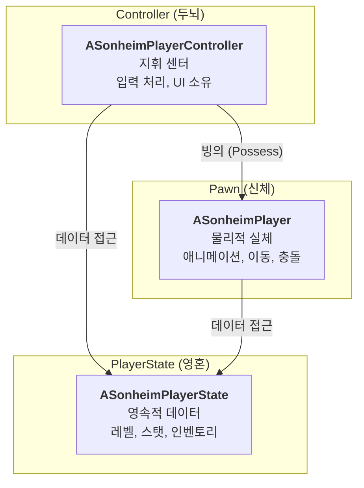

# 4.1. 플레이어 클래스 아키텍처 (Player Class Architecture)

## 4.1.1. 설계 목표

플레이어 시스템은 게임의 주인공을 구현하는 가장 중요한 파트입니다. 복잡한 기능(입력, 데이터, 시각적 표현)을 체계적으로 관리하고, 멀티플레이어 환경에서 안정적으로 동작하도록 하는 것이 핵심 목표였습니다.

1.  **관심사의 분리 (Separation of Concerns):** 플레이어의 **입력 처리(Controller)**, **데이터(State)**, **시각적/물리적 표현(Pawn)** 을 완전히 독립된 클래스로 분리하여 각 클래스가 하나의 명확한 책임만 갖도록 설계합니다.
2.  **네트워크 안정성 및 데이터 영속성:** 플레이어의 핵심 데이터(레벨, 인벤토리 등)는 `Pawn`의 생명주기(죽음, 리스폰)와 무관하게 안정적으로 유지되어야 하며, 서버 권위 하에 모든 클라이언트에 일관되게 복제되어야 합니다.
3.  **유지보수성:** 각 클래스의 역할이 명확하므로, 특정 기능을 수정할 때(예: 키보드 입력 변경, UI 데이터 추가) 다른 부분에 미치는 영향을 최소화하여 유지보수 비용을 낮춥니다.

이를 위해, 언리얼 엔진의 게임플레이 프레임워크가 제공하는 표준적인 **Pawn-Controller-PlayerState** 아키텍처를 채택했습니다. 이는 수많은 언리얼 프로젝트를 통해 검증된 매우 안정적이고 효율적인 설계입니다.

---

## 4.1.2. 아키텍처: Pawn(신체), Controller(두뇌), PlayerState(영혼)

플레이어는 세 개의 핵심 클래스가 유기적으로 결합하여 완성됩니다. 각 클래스의 역할을 **신체, 두뇌, 영혼**에 비유하여 이해할 수 있습니다.



*   **`ASonheimPlayerController` (두뇌):** 플레이어의 '의도'를 대변하는 지휘 센터입니다. 키보드/마우스 입력을 독점적으로 처리하고, UI 위젯을 소유하며, 어떤 액션을 할지 결정하여 `Pawn`에게 명령을 내립니다.
*   **`ASonheimPlayer` (신체):** 월드에 실제로 보여지는 물리적 실체입니다. `Controller`로부터 "점프해라"와 같은 명령을 받아 실제 액션을 수행하고, 애니메이션, 이펙트 등 시각적 표현을 담당합니다.
*   **`ASonheimPlayerState` (영혼):** `Pawn`이 죽거나 사라져도 게임 세션 내내 유지되는 영속적인 데이터 저장소입니다. 레벨, 스탯, 인벤토리와 같은 핵심 데이터를 저장하고, 모든 클라이언트에게 복제되어 상태 공유의 기반이 됩니다.

---

## 4.1.3. 핵심 구현: 역할과 책임의 분리

#### 1. Controller (두뇌): 입력 처리 및 명령 전달
`Controller`는 Enhanced Input 시스템을 통해 입력을 받고, 자신이 '빙의'하고 있는 `Pawn`의 함수를 호출하여 실제 동작을 지시합니다. `Controller`는 "어떻게 움직일지"는 모르며, 오직 "움직여라"라는 명령만 전달합니다.

> [View on GitHub](https://github.com/chungheonLee0325/Sonheim/blob/main/Sonheim/Source/Sonheim/AreaObject/Player/SonheimPlayerController.cpp#L426)
```cpp
// Source/Sonheim/AreaObject/Player/SonheimPlayerController.cpp
void ASonheimPlayerController::OnMove(const FInputActionValue& Value)
{
	if (IsMenuActivate || IsContainerActivate) return;

    // 실제 이동 로직은 자신이 제어하는 Pawn에게 위임합니다.
	m_Player->Move(Value.Get<FVector2D>());
}
```

#### 2. Pawn (신체): 명령의 실행
`Pawn`은 `Controller`로부터 받은 명령을 받아, 자신의 `CharacterMovementComponent`를 사용하여 실제 이동을 수행합니다.

> [View on GitHub](https://github.com/chungheonLee0325/Sonheim/blob/main/Sonheim/Source/Sonheim/AreaObject/Player/SonheimPlayer.cpp#L684)
```cpp
// Source/Sonheim/AreaObject/Player/SonheimPlayer.cpp
void ASonheimPlayer::Move(const FVector2D MovementVector)
{
    // ...
		if (CanPerformAction(CurrentPlayerState, "Move"))
		{
			AddMovementInput(ForwardDirection, MovementVector.Y);
			AddMovementInput(RightDirection, MovementVector.X);
		}
    // ...
}
```

#### 3. PlayerState (영혼): 데이터의 소유
`PlayerState`는 `UInventoryComponent`와 같은 핵심 데이터 컴포넌트들을 직접 소유합니다. `Pawn`이나 `Controller`는 데이터가 필요할 때, 항상 `PlayerState`를 통해 데이터에 접근합니다. `ASonheimPlayer`는 `PlayerState`에 대한 포인터를 캐싱(`S_PlayerState`)해두고, 헬퍼 함수를 통해 간결하게 데이터에 접근합니다.

> [View on GitHub (Helper Function)](https://github.com/chungheonLee0325/Sonheim/blob/main/Sonheim/Source/Sonheim/AreaObject/Player/SonheimPlayer.h#L229)
> [View on GitHub (Usage)](https://github.com/chungheonLee0325/Sonheim/blob/main/Sonheim/Source/Sonheim/AreaObject/Player/SonheimPlayer.cpp#L658)
```cpp
// Source/Sonheim/AreaObject/Player/SonheimPlayer.h
UFUNCTION(BlueprintCallable)
UInventoryComponent* GetInventoryComponent() const { return S_PlayerState->m_InventoryComponent; };

// Source/Sonheim/AreaObject/Player/SonheimPlayer.cpp
bool ASonheimPlayer::HasPalSphere() const
{
	return GetInventoryComponent()->GetPalSphereCount() > 0;
}
```

---

## 4.1.4. 핵심 설계 결정: "왜 인벤토리는 `Pawn`이 아닌 `PlayerState`에 있는가?"

플레이어가 죽었다가 다시 부활하는 상황을 고려해야 합니다. 만약 `ASonheimPlayer`(`Pawn`)가 `UInventoryComponent`를 가지고 있다면, `Pawn`이 죽고 새로 생성될 때 인벤토리 정보가 모두 사라지게 됩니다.

반면, **`APlayerState`는 플레이어가 세션에 접속해 있는 동안 절대 파괴되지 않습니다.**

따라서 `PlayerState`에 `InventoryComponent`를 위치시킴으로써, 플레이어가 죽고 새로운 `Pawn`에 빙의하더라도 인벤토리, 레벨, 스탯 등 모든 핵심 데이터를 그대로 유지할 수 있는 안정적인 구조를 완성했습니다. 이는 언리얼 멀티플레이어 게임플레이의 핵심적인 설계 원칙 중 하나이며, 데이터 영속성을 보장하기 위한 의도적인 설계 결정입니다.

---

## 4.1.5. 관련 시스템

*   [2.2. 컴포넌트 기반 설계](./2.2_Component_Based_Design.md)
*   [3.1. 서버 권한 아키텍처](./3.1_Server_Authority_Architecture.md)
*   [7.1. 인벤토리 시스템](./7.1_Inventory_System.md)
