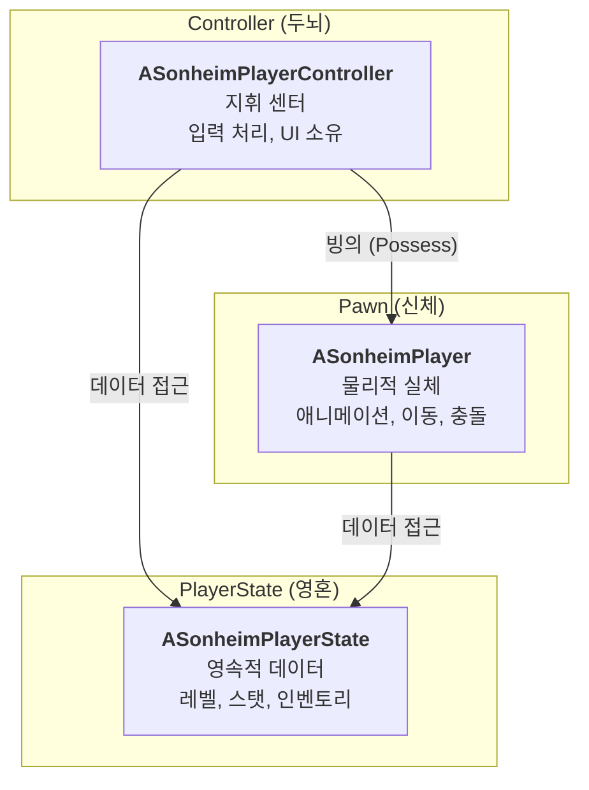

# 4.1. 플레이어 클래스 아키텍처 (Player Class Architecture)

## 4.1.1. 설계 목표

플레이어 시스템은 게임의 주인공을 구현하는 가장 중요한 파트입니다. 복잡한 기능(입력, 데이터, 시각적 표현)을 체계적으로 관리하고, 멀티플레이어 환경에서 안정적으로 동작하도록 하는 것이 핵심 목표였습니다.

1.  **관심사의 분리 (Separation of Concerns):** 플레이어의 **입력 처리(Controller)**, **데이터(State)**, **시각적/물리적 표현(Pawn)**을 완전히 독립된 클래스로 분리하여 각 클래스가 하나의 명확한 책임만 갖도록 설계합니다.
2.  **네트워크 안정성 및 데이터 영속성:** 플레이어의 핵심 데이터(레벨, 인벤토리 등)는 `Pawn`의 생명주기(죽음, 리스폰)와 무관하게 안정적으로 유지되어야 하며, 서버 권위 하에 모든 클라이언트에 일관되게 복제되어야 합니다.
3.  **유지보수성:** 각 클래스의 역할이 명확하므로, 특정 기능을 수정할 때(예: 키보드 입력 변경, UI 데이터 추가) 다른 부분에 미치는 영향을 최소화하여 유지보수 비용을 낮춥니다.

이를 위해, 언리얼 엔진의 게임플레이 프레임워크가 제공하는 표준적인 **Pawn-Controller-PlayerState** 아키텍처를 채택했습니다. 이는 수많은 언리얼 프로젝트를 통해 검증된 매우 안정적이고 효율적인 설계입니다.

---

## 4.1.2. 아키텍처: Pawn(신체), Controller(두뇌), PlayerState(영혼)

플레이어는 세 개의 핵심 클래스가 유기적으로 결합하여 완성됩니다. 각 클래스의 역할을 **신체, 두뇌, 영혼**에 비유하여 이해할 수 있습니다.



*   **[`ASonheimPlayerController`](https://github.com/chungheonLee0325/Sonheim/blob/main/Source/Sonheim/AreaObject/Player/SonheimPlayerController.h) (두뇌):** 플레이어의 '의도'를 대변하는 지휘 센터입니다. 키보드/마우스 입력을 독점적으로 처리하고, UI 위젯을 소유하며, 어떤 액션을 할지 결정하여 `Pawn`에게 명령을 내립니다.
*   **[`ASonheimPlayer`](https://github.com/chungheonLee0325/Sonheim/blob/main/Source/Sonheim/AreaObject/Player/SonheimPlayer.h) (신체):** 월드에 실제로 보여지는 물리적 실체입니다. `Controller`로부터 "점프해라"와 같은 명령을 받아 실제 액션을 수행하고, 애니메이션, 이펙트 등 시각적 표현을 담당합니다.
*   **[`ASonheimPlayerState`](https://github.com/chungheonLee0325/Sonheim/blob/main/Source/Sonheim/AreaObject/Player/SonheimPlayerState.h) (영혼):** `Pawn`이 죽거나 사라져도 게임 세션 내내 유지되는 영속적인 데이터 저장소입니다. 레벨, 스탯, 인벤토리와 같은 핵심 데이터를 저장하고, 모든 클라이언트에게 복제되어 상태 공유의 기반이 됩니다.

| 클래스 (Class) | 주요 역할 (Primary Role) | 주요 소유 컴포넌트 및 데이터 (Key Owned Components & Data) |
| :--- | :--- | :--- |
| `ASonheimPlayerController` | **입력 처리 및 UI 관리**<br/>- 플레이어의 입력을 받아 Pawn에 전달<br/>- HUD, 인벤토리, 상점 등 UI 위젯 생성 및 관리 | - Enhanced Input을 이용한 플레이어 입력 맵핑 <br/>- `UPlayerStatusWidget`, `UInventoryWidget` 등 각종 UI 위젯 |
| `ASonheimPlayer` (Pawn) | **시각적/물리적 표현**<br/>- 월드 내 캐릭터의 외형, 애니메이션, 이동, 충돌 처리<br/>- 스킬, 상호작용 등 실제 액션 수행 | - `USkeletalMeshComponent` (캐릭터, 무기)<br/>- `UCharacterMovementComponent`<br/>- `UCameraComponent`, `USkillComponent`<br/>- `UInteractionComponent`, `UPalCaptureComponent` |
| `ASonheimPlayerState` | **영속적인 데이터 저장**<br/>- 레벨, 스탯, 인벤토리 등 플레이어의 핵심 데이터 관리<br/>- Pawn이 리스폰해도 유지되어야 하는 정보 저장 | - `UInventoryComponent`, `UPalInventoryComponent`<br/>- `UStatBonusComponent`<br/>- `Level`, `BaseStat` 등 복제되는 플레이어 데이터 |


---

## 4.1.3. 핵심 로직 및 구현

#### 1. Controller (두뇌): 입력 처리 및 명령 전달
`Controller`는 Enhanced Input 시스템을 통해 입력을 받고, 자신이 '빙의'하고 있는 `Pawn`의 함수를 호출하여 실제 동작을 지시합니다.

```cpp
// SonheimPlayerController.cpp
// NOTE: 아래는 Controller가 입력을 받아 Pawn에게 전달하는 핵심 로직을 보여주기 위한 요약된 예시입니다.
void ASonheimPlayerController::OnMove(const FInputActionValue& Value)
{
    // 메뉴나 컨테이너 UI가 활성화된 상태 등, 특정 조건에서는 입력을 무시합니다.
    if (IsMenuActivate || IsContainerActivate) return;

    // 실제 이동은 자신이 제어하는 Pawn에게 위임합니다.
    m_Player->Move(Value.Get<FVector2D>());
}
```

#### 2. Pawn (신체): 액션 실행 및 상태 동기화
`Pawn`은 `Controller`로부터 받은 명령을 서버에 요청(`Server RPC`)하고, 서버의 최종 판결에 따라 자신의 상태를 변경합니다. Sonheim에서는 회피와 같은 특수 동작도 모두 **스킬 시스템**을 통해 일관되게 처리합니다.

```cpp
// SonheimPlayer.cpp - 스킬 시스템을 이용한 회피 구현
void ASonheimPlayer::Dodge_Pressed()
{
    // 다른 액션 중에는 회피할 수 없도록 상태를 체크합니다.
    if (!CanPerformAction(CurrentPlayerState, "Action")) return;
    
    // 클라이언트에서는 즉시 서버에 회피 실행을 요청합니다.
    Server_Dodge_Pressed();
}

void ASonheimPlayer::Server_Dodge_Pressed_Implementation()
{
    // 회피는 데이터 테이블에 정의된 고유 ID(2)를 가진 스킬로 취급합니다.
    int dodgeSkillID = 2;
    TObjectPtr<UBaseSkill> skill = GetSkillByID(dodgeSkillID);

    // 스킬 시스템에 스킬 시전을 위임합니다. 스태미나 소모, 쿨타임 등의 판정은 스킬 객체가 담당합니다.
    if (skill && CastSkill(skill, this))
    {
        // 스킬이 성공적으로 시전되면, 스킬이 끝날 때까지 다른 액션을 막도록 상태를 변경하고,
        SetPlayerState(EPlayerState::ACTION);
        // 스킬이 종료되면 다시 원래 상태로 돌아오도록 델리게이트를 바인딩합니다.
        skill->OnSkillComplete.BindUObject(this, &ASonheimPlayer::SetPlayerNormalState);
    }
}
```

#### 3. PlayerState (영혼): 데이터 소유 및 UI 업데이트
`PlayerState`는 [`UInventoryComponent`](https://github.com/chungheonLee0325/Sonheim/blob/main/Source/Sonheim/AreaObject/Player/Utility/InventoryComponent.h)와 같은 핵심 데이터 컴포넌트들을 직접 소유합니다. 이 컴포넌트의 데이터가 서버에서 변경되면, `ReplicatedUsing`을 통해 클라이언트에 자동으로 동기화되고, `OnRep` 함수가 델리게이트를 호출하여 UI를 효율적으로 업데이트합니다.

```cpp
// SonheimPlayerState.h (실제 코드)
UCLASS()
class ASonheimPlayerState : public APlayerState
{
    // ... (다른 변수들)
public:
    // 인벤토리 컴포넌트를 PlayerState가 직접 소유합니다.
    UPROPERTY(BlueprintReadWrite, Category="Inventory")
    UInventoryComponent* m_InventoryComponent;

    // 스탯 변경 이벤트를 전파할 델리게이트
    UPROPERTY(BlueprintAssignable)
    FOnPlayerStatsChanged OnPlayerStatsChanged;
    // ... (다른 함수들)
};
```

---

## 4.1.4. 핵심 설계 결정: "왜 인벤토리는 `Pawn`이 아닌 `PlayerState`에 있는가?"

플레이어가 죽었다가 다시 부활하는 상황을 고려해야 합니다. 만약 `ASonheimPlayer`(`Pawn`)가 `InventoryComponent`를 가지고 있다면, `Pawn`이 죽고 새로 생성될 때 인벤토리 정보가 모두 사라지게 됩니다.

반면, **`APlayerState`는 플레이어가 세션에 접속해 있는 동안 절대 파괴되지 않습니다.**

따라서 `PlayerState`에 `InventoryComponent`를 위치시킴으로써, 플레이어가 죽고 새로운 `Pawn`에 빙의하더라도 인벤토리, 레벨, 스탯 등 모든 핵심 데이터를 그대로 유지할 수 있는 안정적인 구조를 완성했습니다. 이는 언리얼 멀티플레이어 게임플레이의 핵심적인 설계 원칙 중 하나입니다.

---

## 4.1.5. 관련 시스템

*   [2.2. 컴포넌트 기반 설계](./2.2_Component_Based_Design.md)
*   [3.1. 서버 권한 아키텍처](./3.1_Server_Authority_Architecture.md)
*   [7.1. 인벤토리 시스템](./7.1_Inventory_System.md)
