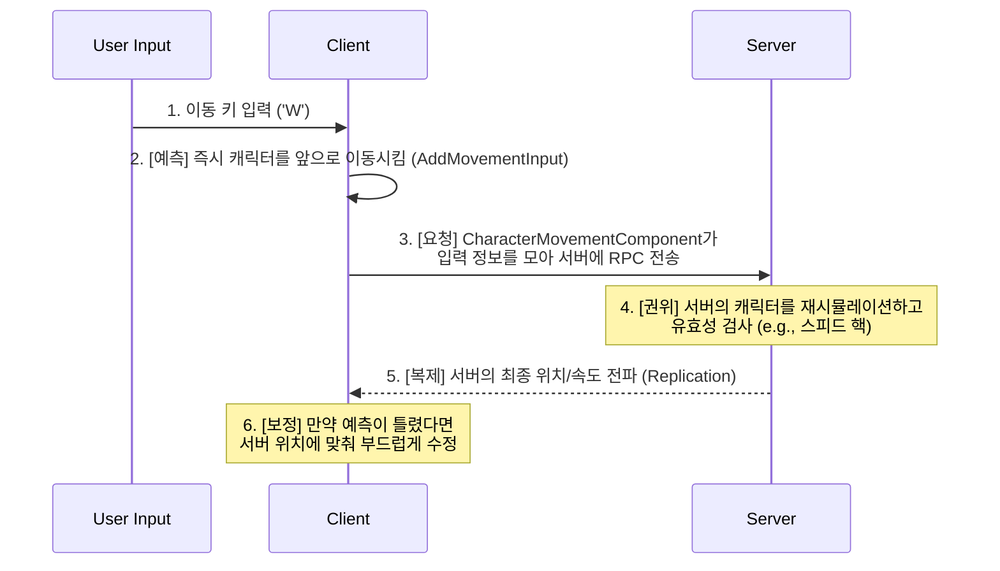

# 4.2. 네트워크 캐릭터 컨트롤: 반응성과 보안의 균형

## 4.2.1. 설계 목표: 왜 직접 만들지 않았는가?

플레이어의 부드럽고 반응성 좋은 움직임은 게임의 몰입감에 매우 중요합니다. 하지만 멀티플레이어 환경에서 이를 구현하는 것은 "서버의 응답을 기다리면 랙(Lag)이 느껴지고, 클라이언트에서만 처리하면 핵(Hack)에 뚫린다"는 고질적인 딜레마를 마주하게 됩니다.

이 문제를 해결하기 위해 직접 클라이언트 예측, 서버 재시뮬레이션, 오차 보정 로직을 구현하는 것은 엄청난 비용과 버그를 유발하는 매우 어려운 작업입니다. 따라서 Sonheim의 네트워크 컨트롤 시스템은 **"바퀴를 재발명하지 않는다(Don't reinvent the wheel)"**는 원칙 아래, 언리얼 엔진이 제공하는 매우 정교하고 안정적인 솔루션인 **`UCharacterMovementComponent`**를 깊이 이해하고, 이를 최대한 활용하여 다음 목표를 달성하는 것을 목표로 설계되었습니다.

1.  **서버 권위의 이동 판정:** 플레이어의 이동 속도, 점프 높이 등 모든 물리적 제약은 서버가 결정하여 스피드 핵과 같은 치트를 원천적으로 방지합니다.
2.  **즉각적인 클라이언트 반응성:** 클라이언트 예측(Client-Side Prediction)을 통해, 플레이어의 입력이 네트워크 지연 없이 즉각적으로 화면에 반영되도록 합니다.
3.  **부드러운 동기화:** 서버의 최종 위치와 클라이언트의 예측 위치가 다를 경우, 이를 부드럽게 보정(Reconciliation)하여 플레이어가 위치가 순간이동하는 것처럼 느끼지 않도록 합니다.

---

## 4.2.2. 아키텍처: UCharacterMovementComponent의 동기화 모델

Sonheim은 언리얼 엔진의 `UCharacterMovementComponent`가 내부적으로 제공하는, 수많은 상용 프로젝트를 통해 검증된 강력한 네트워크 동기화 모델을 그대로 활용합니다.



---

## 4.2.3. 핵심 구현: 엔진 기능의 올바른 활용

#### 1. 표준 이동: `AddMovementInput` 호출이 전부

개발자는 `PlayerController`에서 입력을 받아 `Pawn`의 `Move` 함수를 호출하고, `Pawn`은 이 입력을 받아 `AddMovementInput` 함수를 호출하기만 하면 됩니다. 클라이언트 예측과 서버 동기화는 엔진이 모두 자동으로 처리해줍니다. 개발자의 역할은 복잡한 동기화 로직을 구현하는 것이 아니라, **서버에서 이동 관련 속성을 제어**하는 것입니다.

> [View on GitHub](https://github.com/chungheonLee0325/Sonheim/blob/main/Sonheim/Source/Sonheim/AreaObject/Player/SonheimPlayer.cpp#L480)
```cpp
// Source/Sonheim/AreaObject/Player/SonheimPlayer.cpp
// 서버에서 캐릭터의 달리기 속도를 제어하는 예시
void ASonheimPlayer::ApplySprinting(bool bNew)
{
    // 이 함수는 서버에서만 호출되어야 신뢰할 수 있다.
    const float Base = dt_AreaObject ? dt_AreaObject->WalkSpeed : GetCharacterMovement()->MaxWalkSpeed;
    const float NewSpeed = bNew ? Base * SprintSpeedRatio : Base;
    GetCharacterMovement()->MaxWalkSpeed = NewSpeed;
}

void ASonheimPlayer::Server_SetSprinting_Implementation(bool bNew)
{
    bIsSprinting = bNew;
    ApplySprinting(bIsSprinting);
}
```

#### 2. 커스텀 상태 동기화 (`ReplicatedUsing`): "글라이딩"

걷기, 달리기가 아닌 커스텀 상태(예: 글라이딩)를 동기화할 때는, `ReplicatedUsing`(RepNotify)을 사용하여 상태 변화를 모든 클라이언트에 안정적으로 전파합니다. 이는 일회성 이벤트인 `NetMulticast` RPC와 달리, 중간에 참여한 플레이어에게도 항상 정확한 현재 상태를 보장해주는 가장 견고한 방법입니다.

1.  **[서버]** `Server_SetGliding(true)` RPC가 호출되면, 서버는 `bIsGliding` 변수(UPROPERTY `ReplicatedUsing=OnRep_IsGliding`)의 값을 `true`로 변경합니다.
2.  **[클라이언트]** `bIsGliding` 값이 클라이언트에 복제되면, `OnRep_IsGliding` 함수가 자동으로 호출됩니다.
3.  **[클라이언트]** `OnRep_IsGliding` 함수 안에서 글라이더 메쉬를 보이게 하거나, 관련 사운드를 재생하는 등 모든 시각적/청각적 처리를 수행합니다.

> [View on GitHub (Header)](https://github.com/chungheonLee0325/Sonheim/blob/main/Sonheim/Source/Sonheim/AreaObject/Player/SonheimPlayer.h#L380)
> [View on GitHub (Source)](https://github.com/chungheonLee0325/Sonheim/blob/main/Sonheim/Source/Sonheim/AreaObject/Player/SonheimPlayer.cpp#L500)
```cpp
// Source/Sonheim/AreaObject/Player/SonheimPlayer.h
UPROPERTY(ReplicatedUsing=OnRep_IsGliding)
bool bIsGliding = false;

UFUNCTION()
void OnRep_IsGliding();

// Source/Sonheim/AreaObject/Player/SonheimPlayer.cpp
void ASonheimPlayer::OnRep_IsGliding()
{
    // bIsGliding 값에 따라 글라이더 메쉬를 보이거나 숨기는 등 시각적 처리를 수행
    ApplyGliderState(bIsGliding);
}
```

---

## 4.2.4. 설계의 이점

*   **높은 안정성과 성능:** 직접 구현하기 매우 어려운 클라이언트 예측 및 보정 로직을, 수많은 상용 프로젝트를 통해 검증된 언리얼 엔진의 내장 기능을 활용하여 최고 수준의 안정성과 성능을 확보했습니다.
*   **개발 효율성:** 개발자는 복잡한 네트워크 동기화의 세부 사항을 신경 쓸 필요 없이, `MaxWalkSpeed`와 같은 게임플레이 속성을 제어하는 데에만 집중할 수 있습니다. 이는 개발 시간을 크게 단축시키고 버그 발생 가능성을 줄입니다.
*   **엔진 기능의 깊은 이해:** 이 설계는 단순히 엔진 기능을 사용하는 것을 넘어, "왜 직접 구현하지 않는 것이 더 나은 선택인가"를 이해하고, 언리얼 엔진의 네트워크 아키텍처 철학을 올바르게 활용했음을 보여줍니다.

---

## 4.2.5. 관련 시스템

*   [3.1. 서버 권한 아키텍처](./3.1_Server_Authority_Architecture.md)
*   [4.1. 플레이어 클래스 아키텍처](./4.1_Player_Class_Architecture.md)
*   [4.3. 애니메이션 시스템](./4.3_Animation_System.md)
