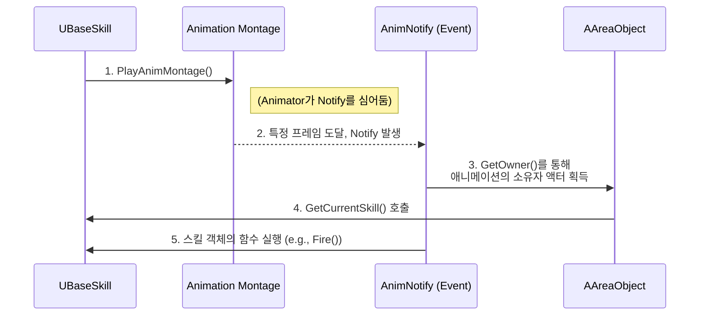

# 4.3. 애니메이션 주도 게임플레이 (Animation-Driven Gameplay)

## 4.3.1. 설계 목표: 애니메이터에게 타이밍 제어권 부여

게임에서 공격 판정, 무적 상태 부여, 투사체 발사 등의 타이밍은 매우 중요합니다. 만약 프로그래머가 코드에서 `Delay(0.5f)`와 같이 타이밍을 하드코딩한다면, 애니메이터가 공격 애니메이션의 길이를 0.4초로 줄였을 때, 애니메이션이 끝난 후에야 공격 판정이 일어나는 심각한 비동기 문제가 발생합니다.

Sonheim의 애니메이션 시스템은 이러한 문제를 근본적으로 해결하기 위해, **게임플레이 로직의 실행 타이밍을 애니메이션 타임라인이 직접 제어**하는 **애니메이션 주도(Animation-Driven)** 설계를 목표로 합니다.

1.  **애니메이터의 제어권:** 애니메이터가 애니메이션의 특정 프레임에 '마커'(`AnimNotify`)를 찍으면, 정확히 그 순간에 게임플레이 로직이 실행되도록 합니다. 이를 통해 애니메이터는 코드 수정 없이 공격 판정, 이펙트 생성 등의 타이밍을 자유롭게 조절할 수 있습니다.
2.  **완벽한 시각적 동기화:** 모든 게임플레이 이벤트가 애니메이션 프레임에서 직접 트리거되므로, "눈에 보이는 것"과 "실제 일어나는 일"이 항상 완벽하게 일치함을 보장합니다.
3.  **로직과 표현의 분리:** 애니메이션 시스템은 "특정 시점에 도달했다"는 신호만 보낼 뿐, 어떤 로직이 실행될지는 알지 못합니다. 이를 통해 애니메이션과 게임플레이 로직 간의 결합도를 극단적으로 낮춥니다.

---

## 4.3.2. 아키텍처: AnimNotify를 이용한 제어 흐름

기본적인 이동은 상태 머신과 블렌드 스페이스로 처리하고, 스킬과 같은 복잡한 행동은 애니메이션 몽타주와 `AnimNotify`를 통해 처리합니다. `AnimNotify`는 애니메이션 애셋과 C++ 코드 사이를 잇는 다리 역할을 합니다.



---

## 4.3.3. 핵심 구현: 범용적인 AnimNotify 시스템

Sonheim은 다양한 게임플레이 이벤트를 처리하기 위해 여러 종류의 커스텀 `AnimNotify`와 `AnimNotifyState`를 구현했습니다.

#### 1. 특정 시점 이벤트: `AddConditionNotify`, `SkillFireNotify`

`UAnimNotify`를 상속받는 이 클래스들은 애니메이션의 **특정 프레임**에 도달했을 때 일회성 이벤트를 발생시킵니다.

*   **`AddConditionNotify`:** 구르기 애니메이션의 특정 구간에 이 Notify를 추가하고 'Invincible(무적)' 상태와 지속시간을 지정하면, 해당 시간 동안 캐릭터가 무적이 됩니다.
*   **`SkillFireNotify`:** 원거리 공격 몽타주에서, 투사체가 발사되어야 할 정확한 프레임에 이 Notify를 추가하여 `UBaseSkill`의 `Fire()` 함수를 호출합니다.

> [View on GitHub](https://github.com/chungheonLee0325/Sonheim/blob/main/Sonheim/Source/Sonheim/Animation/Common/Notify/SkillFireNotify.cpp#L10)
```cpp
// Source/Sonheim/Animation/Common/Notify/SkillFireNotify.cpp
void USkillFireNotify::Notify(USkeletalMeshComponent* MeshComp, UAnimSequenceBase* Animation)
{
    if (AAreaObject* owner = Cast<AAreaObject>(MeshComp->GetOwner()))
    {
        // 1. 애니메이션의 소유자로부터 현재 활성화된 스킬 객체를 가져온다.
        if (UBaseSkill* Skill = owner->GetCurrentSkill())
        {
            // 2. 서버/클라이언트에 따라 적절한 함수를 호출한다.
            if (owner->HasAuthority())
            {
                Skill->Fire(); // 서버는 직접 실행
            }
            else
            {
                owner->Server_NotifySkillFire(Skill->GetSkillID()); // 클라이언트는 서버에 RPC 요청
            }
        }
    }
}
```

#### 2. 특정 구간 이벤트: `MeleeAttackNotifyState`

`UAnimNotifyState`를 상속받는 `MeleeAttackNotifyState` 클래스는 애니메이션의 **특정 구간** 동안 지속적인 로직을 처리합니다. 근접 공격 판정이 대표적인 예입니다.

1.  **`NotifyBegin`:** 공격 애니메이션에서 판정이 시작되어야 할 프레임에 호출됩니다. 이 함수는 `UMeleeAttack` 스킬 객체를 찾아, 충돌 검사를 시작하도록 알립니다.
2.  **`NotifyTick`:** 판정 구간 동안 매 틱 호출됩니다. `UMeleeAttack` 스킬은 이 함수 안에서 이전 프레임과 현재 프레임의 무기 위치를 보간하며 충돌 검사를 수행합니다.
3.  **`NotifyEnd`:** 판정이 끝나는 프레임에 호출되어, 충돌 검사를 종료합니다.

이러한 설계 덕분에, 애니메이터는 몽타주 에디터에서 `MeleeAttackNotifyState`의 시작점과 끝점을 시각적으로 조절하는 것만으로, 모든 근접 공격의 판정 타이밍과 지속시간을 정교하게 제어할 수 있습니다.

---

## 4.3.4. 구현 경험 및 트러블슈팅

#### 문제 1: 프레임 드랍으로 인한 판정 누락

*   **상황:** 캐릭터의 공격 애니메이션이 매우 빠르거나, 저사양 PC에서 프레임 드랍이 발생할 경우, 무기의 충돌체가 한 프레임 만에 적을 완전히 통과해버려 충돌이 감지되지 않는 현상이 발생했습니다.
*   **해결:** `MeleeAttackNotifyState`의 `NotifyTick` 함수를 활용하여 **프레임 보간(Frame Interpolation)** 로직을 구현했습니다. 매 `NotifyTick`마다 이전 프레임의 무기 위치와 현재 프레임의 위치 사이를 선형 보간(Lerp)하여 여러 개의 중간 지점을 계산하고, 각 지점 사이를 스윕 트레이스로 검사하도록 로직을 변경했습니다. 이를 통해 물리 엔진의 틱 간격보다 더 세밀하게 충돌을 감지하여, 프레임 드랍 상황에서도 판정 누락을 완벽하게 막을 수 있었습니다.

#### 문제 2: 리슨 서버에서 서버 캐릭터의 판정 누락

*   **상황:** 리슨 서버 환경에서, 서버 역할을 하는 플레이어의 카메라에서 멀리 떨어진 몬스터의 근접 공격 판정이 간헐적으로 발생하지 않는 문제를 발견했습니다.
*   **원인:** 언리얼 엔진의 렌더링 최적화 기능 때문이었습니다. 캐릭터가 카메라에 보이지 않으면, 엔진은 성능을 위해 해당 캐릭터의 애니메이션 실행 빈도를 줄이거나 완전히 멈춥니다. 서버 캐릭터 역시 이 최적화의 영향을 받아 애니메이션이 멈추면서, `AnimNotify`로 실행되던 공격 판정 로직 또한 누락된 것입니다.
*   **해결:** 서버에서 실행되는 캐릭터는 화면에 보이는지와 관계없이 항상 모든 로직을 정확하게 처리해야 합니다. 모든 캐릭터의 부모 클래스인 `AAreaObject`의 생성자에서, `SkeletalMeshComponent`의 애니메이션 틱 옵션을 다음과 같이 변경하여 이 문제를 해결했습니다.

> [View on GitHub](https://github.com/chungheonLee0325/Sonheim/blob/main/Sonheim/Source/Sonheim/AreaObject/Base/AreaObject.cpp#L55)
```cpp
// Source/Sonheim/AreaObject/Base/AreaObject.cpp
GetMesh()->VisibilityBasedAnimTickOption = EVisibilityBasedAnimTickOption::AlwaysTickPoseAndRefreshBones;
```

이 옵션은 캐릭터가 화면에 보이지 않더라도 항상 애니메이션 틱을 최대 빈도로 실행하고 본(Bone) 정보를 갱신하도록 강제하여, 서버 로직의 정확성을 보장합니다.

---

## 4.3.5. 관련 시스템

*   [6.2. 스킬 아키텍처](./6.2_Skill_Architecture.md)
*   [4.1. 플레이어 클래스 아키텍처](./4.1_Player_Class_Architecture.md)
