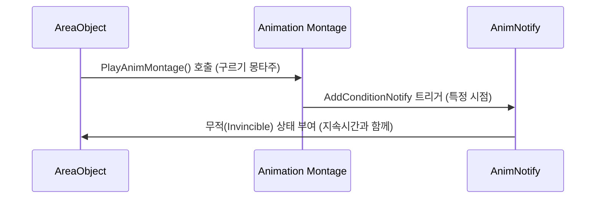

# 4.3. 애니메이션 시스템 (Animation System)

## 4.3.1. 설계 목표

Sonheim의 애니메이션 시스템은 단순히 캐릭터를 움직이게 하는 것을 넘어, **게임플레이 로직의 실행 타이밍과 효과를 정교하게 제어하는 '마스터 시계'** 역할을 하도록 설계되었습니다.

1.  **애니메이션 주도 로직 (Animation-Driven Logic):** 데미지 판정, 상태 이상 부여(예: 구르기 무적) 등 모든 핵심 이벤트는 코드의 타이머가 아닌, 애니메이션 타임라인에서 직접 발생하도록 설계하여 완벽한 시각적/논리적 동기화를 보장합니다.
2.  **궁극의 재사용성 (Ultimate Reusability):** 플레이어, 몬스터, 무기에 관계없이 단 하나의 `MeleeAttackNotifyState`로 모든 근접 공격을 처리하고, `AddConditionNotify`로 모든 상태 이상을 부여할 수 있는 범용적인 시스템을 구축합니다.
3.  **프레임 독립적인 안정성 (Frame-Rate Independence):** 빠른 애니메이션이나 저사양 환경의 프레임 드랍 상황에서도 데미지 판정이 누락되지 않는 안정적인 전투 시스템을 구축합니다.
4.  **코드 재사용성 (`UBaseAnimInstance`):** 플레이어와 몬스터 등 모든 캐릭터가 공유하는 `UBaseAnimInstance`에 공통 로직(속도, 공중 여부 등)을 구현하여 중복 코드를 제거하고 유지보수성을 높입니다.

---

## 4.3.2. 아키텍처: 로직과 애니메이션의 연동

기본적인 이동, 죽음 등은 **애니메이션 블루프린트**의 상태 머신이 담당하며, 공격이나 스킬처럼 복잡하고 코드 연동이 중요한 동작은 **애니메이션 몽타주**를 통해 실행됩니다. Sonheim 아키텍처의 핵심은, 이 몽타주에 커스텀 `AnimNotify` 또는 `AnimNotifyState`를 추가하여 게임플레이 이벤트를 직접 트리거하는 것입니다.



---

## 4.3.3. 핵심 구현: 애니메이션 주도 로직 (Animation-Driven Logic)

#### 1. 범용성을 극대화한 `MeleeAttackNotifyState`

이 Notify는 `UPROPERTY`를 통해 애니메이터가 판정의 거의 모든 것을 제어할 수 있도록 설계되었습니다. 판정의 형태(Sphere, Box), 위치(Socket), 보간 횟수까지 지정할 수 있어, 프로그래머의 개입 없이 아티스트가 공격 판정의 모든 디테일을 직접 디자인할 수 있습니다.

#### 2. 애니메이션으로 게임플레이 상태 부여 (`AddConditionNotify`)

`AddConditionNotify`는 `UAnimNotify`를 상속받아, 애니메이션의 특정 **시점**에 도달했을 때 캐릭터에게 지정된 상태 이상(Condition)을 부여하는 일회성 이벤트를 발생시킵니다. 예를 들어, 구르기 애니메이션의 시작 지점에 이 Notify를 추가하고 'Invincible(무적)' 상태와 지속시간(예: 0.5초)을 지정하면, 해당 시점부터 0.5초 동안 캐릭터가 무적이 됩니다.

```cpp
// AddConditionNotify.cpp (실제 코드)
void UAddConditionNotify::Notify(USkeletalMeshComponent* MeshComp, UAnimSequenceBase* Animation)
{
    if (MeshComp && MeshComp->GetOwner())
    {
        AAreaObject* owner = Cast<AAreaObject>(MeshComp->GetOwner());
        if (owner != nullptr)
        {
            // Notify가 호출된 시점에, 지정된 Condition을 DurationTime만큼 부여합니다.
            owner->AddCondition(Condition, DurationTime);
        }
    }
}
```

---

## 4.3.4. 구현 경험 및 트러블슈팅

#### 문제 1: 프레임 드랍으로 인한 판정 누락

*   **상황:** 캐릭터의 공격 애니메이션이 매우 빠르거나, 저사양 PC에서 프레임 드랍이 발생할 경우, 무기의 충돌체가 한 프레임 만에 적을 완전히 통과해버려 충돌이 감지되지 않는 현상이 발생했습니다.
*   **해결:** `AnimNotifyState`의 `NotifyTick` 함수를 활용하여 **프레임 보간(Frame Interpolation)** 로직을 구현했습니다. 매 `NotifyTick`마다 이전 프레임의 무기 위치와 현재 프레임의 위치 사이를 선형 보간(Lerp)하여 여러 개의 중간 지점을 계산하고, 각 지점 사이를 스윕 트레이스로 검사하도록 로직을 변경했습니다. 이를 통해 물리 엔진의 틱 간격보다 더 세밀하게 충돌을 감지하여, 프레임 드랍 상황에서도 판정 누락을 완벽하게 막을 수 있었습니다.

#### 문제 2: 리슨 서버에서 서버 캐릭터의 판정 누락

*   **상황:** 리슨 서버 환경에서, 서버 역할을 하는 플레이어의 카메라에서 멀리 떨어진 몬스터의 근접 공격 판정이 간헐적으로 발생하지 않는 문제를 발견했습니다.
*   **원인:** 언리얼 엔진의 렌더링 최적화 기능 때문이었습니다. 캐릭터가 카메라에 보이지 않으면, 엔진은 성능을 위해 해당 캐릭터의 애니메이션 실행 빈도를 줄이거나 완전히 멈춥니다 (`AnimInstance.bRecentlyRendered = false`). 서버 캐릭터 역시 이 최적화의 영향을 받아 애니메이션이 멈추면서, `AnimNotify`로 실행되던 공격 판정 로직 또한 누락된 것입니다.
*   **해결:** 서버에서 실행되는 캐릭터는 화면에 보이는지와 관계없이 항상 모든 로직을 정확하게 처리해야 합니다. 모든 캐릭터의 부모 클래스인 `AAreaObject`의 생성자에서, `SkeletalMeshComponent`의 애니메이션 틱 옵션을 다음과 같이 변경하여 이 문제를 해결했습니다.

    ```cpp
    // AreaObject.cpp
    GetMesh()->VisibilityBasedAnimTickOption = EVisibilityBasedAnimTickOption::AlwaysTickPoseAndRefreshBones;
    ```
    이 옵션은 캐릭터가 화면에 보이지 않더라도 항상 애니메이션 틱을 최대 빈도로 실행하고 본(Bone) 정보를 갱신하도록 강제하여, 서버 로직의 정확성을 보장합니다.

---

## 4.3.5. 관련 시스템

*   [6.2. 스킬 아키텍처](./6.2_Skill_Architecture.md)
*   [2.3. 어트리뷰트 및 스탯 시스템](./2.3_Attribute_And_Stat_System.md)
*   [5.1. FSM 기반 AI](./5.1_FSM_based_AI.md)
