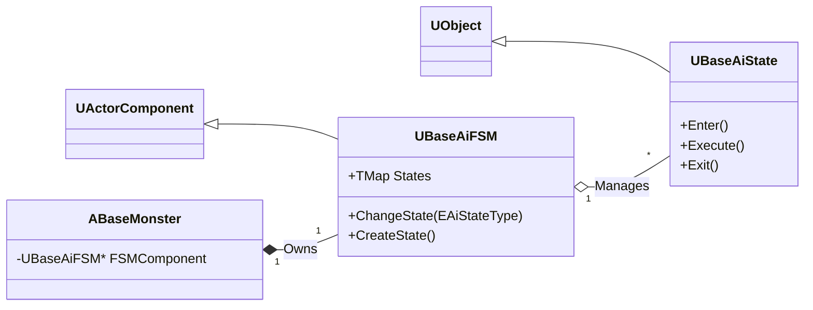

# 5.1. FSM 기반 AI (State Machine based AI)

## 5.1.1. 설계 목표

Sonheim의 몬스터 AI 시스템은 각 몬스터에게 고유한 개성을 부여하고, 예측 가능하면서도 상황에 맞는 지능적인 행동 패턴을 제공하는 것을 목표로 합니다.

1.  **재사용 가능한 프레임워크:** 특정 몬스터나 상태에 종속되지 않는, 범용적인 FSM(Finite State Machine, 유한 상태 머신) 프레임워크를 구축합니다.
2.  **쉬운 조립과 확장성:** 새로운 AI를 만들 때, 마치 레고 블록을 조립하듯 필요한 상태(State)들을 가져와 FSM을 쉽고 빠르게 구성하고 확장할 수 있어야 합니다.
3.  **서버 권위 및 일관성:** 모든 AI 로직은 서버에서만 실행되어 치트를 방지하고, 그 결과는 모든 클라이언트에게 일관되게 보여야 합니다.
4.  **명확한 상태 분리:** `Idle`, `Chase`, `Attack` 등 AI의 모든 가능한 상태를 명시적으로 분리하여, 복잡한 AI 로직을 이해하고 디버깅하기 쉽게 만듭니다.

---

## 5.1.2. 아키텍처: 빌더와 팩토리를 이용한 FSM 프레임워크

AI 시스템은 `ABaseMonster`에 부착되는 `UBaseAiFSM` 컴포넌트와, 이 FSM이 관리하는 여러 `UBaseAiState` UObject들로 구성됩니다. 특히, FSM을 구성하는 과정의 복잡성을 캡슐화하고 재사용성을 높이기 위해 **빌더(Builder) 패턴**과 **팩토리 메서드(Factory Method) 패턴**을 결합한 독자적인 프레임워크를 구축했습니다.



*   **`UBaseAiFSM` (Builder):** FSM을 구성하는 전체 프로세스와 상태를 추가하는 인터페이스(`AddState`)를 제공하는 빌더 클래스입니다.
*   **`UMonsterFSM`, `UFoxparksFSM` (Directors):** 빌더를 사용하여 실제로 FSM을 조립하는 구체적인 클래스입니다. `InitStatePool` 함수 내에서 `CreateState`를 반복적으로 호출하여 상태 객체를 생성하고 `AddState`로 FSM에 등록합니다.
*   **`CreateState<T>()` (Static Template Factory Method):** `UBaseAiState` 타입의 객체를 생성하는 정적 템플릿 팩토리 메서드입니다.
*   **`UBaseAiState`:** `Idle`, `Chase`, `Attack` 등 AI의 개별 상태를 나타내는 클래스입니다. 각 상태는 진입(`Enter`), 업데이트(`Execute`), 퇴장(`Exit`) 시의 고유한 로직을 가집니다.

---

## 5.1.3. 핵심 구현

#### 1. FSM 프레임워크: `CreateState<T>` 정적 템플릿 팩토리

`CreateState`는 `UBaseAiState`의 자식 클래스(`T`)를 받아 객체를 생성하고 초기화하는 정적 템플릿 헬퍼 함수입니다. FSM을 구성하는 구체적인 클래스(Director)는 이 함수를 사용하여 상태 객체를 만든 뒤, `AddState` 함수를 통해 FSM에 등록합니다. 이 과정을 통해 상태 객체 생성의 복잡성을 캡슐화합니다.

```cpp
// BaseAiFSM.h (실제 코드)
template <typename T>
static T* CreateState(UObject* Outer, ABaseMonster* Owner, EAiStateType NextState = EAiStateType::None,
                      EAiStateType SuccessState = EAiStateType::None, EAiStateType FailState = EAiStateType::None)
{
    static_assert(std::is_base_of_v<UBaseAiState, T>, "T must derive from UAiState");

    T* State = NewObject<T>(Outer, T::StaticClass());
    State->SetOwner(Owner);
    State->InitState();
    State->SetNextState(NextState);
    State->SetSuccessState(SuccessState);
    State->SetFailState(FailState);
    
    return State;
}
```

#### 2. FSM 실행: 상태의 생명주기 관리

`UBaseAiFSM`은 매 틱마다 현재 상태 객체의 `Execute` 함수를 호출하고, `ChangeState` 함수를 통해 상태를 전환하며 이전 상태의 `Exit`과 새 상태의 `Enter`를 호출합니다.

```cpp
// BaseAiFSM.cpp (실제 코드)
void UBaseAiFSM::TickComponent(float DeltaTime, ELevelTick TickType, FActorComponentTickFunction* ThisTickFunction)
{
    Super::TickComponent(DeltaTime, TickType, ThisTickFunction);

    // UpdateState 함수를 통해 현재 상태의 Execute 함수를 매 틱 호출
    UpdateState(DeltaTime);
}

void UBaseAiFSM::ChangeState(EAiStateType StateType)
{
    // ... (유효성 검사) ...

    // 이전 상태의 Exit 로직 실행
    if (m_CurrentState) m_CurrentState->Exit();

    m_PreviousState = m_CurrentState;
    m_CurrentState = m_AiStates.FindRef(StateType);
    CurrentStateType = StateType; // For Replication

    // 새 상태의 Enter 로직 실행
    if (m_CurrentState) m_CurrentState->Enter();
}
```

#### 3. FSM 동기화: `ReplicatedUsing`

서버에서 `ChangeState`가 호출되어 `CurrentStateType` 변수의 값이 변경되면, 이 변수는 `ReplicatedUsing`으로 지정되어 있어 클라이언트로 자동 복제됩니다. 복제가 완료된 클라이언트에서는 `OnRep_CurrentStateType` 함수가 자동으로 호출되어, 몬스터의 애니메이션 상태를 변경하는 등 서버의 FSM 상태와 클라이언트의 시각적 표현을 일관되게 동기화합니다.

---

## 5.1.4. 설계 결정 및 발전 방향

#### 왜 비헤이비어 트리 대신 커스텀 FSM을 선택했는가?

언리얼 엔진의 표준 AI 시스템인 비헤이비어 트리(BT)는 복잡하고 다양한 행동을 조합하기에 강력하지만, 특정 상황에서는 상태 흐름이 복잡해져 디버깅이 어려워지는 단점이 있습니다. 반면, FSM은 몬스터의 상태가 '평시 작업 모드', '전투 모드' 등 명확하게 구분되는 Sonheim의 기획에 더 적합하다고 판단했습니다. 특히, 빌더와 팩토리 패턴을 적용하여 FSM 프레임워크를 직접 구축함으로써, **AI를 구성하는 과정 자체를 프로그래밍**할 수 있게 되어 더 높은 수준의 추상화와 재사용성을 확보할 수 있었습니다.

#### 발전 방향

*   **환경 질의 시스템 (EQS - Environment Query System) 도입:** 현재 AI는 '가장 가까운 적'을 찾는 등 비교적 단순하게 타겟을 결정합니다. EQS를 도입하면, "플레이어로부터 가장 멀리 떨어져 있으면서, 시야에 보이지 않는 엄폐 지점"을 찾는 등 훨씬 더 지능적인 의사결정을 내릴 수 있습니다.
*   **AI 인식 시스템 (AIPerception) 적용:** 현재 AI는 주기적인 탐색으로 적을 인지합니다. `AIPerceptionComponent`를 도입하면, 플레이어가 몬스터의 시야각에 들어왔을 때만 '시각'으로 인지하고, 시야 밖에서 뛰는 소리를 내면 '청각'으로 인지하는 등 더 정교하고 현실감 있는 상호작용을 구현할 수 있습니다.

---

## 5.1.5. 관련 시스템

*   [5.2. 파트너 AI](./5.2_Partner_AI.md)
*   [6.2. 스킬 아키텍처](./6.2_Skill_Architecture.md)
*   [2.2. 컴포넌트 기반 설계](./2.2_Component_Based_Design.md)
