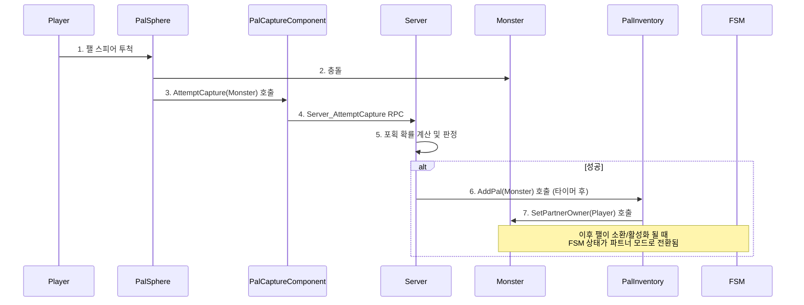

# 5.2. 파트너 AI (Partner AI)

## 5.2.1. 설계 목표

파트너 AI는 야생 몬스터 AI와는 근본적으로 다른 목표를 가집니다. 플레이어와의 상호작용을 중심으로, 충실한 동료로서의 역할을 수행하도록 설계되었습니다.

1.  **역할의 명확한 분리:** 몬스터가 야생 상태일 때의 행동 로직과 플레이어의 파트너일 때의 행동 로직을 FSM 모드 전환을 통해 완전히 분리하여, 서로에게 영향을 주지 않도록 설계합니다.
2.  **플레이어 중심 행동:** 파트너는 항상 플레이어(Master)를 중심으로 행동해야 합니다. 평소에는 플레이어를 따라다니고, 전투 시에는 플레이어의 타겟을 우선적으로 공격하며, 플레이어의 명령에 따라 특수 스킬을 사용해야 합니다.
3.  **서버 권위의 안전한 포획:** 몬스터 포획의 성공/실패 여부는 전적으로 서버에서만 판정되며, 포획 과정 중인 몬스터는 다른 상호작용으로부터 안전하게 보호되어야 합니다.
4.  **명확한 피드백:** 플레이어는 포획 시도 시, 대상의 포획률과 포획 과정을 UI와 시각 효과를 통해 명확하게 인지할 수 있어야 합니다.

---

## 5.2.2. 아키텍처: 포획에서 파트너까지의 완전한 생명주기

몬스터가 플레이어의 파트너가 되는 과정은 포획, 관리, 소환, 행동 전환의 명확한 단계를 거칩니다.



1.  **포획 시도 (`PalSphere`):** 플레이어가 던진 `APalSphere`가 몬스터와 충돌하면, `PalSphere`는 자신을 던진 플레이어의 `UPalCaptureComponent`를 찾아 `AttemptCapture` 함수를 호출합니다.
2.  **포획 판정 (Server):** `UPalCaptureComponent`는 `Server_AttemptCapture` RPC를 통해 서버에 포획을 요청합니다. 서버는 대상의 HP 등을 기반으로 포획 확률을 계산하고, 성공/실패를 판정합니다.
3.  **인벤토리 저장 (`UPalInventoryComponent`):** 포획 연출이 끝나고 최종적으로 성공 판정이 나면, 서버는 플레이어의 `UPalInventoryComponent`에 `AddPal` 함수를 호출하여 몬스터의 데이터를 저장합니다.
4.  **파트너 설정 및 AI 모드 전환:** `AddPal` 함수 내부에서, 포획된 몬스터의 `SetPartnerOwner` 함수가 호출되어 소유권을 설정합니다. 이후 플레이어가 해당 몬스터를 월드에 소환하여 `ActivateMonster` 함수가 호출되면, FSM은 `ChangeState(EAiStateType::SelectMode)`를 통해 파트너로서 행동을 시작할 상태로 전환됩니다.

---

## 5.2.3. 핵심 구현

#### 1. 안전한 포획 프로세스 (동시성 제어)

여러 플레이어가 동시에 한 몬스터를 포획하려는 시도를 막기 위해, **상태 잠금(State Locking)** 과 **상태 면역(State Immunity)** 을 사용합니다.

1.  **상태 잠금:** `PalCaptureComponent`는 포획을 시도하기 전, 대상 몬스터의 `CanCapture()` 함수를 확인합니다. 이 함수는 몬스터가 이미 다른 주인을 가지고 있거나, 죽었거나, 다른 포획 시도가 진행 중인 상태(`Hidden`)인지를 확인하여 중복 요청을 차단합니다.
2.  **상태 면역:** 포획이 시작되면, 대상 몬스터에게 `Hidden` 상태(`EConditionBitsType::Hidden`)를 부여합니다. `CanAttack`와 같은 모든 상호작용 조건 함수들은 이 `Hidden` 상태를 가장 먼저 확인하여, 포획 연출이 진행되는 동안 몬스터가 다른 플레이어의 공격 등 외부 요인에 의해 방해받지 않도록 보장합니다.

#### 2. AI 모드 전환

몬스터의 소유권은 포획 성공 시 `SetPartnerOwner` 함수를 통해 설정됩니다. 이후 플레이어가 해당 몬스터를 월드에 소환하여 `ActivateMonster` 함수를 호출하면, FSM은 `SelectMode` 상태로 진입하여 스스로 파트너 모드로 행동을 시작합니다.

```cpp
// BaseMonster.cpp - 몬스터의 주인을 설정하는 함수
void ABaseMonster::SetPartnerOwner(ASonheimPlayer* NewOwner)
{
    // 몬스터의 주인을 새로운 플레이어로 설정합니다.
    PartnerOwner = NewOwner;
    // 파트너가 되었을 때의 추가 로직 (예: 체력 회복)
    IncreaseHP(10000);
    StatusWidget->SetPartnerPalHPWidget();
}

// BaseMonster.cpp - 몬스터 활성화 시 AI 상태 전환
void ABaseMonster::ActivateMonster()
{
    // FSM의 상태를 'SelectMode'로 변경하여,
    // 주인(PartnerOwner)의 존재 여부에 따라 야생/파트너 모드를 스스로 결정하게 합니다.
    m_AiFSM->ChangeState(EAiStateType::SelectMode);
    
    // ... 기타 활성화 로직 ...
}
```

`SelectMode` 상태는 몬스터에게 `PartnerOwner`가 할당되어 있는지 확인하고, 주인이 있다면 `PartnerPatrol`과 같은 파트너 전용 상태로, 주인이 없다면 `Idle`과 같은 야생 상태로 전환하는 분기점 역할을 합니다.

#### 3. 플레이어 중심 행동

파트너 전용 상태는 야생 상태와 로직이 완전히 다릅니다. 예를 들어, `UPartnerPatrolMode`는 무작위 지점을 순찰하는 대신, 매 틱마다 주인(Master)과의 거리를 확인하여 일정 거리 이상 멀어지면 주인에게 달려가도록 구현되어 있습니다.

---

## 5.2.4. 설계 결정: FSM 모드 전환 vs FSM 교체

파트너 AI를 구현할 때, `ABaseMonster`가 가진 FSM 컴포넌트 자체를 `WildFSM`에서 `PartnerFSM`으로 완전히 교체하는 방식도 고려했습니다. 하지만 이 방식은 FSM을 교체할 때마다 상태를 다시 생성하고 초기화해야 하는 비용이 발생하며, 두 FSM 간에 공유되는 상태(예: '피격' 상태)가 있다면 코드 중복이 발생할 수 있었습니다.

따라서, **하나의 FSM이 여러 행동 모드(Wild, Partner)를 가질 수 있도록 설계**하고, `ChangeState`를 통해 진입점만 변경하는 현재의 방식을 선택했습니다. 이는 FSM 교체 비용 없이 유연하게 행동 패턴을 전환할 수 있으며, 공통 상태를 재사용할 수 있어 더 효율적이고 확장성이 높은 구조입니다.

---

## 5.2.5. 관련 시스템

*   [5.1. FSM 기반 AI](./5.1_FSM_based_AI.md)
*   [4.2. 네트워크 캐릭터 컨트롤](./4.2_Networked_Character_Control.md)
*   [7.2. 제작 및 자원 수명 주기](./7.2_Crafting_and_Resource_Lifecycle.md)
