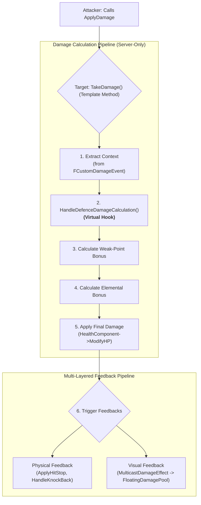

# 6.1. 전투 및 피드백 시스템

## 6.1.1. 설계 목표

Sonheim의 전투는 단순히 공격하고 체력을 깎는 것을 넘어, 플레이어가 적의 속성과 약점을 파악하고 그에 맞는 전략을 사용하도록 유도합니다. 이를 위해 다음 목표를 가지고 시스템을 설계했습니다.

1.  **전략적 깊이:** 9가지 원소 속성 간의 상성 관계와 약점 부위 공격을 도입하여, 플레이어가 적을 분석하고 유리한 스킬을 선택하는 전략적인 재미를 제공합니다.
2.  **명확하고 즉각적인 피드백:** 플레이어의 전략적인 선택이 어떤 결과를 가져왔는지(상성, 약점 공격 등) **물리적 피드백(히트스톱, 넉백)**과 **시각적 피드백(플로팅 데미지 UI)**을 통해 즉각적이고 명확하게 알려주어, 플레이어가 자신의 판단이 옳았음을 인지하고 학습하게 합니다.
3.  **서버 권위의 공정한 판정:** 모든 공격 판정과 데미지 계산은 전적으로 서버에서만 수행하여, 치트를 방지하고 모든 플레이어에게 공정한 전투 환경을 제공합니다.
4.  **유연한 확장성 및 유지보수:** **템플릿 메서드 패턴**을 적용하여, 전투 로직(데미지 계산)과 피드백(이펙트, UI)을 분리하고, 다양한 객체의 피격 반응을 쉽게 확장할 수 있는 유연한 구조를 구축합니다.

---

## 6.1.2. 아키텍처: 템플릿 메서드 패턴 기반 피해 처리 파이프라인

모든 전투 상호작용은 `TakeDamage`라는 단일 함수를 통해 시작됩니다. 이 함수는 **템플릿 메서드 패턴**에 따라 피해 처리의 전체적인 **알고리즘 뼈대(Skeleton)**를 제공하고, 그 과정에서 호출되는 세부 로직들을 작은 가상 함수(Hook)로 분리합니다. 이를 통해 자식 클래스는 전체 알고리즘을 건드리지 않고, 자신이 변경하고 싶은 특정 단계만 재정의하여 반응을 커스터마이징할 수 있습니다.



---

## 6.1.3. 핵심 구현

#### 1. 데미지 처리 파이프라인 (`TakeDamage` - 템플릿 메서드)

서버의 `AAreaObject::TakeDamage` 함수는 전투의 모든 변수를 종합하여 최종 데미지를 결정하는 핵심 로직이자 **템플릿 메서드**입니다. 이 함수는 단순한 피해량 외에도, 공격의 속성, 넉백 강도, 히트스톱 유무 등 풍부한 컨텍스트 정보를 담은 `FCustomDamageEvent`를 받아 순차적으로 데미지를 계산하는 알고리즘의 뼈대를 정의합니다.

> [View on GitHub](https://github.com/chungheonLee0325/Sonheim/blob/main/Sonheim/Source/Sonheim/AreaObject/Base/AreaObject.cpp#L352)
```cpp
// Source/Sonheim/AreaObject/Base/AreaObject.cpp
float AAreaObject::TakeDamage(float Damage, const FDamageEvent& DamageEvent, ...)
{
    if (!HasAuthority() || bIsDead) return 0.0f; // 서버 권위 및 생존 여부 확인

    // 1. FCustomDamageEvent로부터 풍부한 컨텍스트 정보 추출
    FAttackData attackData;
    if (DamageEvent.IsOfType(FCustomDamageEvent::ClassID)) { /* ... */ }

    // 2. 방어력 계산 (자식 클래스가 재정의할 수 있는 Hook)
    float ActualDamage = HandleDefenceDamageCalculation(Damage);
    
    // 3. 약점 판정 및 보너스 적용
    bool bIsWeakPointHit = IsWeakPointHit(hitResult.Location);
    ActualDamage = bIsWeakPointHit ? ActualDamage * 1.5f : ActualDamage;

    // 4. 속성 상성 계산 및 보너스 적용
    float elementDamageMultiplier = 1.0f;
    for (auto defectElementalAttribute : dt_AreaObject->DefenceElementalAttributes)
    {
        elementDamageMultiplier *= USonheimUtility::CalculateDamageMultiplier(...);
    }
    ActualDamage *= elementDamageMultiplier;

    // 5. 최종 데미지로 HP 차감
    float CurrentHP = DecreaseHP(ActualDamage);

    // 6. 물리적/시각적 피드백 요청
    if (attackData.bEnableHitStop) ApplyHitStop(attackData.HitStopDuration);
    HandleKnockBack(DamageCauser->GetActorLocation(), attackData, m_KnockBackForceMultiplier);
    MulticastDamageEffect(ActualDamage, ..., bIsWeakPointHit, elementDamageMultiplier, attackData);

    return ActualDamage;
}
```

`HandleDefenceDamageCalculation`와 같은 가상 함수는 자식 클래스가 재정의할 수 있는 **Hook** 역할을 합니다. 예를 들어 `ABaseMonster`는 기본 방어력 계산을 수행하지만, `ABaseResourceObject`는 이 함수를 재정의하여 '약점 속성'에 따른 데미지 증폭 로직을 구현합니다.

> [View on GitHub](https://github.com/chungheonLee0325/Sonheim/blob/main/Sonheim/Source/Sonheim/AreaObject/Base/AreaObject.h#L170)
```cpp
// Source/Sonheim/AreaObject/Base/AreaObject.h
virtual float HandleDefenceDamageCalculation(float Damage);
```

#### 2. 데이터 기반 속성 상성 시스템

`TakeDamage` 파이프라인의 4단계에서 호출되는 `USonheimUtility::CalculateDamageMultiplier` 함수는, 중앙 유틸리티 클래스에 하드코딩된 `static const` 2차원 배열을 통해 9가지 원소 속성 간의 상성 관계를 계산합니다. 이 방식은 데이터 테이블을 사용하는 것보다 유연성은 떨어지지만, 게임의 핵심 규칙인 상성 관계가 개발 과정에서 임의로 변경되는 것을 방지하고, 런타임에 파일을 읽는 대신 컴파일 타임에 데이터가 확정되므로 미세한 성능상의 이점을 가집니다.

> [View on GitHub](https://github.com/chungheonLee0325/Sonheim/blob/main/Sonheim/Source/Sonheim/Utilities/SonheimUtility.cpp#L41)
```cpp
// Source/Sonheim/Utilities/SonheimUtility.cpp
// [방어 속성][공격 속성] 순서의 9x9 데미지 배율 테이블
static const float DamageMultiplierTable[9][9] = {
    //   Grass   Fire  Water Electric Ground  Ice   Dragon  Dark  Neutral
    {  1.0f,  2.0f,  1.0f,  1.0f,   0.5f,  1.0f,  1.0f,  1.0f,  1.0f  }, // Grass
    {  0.5f,  1.0f,  2.0f,  1.0f,   1.0f,  0.5f,  1.0f,  1.0f,  1.0f  }, // Fire
    {  1.0f,  0.5f,  1.0f,  2.0f,   1.0f,  1.0f,  1.0f,  1.0f,  1.0f  }, // Water
    {  1.0f,  1.0f,  0.5f,  1.0f,   2.0f,  1.0f,  1.0f,  1.0f,  1.0f  }, // Electric
    {  2.0f,  1.0f,  1.0f,  0.5f,   1.0f,  1.0f,  1.0f,  1.0f,  1.0f  }, // Ground
    {  1.0f,  2.0f,  1.0f,  1.0f,   1.0f,  1.0f,  0.5f,  1.0f,  1.0f  }, // Ice
    {  1.0f,  1.0f,  1.0f,  1.0f,   1.0f,  2.0f,  1.0f,  0.5f,  1.0f  }, // Dragon
    {  1.0f,  1.0f,  1.0f,  1.0f,   1.0f,  1.0f,  2.0f,  1.0f,  0.5f  }, // Dark
    {  1.0f,  1.0f,  1.0f,  1.0f,   1.0f,  1.0f,  1.0f,  2.0f,  1.0f  }  // Neutral
};
```

#### 3. 다층적 피드백 시스템

`TakeDamage` 함수는 데미지 계산이 끝난 후, 여러 피드백 시스템에 계산된 결과와 컨텍스트 정보를 전달하여 '표현'을 요청합니다.

*   **물리적 피드백 (타격감):**
    *   **히트스톱 (Hit Stop):** `ApplyHitStop` 함수는 `UGameplayStatics::SetGlobalTimeDilation`을 호출하여 짧은 시간 동안 월드의 시간을 느리게 만들어, 공격이 명중했을 때 묵직한 타격감을 연출합니다.
    *   **넉백 (Knockback):** `HandleKnockBack` 함수는 공격 데이터에 정의된 `KnockBackForce`와 방향을 기반으로, 피격된 캐릭터를 뒤로 밀어내는 물리적 반응을 생성합니다.

*   **시각적 피드백 (정보 전달):**
    *   `MulticastDamageEffect` RPC는 최종 데미지, 약점 여부, 속성 상성 배율 등의 정보를 모든 클라이언트에게 전파합니다.
    *   각 클라이언트는 이 정보를 받아 `AFloatingDamagePool`에 데미지 숫자 표시를 요청합니다.
    *   `UFloatingDamageWidget`은 전달받은 컨텍스트 정보에 따라, 데미지 숫자의 색상(상성), 크기, 외곽선(약점) 등을 동적으로 변경하여 플레이어에게 명확한 전략적 피드백을 제공합니다. (참고: [8.2. UI 위젯 오브젝트 풀링](./8.2_UI_Widget_Object_Pooling.md))

---

## 6.1.4. 설계 결정: 템플릿 메서드 패턴의 이점

`TakeDamage` 파이프라인에 템플릿 메서드 패턴을 적용한 것은 다음과 같은 중요한 설계적 이점을 제공합니다.

*   **높은 응집도, 낮은 결합도 (High Cohesion, Loose Coupling):**
    *   **로직과 표현의 분리:** 전투 로직(`TakeDamage`)과 피드백 표현(히트스톱, 넉백, UI)이 완벽하게 분리되어 있습니다. 덕분에 플로팅 데미지의 디자인을 변경하거나 새로운 피드백(예: 화면 흔들림)을 추가하더라도, 핵심 데미지 계산 코드는 전혀 수정할 필요가 없습니다.
    *   **공격자와 피격자의 분리:** 공격자는 `ApplyDamage`를 호출할 뿐, 피격자가 누구인지, 어떻게 반응할지 전혀 알 필요가 없습니다. 피격자는 자신의 반응을 스스로 책임지므로, 각 객체의 역할이 명확하고 서로에 대한 의존성이 매우 낮습니다.

*   **유연한 확장성 (Flexible Scalability):** 새로운 종류의 피격 가능 객체(예: 때리면 폭발하는 상자)를 추가할 때, 개발자는 `TakeDamage`라는 복잡한 알고리즘 전체를 새로 작성할 필요가 없습니다. `AAreaObject`를 상속받고 `HandleDefenceDamageCalculation`과 같은 작은 가상 함수(Hook) 몇 개만 재정의하여 원하는 행동을 손쉽게 커스터마이징할 수 있습니다. 예를 들어 `ABaseResourceObject`는 이 방식을 통해 '방어력' 대신 '자원 채집 효율'을 계산하는 전혀 다른 로직을 수행합니다.

*   **안정적인 프레임워크:** 부모 클래스(`AAreaObject`)가 전체 알고리즘의 뼈대를 안정적으로 잡아주므로, 자식 클래스의 구현 실수가 전체 시스템에 미치는 영향을 최소화하고, 코드의 일관성을 유지할 수 있습니다.

*   **명확하고 즉각적인 피드백:** 플레이어는 데미지 숫자의 색상과 스타일, 그리고 캐릭터의 물리적 반응을 통해 자신의 공격이 왜 효과적이었는지(또는 아니었는지) 즉시 파악하고, 다음 행동을 위한 전략적인 판단을 내릴 수 있습니다.

---

## 6.1.5. 관련 시스템

*   [4.3. 애니메이션 주도 게임플레이](./4.3_Animation_System.md)
*   [2.3. 어트리뷰트 및 스탯 시스템](./2.3_Attribute_And_Stat_System.md)
*   [8.2. UI 위젯 오브젝트 풀링](./8.2_UI_Widget_Object_Pooling.md)
