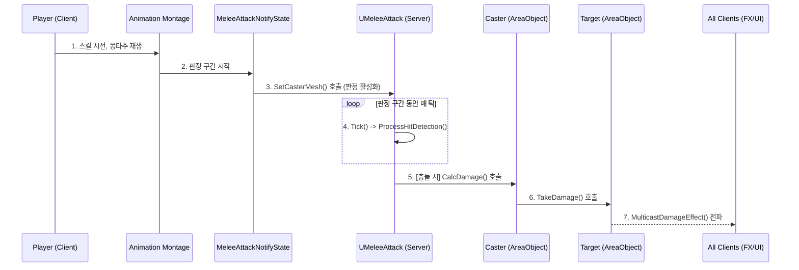

# 6.1. 전투 및 피드백 시스템 (Combat & Feedback System)

## 6.1.1. 설계 목표

Sonheim의 전투는 단순히 공격하고 체력을 깎는 것을 넘어, 플레이어가 적의 속성과 약점을 파악하고 그에 맞는 전략을 사용하도록 유도합니다. 이를 위해 다음 목표를 가지고 시스템을 설계했습니다.

1.  **전략적 깊이:** 9가지 원소 속성 간의 상성 관계를 도입하여, 플레이어가 적의 속성을 파악하고 유리한 스킬을 선택하는 전략적인 재미를 제공합니다.
2.  **명확하고 즉각적인 피드백:** 플레이어의 전략적인 선택이 어떤 결과를 가져왔는지(상성, 약점 공격 등) 플로팅 데미지 UI의 색상과 스타일 변화를 통해 즉각적이고 명확하게 알려줍니다.
3.  **서버 권위의 공정한 판정:** 모든 공격 판정(Hit Detection)과 데미지 계산은 전적으로 서버에서만 수행하여, 치트를 방지하고 모든 플레이어에게 공정한 전투 환경을 제공합니다.
4.  **데이터 주도 확장성:** 스킬의 모든 요소를 데이터 테이블 기반으로 구동하여, 기획자가 코드 변경 없이 데이터 수정만으로 새로운 스킬을 창조하거나 밸런스를 조정할 수 있도록 합니다.

---

## 6.1.2. 아키텍처: 전투 및 스킬 파이프라인

전투 시스템은 플레이어의 입력으로부터 시작하여, 서버의 판정을 거쳐 모든 클라이언트에게 시각적 피드백이 전파되는 명확한 파이프라인 구조를 가집니다.

1.  **[Client]** 플레이어가 공격을 입력하면, 관련 스킬이 활성화되고 애니메이션 몽타주가 재생됩니다.
2.  **[Server]** 몽타주의 특정 구간에 삽입된 `MeleeAttackNotifyState`가 시작되면, `NotifyBegin` 함수가 호출됩니다.
3.  **[Server]** `NotifyBegin`은 현재 활성화된 스킬 객체(`UMeleeAttack`)를 찾아, 충돌 검사를 시작하도록 알립니다.
4.  **[Server]** `UMeleeAttack` 스킬은 `NotifyState`가 활성화된 동안 매 `Tick`마다 충돌 검사(`ProcessHitDetection`)를 수행합니다.
5.  **[Server]** 충돌이 감지되면, `UMeleeAttack`은 스킬을 시전한 `Caster`(캐릭터)의 `CalcDamage` 함수를 호출합니다.
6.  **[Server]** `CalcDamage` 함수는 `FAttackData`, 캐릭터 스탯, 속성 상성 등을 종합하여 최종 데미지를 계산하고, `Target`의 `TakeDamage` 함수를 호출하여 체력을 변경합니다.
7.  **[Server → All Clients]** `Target`은 `MulticastDamageEffect` RPC를 호출하여, 모든 클라이언트에게 데미지 수치, 피격 위치, 상성 결과 등 풍부한 피드백 정보를 담아 전파합니다.

---

## 6.1.3. 핵심 구현

#### 1. 데이터 주도 스킬 정의 (`FSkillData`)

모든 스킬의 핵심 속성은 `FSkillData`라는 데이터 테이블에 정의됩니다. 여기에는 기본 데미지, 공격 속성, 쿨다운뿐만 아니라, 해당 스킬의 실제 로직을 담고 있는 C++ 클래스(`SkillClass`)의 경로까지 포함됩니다. 이를 통해 기획자는 코드 변경 없이 데이터 수정만으로 스킬의 거의 모든 것을 변경하거나 새로 만들 수 있습니다.

#### 2. 서버 측 판정 (Hit Detection)

모든 공격 판정은 서버에서만 수행됩니다. 근접 공격의 경우, `MeleeAttackNotifyState`가 활성화된 동안 `UMeleeAttack` 스킬이 매 틱마다 이전 프레임과 현재 프레임의 무기 위치를 **선형 보간(Linear Interpolation)**하여 그 사이를 스윕 트레이스로 검사합니다. 이를 통해 프레임 드랍 상황에서도 판정이 누락되는 것을 방지하여 정확성을 확보합니다.

#### 3. 서버 권위 데미지 계산

서버의 `AAreaObject::CalcDamage` 함수는 전투의 모든 변수를 종합하여 최종 데미지를 결정하는 핵심 로직입니다. 이 과정에서 `SonheimUtility::CalculateDamageMultiplier` 함수를 호출하여 9x9 속성 상성 테이블에 따른 데미지 배율을 적용합니다.

#### 4. 풍부한 시각적 피드백 (`FloatingDamageWidget`)

`MulticastDamageEffect` RPC를 통해 전달받은 정보로 `UFloatingDamageWidget`의 스타일을 동적으로 변경하여, 플레이어에게 풍부하고 직관적인 피드백을 제공합니다.

*   **텍스트 색상 (속성 상성):** 유리하면 밝은 빨강, 불리하면 회색으로 표시됩니다.
*   **외곽선 색상 (약점/치명타):** 약점 공격은 주황색, 치명타는 빨간색 외곽선으로 표시됩니다.

---

## 6.1.4. 구현 경험 및 개선점

#### 반응성 향상을 위한 클라이언트 예측

*   **한계:** 완전한 서버 권위 모델은 네트워크 지연 시 타격감이 저하될 수 있습니다.
*   **개선 방안:** 실제 데미지는 서버에서 처리하되, **시각적인 피격 효과(Cosmetic Effect)만 클라이언트에서 예측하여 즉시 재생**하는 하이브리드 모델을 도입할 수 있습니다. 공격자의 클라이언트가 예측 판정에 성공하면, 실제 데미지 없이 장식용 피격 이펙트만 즉시 재생하여 즉각적인 타격감을 제공하고, 이후 서버의 공식 결과를 받아 다시 한번 동기화합니다.

#### Hit Stop(경직) 효과의 동기화 문제

*   **문제:** 타격감을 극대화하는 Hit Stop 효과는 멀티플레이 환경에서 동기화가 매우 까다롭습니다.
*   **해결 방안:** 하이브리드 방식을 사용합니다. 공격자는 명중 예측 시 자신에게만 즉시 Hit Stop을 적용하여 타격감을 얻고, 서버는 명중 판정 후 `Multicast` RPC를 통해 모든 클라이언트에게 "Hit Stop을 시작하라"고 명령합니다. 그리고 서버와 모든 클라이언트는 동일한 시간 후에 애니메이션 속도를 원래대로 되돌리는 타이머를 각각 설정하여, 경직의 시작과 끝 시점을 거의 일치시켜 동기화 문제를 최소화합니다.

---

## 6.1.5. 관련 시스템

*   [4.3. 애니메이션 시스템](./4.3_Animation_System.md)
*   [2.3. 어트리뷰트 및 스탯 시스템](./2.3_Attribute_And_Stat_System.md)
*   [3.1. 서버 권한 아키텍처](./3.1_Server_Authority_Architecture.md)
