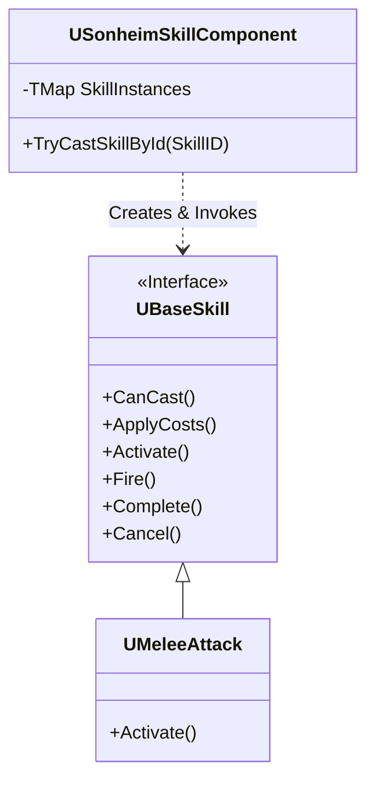

# 6.2. 스킬 아키텍처: 커맨드 패턴을 이용한 행동의 객체화

## 6.2.1. 설계 목표: 왜 모든 행동을 '스킬'로 만들었는가?

게임에는 기본 공격, 구르기, 아이템 사용, 몬스터의 돌진 등 수많은 '행동'이 존재합니다. 만약 이 모든 행동의 로직을 각자 다른 클래스(`Player`, `MonsterA`, `MonsterB`...)에 하드코딩한다면, 비슷한 행동(예: 플레이어의 구르기와 몬스터의 회피)의 코드가 중복되고, 새로운 행동을 추가할 때마다 수많은 파일을 수정해야 하는 유지보수의 악몽이 시작됩니다.

Sonheim의 스킬 시스템은 이러한 문제를 해결하기 위해, **커맨드 패턴(Command Pattern)**을 활용하여 모든 행동을 **'스킬'이라는 독립적인 '명령 객체'로 캡슐화**하는 것을 목표로 합니다.

1.  **행동의 객체화:** 모든 행동을 `UBaseSkill`이라는 공통 인터페이스를 가진 객체로 추상화하여, "누가" 사용하는지와 관계없이 "어떤 행동"인지에만 집중할 수 있도록 합니다.
2.  **궁극의 재사용성:** 플레이어의 '구르기' 스킬과 몬스터의 '회피' 스킬이 동일한 스킬 클래스를 공유하도록 하여, 코드 중복을 원천적으로 방지합니다.
3.  **데이터 기반 확장성:** 새로운 행동을 추가할 때, `UBaseSkill`을 상속받는 새로운 클래스를 만들고 데이터 테이블에 등록하는 것만으로 시스템을 확장할 수 있도록 합니다.

---

## 6.2.2. 아키텍처: 커맨드 패턴(Command Pattern)

스킬 시스템은 커맨드 패턴의 표준적인 구성요소를 따릅니다. `USonheimSkillComponent`는 명령을 호출하는 `Invoker`이자 스킬을 관리하는 `Client`의 역할을, `UBaseSkill`은 모든 명령의 공통 인터페이스인 `Command`, 그리고 `UMeleeAttack`과 같은 구체적인 스킬 클래스들은 `ConcreteCommand` 역할을 합니다.



---

## 6.2.3. 코드 심층 분석: `UBaseSkill`의 생명주기와 비용 처리

#### 1. `UBaseSkill`: 표준화된 생명주기 프레임워크

모든 스킬의 부모 클래스인 `UBaseSkill`은 모든 파생 스킬이 따라야 할 **표준화된 생명주기(Lifecycle)** 와 **비용 처리(Cost Handling)** 규칙을 제공하는 기반 프레임워크입니다.

*   **`CanCast()`:** 스킬 시전에 필요한 모든 조건을 확인합니다. 데이터 테이블에 정의된 비용 구조체를 읽어, 스태미나가 충분한지, 필요한 아이템을 소지하고 있는지, 그리고 쿨다운이 완료되었는지 등을 종합적으로 검사합니다.
*   **`Activate()`:** 스킬의 실제 로직이 시작되는 진입점입니다. 이 단계에서 `ApplyCosts(OnActivate)`를 호출하여 **시전 비용**을 소모하고, 애니메이션 재생 등 핵심 동작을 시작합니다.
*   **`Fire()`:** 스킬의 핵심 이벤트가 발생하는 시점입니다. (예: 투사체 발사) 이 단계에서도 `ApplyCosts(OnFire)`를 호출하여 **발사 비용**을 추가로 소모할 수 있습니다.
*   **`Complete()`:** 스킬의 모든 로직이 성공적으로 완료되었을 때 호출됩니다. 이 단계 역시 `ApplyCosts(OnComplete)`를 통해 **완료 비용**을 소모할 수 있습니다.
*   **`Cancel()`:** 피격, 다른 스킬 사용 등 외부 요인에 의해 스킬이 중단될 때 호출됩니다. 진행 중이던 로직을 안전하게 정리하고 스킬을 종료시킵니다.

#### 2. 설계 결정: 단계별 비용 소모와 원자적 환불(Atomic Refund)

Sonheim의 스킬 시스템은 `ESkillCostPhase`라는 열거형을 통해, 스킬 비용을 `OnActivate`, `OnFire`, `OnComplete`라는 각기 다른 단계에 나누어 소모할 수 있는 정교한 구조를 가집니다. 비용 소모의 핵심 로직은 `ApplyCosts` 메서드에 구현되어 있습니다.

> [View on GitHub](https://github.com/chungheonLee0325/Sonheim/blob/main/Sonheim/Source/Sonheim/AreaObject/Skill/Base/BaseSkill.cpp#L340)
```cpp
// Source/Sonheim/AreaObject/Skill/Base/BaseSkill.cpp
bool UBaseSkill::ApplyCosts(AAreaObject* Caster, ESkillCostPhase Phase)
{
    // ...

    // 아이템 소모 로직
    TArray<TPair<int32, int32>> consumed;
    for (const FSkillItemCost& C : m_SkillData->ItemCosts)
    {
        if (C.Phase != Phase) continue;
        // ...
        if (ItemID <= 0 || !Inv || !Inv->RemoveItem(ItemID, C.Count))
        {
            // 실패 시, 지금까지 소모한 것들을 모두 환불
            for (const auto& P : consumed) Inv->AddItem(P.Key, P.Value, false);
            return false;
        }
        // 성공 시, 소모 목록에 기록
        consumed.Emplace(ItemID, C.Count);
    }

    return true;
}
```

이 설계의 핵심적인 두 가지 결정은 다음과 같습니다.

*   **원자적 트랜잭션(Atomic Transaction):** `ApplyCosts` 함수는 특정 단계(`Phase`)의 비용 소모를 **하나의 원자적 트랜잭션**으로 처리합니다. 예를 들어, `OnActivate` 단계에서 아이템 A 1개와 아이템 B 1개를 소모해야 하는데, A는 성공했지만 B가 부족하여 실패할 경우, `ApplyCosts` 함수는 **즉시 이전에 소모했던 아이템 A를 플레이어의 인벤토리에 다시 추가하여 롤백**합니다. 이는 비용 소모 과정의 데이터 정합성을 완벽하게 보장합니다.

*   **취소 시 환불 불가 정책:** 스킬이 일단 특정 단계의 `ApplyCosts`를 성공적으로 통과한 후, 다음 단계로 넘어가기 전에 외부 요인에 의해 `Cancel`될 경우, **이전에 소모된 비용은 환불되지 않습니다.** 이는 스킬 사용이라는 '결단'에 무게를 싣고, 플레이어가 스킬을 함부로 난사 후 취소하여 이득을 보는 행위를 방지하는 중요한 게임플레이적 결정입니다.

이처럼, Sonheim의 스킬 시스템은 원자적 환불을 통해 데이터 무결성을 확보하는 동시에, 의도적인 환불 불가 정책을 통해 깊이 있는 게임플레이를 유도하는 정교한 설계를 갖추고 있습니다.

#### 3. `USonheimSkillComponent`: 중앙 관리자 및 실행자

`USonheimSkillComponent`는 `AAreaObject`에 부착되어, 스킬의 생성부터 실행까지 모든 과정을 책임지는 **중앙 관리자(Central Manager)**입니다.

*   **역할 1: 스킬 객체 생성 및 소유 (Factory & Owner)**
    `BeginPlay` 시점에, 컴포넌트는 캐릭터의 데이터에 명시된 모든 스킬 클래스(`TSubclassOf<UBaseSkill>`)를 순회하며 실제 스킬 객체(`UBaseSkill*`)를 생성하여 `TMap`에 보관합니다.

*   **역할 2: 시전 조건 검사 및 비용 지불 (Gatekeeper)**
    플레이어가 스킬 시전을 요청하면, 서버의 `Server_TryCastSkill` 함수는 `UBaseSkill::CanCast()`를 호출하여 모든 조건을 검사합니다. 검사를 통과하면, `UBaseSkill::ApplyCosts()`를 호출하여 비용을 지불한 뒤, `Activate()`를 호출하여 스킬을 최종적으로 활성화합니다.

*   **역할 3: 시전 요청 중계 (Broker)**
    모든 조건이 충족되면, 컴포넌트는 스킬 실행을 모든 클라이언트에 전파합니다. 이 과정은 클라이언트 예측을 포함한 표준적인 RPC 흐름을 따릅니다.

---

## 6.2.4. 설계의 이점

*   **궁극의 재사용성:** 이 아키텍처 덕분에, 플레이어뿐만 아니라 **AI 몬스터도 똑같은 스킬 객체를 사용**하여 동일한 행동을 할 수 있습니다. 
*   **데이터 기반 확장성:** 새로운 행동을 추가하고 싶을 때, 개발자는 `UBaseSkill`을 상속받는 새로운 클래스를 만들고 그 안의 `Activate` 로직만 채우면 됩니다.
*   **독립적인 로직 관리:** 각 스킬의 복잡한 로직과 상태(쿨다운, 비용, 연속기 등)는 해당 스킬 객체 내에 완벽하게 캡슐화되어 있어, 다른 시스템에 미치는 영향을 최소화하고 디버깅을 용이하게 합니다.

---

## 6.2.5. 관련 시스템

*   [4.3. 애니메이션 주도 게임플레이](./4.3_Animation_System.md)
*   [5.1. FSM과 상태 패턴을 이용한 AI 설계](./5.1_FSM_based_AI.md)
*   [2.2. 컴포넌트 기반 설계](./2.2_Component_Based_Design.md)
