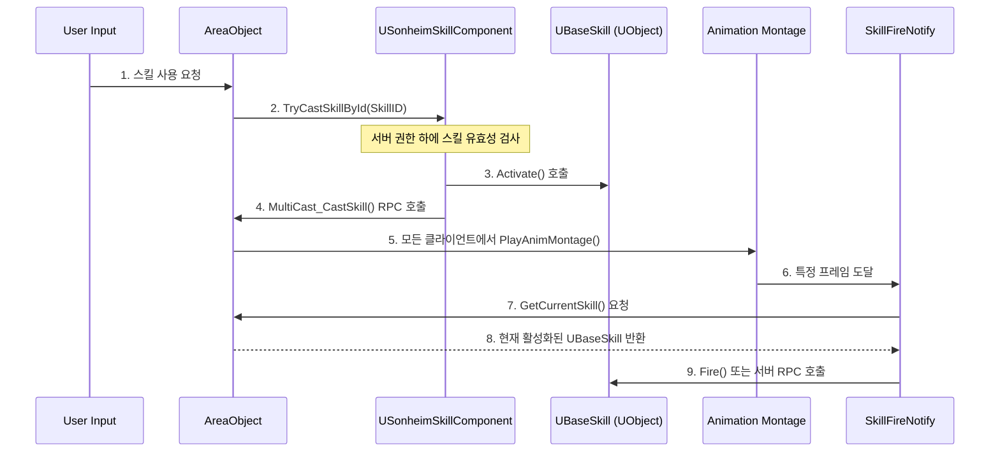

# 6.2. 스킬 아키텍처 (Skill Architecture)

## 6.2.1. 설계 목표

Sonheim의 스킬 시스템은 단순한 공격 기능의 집합이 아닌, 캐릭터의 모든 전투 행동을 정의하는 유연하고 확장 가능한 프레임워크로 설계되었습니다.

1.  **모든 행동의 스킬화 (Everything is a Skill):** 기본 근접 공격, 원거리 발사, 회피, 특수 능력 등 캐릭터의 모든 전투 관련 행동을 '스킬'이라는 단일한 개념으로 추상화하여 일관된 방식으로 관리합니다.
2.  **데이터 기반 확장성 (Data-Driven Scalability):** 새로운 스킬을 추가할 때, C++ 코드 변경을 최소화하고 데이터 테이블(`FSkillData`)과 애니메이션 몽타주 작업만으로 대부분의 설정이 가능하도록 설계합니다.
3.  **독립적인 생명주기 및 캡슐화:** 각 스킬의 복잡한 로직과 상태는 시전 주체(`AreaObject`)로부터 독립된 `UBaseSkill` 객체 내에 완벽하게 캡슐화하여, `AreaObject`의 코드를 깔끔하게 유지하고 시스템 전체의 확장성을 높입니다.
4.  **중앙화된 상태 관리 및 네트워크 효율성:** 모든 스킬의 상태(쿨다운 등)는 `USonheimSkillComponent`에서 중앙 관리하며, `FastArraySerializer`를 통해 네트워크에 매우 효율적으로 복제합니다.

---

## 6.2.2. 아키텍처

스킬 시스템은 **데이터(`FSkillData`)**, **관리자(`USonheimSkillComponent`)**, **실행자(`UBaseSkill`)**, **트리거(`AnimNotify`)** 라는 네 가지 요소가 유기적으로 협력하여 동작합니다.



*   **`FSkillData` (데이터):** 스킬의 모든 속성(데미지, 쿨다운, 공격 속성, 애니메이션 몽타주, 그리고 가장 중요한 `SkillClass`)을 정의하는 데이터 테이블 행 구조체입니다.
*   **`USonheimSkillComponent` (관리자):** `AreaObject`에 부착되어, 모든 스킬의 상태(특히 쿨다운)를 중앙 관리하고 `FastArraySerializer`로 효율적으로 복제합니다. 스킬 시전 요청을 받아 유효성을 검사하고, `UBaseSkill` 인스턴스를 생성 및 관리하며, `AreaObject`에 애니메이션 재생을 명령하는 역할을 합니다.
*   **`UBaseSkill` (실행자):** `UObject`를 상속받는 가벼운 객체로, 스킬의 실제 로직(비용 소모, 상태 변경 등)과 생명주기를 캡슐화합니다.
*   **`AnimNotify` (트리거):** 애니메이션 몽타주에 삽입되어, 정확한 타이밍에 `AreaObject`를 통해 현재 활성화된 `UBaseSkill` 객체를 찾아 로직(예: `Fire()`)을 실행시키는 핵심적인 역할을 합니다.

---

## 6.2.3. 핵심 구현

#### 1. 데이터와 로직의 연결

`SkillComponent`는 `FSkillData`에 명시된 `SkillClass`(`TSubclassOf<UBaseSkill>`)를 바탕으로 실제 `UBaseSkill` 객체를 생성하여 `TMap`에 보관합니다. 이때 스킬 객체의 소유자(Outer)는 `SkillComponent`가 아닌, 실제 스킬을 사용하는 `AreaObject`로 지정하여 생명주기를 연동합니다.

```cpp
// SonheimSkillComponent.cpp (실제 코드)
UBaseSkill* USonheimSkillComponent::EnsureSkillInstance(int32 SkillId)
{
    if (SkillId <= 0) return nullptr;
    if (TObjectPtr<UBaseSkill>* Found = SkillInstances.Find(SkillId))
    {
        if (IsValid(*Found)) return *Found;
        SkillInstances.Remove(SkillId);
    }

    AAreaObject* OwnerArea = Cast<AAreaObject>(GetOwner());
    if (!OwnerArea) return nullptr;
    if (USonheimGameInstance* GI = Cast<USonheimGameInstance>(OwnerArea->GetGameInstance()))
    {
        if (FSkillData* Data = GI->GetDataSkill(SkillId))
        {
            // Outer를 SkillComponent가 아닌 AreaObject로 지정하고, 고유한 이름을 부여합니다.
            const FString NameStr = FString::Printf(TEXT("BaseSkill_%d"), SkillId);
            UBaseSkill* NewSkill = NewObject<UBaseSkill>(OwnerArea, Data->SkillClass, *NameStr);
            if (NewSkill)
            {
                NewSkill->InitSkill(Data);
                SkillInstances.Add(SkillId, NewSkill);
                return NewSkill;
            }
        }
    }
    return nullptr;
}
```

#### 2. AnimNotify를 통한 독립적인 로직 실행

`SkillFireNotify`는 Notify 함수가 호출될 때, 애니메이션의 소유자인 `AreaObject`를 통해 현재 활성화된 스킬 객체를 얻어와, 해당 스킬의 `Fire()` 함수를 호출합니다. 이를 통해 스킬 로직을 `AreaObject`로부터 분리하면서도, 정확한 타이밍에 로직을 실행할 수 있습니다.

```cpp
// SkillFireNotify.cpp (실제 코드)
void USkillFireNotify::Notify(USkeletalMeshComponent* MeshComp, UAnimSequenceBase* Animation)
{
    if (!MeshComp || !MeshComp->GetOwner()) return;

    // 1. 애니메이션의 소유자인 AreaObject를 가져옵니다.
    AAreaObject* owner = Cast<AAreaObject>(MeshComp->GetOwner());
    if (!owner) return;

    // 2. AreaObject로부터 현재 활성화된 스킬 객체를 얻습니다.
    if (UBaseSkill* Skill = owner->GetCurrentSkill())
    {
        // 3. 서버/클라이언트에 따라 적절한 함수를 호출합니다.
        if (owner->HasAuthority())
        {
            // 서버는 직접 Fire() 함수를 실행합니다.
            Skill->Fire();
        }
        else
        {
            // 클라이언트는 서버에 RPC를 보냅니다.
            owner->Server_NotifySkillFire(Skill->GetSkillID());
        }
    }
}
```

#### 3. 동적 스킬 교체 (무기 교체 시)

플레이어의 기본 공격은 고정된 기능이 아니라, 현재 장착한 무기에 귀속된 스킬입니다. 무기를 바꾸면 기본 공격 스킬도 즉시 바뀝니다.

1.  **[InventoryComponent]** 현재 사용 중인 무기 슬롯이 변경되면, `OnWeaponChanged` 델리게이트를 통해 `ASonheimPlayer`에게 알립니다.
2.  **[ASonheimPlayer → SkillComponent]** `ASonheimPlayer`는 `SkillComponent`에 접근하여, `ReplaceGrant` 함수를 호출합니다. 이때 새로 장착한 무기 아이템의 데이터에서 `SkillID`를 찾아 함께 전달합니다.
3.  **[SkillComponent]** `ReplaceGrant` 요청을 받으면, 기존에 있던 무기 스킬을 제거하고 새로 받은 `SkillID`에 해당하는 스킬을 사용 가능한 스킬 목록에 추가합니다.

---

## 6.2.4. 설계 결정: 왜 `UObject`를 사용했는가?

스킬을 구현할 때 `AActor`나 `UActorComponent`를 사용하는 방식도 고려했습니다. 하지만 스킬은 월드에 물리적으로 존재할 필요가 없고(발사체는 별도의 `AElement` 액터), 캐릭터의 컴포넌트로 존재하기에는 너무 독립적인 생명주기를 가졌습니다.

따라서 가장 가벼운 리플렉션 객체인 **`UObject`**를 선택했습니다. `UObject`는 `AActor`처럼 무거운 트랜스폼이나 틱 기능을 가지지 않아 성능 부담이 적고, `UActorComponent`처럼 소유자 액터에 종속되지 않고 독립적으로 존재할 수 있습니다. `NewObject`를 통해 동적으로 생성하고, 아무도 참조하지 않으면 가비지 컬렉터에 의해 자동으로 소멸되므로 생명주기 관리 또한 매우 편리합니다. 이는 스킬이라는 '일회성 로직 묶음'을 표현하기에 가장 이상적인 선택이었습니다.

---

## 6.2.5. 관련 시스템

*   [6.1. 전투 및 피드백 시스템](./6.1_Combat_and_Feedback_System.md)
*   [4.3. 애니메이션 시스템](./4.3_Animation_System.md)
*   [5.1. FSM 기반 AI](./5.1_FSM_based_AI.md)
