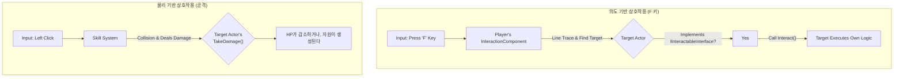

# 6.3. 통합 상호작용 시스템: 의도와 결과의 분리

## 6.3.1. 설계 목표

게임 세계에서 "상호작용"은 다양한 형태로 나타납니다. `F`키를 눌러 문을 여는 행동과, 도끼로 나무를 내리쳐 목재를 얻는 행동은 사용자에게는 모두 "상호작용"으로 느껴지지만, 그 내부 구현 방식은 완전히 달라야 합니다.

Sonheim의 통합 상호작용 시스템은 이처럼 다른 성격의 상호작용들을, 각 목적에 맞는 별개의 시스템으로 명확히 분리하여 처리하는 것을 목표로 합니다.

1.  **의도 기반 상호작용 (Intent-Based):** 문 열기, 아이템 줍기, NPC와 대화하기 등 플레이어가 명확한 **의도**를 가지고 `F`키를 누르는 행동은 **인터페이스(`IInteractableInterface`)**를 통해 처리합니다.
2.  **물리 기반 상호작용 (Physics-Based):** 칼로 몬스터를 공격하거나, 도끼로 나무를 내리치는 등 **물리적인 충돌**의 결과로 발생하는 상호작용은 **데미지 시스템(`TakeDamage`)**을 통해 처리합니다.
3.  **명확한 역할 분리:** 이 두 시스템을 분리함으로써, 각 시스템은 자신의 책임에만 집중하여 코드의 복잡성을 낮추고, 새로운 종류의 상호작용을 추가할 때 어떤 시스템을 확장해야 할지 명확하게 만듭니다.

---

## 6.3.2. 아키텍처: 두 개의 독립적인 파이프라인

플레이어의 입력은 그 종류에 따라 완전히 다른 두 개의 파이프라인을 통해 처리됩니다.



---

## 6.3.3. 핵심 인터페이스: `IInteractableInterface`

'의도 기반 상호작용'의 핵심은 `IInteractableInterface`입니다. 이 인터페이스는 상호작용 가능한 객체가 구현해야 할 **메서드의 목록(계약)**을 정의하며, 상호작용을 하는 주체(`InteractionComponent`)와 상호작용의 대상(구현 객체)을 분리합니다.

> [View on GitHub](https://github.com/chungheonLee0325/Sonheim/blob/main/Sonheim/Source/Sonheim/GameObject/InteractableInterface.h#L27)
```cpp
// Source/Sonheim/GameObject/InteractableInterface.h
class SONHEIM_API IInteractableInterface
{
	GENERATED_BODY()

public:
	// 상호작용이 가능한 상태인지 확인합니다. (예: 문이 이미 열려있는지)
	UFUNCTION(BlueprintNativeEvent, BlueprintCallable)
	bool CanInteract() const;

	// 플레이어가 대상을 바라보기 시작/종료했을 때 호출됩니다. (UI 표시/숨김 처리)
	UFUNCTION(BlueprintNativeEvent, BlueprintCallable)
	void OnDetected(bool bDetected);

	// 실제 상호작용 로직을 실행합니다.
	UFUNCTION(BlueprintNativeEvent, BlueprintCallable)
	void Interact(class ASonheimPlayer* Player);

	// 상호작용 UI에 표시될 이름을 반환합니다.
	UFUNCTION(BlueprintNativeEvent, BlueprintCallable)
	FString GetInteractionName() const;

	// 길게 누르기(Hold) 상호작용에 필요한 시간을 반환합니다. (0이면 즉시 실행)
	UFUNCTION(BlueprintNativeEvent, BlueprintCallable)
	float GetHoldDuration() const;
    
    // ... and other methods for UI and special interactions ...
};
```

`InteractionComponent`는 이 인터페이스를 구현한 액터를 발견하면, `Interact()` 함수를 호출할 뿐 구체적인 실행 내용에 대해서는 관여하지 않습니다.

---

## 6.3.4. 구현 예시: `Interact` 메서드의 다형성

`Interact` 함수는 각 클래스의 특성과 상태에 따라 전혀 다른 로직을 수행하며, 이것이 인터페이스 기반 설계의 핵심적인 장점입니다.

#### 1. `ABaseItem`: 아이템 획득
아이템의 `Interact`는 단순합니다. 자신을 획득 처리하고, 이펙트를 재생한 뒤, 월드에서 사라집니다.

> [View on GitHub](https://github.com/chungheonLee0325/Sonheim/blob/main/Sonheim/Source/Sonheim/GameObject/Items/BaseItem.cpp#L526)
```cpp
// Source/Sonheim/GameObject/Items/BaseItem.cpp
void ABaseItem::Interact_Implementation(ASonheimPlayer* Player)
{
	if (CanInteract_Implementation() && CanBeCollectedBy(Player))
	{
		OnCollected(Player);
		Multicast_OnCollected();
	}
}
```

#### 2. `ACraftingStation`: 상태에 따른 분기 처리
제작대의 `Interact`는 내부 상태(`CompletedToCollect`, `bHasActiveWork`)에 따라 세 가지 다른 행동으로 분기됩니다. `InteractionComponent`는 동일하게 `Interact()`를 호출했지만, 결과는 제작대의 상태에 따라 완전히 달라집니다.

> [View on GitHub](https://github.com/chungheonLee0325/Sonheim/blob/main/Sonheim/Source/Sonheim/GameObject/Buildings/Crafting/CraftingStation.cpp#L180)
```cpp
// Source/Sonheim/GameObject/Buildings/Crafting/CraftingStation.cpp
void ACraftingStation::Interact_Implementation(ASonheimPlayer* Player)
{
	if (!Player) return;

    // 1. 수령할 완성품이 있는가? -> 서버에 아이템 수령 요청
	if (CompletedToCollect > 0)
	{
		ServerCollectAll(Player);
		return;
	}
    // 2. 진행중인 작업이 있는가? -> 서버에 작업량 추가 요청
	else if (bHasActiveWork)
	{
		ServerAddWork(ResolvePlayerWorkSpeed_Internal(Player), Player);
		return;
	}
    // 3. 아무 작업도 없는가? -> 서버에 제작 UI 열기 요청
	if (!bHasActiveWork)
    {
        ServerRequestOpenUI(Player);
    }
}
```

---

## 6.3.5. 설계의 이점

*   **역할과 책임의 명확한 분리:** `InteractionComponent`는 '무엇과 상호작용할지'만 결정하고, `IInteractableInterface`를 구현한 액터는 '어떻게 상호작용할지'만 책임집니다. 이로 인해 코드를 이해하고 수정하기 매우 쉬워집니다.
*   **독립적인 확장성:** 새로운 상호작용 객체(예: 여닫이 문, 레버)를 추가하고 싶다면, `IInteractableInterface`를 구현하고 `Interact` 메서드에 원하는 동작을 작성하기만 하면 됩니다. 기존 코드는 전혀 수정할 필요가 없습니다.
*   **직관적인 게임플레이:** 플레이어는 자연스럽게 문을 열 때는 `F`키를, 나무를 캘 때는 공격 키를 사용하게 되어, 현실의 경험과 일치하는 직관적인 조작이 가능해집니다.
