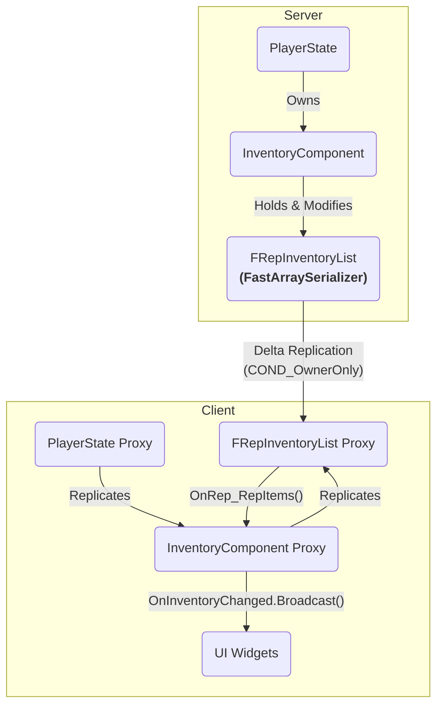

# 7.1. 인벤토리 시스템 (InventoryComponent)

## 7.1.1. 설계 목표

인벤토리 시스템은 플레이어의 성장과 직결되는 핵심 시스템입니다. 이 시스템의 핵심 기능을 담당하는 `UInventoryComponent`는 다음과 같은 목표를 달성하기 위해 설계되었습니다.

1.  **데이터 영속성 (Data Persistence):** 플레이어가 죽거나 재접속하더라도 모든 아이템 정보가 안전하게 유지되어야 합니다. 이를 위해 컴포넌트는 폰(Pawn)이 아닌, 세션 내내 유지되는 `PlayerState`에 소속됩니다.
2.  **서버 권위 및 데이터 무결성:** 모든 아이템의 추가, 삭제, 이동은 반드시 서버의 검증을 거쳐야 하며, 클라이언트의 조작이나 네트워크 오류로 인해 아이템이 복제되거나 유실되어서는 안 됩니다.
3.  **네트워크 효율성 (Network Efficiency):** 수십 개의 슬롯을 가진 인벤토리 데이터가 변경될 때, 전체 목록이 아닌 변경된 슬롯의 정보만 클라이언트에 전송하여 네트워크 부하를 최소화해야 합니다.
4.  **반응성 높은 UX 지원:** 네트워크 지연 속에서도 사용자가 아이템을 옮기거나 사용할 때 즉각적인 피드백을 느낄 수 있도록, 클라이언트 예측(Client-Side Prediction)을 지원하는 유연한 구조를 가져야 합니다.

---

## 7.1.2. 아키텍처: Fast Array와 조건부 복제

`UInventoryComponent`의 핵심 아키텍처는 언리얼 엔진의 고급 복제 기술을 적극적으로 활용하여, 안정성과 효율성이라는 두 마리 토끼를 모두 잡는 것입니다.

*   **`FRepInventoryList` (Fast Array Serializer):** 아이템 목록을 일반 `TArray`가 아닌 `FFastArraySerializer` 기반의 커스텀 구조체로 관리합니다. 이는 배열 전체가 아닌, **변경된 아이템 슬롯만** 클라이언트에 전송하는 **델타 복제(Delta Replication)**를 가능하게 하여 네트워크 효율을 극대화합니다.
*   **`COND_OwnerOnly` (조건부 복제):** 인벤토리 데이터는 `DOREPLIFETIME_CONDITION` 매크로를 통해 `COND_OwnerOnly` 조건으로 복제됩니다. 이는 각 플레이어가 오직 **자기 자신의 인벤토리 데이터만** 수신하도록 하여, 불필요한 정보 전송을 막고 보안을 강화합니다.

---

## 7.1.3. 핵심 기능 및 API

`UInventoryComponent`는 모든 데이터 조작 로직을 내부에 캡슐화하고, 외부 시스템이 호출할 수 있는 명확한 API를 제공합니다.

*   **`AddItem` / `RemoveItem`:** 아이템을 추가하거나 제거하는 가장 기본적인 함수입니다. 서버에서만 실제 데이터 변경이 일어나며, 클라이언트에서 호출될 경우 자동으로 서버 RPC를 호출합니다.
*   **`SwapItems` / `SwapEquippedItems`:** 인벤토리 내 슬롯 간, 또는 장비 슬롯 간의 아이템을 교환합니다. 이 함수 역시 클라이언트 예측과 서버 권위 로직을 모두 포함합니다.
*   **`EquipItem` / `UnEquipItem`:** 인벤토리의 아이템을 장비 슬롯에 장착하거나 해제합니다. 이 과정에서 `StatBonusComponent`와 같은 다른 컴포넌트와의 상호작용이 발생합니다.
*   **`PerformClientPrediction_...` 함수군:** `SwapItems`와 같은 각 서버 요청 함수에 대응하는 클라이언트 예측 함수입니다. 이 함수들은 서버의 응답을 기다리지 않고 UI를 즉시 업데이트하여 사용자에게 반응성 높은 경험을 제공합니다. 이 예측-요청-조정의 전체 흐름은 아래 사례 연구에서 자세히 다룹니다.
    *   **참고: [9.1. 사례 연구: 클라이언트 예측으로 구현하는 반응형 인벤토리 UX](./9.1_Case_Study_Inventory_Interaction.md)**

---

## 7.1.4. 구현 경험 및 교훈: TMap에서 Fast Array로

*   **문제:** 프로젝트 초기, 인벤토리 데이터를 `TMap<int32, FInventoryItem>`으로 구현하려 했습니다. `TMap`은 키를 통한 빠른 접근(O(1))이 가능하지만, 언리얼 엔진에서 `TMap` 자체는 네트워크 리플리케이션을 직접 지원하지 않아 데이터 동기화에 큰 어려움이 있었습니다.
*   **해결 과정:** 대안으로 `TArray<FInventoryItem>`을 사용했지만, 아이템 하나만 변경되어도 배열 전체를 복제하는 비효율 문제가 발생했습니다. 이 문제를 해결하기 위해 언리얼 엔진의 `Fast Array Serialization`을 학습하고 도입했습니다. 아이템 목록을 `FFastArraySerializer` 기반의 구조체로 리팩토링하여, 변경된 항목만 선택적으로 동기화하는 델타 복제 기능을 구현했습니다.
*   **교훈:** 언리얼 엔진의 네트워크 아키텍처를 깊이 이해하고, 상황에 맞는 최적의 동기화 메커니즘을 선택하는 것이 멀티플레이어 게임의 성능과 안정성에 얼마나 중요한지 깨달았습니다. 특히 `FastArraySerializer`와 같은 엔진의 고급 기능을 적극적으로 활용하면, 직접 구현하기 어려운 복잡한 네트워크 최적화를 매우 효율적으로 달성할 수 있다는 것을 배웠습니다.

---

## 7.1.5. 관련 시스템

*   [4.1. 플레이어 클래스 아키텍처](./4.1_Player_Class_Architecture.md)
*   [2.3. 어트리뷰트 및 스탯 시스템](./2.3_Attribute_And_Stat_System.md)
*   [9.1. 사례 연구: 클라이언트 예측으로 구현하는 반응형 인벤토리 UX](./9.1_Case_Study_Inventory_Interaction.md)
