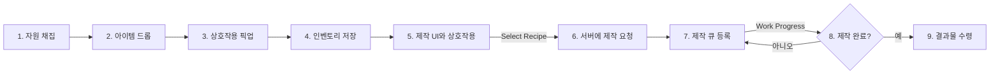

# 7.2. 제작 및 자원 수명 주기 (Crafting & Resource Lifecycle)

## 7.2.1. 설계 목표

제작과 자원 시스템은 Sonheim의 핵심 게임 루프인 **'탐험 → 채집 → 보관 → 제작 → 성장'**을 완성하는 필수 시스템입니다. 이 시스템은 다음 목표를 가지고 설계되었습니다.

1.  **만족스러운 채집 경험:** 플레이어가 자원을 타격할 때마다 아이템이 단계적으로 드롭되고, 적절한 도구를 사용했을 때 더 많은 보상을 얻는 '약점' 시스템을 통해 채집 행위 자체의 만족감과 전략적 재미를 제공합니다.
2.  **서버 권위 파이프라인:** 자원 획득, 재료 소모, 아이템 제작 등 모든 데이터 변경은 반드시 서버에서만 처리되도록 하여 멀티플레이어 환경에서의 데이터 정합성과 보안을 확보합니다.
3.  **데이터 기반 확장성:** 모든 자원과 제작법의 속성은 데이터 테이블에서 관리하여, 기획자가 코드를 수정하지 않고도 새로운 자원이나 아이템을 쉽게 추가하거나 밸런스를 조정할 수 있도록 합니다.
4.  **모듈성 및 재사용성:** 아이템을 보관하는 '보관함' 기능을 독립적인 `UContainerComponent`로 모듈화하여, 어떤 액터든 이 컴포넌트를 추가하는 것만으로 보관함 기능을 가질 수 있도록 설계합니다.

---

## 7.2.2. 아키텍처: 자원에서 아이템까지의 완전한 파이프라인

자원 채집부터 아이템 제작까지의 과정은 서버 권위 하에 관리되는 명확한 파이프라인을 따릅니다.



---

## 7.2.3. 1단계: 자원 채집 (Resource Harvesting)

자원 오브젝트(`ABaseResourceObject`)는 `TakeDamage` 함수를 오버라이드하여, 공격받을 때마다 자원을 생성하는 독자적인 로직을 수행합니다.

*   **약점 시스템:** 플레이어의 공격에 포함된 `EAttackType`을 자원의 약점과 비교하여, 적절한 도구(예: 나무에 도끼)로 공격했을 때 더 많은 데미지가 들어가도록 만듭니다.
*   **단계적 드롭:** 자원은 체력이 0이 될 때만 아이템을 드롭하는 것이 아니라, 피해를 입어 체력이 일정 구간(예: 10%)을 넘어설 때마다 아이템을 즉시 드롭하여 즉각적인 보상과 만족감을 제공합니다.

```cpp
// BaseResourceObject.cpp - TakeDamage 함수 내 단계적 드롭 로직
float ThresholdHP = HealthComponent->GetMaxHP() * dt_ResourceObject->DamageThresholdPct;
int32 PreviousHPSegment = FMath::FloorToInt(PreviousHP / ThresholdHP);
int32 CurrentHPSegment = FMath::FloorToInt(CurrentHP / ThresholdHP);

if (CurrentHPSegment < PreviousHPSegment)
{
    SpawnPartialResources(PreviousHPSegment - CurrentHPSegment);
}
```

---

## 7.2.4. 2단계: 제작 (Item Crafting)

제작 시스템은 데이터(`FCraftingRecipe`), 월드 오브젝트(`ACraftingStation`), UI(`UCraftingWidget`), 플레이어 상태(`UInventoryComponent`)의 명확한 역할 분담을 통해 구현됩니다.

1.  **데이터 정의 (`FCraftingRecipe`):** 모든 제작법은 데이터 테이블에 정의됩니다. 이 구조체는 결과 아이템, 필요한 재료(`TMap<ItemID, Count>`), 제작에 필요한 총 작업량(`WorkRequired`) 등 제작법의 모든 정보를 포함합니다.

2.  **서버 권위 작업 관리 (`ACraftingStation`):** 플레이어가 UI에서 제작 버튼을 누르면, `ACraftingStation`의 `ServerStartWork` RPC가 호출됩니다. 이 함수는 플레이어 인벤토리에서 재료를 검증 및 차감하고, 복제되는 변수인 `ActiveWork` 구조체에 현재 작업 상태를 기록합니다.

3.  **UI와 데이터의 연결 (`UCraftingWidget`):** `ActiveWork` 변수는 `ReplicatedUsing`으로 지정되어 있어, 내용이 변경되면 모든 클라이언트의 `OnRep_ActiveWork` 함수가 호출되어 월드에 부착된 `UCraftingQueueWidget`의 UI(진행률 등)가 자동으로 갱신됩니다. 또한, `UCraftingWidget`은 `ACraftingStation`의 `OnWorkChanged` 델리게이트를 구독하여, 제작이 완료되는 등의 상태 변화를 실시간으로 감지하고 UI를 업데이트합니다.

---

## 7.2.5. 설계 결정 및 재사용성

#### `UContainerComponent`의 재사용성

보관함의 모든 데이터와 로직을 `ABaseContainer` 액터에 직접 구현하는 대신, `UContainerComponent`로 분리한 것은 의도적인 설계 결정이었습니다. 이 덕분에 '아이템 보관'이라는 기능은 `ABaseContainer`뿐만 아니라, 이론적으로는 어떤 액터든 가질 수 있게 되었습니다.

예를 들어, 나중에 '아이템을 드랍하는 특별한 몬스터'를 만들고 싶다면, 그 몬스터 블루프린트에 `UContainerComponent`를 추가하기만 하면 됩니다. 몬스터가 죽었을 때 이 컴포넌트의 아이템들을 드랍하도록 로직을 추가하면, 보관함 시스템을 전혀 수정하지 않고도 새로운 기능을 쉽게 구현할 수 있습니다. 이는 시스템의 재사용성과 확장성을 극대화하는 컴포넌트 기반 설계의 강력한 장점입니다.

---

## 7.2.6. 관련 시스템

*   [7.1. 인벤토리 시스템](./7.1_Inventory_System.md)
*   [6.3. 통합 상호작용 시스템](./6.3_Unified_Interaction_System.md)
*   [2.1. 데이터 주도 설계](./2.1_Data_Driven_Design.md)
