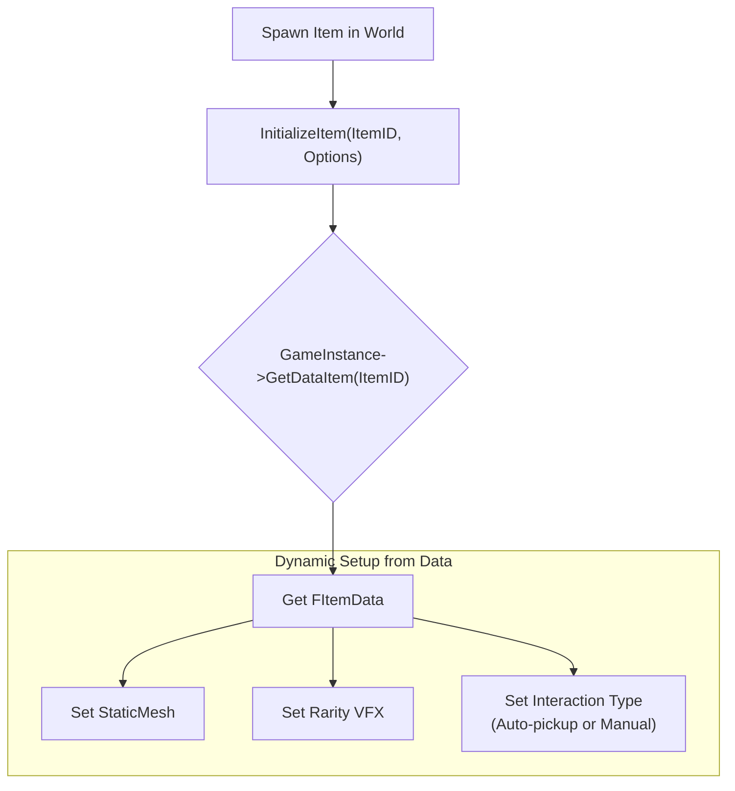

# 7.2. 아이템 시스템 (ABaseItem)

## 7.2.1. 서론

월드에 드롭된 아이템은 단순한 시각적 표현을 넘어, 고유한 물리적 특성을 가지고, 네트워크 환경에서 효율적으로 관리되어야 하며, 다양한 방식으로 플레이어와 상호작용해야 합니다. 

이 문서는 Sonheim의 모든 월드 드롭 아이템의 기반이 되는 `ABaseItem` 클래스가 어떻게 **데이터 기반의 외형 결정**, **물리 및 네트워크 최적화**, 그리고 **유연한 상호작용 방식**을 구현했는지 그 핵심 설계를 설명합니다.

---

## 7.2.2. 아키텍처: 데이터 기반의 동적 아이템

`ABaseItem`의 핵심 설계는, 모든 아이템의 외형과 속성이 `ItemID`에 연결된 데이터 테이블(`dt_Item`)에 의해 동적으로 결정된다는 것입니다. 액터 자체는 텅 빈 껍데기에 가깝고, `Init` 함수가 호출될 때 `GameInstance`로부터 해당 `ItemID`의 데이터를 받아와 자신의 메시, 이펙트, 상호작용 방식 등을 결정합니다.



---

## 7.2.3. 핵심 기능 및 설계

#### 1. 데이터 기반 외형 및 속성

`ABaseItem`이 월드에 스폰될 때, `InitializeItem` 함수는 `ItemID`와 `FItemSpawnOptions`를 인자로 받습니다. 이 함수는 `GameInstance`에 `ItemID`로 데이터를 요청하여 `FItemData`를 가져오고, 이 데이터에 정의된 `ItemMesh`와 `ItemRarity`에 따라 아이템의 외형과 등급 이펙트(VFX)를 동적으로 설정합니다.

> [View on GitHub](https://github.com/chungheonLee0325/Sonheim/blob/main/Sonheim/Source/Sonheim/GameObject/Items/BaseItem.cpp#L160)
```cpp
// Source/Sonheim/GameObject/Items/BaseItem.cpp
void ABaseItem::InitializeItem(int32 InItemID, const FItemSpawnOptions& Options)
{
    m_ItemID = InItemID;
    // ... (스폰 옵션 설정)

    // 1. GameInstance로부터 ItemID에 맞는 데이터를 가져온다.
    if (m_GameInstance)
    {
        dt_ItemData = m_GameInstance->GetDataItem(m_ItemID);
    }

    // 2. 데이터에 정의된 메시와 등급에 맞춰 외형을 설정한다.
    ApplyRarityVFX();
    SetupComponents(); 
    // ...
}
```

#### 2. 물리 및 네트워크 최적화 (Net Dormancy)

월드에 수백 개의 아이템이 드롭되어도 성능 저하가 발생하지 않도록, `ABaseItem`은 언리얼 엔진의 **네트워크 도먼시(Net Dormancy)** 시스템을 적극적으로 활용합니다.

1.  **초기 상태:** 아이템이 처음 드롭되면, 물리 시뮬레이션이 활성화되어 바닥을 구르거나 튕기는 등 자연스러운 연출을 보여줍니다. 이 때 네트워크 상태는 `DORM_Awake`로, 위치 정보가 계속해서 복제됩니다.
2.  **수면 상태 진입:** 아이템의 물리적 움직임이 멈추면(`OnComponentSleep` 이벤트 발생), 서버는 해당 액터의 네트워크 상태를 `DORM_DormantAll`로 변경합니다. 이 상태의 액터는 더 이상 위치 업데이트와 같은 어떤 네트워크 패킷도 전송하지 않으므로, 서버와 클라이언트의 부하가 거의 0에 수렴하게 됩니다.
3.  **각성 상태 복귀:** 만약 플레이어나 다른 물리적 요인에 의해 아이템이 다시 움직이기 시작하면(`OnComponentWake` 이벤트 발생), 서버는 즉시 네트워크 상태를 `DORM_Awake`로 되돌려 다시 위치 정보를 동기화하기 시작합니다.

> [View on GitHub](https://github.com/chungheonLee0325/Sonheim/blob/main/Sonheim/Source/Sonheim/GameObject/Items/BaseItem.cpp#L260)
```cpp
// Source/Sonheim/GameObject/Items/BaseItem.cpp
void ABaseItem::OnMeshSleep(UPrimitiveComponent* Comp, FName)
{
    if (!HasAuthority()) return;

    // 움직임이 멈추면, 네트워크 업데이트를 완전히 중단하여 부하를 없앤다.
    SetNetDormancy(DORM_DormantAll);
}

void ABaseItem::OnMeshWake(UPrimitiveComponent* Comp, FName)
{
    if (!HasAuthority()) return;

    // 다시 움직이면, 즉시 네트워크 업데이트를 재개한다.
    FlushNetDormancy();
    SetNetDormancy(DORM_Awake);
}
```

#### 3. 유연한 상호작용 방식

`ABaseItem`은 스폰될 때 전달받는 `FItemSpawnOptions`에 따라 두 가지 다른 방식으로 플레이어와 상호작용합니다.

*   **자동 획득 (Auto-Pickup):** `bRequireInteraction` 플래그가 `false`이면, 아이템의 `CollectionSphere` 컴포넌트가 활성화됩니다. 플레이어가 이 영역 안으로 들어가면 `OnOverlapBegin` 이벤트가 발생하여 아이템이 즉시 획득됩니다. `AutoPickupDelay` 옵션을 통해, 드롭된 직후가 아닌 일정 시간 후에만 자동 획득이 가능하도록 설정할 수도 있습니다.
*   **수동 획득 (Manual Interaction):** `bRequireInteraction` 플래그가 `true`이면, `CollectionSphere`는 비활성화됩니다. 대신, 이 액터는 `IInteractableInterface`를 구현하고 있으므로, 플레이어가 아이템을 바라보고 `F`키를 눌러야만 `Interact_Implementation` 함수가 호출되어 아이템이 획득됩니다. (참고: [8.3. 인터페이스를 활용한 범용 상호작용 UI](./8.3_Interface-Based_Contextual_UI.md))

이러한 설계 덕분에, 개발자는 아이템을 스폰하는 시점에서 옵션 값 하나만 변경하는 것으로, 동일한 `ABaseItem` 클래스를 전혀 다른 두 가지 상호작용 방식을 가진 아이템으로 손쉽게 활용할 수 있습니다.
