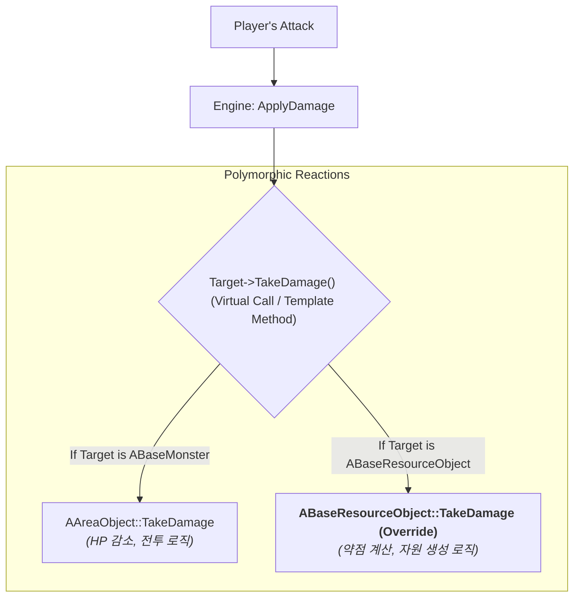

# 7.3. 자원 시스템 (ABaseResourceObject)

## 7.3.1. 서론

월드에 배치된 나무, 광석과 같은 자원 오브젝트는 몬스터와 근본적으로 다른 상호작용을 가집니다. 플레이어의 공격에 대해 이들은 피해를 입고 쓰러지는 것이 아니라, 정해진 자원(목재, 광물 등)을 생성하고 최종적으로는 파괴되어야 합니다.

이 문서는 Sonheim의 모든 자원 오브젝트의 기반이 되는 `ABaseResourceObject` 클래스가 어떻게 부모의 `TakeDamage` 함수를 **재정의(Override)**하여, 전투 로직을 **수확 로직**으로 완벽하게 전환하는지 그 객체 지향적 설계를 상세히 설명합니다. 

이는 [6.1. 전투 및 피드백 시스템](./6.1_Combat_and_Feedback_System.md)에서 설명된 **템플릿 메서드 패턴**의 다형성(Polymorphism)이 어떻게 활용되는지에 대한 구체적인 사례 연구이기도 합니다.

---

## 7.3.2. 아키텍처: 피해 반응의 재정의 (Overriding Damage Response)

이 시스템의 핵심은, `AAreaObject`에 이미 존재하는 `TakeDamage`라는 가상 함수를 `ABaseResourceObject`가 자신만의 목적에 맞게 완전히 새로운 내용으로 재정의하는 것입니다. 이를 통해 공격을 하는 플레이어나 스킬 코드는 대상을 전혀 구분할 필요 없이 동일한 `ApplyDamage` 함수를 호출하지만, 그 결과는 대상의 실제 타입에 따라 다형적으로 결정됩니다.



---

## 7.3.3. 핵심 기능 및 설계

#### 1. 데이터 기반 자원 정의

모든 자원 오브젝트의 속성은 `dt_ResourceObject`라는 `UDataTable`에 의해 결정됩니다. 이 데이터에는 자원의 최대 체력(`HPMax`), 약점 공격 타입과 그에 따른 데미지 배율(`WeaknessAttackMap`), 그리고 피해를 입을 때마다 자원을 생성하는 체력 임계값(`DamageThresholdPct`) 등이 정의되어 있어, 기획자가 코드를 수정하지 않고도 새로운 자원을 추가하거나 밸런스를 조정할 수 있습니다.

#### 2. TakeDamage 재정의: 전투에서 수확으로

`ABaseResourceObject`는 부모인 `AAreaObject`의 `TakeDamage` 함수를 오버라이드하여, HP 감소와 사망이라는 전투의 맥락을 자원 생성과 파괴라는 수확의 맥락으로 재해석합니다.

> [View on GitHub](https://github.com/chungheonLee0325/Sonheim/blob/main/Sonheim/Source/Sonheim/GameObject/ResourceObject/BaseResourceObject.cpp#L158)
```cpp
// Source/Sonheim/GameObject/ResourceObject/BaseResourceObject.cpp
float ABaseResourceObject::TakeDamage(float Damage, const FDamageEvent& DamageEvent, ...)
{
    if (!HasAuthority() || !CanHarvest) return 0.0f;

    // 1. 공격 타입에 따른 약점 데미지 계산
    float damageCoefficient = GetWeaknessModifier(attackData.AttackType);
    ActualDamage = ActualDamage * damageCoefficient;

    float PreviousHP = HealthComponent->GetHP();
    HealthComponent->ModifyHP(-ActualDamage); // HP 감소
    float CurrentHP = HealthComponent->GetHP();

    // 2. 체력 감소량에 따른 '단계적 자원 드랍' 로직 호출
    float ThresholdHP = HealthComponent->GetMaxHP() * dt_ResourceObject->DamageThresholdPct;
    int32 PreviousHPSegment = FMath::FloorToInt(PreviousHP / ThresholdHP);
    int32 CurrentHPSegment = FMath::FloorToInt(CurrentHP / ThresholdHP);
    if (CurrentHPSegment < PreviousHPSegment)
    {
        SpawnPartialResources(PreviousHPSegment - CurrentHPSegment);
    }

    // 3. HP가 0이 되면 파괴 처리
    if (FMath::IsNearlyZero(CurrentHP))
    {
        OnDestroy();
    }

    return ActualDamage;
}
```

#### 3. 단계적 드랍 (Staged Drops)

자원 오브젝트는 체력이 0이 될 때만 아이템을 드롭하는 것이 아니라, 피해를 입어 체력이 일정 구간(예: 데이터에 정의된 `DamageThresholdPct`가 0.1이라면, 매 10%)을 넘어설 때마다 아이템을 즉시 드롭합니다. `TakeDamage` 함수는 피해 전후의 체력 구간을 계산하여, 넘어선 구간의 수만큼 `SpawnPartialResources` 함수를 호출합니다. 이는 플레이어에게 즉각적인 보상을 제공하여 채집 행위 자체의 만족감을 높이는 중요한 디자인적 장치입니다.

---

## 7.3.4. 설계의 이점

*   **완벽한 역할 분리:** 공격을 하는 `ASonheimPlayer`는 자신이 공격하는 대상이 몬스터인지 나무인지 전혀 알 필요가 없습니다. 오직 `ApplyDamage`를 호출할 뿐입니다. 어떻게 반응할지는 전적으로 피격 대상이 스스로 결정하므로, 각 객체의 역할이 명확하고 시스템 간의 결합도가 매우 낮습니다.
*   **높은 확장성:** 미래에 '때리면 전기가 흐르는 수정'과 같은 새로운 종류의 자원 객체를 추가하고 싶을 때, `ABaseResourceObject`를 상속받고 `TakeDamage` 함수를 자신만의 로직으로 오버라이드하기만 하면 됩니다. 플레이어나 스킬 코드는 단 한 줄도 수정할 필요가 없습니다.
*   **데이터 기반 밸런싱:** 모든 자원의 체력, 약점, 드랍률 등은 데이터 테이블에서 관리되므로, 기획자가 언제든지 게임의 밸런스를 손쉽게 조정할 수 있습니다.
