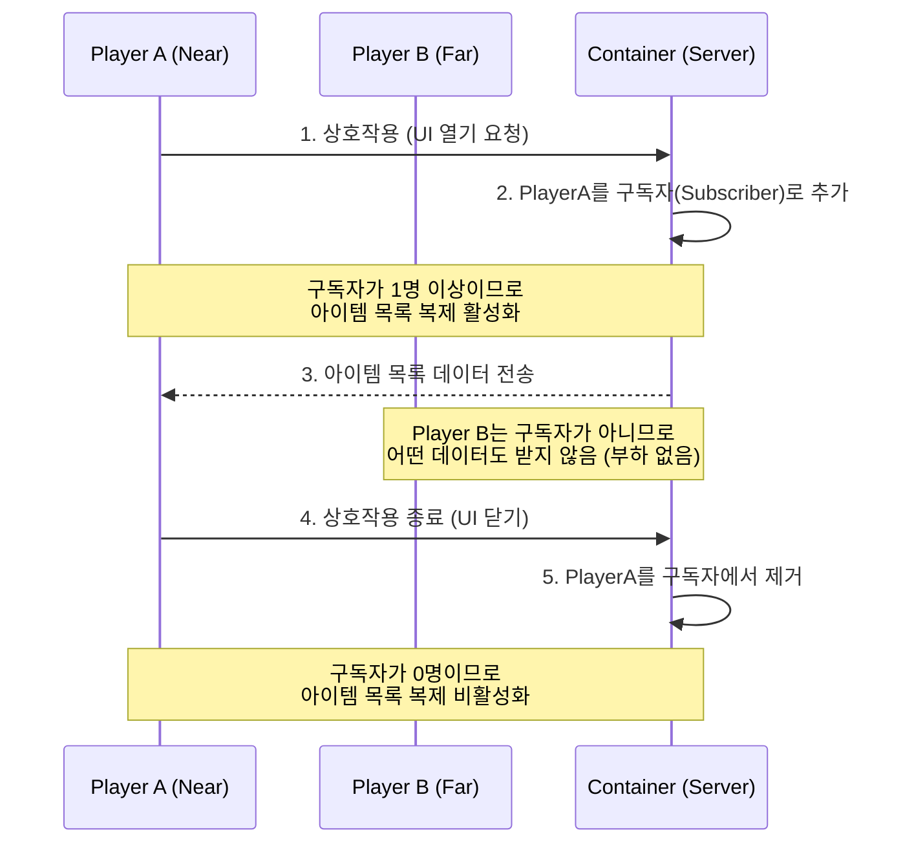

# 7.4. 보관함 시스템 (UContainerComponent)

## 7.4.1. 서론

월드에 배치된 보관함(상자, 창고 등)은 여러 플레이어가 공유하는 중요한 상호작용 객체입니다. 월드에 수백 개의 보관함이 존재할 수 있으므로, 이들의 아이템 정보를 모든 플레이어에게 항상 동기화하는 것은 엄청난 네트워크 부하를 유발합니다.

이 문서는 Sonheim의 모든 월드 보관함 기능을 책임지는 `UContainerComponent`가 어떻게 **컴포넌트 기반의 재사용성**을 확보하고, **구독 기반 복제(Subscription-based Replication)**라는 고급 네트워크 최적화 기법을 통해 서버 부하를 최소화했는지 그 핵심 설계를 설명합니다.

---

## 7.4.2. 아키텍처: 구독 기반의 효율적인 공유 보관함

이 시스템의 핵심은, 보관함의 아이템 목록을 무조건 모든 클라이언트에 복제하는 것이 아니라, 오직 해당 보관함의 UI를 열어보고 있는 플레이어(`Subscribers`)가 있을 때만 서버가 클라이언트로 데이터를 전송하는 **구독 기반 복제** 전략입니다. 이를 통해 월드에 수많은 보관함이 존재하더라도 네트워크 부하를 최소화합니다.



---

## 7.4.3. 핵심 기능 및 설계

#### 1. 컴포넌트 기반의 재사용성

'아이템 보관'이라는 기능은 특정 액터에 종속되지 않고, `UContainerComponent`라는 독립적인 컴포넌트로 모듈화되었습니다. 덕분에 이 컴포넌트를 어떤 액터 블루프린트에 추가하기만 하면, 그 액터는 즉시 아이템을 보관할 수 있는 기능을 갖게 됩니다. 이는 '아이템을 드랍하는 특별한 몬스터'나 '움직이는 보물 상자'와 같은 새로운 콘텐츠를 매우 쉽게 구현할 수 있는 확장성을 제공합니다.

#### 2. 구독 기반 복제 (Subscription-based Replication)

이 컴포넌트의 가장 큰 특징은 네트워크 효율을 극대화하는 구독 모델입니다. 플레이어가 보관함의 UI를 열 때, 서버에 `ServerSubscribeViewer` RPC를 호출하여 스스로를 '구독자'로 등록합니다. `UContainerComponent`는 이 구독자 목록을 관리하며, `PreReplication` 함수를 오버라이드하여 복제 여부를 동적으로 제어합니다.

*   **`Subscribers`:** 보관함을 열어보고 있는 플레이어의 목록입니다.
*   **`PreReplication`:** 언리얼의 리플리케이션 시스템이 실제로 데이터를 복제하기 직전에 호출되는 함수입니다. 여기서 `DOREPLIFETIME_ACTIVE_OVERRIDE` 매크로를 사용하여, `Subscribers` 목록이 비어있지 않을 때만(`!Subscribers.IsEmpty()`) 아이템 목록(`RepContainerItems`)을 복제하도록 설정합니다.

> [View on GitHub (Header)](https://github.com/chungheonLee0325/Sonheim/blob/main/Sonheim/Source/Sonheim/GameObject/Buildings/Utility/ContainerComponent.h#L241)
> [View on GitHub (Source)](https://github.com/chungheonLee0325/Sonheim/blob/main/Sonheim/Source/Sonheim/GameObject/Buildings/Utility/ContainerComponent.cpp#L26)
```cpp
// Source/Sonheim/GameObject/Buildings/Utility/ContainerComponent.h
UPROPERTY(Transient)
	TSet<TWeakObjectPtr<APlayerController>> Subscribers;

// Source/Sonheim/GameObject/Buildings/Utility/ContainerComponent.cpp
void UContainerComponent::PreReplication(IRepChangedPropertyTracker& ChangedPropertyTracker)
{
	Super::PreReplication(ChangedPropertyTracker);

	// 구독자가 있을 때만 아이템 목록을 복제하도록 동적으로 설정
	const bool bActive = Subscribers.Num() > 0;
	DOREPLIFETIME_ACTIVE_OVERRIDE(UContainerComponent, RepContainerItems, bActive);
}
```

#### 3. 델타 복제 (Fast Array Serialization)

아이템 목록(`RepContainerItems`)은 `FFastArraySerializer` 구조체를 통해 관리됩니다. 이는 구독자에게 데이터를 보낼 때, 보관함의 아이템 목록 전체를 매번 통째로 보내는 대신, 마지막으로 보낸 이후 **변경이 발생한 슬롯(추가, 삭제, 수량 변경)만** 네트워크를 통해 전송하는 델타 복제 기법입니다. 이는 대량의 아이템이 빠르게 이동하는 상황에서도 네트워크 부하를 최소화하여 효율적인 데이터 동기화를 보장합니다.

---

## 7.4.4. 설계의 이점

*   **엄청난 네트워크 성능 최적화:** 월드에 수백, 수천 개의 보관함이 있더라도, 플레이어가 실제로 열어보는 소수의 보관함을 제외하고는 어떤 네트워크 트래픽도 발생시키지 않습니다. 이는 대규모 월드에서 매우 중요한 최적화 요소입니다.
*   **높은 재사용성과 확장성:** 컴포넌트 기반 설계를 통해, 어떤 액터든 보관함 기능을 가질 수 있으며, 이는 새로운 종류의 게임플레이 오브젝트를 매우 쉽게 추가할 수 있게 해줍니다.
*   **명확한 역할 분담:** `UContainerComponent`는 오직 '아이템을 담고, 구독자에게 알린다'는 자신의 역할에만 집중합니다. UI가 어떻게 표시되는지, 어떤 아이템이 들어올 수 있는지 등의 정책은 다른 시스템이 책임지므로, 코드의 유지보수성이 향상됩니다.
