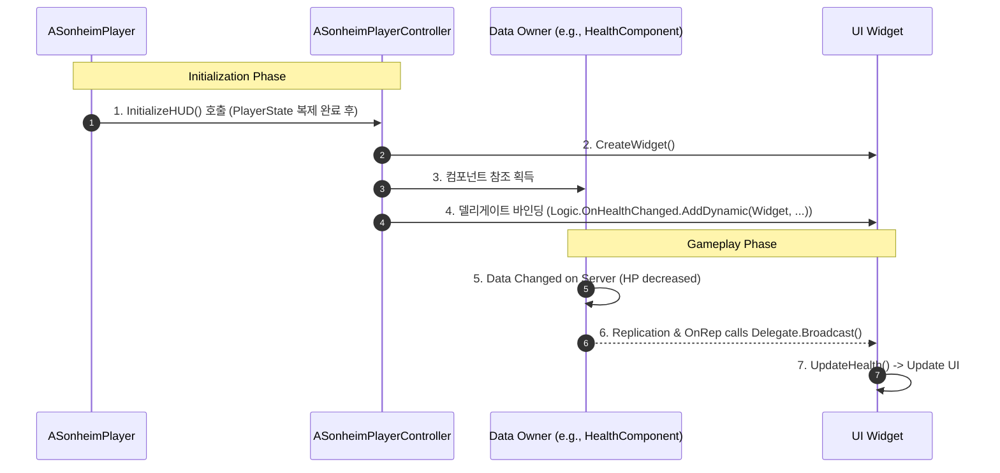

# 8.1. UI 아키텍처 및 이벤트 시스템 (UI Architecture & Event System)

## 8.1.1. 설계 목표

UI 시스템은 게임의 상태를 플레이어에게 전달하는 가장 중요한 창구입니다. 복잡한 게임 로직과 UI가 뒤섞이지 않고, 각자의 역할에만 집중할 수 있는 깨끗하고 효율적인 구조를 만드는 것이 핵심 목표였습니다.

1.  **데이터와 표현의 완벽한 분리 (Decoupling):** 게임 로직(HP 감소, 아이템 획득 등)은 UI가 어떻게 생겼는지, 존재하는지조차 알 필요가 없어야 합니다. 반대로, UI는 데이터가 어떻게 변경되는지에 대한 내부 로직을 알 필요 없이, 오직 '변경되었다'는 사실만 통지받아 화면을 갱신해야 합니다.
2.  **이벤트 기반 업데이트 (Event-Driven Updates):** `Tick`을 돌며 매 프레임 데이터를 확인하는 비효율적인 방식을 지양하고, 데이터에 실제 변경이 발생했을 때만 UI가 반응하도록 하는 이벤트 기반 구조를 목표로 합니다.
3.  **중앙화된 UI 관리 (Centralized UI Management):** 인벤토리, 제작창 등 복잡한 UI 위젯의 생성과 소멸은 `ASonheimPlayerController`가 전담하도록 하여, UI의 생명주기 관리를 중앙화하고 코드의 분산을 막습니다.
4.  **단방향 데이터 흐름 (One-Way Data Flow):** UI는 게임 상태를 직접 변경할 수 없습니다. UI는 오직 서버로부터 복제된 데이터를 화면에 보여주는 '뷰(View)'의 역할만 수행하며, 상태 변경이 필요할 때는 반드시 서버 RPC를 통해 '요청'해야 합니다.

---

## 8.1.2. 아키텍처: 중재자를 통한 발행-구독 (Mediated Publish-Subscribe)

이러한 목표를 달성하기 위해, 언리얼 엔진의 **델리게이트(Delegate)** 시스템을 활용하되, `PlayerController`가 데이터 소유자와 UI 위젯 사이를 연결하는 **중재자(Mediator)** 역할을 하는 발행-구독 패턴을 사용합니다.



*   **데이터 소유자 (Publisher):** `UHealthComponent`, `UInventoryComponent` 등 실제 데이터를 소유하고 변경하는 컴포넌트입니다. 데이터가 변경될 때마다 `OnHealthChanged`와 같은 델리게이트를 '방송(Publish)'합니다.
*   **UI 위젯 (Subscriber):** `UPlayerStatusWidget` 등 데이터를 시각적으로 표현하는 위젯입니다. 자신을 생성한 `PlayerController`에 의해 델리게이트가 '구독(Subscribe)'됩니다.
*   **UI 관리자/중재자 (`ASonheimPlayerController`):** 위젯을 생성하고, 데이터 소스(각종 컴포넌트)와 위젯의 이벤트 핸들러를 직접 연결(`AddDynamic`)해주는 중재자 역할을 수행합니다.

이 구조에서 데이터 소유자와 UI 위젯은 서로의 존재를 전혀 알지 못하며, 오직 `PlayerController`만이 둘 사이의 관계를 알고 연결해줌으로써 시스템 간의 결합도를 극단적으로 낮춥니다.

---

## 8.1.3. 핵심 구현: 이벤트 정의 및 구독

1.  **이벤트 정의 (Publisher):** 데이터를 소유한 컴포넌트는 외부에 공개할 이벤트를 `DECLARE_DYNAMIC_MULTICAST_DELEGATE` 매크로로 선언하고, 데이터 변경 시 `Broadcast()` 함수를 호출합니다.

    ```cpp
    // HealthComponent.h
    DECLARE_DYNAMIC_MULTICAST_DELEGATE_ThreeParams(FOnHealthChangedDelegate, float, CurrentHP, float, Delta, float, MaxHP);

    UPROPERTY(BlueprintAssignable)
    FOnHealthChangedDelegate OnHealthChanged;

    // HealthComponent.cpp (실제로는 OnRep_HP 또는 ModifyHP 내부에서 호출)
    void UHealthComponent::OnRep_HP(float OldHP)
    {
        float Delta = m_HP - OldHP;
        // "HP가 변경되었다"고 현재값, 변화량, 최대값을 모두 방송
        OnHealthChanged.Broadcast(m_HP, Delta, m_HPMax);
    }
    ```

2.  **이벤트 구독 (Mediator):** `PlayerController`가 위젯을 생성한 후, 데이터 컴포넌트와 위젯의 함수를 직접 연결하여 구독 관계를 설정합니다.

    ```cpp
    // SonheimPlayerController.cpp
    void ASonheimPlayerController::InitializeHUD_Implementation(ASonheimPlayer* NewPlayer)
    {
        // ... (위젯 생성 로직)
        StatusWidget = CreateWidget<UPlayerStatusWidget>(this, StatusWidgetClass);
        if (StatusWidget)
        {
            StatusWidget->AddToViewport();
            if (NewPlayer->m_HealthComponent)
            {
                // Controller가 직접 HealthComponent의 델리게이트에 StatusWidget의 함수를 구독자로 등록
                NewPlayer->m_HealthComponent->OnHealthChanged.AddDynamic(StatusWidget, &UPlayerStatusWidget::UpdateHealth);
            }
        }
    }
    ```

---

## 8.1.4. 구현 경험 및 트러블슈팅: 초기화 시점의 경쟁 상태 (Race Condition)

*   **문제:** 멀티플레이 환경에서, 클라이언트의 UI 위젯이 생성되는 시점과, 위젯이 필요로 하는 데이터 소스(`PlayerState` 등)가 서버로부터 복제되어 유효해지는 시점 중 어느 것이 먼저일지 보장할 수 없습니다.

*   **해결책:** `ASonheimPlayer`(`Pawn`)가 데이터와 UI 초기화 순서를 보장하는 책임을 맡습니다. `Pawn`은 자신을 조종할 `Controller`와 자신의 데이터인 `PlayerState`가 모두 유효해지는 시점에 `Controller`의 HUD 초기화 함수를 호출합니다.

    1.  클라이언트의 `Pawn`에 `Controller`가 빙의(`Possess`)되면, `PossessedBy` 함수가 호출됩니다. 이 시점에서 `Controller`는 유효합니다.
    2.  서버로부터 `PlayerState`가 성공적으로 복제되면, `OnRep_PlayerState` 함수가 호출됩니다. 이 시점에서 `PlayerState`가 유효함을 보장할 수 있습니다.
    3.  `ASonheimPlayer`는 이 두 함수(`PossessedBy`, `OnRep_PlayerState`) 모두에서 `PlayerController`의 `InitializeHUD` 함수를 호출합니다. 이를 통해 `Controller`와 `PlayerState`가 어떤 순서로 클라이언트에 도착하든, 두 가지 모두 준비되었을 때만 HUD가 초기화되도록 보장하여 경쟁 상태를 해결합니다.

    ```cpp
    // SonheimPlayer.cpp - Pawn이 초기화 순서를 보장
    void ASonheimPlayer::PossessedBy(AController* NewController)
    {
        Super::PossessedBy(NewController);
        S_PlayerController = Cast<ASonheimPlayerController>(NewController);

        // Controller가 유효해졌으므로, HUD 초기화 시도
        if (S_PlayerController != nullptr && IsLocallyControlled())
            S_PlayerController->InitializeHUD(this);
    }

    void ASonheimPlayer::OnRep_PlayerState()
    {
        Super::OnRep_PlayerState();
        S_PlayerState = Cast<ASonheimPlayerState>(GetPlayerState());

        // PlayerState가 유효해졌으므로, HUD 초기화 시도
        if (S_PlayerController != nullptr && IsLocallyControlled())
            S_PlayerController->InitializeHUD(this);
    }
    ```

*   **교훈:** 멀티플레이 UI 프로그래밍에서는 `OnRep_` 함수와 `PossessedBy` 같은 생명주기 함수가 데이터와 액터의 유효성을 보장하는 매우 강력한 이벤트 포인트임을 인지해야 합니다. 이를 활용하여 초기화 순서를 명확하게 제어하는 것이 안정적인 UI 시스템을 구축하는 핵심입니다.

---

## 8.1.5. 관련 시스템

*   [2.3. 어트리뷰트 및 스탯 시스템](./2.3_Attribute_And_Stat_System.md)
*   [4.1. 플레이어 클래스 아키텍처](./4.1_Player_Class_Architecture.md)
*   [8.2. UI 위젯 오브젝트 풀링](./8.2_UI_Widget_Object_Pooling.md)
