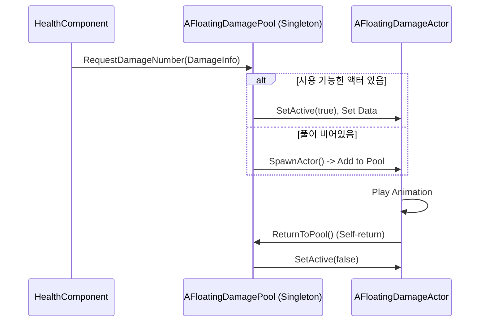

# 8.2. UI 위젯 오브젝트 풀링 (UI Widget Object Pooling)

## 8.2.1. 설계 목표

Sonheim의 UI는 단순한 정보 표시를 넘어, 게임플레이의 반응성과 몰입감에 직접적인 영향을 미칩니다. 특히, 다수의 UI 요소가 짧은 시간 안에 생성되고 소멸되는 상황에서 성능 저하를 방지하는 것이 핵심 목표였습니다.

1.  **성능 안정성 (Performance Stability):** 전투 중 수많은 데미지 숫자가 표시되거나, 재료가 많은 제작 UI를 열 때 발생할 수 있는 프레임 드랍(Hitching) 현상을 최소화합니다.
2.  **메모리 효율성 (Memory Efficiency):** UObject(위젯, 액터)의 잦은 생성(`CreateWidget`, `SpawnActor`)과 소멸(Garbage Collection)로 인한 메모리 파편화 및 오버헤드를 줄입니다.
3.  **상황에 맞는 최적화:** UI 요소의 특성과 사용 범위에 따라, **전역 액터 풀링**과 **지역 위젯 풀링**이라는 두 가지 다른 최적화 전략을 유연하게 적용합니다.

---

## 8.2.2. 아키텍처: 두 가지 풀링 전략

풀링(Pooling)은 자주 사용되는 객체를 미리 생성하여 비활성 상태로 '풀(Pool)'에 보관하고, 필요할 때 가져와 활성화한 뒤, 사용이 끝나면 파괴하는 대신 다시 풀에 반납하여 재사용하는 기법입니다. Sonheim에서는 두 가지 주요 영역에 이 기법이 적용되었습니다.

#### 1. 전역 액터 풀링: `AFloatingDamagePool`

*   **목적:** 월드 어디에서든, 어떤 캐릭터든 예측 불가능한 시점에 필요로 하는 **플로팅 데미지 숫자**(`AFloatingDamageActor`)를 관리하기 위해 사용됩니다.
*   **구조:** 월드에 단 하나만 존재하는 싱글톤 매니저 `AFloatingDamagePool`을 구현했습니다. 다른 시스템(예: `HealthComponent`)은 데미지 표시가 필요할 때, 이 풀 매니저에 `RequestDamageNumber` 함수를 호출하여 데미지 정보만 전달합니다. 그러면 풀이 알아서 쉬고 있는 액터를 꺼내 활성화하고, 사용이 끝난 액터는 자동으로 풀에 반납됩니다.



#### 2. 지역 위젯 풀링: `UCraftingWidget`

*   **목적:** 제작 UI의 재료 목록처럼, 특정 상위 위젯 내에서만 하위 위젯들이 반복적으로 생성/소멸되는 경우에 사용됩니다.
*   **구조:** 상위 위젯인 `UCraftingWidget`이 `TArray<URequiredMatRowWidget*>` 형태의 자신만의 풀을 소유하고 직접 관리합니다. 레시피가 변경될 때, 기존의 재료 행 위젯들은 파괴되는 대신 `SetVisibility(ESlateVisibility::Collapsed)`로 숨겨져 재사용을 기다립니다. 새로운 재료를 표시해야 할 때, 풀에서 위젯을 가져와 내용만 갱신하여 다시 보여줍니다.

---

## 8.2.3. 핵심 구현

#### 1. 액터 풀링: 요청 기반 재활용

`AFloatingDamagePool`은 사용 편의성을 위해 복잡한 내부 동작을 숨기고, `RequestDamageNumber`라는 간단한 인터페이스만 외부에 제공합니다.

> [View on GitHub](https://github.com/chungheonLee0325/Sonheim/blob/main/Sonheim/Source/Sonheim/UI/FloatingDamagePool.h#L23)
```cpp
// Source/Sonheim/UI/FloatingDamagePool.h
UCLASS()
class AFloatingDamagePool : public AActor
{
public:
    // 월드 어디서든 풀 매니저에 접근하기 위한 싱글톤 함수
    static AFloatingDamagePool* GetInstance(UWorld* World);

    // 데미지 표시를 요청하는 유일한 외부 통로
    void RequestDamageNumber(const FDamageNumberRequest& Request);

    // 사용이 끝난 액터를 풀에 반환
    void ReturnToPool(AFloatingDamageActor* Actor);
private:
    UPROPERTY()
    TArray<AFloatingDamageActor*> Pool;
};
```

#### 2. 위젯 풀링: 생성 대신 가시성 제어

`UCraftingWidget`의 `RebuildStaticForRecipe` 함수는 필요한 재료 위젯의 개수를 확인하고, 풀이 부족하면 새로 생성합니다. 그 후, 풀에 있는 모든 위젯을 순회하며 필요한 만큼은 `Visible`로, 나머지는 `Collapsed`로 설정하여 재사용합니다.

> [View on GitHub](https://github.com/chungheonLee0325/Sonheim/blob/main/Sonheim/Source/Sonheim/UI/Widget/GameObject/Crafting/CraftingWidget.cpp#L195)
```cpp
// Source/Sonheim/UI/Widget/GameObject/Crafting/CraftingWidget.cpp
void UCraftingWidget::RebuildStaticForRecipe(const FCraftingRecipe* R)
{
    // 풀이 필요한 위젯 수보다 작으면, 부족한 만큼 새로 생성하여 풀에 추가
    while (RequiredRowPool.Num() < CachedMatIDs.Num())
    {
        URequiredMatRowWidget* RowW = CreateWidget<URequiredMatRowWidget>(...);
        RequiredRowPool.Add(RowW);
        RequiredList->AddChild(RowW);
    }

    // 풀에 있는 모든 위젯을 순회하며 가시성 조절
    for (int32 i = 0; i < RequiredRowPool.Num(); ++i)
    {
        const bool bVisible = (i < CachedMatIDs.Num());
        RequiredRowPool[i]->SetVisibility(bVisible ? ESlateVisibility::Visible : ESlateVisibility::Collapsed);

        if (bVisible) RequiredRowPool[i]->UpdateRow(...);
    }
}
```

---

## 8.2.4. 결론

풀링 기법을 적용한 결과, 수십 개의 재료가 필요한 복잡한 제작 UI를 열 때도 프레임 드랍 없이 즉시 열리고, 다수의 몬스터와 동시에 전투를 벌여 수십 개의 데미지 숫자가 화면에 표시되어도 프레임 속도가 안정적으로 유지되는 등, 게임의 전반적인 성능과 안정성이 크게 향상되었습니다. 이처럼 상황에 맞는 최적화 패턴을 선택하고 구현함으로써, 각기 다른 UI 요구사항에 효과적으로 대응할 수 있었습니다.

---

## 8.2.5. 관련 시스템

*   [8.1. UI 아키텍처 및 이벤트 시스템](./8.1_UI_Architecture_and_Event_System.md)
*   [7.5. 제작 시스템](./7.5_Crafting_System.md)
*   [6.1. 전투 및 피드백 시스템](./6.1_Combat_and_Feedback_System.md)
