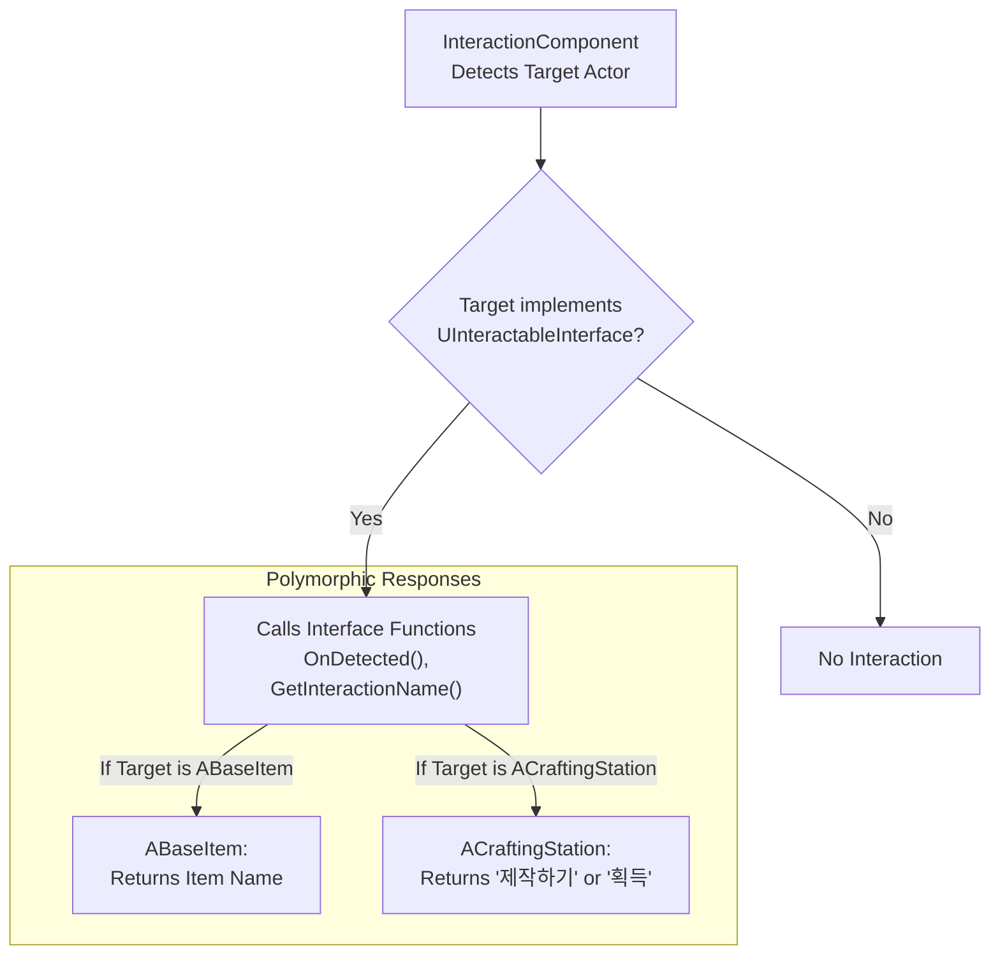

# 8.3. 인터페이스 기반 컨텍스트 UI 아키텍처

## 8.3.1. 설계 목표

월드에는 플레이어가 상호작용할 수 있는 수많은 오브젝트(아이템, 제작대, NPC 등)가 존재하며, 플레이어가 이들을 바라볼 때 나타나는 UI(`DetectWidget`)는 각 오브젝트의 상황에 맞는 정확한 정보를 표시해야 합니다. 예를 들어, 아이템 위에서는 "아이템 이름"을, 제작대 위에서는 "제작하기" 또는 "아이템 수령"을 표시해야 합니다.

만약 `DetectWidget`이 `if (Target->IsA<ABaseItem>()) ... else if (Target->IsA<ACraftingStation>()) ...` 와 같이 모든 상호작용 대상을 하드코딩하여 분기 처리한다면, 새로운 종류의 오브젝트가 추가될 때마다 이 위젯의 코드는 계속해서 수정되어야만 합니다. 이는 유지보수의 악몽으로 이어질 것입니다.

이 아키텍처는 C++의 **인터페이스(Interface)**를 활용하여, UI 시스템이 상호작용 대상이 누구인지 전혀 알 필요 없이, 각 대상이 스스로 자신의 정보를 제공하도록 만드는 **느슨한 결합(Loose Coupling)** 구조를 구축하는 것을 목표로 합니다.

1.  **UI와 게임 로직의 완벽한 분리:** UI는 "정보를 표시한다"는 자신의 역할에만 집중하고, 게임플레이 오브젝트는 "자신이 어떤 정보를 표시할지 결정한다"는 역할에만 집중하도록 합니다.
2.  **궁극의 확장성:** 새로운 종류의 상호작용 오브젝트를 추가하더라도, UI 시스템의 코드는 단 한 줄도 수정할 필요가 없도록 설계합니다.

---

## 8.3.2. 아키텍처: 약속(Interface)을 통한 정보 요청

이 아키텍처의 핵심은, UI나 상호작용 컴포넌트가 대상의 구체적인 클래스를 확인하는 대신, **`UInteractableInterface`** 라는 공통된 "약속"을 구현했는지 여부만 확인하는 것입니다. `InteractionComponent`는 대상이 어떤 클래스인지 신경 쓰지 않고, 오직 인터페이스에 정의된 함수(`GetInteractionName` 등)를 호출하여 정보를 요청합니다. 그러면 각 액터는 자신만의 방식으로 이 함수를 구현하여, 상황에 맞는 올바른 정보를 반환합니다.



이 구조를 통해 `DetectWidget`과 같은 UI는 `InteractionComponent`가 보내주는 텍스트를 표시하기만 하면 될 뿐, 그 텍스트가 아이템의 이름인지, 제작대의 상태인지 전혀 알 필요가 없습니다.

---

## 8.3.3. 단계별 상세 분석

#### 1단계: 약속의 정의 (`UInteractableInterface`)

가장 먼저, 모든 상호작용 가능한 객체들이 반드시 지켜야 할 공통된 약속, 즉 인터페이스를 정의합니다. `UInteractableInterface`는 `DetectWidget`이 필요로 하는 모든 정보(표시할 이름, 상호작용 종류 등)를 얻기 위한 함수들을 `BlueprintNativeEvent`로 선언합니다.

> [View on GitHub](https://github.com/chungheonLee0325/Sonheim/blob/main/Sonheim/Source/Sonheim/GameObject/InteractableInterface.h#L31)
```cpp
// Source/Sonheim/GameObject/InteractableInterface.h
UINTERFACE(MinimalAPI, Blueprintable)
class UInteractableInterface : public UInterface { ... };

class SONHEIM_API IInteractableInterface
{
    GENERATED_BODY()
public:
    // 표시할 이름
    UFUNCTION(BlueprintNativeEvent, BlueprintCallable, Category = "Interaction")
    FString GetInteractionName() const;

    // 감지되었을 때 호출될 함수
    UFUNCTION(BlueprintNativeEvent, BlueprintCallable, Category = "Interaction")
    void OnDetected(bool bDetected);
    
    // ... 기타 상호작용 함수들 ...
};
```

#### 2단계: 정보의 소비자 (`InteractionComponent`)

`InteractionComponent`는 주기적으로 전방을 탐색하여 상호작용 가능한 대상을 찾습니다. 이 때, 대상의 구체적인 클래스를 확인하는 대신, `UInteractableInterface`를 구현했는지 여부만 확인하고 인터페이스 함수를 호출합니다.

> [View on GitHub](https://github.com/chungheonLee0325/Sonheim/blob/main/Sonheim/Source/Sonheim/AreaObject/Player/Utility/InteractionComponent.cpp#L50)
```cpp
// Source/Sonheim/AreaObject/Player/Utility/InteractionComponent.cpp
void UInteractionComponent::PerformDetection()
{
    // ... (라인 트레이스로 전방의 액터들을 탐색) ...

    AActor* BestInteractable = nullptr;
    for (const FHitResult& Hit : InteractionHits)
    {
        if (!Hit.GetActor()) continue;

        // 1. 액터가 UInteractableInterface를 구현했는지 확인한다.
        if (Hit.GetActor()->GetClass()->ImplementsInterface(UInteractableInterface::StaticClass()))
        {
            // 2. 인터페이스 함수를 호출하여 상호작용 가능한지 확인한다.
            if (IInteractableInterface::Execute_CanInteract(Hit.GetActor()))
            {
                BestInteractable = Hit.GetActor();
                break; // 가장 가까운 대상을 찾았으므로 종료
            }
        }
    }
    
    // 3. 상호작용 대상이 변경되었는지 확인하고, OnDetected 이벤트를 호출한다.
    UpdateInteractable(BestInteractable, ClosestDistance);
}

void UInteractionComponent::UpdateInteractable(AActor* NewTarget, float Distance)
{
    if (NewTarget != CurrentInteractable)
    {
        // 4. 이전 대상에게는 감지가 끝났음을 알린다.
        if (CurrentInteractable)
        {
            IInteractableInterface::Execute_OnDetected(CurrentInteractable, false);
        }

        CurrentInteractable = NewTarget;

        // 5. 새로운 대상에게는 감지가 시작되었음을 알린다.
        if (CurrentInteractable)
        {
            IInteractableInterface::Execute_OnDetected(CurrentInteractable, true);
        }
    }
}
```
`OnDetected` 함수가 호출되면, 각 액터는 자신의 `OnDetected_Implementation` 내부에서 `DetectWidget`에 표시할 텍스트를 `GetInteractionName`을 통해 가져와 설정합니다.

#### 3단계: 정보의 제공자 (다양한 Actor들)

`UInteractableInterface`를 구현한 각 액터는, 동일한 인터페이스 함수를 자신만의 상황과 데이터에 맞게 **재정의(Override)**하여 구체적인 정보를 제공합니다.

*   **`ABaseItem`의 경우:** 자신의 아이템 데이터 테이블에서 `ItemName`을 찾아 반환합니다.

> [View on GitHub](https://github.com/chungheonLee0325/Sonheim/blob/main/Sonheim/Source/Sonheim/GameObject/Items/BaseItem.cpp#L346)
```cpp
// Source/Sonheim/GameObject/Items/BaseItem.cpp
FString ABaseItem::GetInteractionName_Implementation() const
{
    return dt_ItemData ? dt_ItemData->ItemName.ToString() : FString("아이템");
}
```

*   **`ACraftingStation`의 경우:** 자신의 내부 상태 변수를 확인하여, 컨텍스트에 맞는 동적인 텍스트를 반환합니다.

> [View on GitHub](https://github.com/chungheonLee0325/Sonheim/blob/main/Sonheim/Source/Sonheim/GameObject/Buildings/Crafting/CraftingStation.cpp#L175)
```cpp
// Source/Sonheim/GameObject/Buildings/Crafting/CraftingStation.cpp
FString ACraftingStation::GetInteractionName_Implementation() const
{
    if (CompletedToCollect > 0) return TEXT("취득");
    if (bHasActiveWork) return TEXT("[길게 누르기] 작업");
    return TEXT("레시피 선택");
}
```

---

## 8.3.4. 설계의 이점

*   **완벽한 분리 (Decoupling):** `InteractionComponent`와 `DetectWidget`은 `ABaseItem`이나 `ACraftingStation`의 존재 자체를 알 필요가 없으며, 오직 `UInteractableInterface`라는 약속에만 의존합니다. 이 덕분에 UI 시스템과 게임플레이 오브젝트 시스템은 서로에게 아무런 영향을 주지 않고 독립적으로 개발 및 수정될 수 있습니다.
*   **엄청난 확장성 (Massive Scalability):** 미래에 '잠긴 문', 'NPC', '레버 스위치' 등 새로운 종류의 상호작용 오브젝트를 수백 개 추가하더라도, 그 오브젝트들이 `UInteractableInterface`를 구현하고 `GetInteractionName` 함수를 올바르게 재정의하기만 한다면, `InteractionComponent`나 `DetectWidget`의 코드는 **단 한 줄도 수정할 필요 없이** 모든 오브젝트와 완벽하게 상호작용할 수 있습니다.
*   **명확한 역할 분담:** `DetectWidget`은 "정보를 받아서 표시한다"는 자신의 역할에만 집중하고, 각 상호작용 객체는 "자신이 어떤 이름으로 불릴지 결정한다"는 역할에만 집중합니다. 이는 코드의 가독성과 유지보수성을 극대화합니다.
