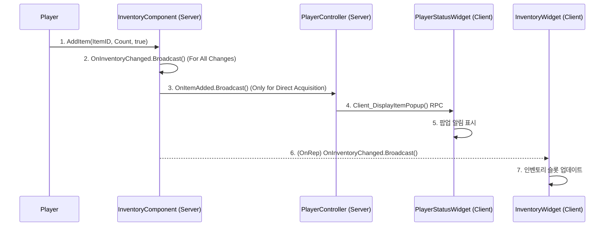

# 8.4. 사례 연구: 조건부 이벤트를 통한 반응형 UI

## 8.4.1. 서론

플레이어가 아이템을 획득했을 때, 인벤토리 UI가 실시간으로 업데이트되는 것은 당연해 보이지만, 그 이면에는 여러 시스템이 각자의 역할에만 집중하며 효율적으로 협력하는 과정이 숨어있습니다. 

만약 UI가 매 프레임 인벤토리의 상태를 감시하고 변경점을 찾아 화면에 그린다면(`Tick` 기반), 이는 엄청난 성능 낭비를 유발할 것입니다.

이 문서는 Sonheim이 어떻게 **이벤트 기반(Event-Driven)** 설계를 통해, 데이터가 실제로 변경되었을 때만 UI가 반응하도록 하여, **데이터 시스템, 인벤토리 시스템, UI 시스템**이 효율적으로 협력하는지 그 흐름을 추적하는 사례 연구입니다. 특히, 하나의 게임플레이 이벤트가 어떻게 여러 UI(인벤토리 창, HUD 팝업)에 각기 다른 방식으로 동시에 영향을 미치는지 심층적으로 분석합니다.

---

## 8.4.2. 아키텍처: 조건부 이벤트를 통한 다중 UI 업데이트

이 시퀀스의 핵심은 **UI가 인벤토리의 상태를 감시하는 것이 아니라, 오직 인벤토리의 내용이 변경되는 '이벤트'가 발생했을 때만 UI를 업데이트**한다는 점입니다. 특히, `InventoryComponent`는 상황에 따라 각기 다른 델리게이트(`OnInventoryChanged`, `OnItemAdded`)를 발생시켜, UI들이 필요한 정보만 선택적으로 구독하고 반응하도록 합니다.



---

## 8.4.3. 단계별 상세 분석

#### 1단계: 아이템 획득 및 조건부 이벤트 발생

*   **시작점:** 플레이어가 필드의 아이템을 획득하여 `InventoryComponent`의 `AddItem` 함수가 `IsDirectAcquisition = true` 플래그와 함께 서버에서 호출됩니다.
*   **흐름:**
    1.  `AddItem` 함수는 아이템 데이터를 변경한 후, 두 종류의 델리게이트를 조건부로 호출합니다.
    2.  `BroadcastInventoryChanged()`: 인벤토리 내용이 변경되었음을 알리는 **일반적인 신호**입니다. `OnInventoryChanged` 델리게이트를 호출합니다.
    3.  `OnItemAdded.Broadcast()`: `IsDirectAcquisition` 플래그가 true일 때만 호출되는 **특별한 신호**입니다. 이는 장비 해제 등으로 아이템이 인벤토리에 들어오는 경우와, 필드에서 직접 아이템을 줍는 경우를 구분하기 위함입니다.

> [View on GitHub](https://github.com/chungheonLee0325/Sonheim/blob/main/Sonheim/Source/Sonheim/AreaObject/Player/Utility/InventoryComponent.cpp#L310)
```cpp
// Source/Sonheim/AreaObject/Player/Utility/InventoryComponent.cpp
bool UInventoryComponent::AddItem(int ItemID, int ItemCount, bool IsDirectAcquisition)
{
    // ... (아이템 추가 로직)

    // 특별한 조건(직접 획득)일 때만 OnItemAdded 호출
    if (IsDirectAcquisition && AddedToInventory > 0)
    {
        OnItemAdded.Broadcast(ItemID, AddedToInventory);
    }
    // 인벤토리 변경은 항상 호출
    BroadcastInventoryChanged();
    return true;
}
```

#### 2단계: 독립적인 UI 반응 (팝업과 인벤토리)

*   **시작점:** `OnItemAdded`와 `OnInventoryChanged` 델리게이트가 각각 다른 구독자에게 전파됩니다.
*   **흐름:**
    1.  **팝업 알림:** `PlayerController`는 서버에서 `OnItemAdded`를 구독하고 있다가, 이벤트가 발생하면 `Client_DisplayItemPopup` RPC를 호출합니다. 오직 해당 클라이언트의 `PlayerStatusWidget`(HUD)만이 이 RPC를 받아, 아이템 획득 팝업 애니메이션을 재생합니다.
    2.  **인벤토리 업데이트:** 한편, `InventoryComponent`의 데이터 변경은 리플리케이션을 통해 클라이언트에 동기화되고, `OnRep_RepItems` 함수가 `OnInventoryChanged` 델리게이트를 호출합니다. `InventoryWidget`은 이 신호를 받아 자신의 슬롯들을 업데이트합니다.

이처럼 두 UI는 서로를 전혀 알지 못한 채, 각자 자신이 구독한 이벤트에만 독립적으로 반응합니다.

#### 3단계: 데이터 기반 스타일링

*   **시작점:** `SlotWidget`과 `PlayerStatusWidget`이 아이템 정보를 표시해야 할 때입니다.
*   **흐름:**
    1.  두 위젯 모두 아이템의 등급(Rarity)에 맞는 색상을 표시하기 위해, 중앙 유틸리티 함수인 `USonheimUtility::GetRarityColor`를 호출합니다.
    2.  이 함수는 `GameInstance`의 데이터 테이블에서 아이템 등급 정보를 찾아, 미리 정의된 색상 팔레트에 맞는 `FLinearColor`를 반환합니다.
    3.  `SlotWidget`은 이 색상을 슬롯의 배경색으로, `PlayerStatusWidget`은 팝업 UI의 테두리나 텍스트 색상으로 사용하여, 게임 전체에 걸쳐 일관된 시각적 피드백을 제공합니다.

> [View on GitHub](https://github.com/chungheonLee0325/Sonheim/blob/main/Sonheim/Source/Sonheim/UI/Widget/Player/PlayerStatusWidget.cpp#L441)
```cpp
// Source/Sonheim/UI/Widget/Player/PlayerStatusWidget.cpp
void UPlayerStatusWidget::DisplayItemPopup(int ItemID, int Count)
{
    FItemData* ItemData = USonheimGameInstance::Get(GetWorld())->GetDataItem(ItemID);
    if (ItemData && Count != 0)
    {
        // GetRarityColor 유틸리티 함수로 일관된 색상을 가져와 적용
        OnItemPopupDisplay(ItemData->ItemIcon, ItemData->ItemName, Count,
                           USonheimUtility::GetRarityColor(ItemData->ItemRarity));
    }
}
```

---

## 8.4.4. 설계의 이점

*   **최적화된 성능:** UI는 매 프레임 데이터를 검사하는 대신(`Tick` 방식의 비효율성), 데이터가 실제로 변경되었을 때만 이벤트를 받아 필요한 부분만 업데이트하므로 불필요한 성능 낭비를 막습니다.
*   **높은 확장성 및 낮은 결합도:** 이 설계 덕분에, 나중에 '획득 아이템 로그' UI를 추가하고 싶을 때도, `OnItemAdded` 델리게이트를 구독하기만 하면 기존의 어떤 코드도 수정할 필요 없이 새로운 기능을 손쉽게 추가할 수 있습니다. 이는 시스템 간의 의존성을 최소화하는 이벤트 기반 아키텍처의 가장 큰 장점입니다.
*   **일관된 데이터 표현:** 모든 UI 요소가 `GameInstance`라는 단일 출처(Single Source of Truth)의 데이터와 `GetRarityColor`와 같은 중앙 유틸리티 함수를 사용하므로, 게임 전체에 걸쳐 아이템의 등급과 색상 표현이 항상 일관성을 유지합니다.
