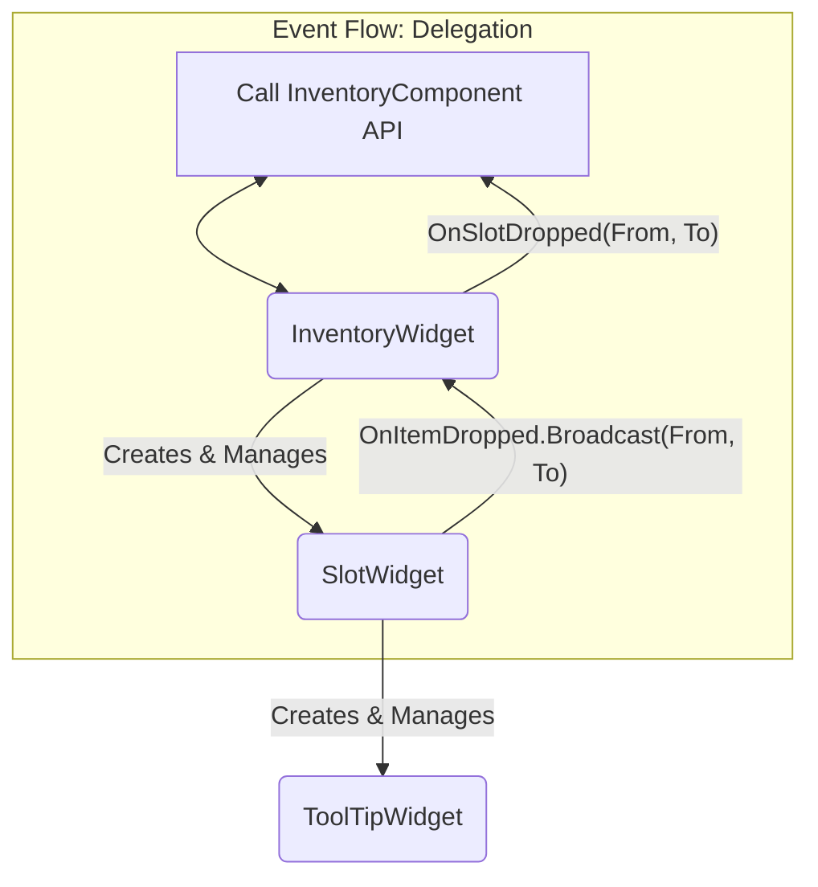

# 8.5. 인벤토리 UI 시스템: 위젯의 협력과 역할 분담

## 8.5.1. 설계 목표

인벤토리 UI는 플레이어와 아이템 시스템을 연결하는 핵심 인터페이스입니다. 이 시스템은 단순한 데이터 표시를 넘어, 여러 위젯이 유기적으로 협력하여 직관적이고 반응성 높은 사용자 경험을 제공하는 것을 목표로 합니다.

1.  **명확한 역할 분담 (SRP):** 인벤토리 전체를 관리하는 컨테이너 위젯, 개별 슬롯의 상호작용을 처리하는 슬롯 위젯, 상세 정보를 보여주는 툴팁 위젯으로 역할을 명확히 분리하여 각 위젯이 하나의 책임만 갖도록 합니다.
2.  **데이터와 표현의 완벽한 분리:** UI는 `UInventoryComponent`의 데이터를 화면에 보여주는 **뷰(View)**의 역할에만 집중하며, 백엔드 로직을 전혀 알 필요가 없습니다.
3.  **정교하고 즉각적인 UX:** 드래그 앤 드롭, 우클릭 등 사용자의 모든 상호작용에 대해, 명확하고 즉각적인 시각적 피드백을 제공하여 최상의 사용자 경험을 만듭니다.
4.  **일관된 UI 스타일:** 모든 관련 위젯은 [8.7. UI 스타일 및 유틸리티](./8.7_UI_Style_and_Utility.md)에 정의된 중앙 유틸리티를 사용하여, 게임 전체에 걸쳐 일관된 시각적 표현을 보장합니다.

---

## 8.5.2. 아키텍처: 세 위젯의 협력 관계

인벤토리 UI 시스템은 `InventoryWidget`, `SlotWidget`, `ToolTipWidget`이라는 세 가지 핵심 위젯이 계층적으로 협력하는 구조로 이루어져 있습니다.



*   **`InventoryWidget` (지휘자/컨테이너):** 인벤토리 전체를 감싸는 최상위 위젯입니다. `UInventoryComponent`와 직접 통신하는 유일한 창구이며, 하위 `SlotWidget`들을 생성하고 관리합니다. 또한, 슬롯에서 발생한 모든 이벤트(클릭, 드롭)를 수신하여 실제 어떤 로직(아이템 사용, 스왑)을 실행할지 결정하고 백엔드에 요청하는 **지휘자** 역할을 합니다.

*   **`SlotWidget` (상호작용 요소):** 개별 아이템 슬롯을 나타냅니다. 드래그 앤 드롭 시의 시각적 피드백(테두리, 아이콘 색상 변경)과 같은 **UX 표현**을 전담합니다. 또한, 사용자 입력(클릭, 드롭)을 감지하여 `InventoryWidget`에 **이벤트를 전달**하는 역할을 합니다.

*   **`ToolTipWidget` (상세 정보 뷰):** 아이템의 상세 정보를 표시하는 역할만 담당합니다. `SlotWidget`에 의해 생성되고, 아이템 데이터를 받아 자신의 내용을 채웁니다.

---

## 8.5.3. 아키텍처 심층 분석: 위젯의 역할과 책임

#### 1. `InventoryWidget`: 이벤트의 최종 해석자

`InventoryWidget`은 `NativeConstruct`에서 자신이 생성한 모든 `SlotWidget`의 델리게이트(`OnItemClicked`)를 자신의 함수(`OnSlotClicked`)에 바인딩합니다. `SlotWidget`은 단지 "우클릭이 발생했다"고 알릴 뿐, 그 결과 어떤 일이 벌어질지는 `InventoryWidget`이 결정합니다.

> [View on GitHub](https://github.com/chungheonLee0325/Sonheim/blob/main/Sonheim/Source/Sonheim/UI/Widget/Player/Inventory/InventoryWidget.cpp#L181)
```cpp
// Source/Sonheim/UI/Widget/Player/Inventory/InventoryWidget.cpp
void UInventoryWidget::OnSlotClicked(USlotWidget* SlotWidget, bool bIsRightClick)
{
    if (!bIsRightClick) return; // 우클릭이 아니면 무시

    // 장비 슬롯 우클릭 -> 장비 해제 요청
    if (SlotWidget->EquipmentSlotType != EEquipmentSlotType::None)
    {
        InventoryComponent->UnEquipItem(SlotWidget->EquipmentSlotType);
    }
    // 인벤토리 슬롯 우클릭 -> 장비 장착 요청
    else
    {
        // ...
        InventoryComponent->EquipItemByIndex(SlotWidget->SlotIndex);
    }
}
```
이 구조를 통해, `SlotWidget`은 우클릭의 의미를 알 필요 없이 범용성을 유지하고, `InventoryWidget`은 인벤토리 컨텍스트에 맞는 정책(우클릭=장착/해제)을 자유롭게 정의할 수 있습니다.

#### 2. `SlotWidget`: UX 표현의 전문가

`SlotWidget`은 데이터 처리 로직 대신, 사용자에게 최상의 시각적 피드백을 제공하는 데 집중합니다. 특히, `NativeOnDragEnter`에서는 드롭 가능 여부에 따라 **타겟 슬롯의 테두리 색상**과 **드래그 중인 아이콘의 색상**을 동시에 변경하여, 사용자에게 매우 명확하고 직관적인 피드백을 제공합니다.

또한, `SetItemData` 함수가 호출되면, `USonheimUtility::GetRarityColor`를 호출하여 아이템 등급에 맞는 배경색을 스스로 설정하고, 자신의 툴팁 위젯을 직접 생성하고 관리하며 책임을 다합니다.

#### 3. `ToolTipWidget`: 데이터의 최종 시각화

`ToolTipWidget`은 `InitToolTip` 함수를 통해 `FItemData`를 전달받으면, 그 안의 모든 정보를 각 `TextBlock`과 `Image`에 채워 넣는 역할만 수행합니다. 이 때, 아이템 등급 텍스트의 색상 역시 `USonheimUtility::GetRarityColor`를 호출하여, 게임의 모든 UI 요소가 일관된 스타일을 유지하도록 합니다.

이처럼 세 위젯은 각자의 역할과 책임을 명확히 분담하고, 델리게이트와 API를 통해 소통하며 하나의 완전하고 유연한 인벤토리 UI 시스템을 구성합니다.

---

## 8.5.4. 구현 경험: 델리게이트를 이용한 상호작용 로직 위임 (Strategy Pattern)

#### 문제 정의: 재사용성과 확장성의 딜레마

`SlotWidget`은 인벤토리, 보관함, 퀵슬롯 등 다양한 곳에서 재사용되어야 합니다. 만약 `SlotWidget`이 드래그 앤 드롭의 결과(예: `InventoryComponent`의 아이템 스왑)를 직접 처리하도록 하드코딩했다면, 이 위젯은 오직 플레이어 인벤토리에서만 작동하는 반쪽짜리가 되었을 것입니다. 보관함 UI에 이 슬롯을 가져다 쓰려면, 보관함 로직을 처리하는 코드를 `SlotWidget`에 또 추가해야만 합니다. 이는 단일 책임 원칙을 위배하고 위젯을 점점 무겁고 복잡하게 만듭니다.

#### 해결 방안: '전략 패턴'을 이용한 책임 위임

이 문제를 해결하기 위해, **전략 패턴(Strategy Pattern)**과 유사한 접근 방식을 사용했습니다. `SlotWidget`은 상호작용이 발생했다는 '사실'만 알리고, 그 상호작용을 '어떻게 처리할지'에 대한 구체적인 '전략'은 전적으로 상위 위젯에 위임합니다. 이 연결고리가 바로 **델리게이트(Delegate)**입니다.

1.  **`SlotWidget`: 이벤트 방송 (Broadcast)**
    `SlotWidget`은 `NativeOnDrop` 함수에서 드롭이 유효하다고 판단되면, 자신이 직접 로직을 처리하는 대신 `OnItemDropped` 델리게이트를 호출하여 "From 슬롯에서 To 슬롯으로 드롭이 발생했다"는 사실을 상위 위젯에 방송(Broadcast)합니다.

> [View on GitHub](https://github.com/chungheonLee0325/Sonheim/blob/main/Sonheim/Source/Sonheim/UI/Widget/Player/Inventory/SlotWidget.cpp#L281)
```cpp
// Source/Sonheim/UI/Widget/Player/Inventory/SlotWidget.cpp
bool USlotWidget::NativeOnDrop(...)
{
    // ... (유효성 검사) ...

    // 같은 위젯 내에서의 드롭이라면, 델리게이트 호출
    OnItemDropped.Broadcast(DragDropOp->DraggedSlotWidget, this);
    return true;
}
```

2.  **`InventoryWidget`: 이벤트 구독 및 전략 구현 (Subscribe & Implement)**
    `InventoryWidget`은 생성될 때, 자신이 소유한 모든 `SlotWidget`의 `OnItemDropped` 델리게이트에 자신의 `OnSlotDropped` 함수를 구독(Subscribe)시킵니다.

> [View on GitHub](https://github.com/chungheonLee0325/Sonheim/blob/main/Sonheim/Source/Sonheim/UI/Widget/Player/Inventory/InventoryWidget.cpp#L281)
```cpp
// Source/Sonheim/UI/Widget/Player/Inventory/InventoryWidget.cpp
void UInventoryWidget::BindSlotEvents(USlotWidget* SlotWidget)
{
    if (!SlotWidget)
        return;
    // ...
    SlotWidget->OnItemDropped.AddDynamic(this, &UInventoryWidget::OnSlotDropped);
}
```

    이제 `SlotWidget`에서 드롭 이벤트가 방송되면, `InventoryWidget`의 `OnSlotDropped` 함수가 자동으로 실행됩니다. 이 함수는 인벤토리의 '지휘자'로서, 드롭된 슬롯의 종류에 따라 `InventoryComponent`의 어떤 API를 호출할지 결정하는 **구체적인 전략을 구현**합니다.

> [View on GitHub](https://github.com/chungheonLee0325/Sonheim/blob/main/Sonheim/Source/Sonheim/UI/Widget/Player/Inventory/InventoryWidget.cpp#L221)
```cpp
// Source/Sonheim/UI/Widget/Player/Inventory/InventoryWidget.cpp
void UInventoryWidget::OnSlotDropped(USlotWidget* FromSlot, USlotWidget* ToSlot)
{
    if (!FromSlot || !ToSlot || !InventoryComponent) return;

    // 인벤토리 -> 인벤토리: 아이템 스왑
    if (FromSlot->EquipmentSlotType == EEquipmentSlotType::None && ToSlot->EquipmentSlotType == EEquipmentSlotType::None)
    {
        InventoryComponent->SwapItems(FromSlot->SlotIndex, ToSlot->SlotIndex);
    }
    // 인벤토리 -> 장비: 아이템 장착
    else if (FromSlot->EquipmentSlotType == EEquipmentSlotType::None && ToSlot->EquipmentSlotType != EEquipmentSlotType::None)
    {
        InventoryComponent->EquipItemToSlotByIndex(FromSlot->SlotIndex, ToSlot->EquipmentSlotType);
    }
    // ... 기타 등등 ...
}
```

#### 설계의 이점: 완벽한 재사용성

이 설계 덕분에 `SlotWidget`은 `InventoryComponent`의 존재 자체를 알 필요가 없는, 순수하게 UI 표현과 이벤트 전달에만 집중하는 범용적인 부품이 되었습니다. 만약 나중에 '보관함' UI(`ContainerWidget`)를 만든다면, `SlotWidget`의 코드는 단 한 줄도 건드리지 않고, `ContainerWidget`이 `OnItemDropped` 델리게이트를 구독하여 `ContainerComponent`의 API를 호출하도록 새로운 '전략'만 구현하면 됩니다. 이는 시스템의 확장성과 유지보수성을 극대화합니다.

---

## 8.5.5. 관련 시스템

*   [8.1. UI 아키텍처 및 이벤트 시스템](./8.1_UI_Architecture_and_Event_System.md)
*   [8.7. UI 스타일 및 유틸리티](./8.7_UI_Style_and_Utility.md)
*   [7.1. 인벤토리 시스템](./7.1_Inventory_System.md)
*   [9.1. 사례 연구: 클라이언트 예측으로 구현하는 반응형 인벤토리 UX](./9.1_Case_Study_Inventory_Interaction.md)
