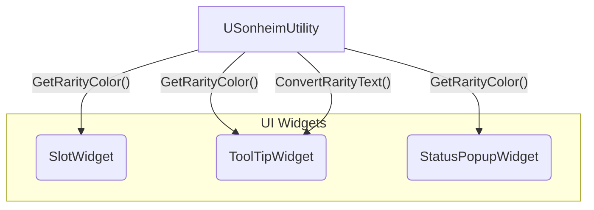

# 8.7. UI 스타일 및 유틸리티

## 8.7.1. 설계 목표: UI의 시각적 일관성 확보

게임의 모든 UI는 일관된 디자인 언어를 가져야 합니다. 예를 들어, "전설" 등급 아이템은 인벤토리 슬롯의 배경이든, 툴팁의 이름이든, 획득 팝업의 테두리든, 항상 동일한 "황금색"으로 표현되어야 합니다. 만약 이 색상 값을 각 위젯에 개별적으로 하드코딩한다면, 사소한 색상 변경 작업이 수많은 위젯을 수정해야 하는 거대한 작업으로 변하고, 디자이너와 프로그래머 간의 협업 비용이 급증할 것입니다.

이러한 문제를 해결하기 위해, Sonheim은 UI 스타일과 관련된 모든 규칙을 **`USonheimUtility`** 라는 중앙 유틸리티 클래스에 `static` 함수로 정의하여, **UI 스타일 규칙의 단일 출처(Single Source of Truth)**를 확보하는 것을 목표로 합니다.

---

## 8.7.2. 아키텍처: 중앙화된 스타일 규칙

모든 UI 위젯은 색상이나 텍스트 표현이 필요할 때, `USonheimUtility`의 `static` 함수를 직접 호출하여 결과값을 받아 사용합니다. 이를 통해 모든 위젯은 동일한 규칙에 따라 자신의 스타일을 결정하게 됩니다.



---

## 8.7.3. 코드 심층 분석

`USonheimUtility` 클래스는 아이템 등급(`EItemRarity`)과 같은 데이터에 대한 시각적 표현 규칙을 정의하는 여러 `static` 함수를 제공합니다.

#### 1. 등급별 색상 반환 (`GetRarityColor`)

이 함수는 `EItemRarity` 열거형 값을 입력받아, 그에 해당하는 `FLinearColor`를 반환합니다. 모든 UI 위젯은 아이템의 등급 색상을 표현해야 할 때, 이 함수를 호출하여 일관된 색상 값을 얻습니다.

> [View on GitHub](https://github.com/chungheonLee0325/Sonheim/blob/main/Sonheim/Source/Sonheim/Utilities/SonheimUtility.cpp#L78)
```cpp
// SonheimUtility.cpp - 아이템 등급에 따른 색상을 반환하는 중앙 함수
FLinearColor USonheimUtility::GetRarityColor(EItemRarity Rarity, float Alpha)
{
	switch (Rarity)
	{
	case EItemRarity::Common:
		return FLinearColor(0.8f, 0.8f, 0.8f, Alpha);  // 회색
	case EItemRarity::Uncommon:
		return FLinearColor(0.0f, 1.0f, 0.0f, Alpha);  // 녹색
	// ... (이하 생략)
	default:
		return FLinearColor::White;
	}
}
```
> [View on GitHub](https://github.com/chungheonLee0325/Sonheim/blob/main/Sonheim/Source/Sonheim/UI/Widget/Player/Inventory/SlotWidget.cpp#L26)
```cpp
// SlotWidget.cpp - GetRarityColor를 호출하여 슬롯 배경색을 설정하는 예시
void USlotWidget::SetItemData(const FItemData* ItemData, int32 NewQuantity)
{
    // ...
    if (IMG_BackGround)
    {
        IMG_BackGround->SetColorAndOpacity(USonheimUtility::GetRarityColor(ItemData->ItemRarity, 0.2f));
    }
    // ...
}
```

#### 2. 등급별 텍스트 변환 (`ConvertRarityText`)

`GetRarityColor`와 마찬가지로, 이 함수는 `EItemRarity` 값을 입력받아 "일반", "전설"과 같은 `FText`를 반환합니다. `ToolTipWidget`과 같이 아이템의 등급을 텍스트로 표시해야 하는 모든 위젯이 이 함수를 사용합니다.

---

## 8.7.4. 설계의 이점

*   **유지보수 효율성:** 만약 "전설" 등급의 색상을 약간 수정해야 할 경우, 디자이너는 `GetRarityColor` 함수 단 하나만 수정하면 게임 내 모든 UI에 변경사항이 즉시 일관되게 적용됩니다.
*   **협업 효율성:** 프로그래머는 각 위젯의 세부적인 색상 값에 대해 신경 쓸 필요 없이, `USonheimUtility`의 함수를 호출하기만 하면 됩니다. 디자이너는 유틸리티 클래스만 관리하면 되므로, 역할 분담이 명확해지고 협업이 원활해집니다.
*   **일관성 보장:** 모든 UI가 단일 출처의 스타일 규칙을 따르므로, 게임의 전체적인 시각적 완성도와 일관성이 보장됩니다.
