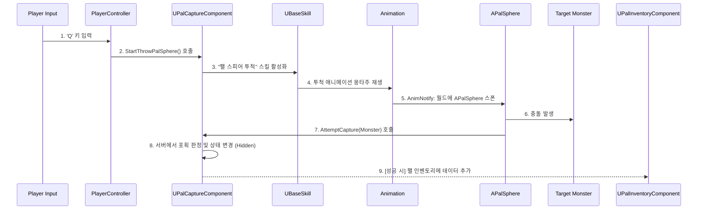

# 9.1. 사례 연구: 팰 포획 시퀀스 (Case Study: Pal Capture Sequence)

## 9.1.1. 서론

이 문서는 Sonheim의 핵심 게임플레이 기능인 **팰 포획(Pal Capture)**이 어떻게 여러 모듈화된 시스템들의 유기적인 협력을 통해 구현되는지, 그 전체적인 데이터와 이벤트의 흐름을 추적하는 사례 연구입니다. 이를 통해 각 시스템이 어떻게 자신의 역할에만 집중하면서도, 전체적으로는 복잡하고 완전한 기능을 완성하는지 보여주고자 합니다.

---

## 9.1.2. 포획 시퀀스 다이어그램

---

## 9.1.3. 단계별 상세 분석

#### 1단계: 입력 및 스킬 활성화

*   **시작점:** 플레이어가 'Q' 키를 누르는 것으로 시퀀스가 시작됩니다.
*   **흐름:**
    1.  `ASonheimPlayerController`가 키 입력을 감지합니다. (참고: [4.1. 플레이어 클래스 아키텍처](./4.1_Player_Class_Architecture.md))
    2.  `Controller`는 플레이어 `Pawn`에 부착된 `UPalCaptureComponent`의 `StartThrowPalSphere()` 함수를 호출하여 투척 준비 상태로 만듭니다.
    3.  플레이어가 마우스 버튼을 놓으면, `UPalCaptureComponent`는 데이터 테이블에 정의된 '팰 스피어 투척' 스킬을 찾아 활성화합니다. 이 과정은 [6.2. 스킬 아키텍처](./6.2_Skill_Architecture.md)에 정의된 파이프라인을 따릅니다.

#### 2단계: 투사체 발사

*   **시작점:** '팰 스피어 투척' 스킬이 활성화됩니다.
*   **흐름:**
    1.  `UBaseSkill` 객체는 자신의 데이터에 정의된 투척 애니메이션 몽타주를 재생합니다.
    2.  몽타주의 특정 프레임에 삽입된 `AnimNotify`가 트리거됩니다. (참고: [4.3. 애니메이션 시스템](./4.3_Animation_System.md))
    3.  `AnimNotify`는 `APalSphere`라는 투사체 액터를 월드에 스폰하고, 포물선 궤적으로 날아가도록 초기화합니다.

#### 3단계: 서버 측 판정

*   **시작점:** `APalSphere`가 월드의 몬스터와 충돌합니다.
*   **흐름:**
    1.  충돌이 감지되면, `APalSphere`는 자신을 던진 플레이어의 `UPalCaptureComponent`를 찾아 `AttemptCapture(Monster)` 함수를 호출합니다.
    2.  `UPalCaptureComponent`는 `Server_AttemptCapture` RPC를 통해 서버에 포획 시도를 알립니다.
    3.  서버의 `UPalCaptureComponent`는 대상 몬스터가 현재 포획 가능한 상태인지(다른 플레이어가 동시에 시도하지 않는지) **상태 잠금**을 통해 동시성을 제어합니다. (참고: [5.2. 파트너 AI](./5.2_Partner_AI.md))
    4.  서버는 대상 몬스터의 현재 HP, 상태이상 여부 등을 종합하여 **포획 성공 확률을 계산**하고, 계산된 확률에 따라 포획의 성공/실패 여부를 최종 판정합니다.

#### 4단계: 상태 변경 및 피드백

*   **시작점:** 서버의 `UPalCaptureComponent`가 포획 성공/실패를 판정합니다.
*   **흐름:**
    1.  포획 시도가 시작되면, 서버는 즉시 대상 몬스터의 AI 상태를 `Hidden`으로 변경하여 다른 모든 상호작용(공격 등)으로부터 보호합니다. (참고: [5.1. FSM 기반 AI](./5.1_FSM_based_AI.md))
    2.  포획의 결과(성공/실패)는 `Multicast` RPC를 통해 모든 클라이언트에 전파되어, 흔들리는 팰 스피어나 성공/실패 이펙트 등 동일한 시각적 피드백을 제공합니다.
    3.  이 과정에서 플레이어의 화면에는 포획 확률을 보여주는 UI가 표시됩니다. 이 UI는 서버로부터 받은 데이터에 의해서만 갱신됩니다. (참고: [8.1. UI 아키텍처](./8.1_UI_Architecture_and_Event_System.md))

#### 5단계: 결과 처리

*   **시작점:** 서버가 최종적으로 포획 성공을 확정합니다.
*   **흐름:**
    1.  서버의 `UPalCaptureComponent`는 포획 연출이 끝나는 타이밍에 맞춰, `UPalInventoryComponent`의 `AddPal` 함수를 호출합니다.
    2.  `AddPal` 함수는 몬스터의 소유권을 플레이어에게 설정(`SetPartnerOwner`)하고, 몬스터의 데이터를 `UPalInventoryComponent`의 배열에 추가합니다.
    3.  `UPalInventoryComponent`의 데이터 변경은 `Replicated` 설정을 통해 모든 클라이언트에 자동으로 동기화되고, 플레이어는 자신의 팰 목록 UI에서 새로 포획한 팰을 확인할 수 있습니다. (참고: [7.1. 인벤토리 시스템](./7.1_Inventory_System.md))

---

## 9.1.4. 결론

'팰 포획'이라는 단일 기능은 이처럼 **입력, 스킬, 애니메이션, 네트워크, AI, UI, 인벤토리** 등 수많은 시스템이 각자의 역할과 책임을 다하며 유기적으로 협력해야만 완성될 수 있습니다. Sonheim의 모듈화된 아키텍처는 각 시스템이 서로의 내부 구현을 알 필요 없이, 오직 잘 정의된 인터페이스와 이벤트(RPC, 델리게이트)를 통해서만 통신하도록 설계되었습니다. 이는 복잡한 기능을 안정적으로 구현하고, 향후 새로운 기능을 추가하거나 기존 기능을 수정할 때 유연하게 대처할 수 있는 강력한 기반이 됩니다.
