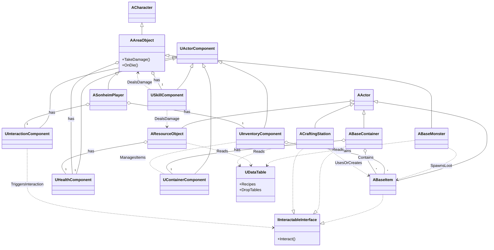

# Sonheim 프로젝트 기술 문서

이 문서는 Sonheim 프로젝트의 핵심 시스템 설계와 구현 내용을 종합한 기술 문서입니다.

---
## 시스템 개요 (아키텍처)

<b> 전체 시스템 아키텍처 다이어그램 펼쳐보기 </b>

 

 

---

### 목차 (Table of Contents)

*   **1. 프로젝트 개요 (Project Overview)**
    > 프로젝트의 비전, 핵심 게임플레이 루프, 그리고 전체 아키텍처를 관통하는 설계 원칙을 소개합니다.
    *   [1.1. 프로젝트 비전 및 목표](./1_Project_Overview.md): 이 프로젝트가 만들고자 하는 게임의 최종 목표와 핵심 경험을 정의합니다.

*   **2. 코어 아키텍처 (Core Architecture)**
    > 게임의 가장 근간이 되는 아키텍처 철학을 다룹니다. 데이터 테이블로 콘텐츠를 관리하는 '데이터 주도 설계'와, 기능을 독립적인 부품처럼 조립하는 '컴포넌트 기반 설계', 그리고 모든 캐릭터의 능력치를 관리하는 '어트리뷰트 시스템'에 대해 설명합니다.
    *   [2.1. 데이터 주도 설계](./2.1_Data_Driven_Design.md): "코드는 로직을, 데이터는 콘텐츠를" 원칙 아래, 데이터 테이블로 게임을 유연하게 만드는 방법을 설명합니다.
    *   [2.2. 컴포넌트 기반 설계](./2.2_Component_Based_Design.md): '상속보다 조립' 원칙을 통해, 기능을 독립적인 부품(컴포넌트)으로 만들어 재사용성과 확장성을 높이는 방법을 설명합니다.
    *   [2.3. 어트리뷰트 및 스탯 시스템](./2.3_Attribute_And_Stat_System.md): HP, 스태미나 등 캐릭터의 모든 능력치가 어떻게 정의되고, 장비나 버프에 의해 동적으로 변화하는지 설명합니다.

*   **3. 멀티플레이어 및 네트워킹 (Multiplayer & Networking)**
    > 안정적인 멀티플레이 환경을 구축하기 위한 핵심 원칙과 기술을 다룹니다. 서버가 모든 것을 결정하는 '서버 권한 아키텍처'와, 플레이어가 게임에 참여하는 '세션 관리'에 대해 설명합니다.
    *   [3.1. 서버 권한 아키텍처](./3.1_Server_Authority_Architecture.md): 모든 중요 로직을 서버에서만 처리하여 보안과 데이터 일관성을 확보하는, 멀티플레이 게임의 가장 중요한 원칙을 설명합니다.
    *   [3.2. 세션 관리 및 로비](./3.2_Session_Management_And_Lobby.md): 플레이어들이 어떻게 게임 세션을 만들고, 찾고, 참여하여 함께 플레이하게 되는지의 전 과정을 설명합니다.

*   **4. 플레이어 시스템 (Player System)**
    > 게임의 주인공인 플레이어 캐릭터의 구현 방식을 심층적으로 다룹니다. '두뇌-신체-영혼'으로 역할을 분리한 '클래스 아키텍처', 네트워크 지연 속에서도 부드러운 움직임을 보장하는 '네트워크 컨트롤', 그리고 행동에 생동감을 불어넣는 '애니메이션 시스템'에 대해 설명합니다.
    *   [4.1. 플레이어 클래스 아키텍처](./4.1_Player_Class_Architecture.md): 입력(Controller), 외형(Pawn), 데이터(PlayerState)의 역할을 명확히 분리하여 플레이어를 구현하는 방법을 설명합니다.
    *   [4.2. 네트워크 캐릭터 컨트롤](./4.2_Networked_Character_Control.md): 클라이언트 예측과 서버 보정을 통해, 네트워크 지연 환경에서도 부드럽고 반응성 좋은 움직임을 구현하는 방법을 설명합니다.
    *   [4.3. 애니메이션 시스템](./4.3_Animation_System.md): 애니메이션이 어떻게 게임플레이 로직(공격 판정, 무적)을 직접 트리거하여 완벽한 시각적 동기화를 이루는지 설명합니다.

*   **5. 몬스터 (AI) 시스템 (Monster (AI) System)**
    > 살아있는 생명체처럼 행동하는 몬스터의 인공지능을 다룹니다. 몬스터의 행동 패턴을 결정하는 'FSM 기반 AI' 프레임워크와, 플레이어를 돕는 동료로서 특별한 행동 로직을 가지는 '파트너 AI'에 대해 설명합니다.
    *   [5.1. FSM 기반 AI](./5.1_FSM_based_AI.md): 유한 상태 머신(FSM)을 통해, 몬스터가 상황(평시, 추격, 공격)에 따라 어떻게 다른 행동 패턴을 보이는지 설명합니다.
    *   [5.2. 파트너 AI](./5.2_Partner_AI.md): 플레이어의 동료가 된 몬스터가 어떻게 주인을 따라다니고, 전투를 돕는 등 야생 상태와는 다른 행동 로직을 갖게 되는지 설명합니다.

*   **6. 핵심 게임플레이 시스템 (Core Gameplay Systems)**
    > 게임의 핵심적인 재미를 구성하는 주요 메카닉을 다룹니다. 전략적 깊이를 더하는 '전투 및 피드백 시스템', 모든 행동의 기반이 되는 '스킬 아키텍처', 그리고 월드와 소통하는 '통합 상호작용 시스템'에 대해 설명합니다.
    *   [6.1. 전투 및 피드백 시스템](./6.1_Combat_and_Feedback_System.md): 속성 상성, 약점 공격 등 전략적인 전투 시스템과, 그 결과를 플로팅 데미지 UI로 명확하게 보여주는 피드백 시스템을 설명합니다.
    *   [6.2. 스킬 아키텍처](./6.2_Skill_Architecture.md): 기본 공격부터 특수 능력까지, 게임의 모든 행동을 '스킬'이라는 독립적인 객체로 관리하는 유연하고 확장 가능한 구조를 설명합니다.
    *   [6.3. 통합 상호작용 시스템](./6.3_Unified_Interaction_System.md): 아이템 줍기('Use')와 자원 채집('Harvest')처럼 다른 성격의 상호작용을, 각각 인터페이스와 데미지 시스템을 통해 일관되게 처리하는 방법을 설명합니다.

*   **7. 아이템 및 제작 시스템 (Item & Crafting Systems)**
    > 플레이어의 성장과 파밍의 즐거움을 담당하는 시스템을 다룹니다.
    *   [7.1. 인벤토리 시스템](./7.1_Inventory_System.md): 플레이어의 아이템과 장비를 안전하게 저장하고 관리하는 `InventoryComponent`의 핵심 설계와 API를 설명합니다.
    *   [7.2. 아이템 시스템 (ABaseItem)](./7.2_Item_System.md): 월드에 드롭된 아이템의 생명주기, 데이터 기반 외형, 물리 및 네트워크 최적화 방법을 설명합니다.
    *   [7.3. 자원 시스템 (ABaseResourceObject)](./7.3_Resource_System.md): `TakeDamage`를 오버라이드하여, 피해를 입을 때마다 단계적으로 자원을 생성하는 고유한 로직을 설명합니다.
    *   [7.4. 보관함 시스템 (UContainerComponent)](./7.4_Container_System.md): 여러 플레이어가 공유하는 월드 보관함의 데이터 구조와 구독 기반 네트워크 복제 전략을 설명합니다.
    *   [7.5. 제작 시스템](./7.5_Crafting_System.md): 레시피에 따라 아이템을 조합하고, 제작 과정을 관리하는 `CraftingComponent`의 핵심 로직을 설명합니다.

*   **8. UI / UX 시스템**
    > 플레이어에게 게임의 정보를 전달하고 상호작용하는 인터페이스를 다룹니다.
    *   [8.1. UI 아키텍처와 이벤트 시스템](./8.1_UI_Architecture_and_Event_System.md): `Controller`를 중재자로 하는 이벤트 기반 아키텍처를 통해, 게임 로직과 UI를 어떻게 완벽히 분리하는지 설명합니다.
    *   [8.2. UI 위젯 오브젝트 풀링](./8.2_UI_Widget_Object_Pooling.md): 반복적으로 생성/소멸되는 UI 요소들을 '풀링' 기법으로 재활용하여 성능을 최적화하는 방법을 설명합니다.
    *   [8.3. 인터페이스 기반 컨텍스트 UI](./8.3_Interface-Based_Contextual_UI.md): 단일 UI 위젯이 어떻게 인터페이스를 통해 수많은 종류의 월드 오브젝트와 독립적으로 상호작용하는지, 그 설계 패턴을 분석합니다.
    *   [8.4. 사례 연구: 조건부 이벤트를 통한 반응형 UI](./8.4_Event-Driven_UI_Architecture.md): 아이템 획득 시, 조건부 델리게이트를 통해 어떻게 여러 UI(인벤토리, 팝업)가 각기 다른 방식으로 동시에 반응하는지 심층 분석합니다.
    *   [8.5. 인벤토리 UI 시스템](./8.5_Inventory_UI_System.md): 인벤토리 데이터를 시각화하고, 드래그 앤 드롭, 아이템 사용 등 복잡한 사용자 상호작용을 처리하는 방법을 설명합니다.
    *   [8.6. 제작 UI 시스템](./8.6_Crafting_UI_System.md): 제작 레시피를 표시하고, 재료를 등록하며, 제작 과정을 시각적으로 피드백하는 UI의 구현을 설명합니다.
    *   [8.7. UI 스타일 및 유틸리티](./8.7_UI_Style_and_Utility.md): 게임 전체에 일관된 UI 스타일(색상, 폰트)을 적용하고, 반복적인 UI 로직을 자동화하는 유틸리티 함수들을 소개합니다.

*   **9. 통합 사례 연구 (Integration Case Studies)**
    > 각 시스템들이 어떻게 유기적으로 협력하여 하나의 완전한 기능을 완성하는지 실제 사례를 통해 보여줍니다.
    *   [9.1. 사례 연구: 클라이언트 예측으로 구현하는 반응형 인벤토리 UX](./9.1_Case_Study_Inventory_Interaction.md)
    *   [9.2. 사례 연구: 팰 포획 시퀀스](./9.2_Case_Study_Pal_Capture_Sequence.md)
    *   [9.3. 사례 연구: 제작 시스템으로 알아보는 컨텍스트 기반 상호작용](./9.3_Case_Study_Server_Authority_Crafting.md)

*   **10. 회고 및 향후 계획 (Retrospective & Future Plan)**
    > 프로젝트를 통해 얻은 기술적 교훈과 미래 발전 가능성을 다룹니다.
    *   [10.1. 프로젝트 회고](./10.1_Project_Retrospective.md): 프로젝트의 아키텍처와 구현 과정 전반에 걸쳐 잘된 점과 아쉬웠던 점을 기술적으로 분석하고 회고합니다.
    *   [10.2. 향후 작업 계획](./10.2_Future_Work.md): Gameplay Ability System(GAS) 도입 등, 현재 아키텍처를 한 단계 더 발전시키기 위한 구체적인 기술 계획을 제시합니다.
