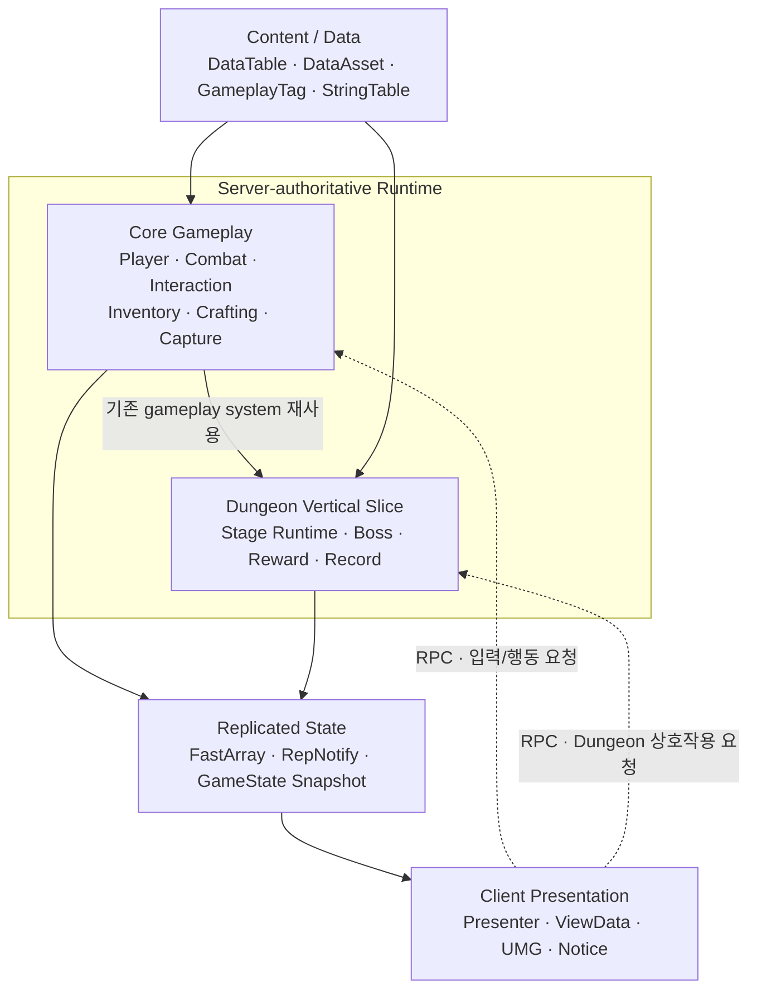

# Sonheim Engineering Wiki

> **Unreal Engine 5.5 / C++ 기반 서버 권위 멀티플레이 액션 어드벤처**
>
> 전투·포획·인벤토리·제작·상호작용 시스템을 멀티플레이 환경에서 구현하고, 이 기반 시스템들을 재사용해 **분기형 Dungeon Vertical Slice**까지 확장했습니다.

---

## 런타임 아키텍처


```mermaid
flowchart TB
    DATA["Content / Data<br/>DataTable · DataAsset · GameplayTag · StringTable"]

    subgraph SERVER["Server-authoritative Runtime"]
        CORE["Core Gameplay<br/>Player · Combat · Interaction<br/>Inventory · Crafting · Capture"]
        DUNGEON["Dungeon Vertical Slice<br/>Stage Runtime · Boss · Reward · Record"]
        CORE -->|"기존 gameplay system 재사용"| DUNGEON
    end

    STATE["Replicated State<br/>FastArray · RepNotify · GameState Snapshot"]
    CLIENT["Client Presentation<br/>Presenter · ViewData · UMG · Notice"]

    DATA --> CORE
    DATA --> DUNGEON

    CORE --> STATE
    DUNGEON --> STATE
    STATE --> CLIENT

    CLIENT -. "RPC · 입력/행동 요청" .-> CORE
    CLIENT -. "RPC · Dungeon 상호작용 요청" .-> DUNGEON
```

- **Content / Data** — Item·Skill 같은 반복 데이터는 DataTable, Dungeon·Boss 같은 콘텐츠 단위 정의는 DataAsset으로 관리합니다.
- **Server-authoritative Runtime** — 전투 결과, 인벤토리 변경, 제작 진행, 포획 성공, Dungeon 진행 같은 최종 gameplay state는 서버가 결정합니다.
- **Replicated State** — 개인 Inventory는 FastArray, Character state는 RepNotify, Dungeon처럼 복합적인 콘텐츠 상태는 GameState Snapshot으로 Client에 전달합니다.
- **Client Presentation** — Client는 복제된 상태를 HUD·미니맵·결과창·Notice 등 화면 표현으로 변환하며 gameplay 결과를 직접 확정하지 않습니다.

---

## Architecture Foundation

- [[2. Architecture Overview|2_Architecture_Overview]] — 서버가 최종 상태를 소유하고, 개인 상태·공유 상태·일회성 요청의 성격에 따라 **RPC와 Replication 범위**를 다르게 설계했습니다.
- [[3. Data & Content Architecture|3_Data_Content_Architecture]] — Item·Skill은 DataTable, Dungeon·Boss 콘텐츠는 DataAsset, 런타임 식별자는 GameplayTag로 나눠 **데이터의 수명과 사용 방식에 맞게 관리**합니다.

---

## Core Gameplay Foundations

- [[11. Player & Character Systems|11_Player_Character_Systems]] — Pawn·Controller·PlayerState의 수명을 나누고 Health·Condition·Stat·행동 가능 상태를 component 단위로 관리해 **캐릭터 상태와 네트워크 책임을 분리**했습니다.

- [[10. Combat, Skill & Animation|10_Combat_Skill_Animation]] — 스킬의 **정적 데이터·복제 상태·실행 로직을 분리**하고, 서버 검증 후 AnimNotify 시점에 근접/투사체 판정과 Damage를 실행합니다. 빠른 근접 공격은 frame 사이의 이동을 보간해 판정 누락을 줄였습니다.

- [[12. World Interaction Systems|12_World_Interaction_Systems]] — 하나의 `IInteractableInterface`로 **아이템 획득, 상자 열기, 제작대 작업, 레버·포털 작동**처럼 서로 다른 Actor의 상호작용을 공통 입력 흐름에 연결했습니다. 대상이 Prompt·Hold 시간·취소 가능 여부를 제공해 UI도 같은 contract를 사용합니다.

- [[8. Multiplayer Inventory & Crafting|8_Multiplayer_Inventory_Crafting]] — 개인 Inventory는 **Owner-only FastArray와 Client Prediction/Reconciliation**, 공유 Container와 Crafting Station은 **열람자와 작업 상태를 기준으로 한 서버 권위 동기화**를 사용합니다.

- [[9. Pal Capture & Partner Lifecycle|9_Pal_Capture_Partner_Lifecycle]] — 포획 확률 계산과 결과 판정은 서버가 수행하고, Capture 연출 이후 Ownership을 적용합니다. 획득한 Pal은 같은 Monster Actor를 비활성/재활성화해 **보관·선택·소환·Partner AI**까지 이어집니다.

---

## Dungeon Vertical Slice

- [[4. Branching Dungeon Runtime|4_Branching_Dungeon_Runtime]] — Stage마다 C++ 분기문을 작성하는 대신 **Event / Condition / Action / Transition을 DataAsset에 정의**하고 서버 Runtime이 해석해 분기·목표·시간 제한·실패·보상·기록을 진행합니다.

- [[7. Boss Encounter Runtime|7_Boss_Encounter_Runtime]] — 공격 패턴마다 **예고 영역, 실제 타격 시점, 공격 범위, 사거리, Phase 조건**을 데이터로 정의하고 공통 Boss Runtime이 실행합니다. Down·Exhaust·Capture Window도 같은 상태 흐름에 포함했습니다.

- [[5. Multiplayer State & UI Pipeline|5_Multiplayer_State_UI_Pipeline]] — Dungeon의 현재 상태를 GameState로 복제하고, Client에서 **Presenter가 화면용 ViewData로 변환**해 HUD·미니맵·Boss 정보·결과창을 구성합니다. Widget 수명과 gameplay state를 분리했습니다.

- [[6. Content Authoring & Validation|6_Content_Authoring_Validation]] — 잘못된 Stage 연결이나 필수 데이터 누락을 플레이 중에 찾지 않도록 **Editor 입력 제한, Data Validation, CallInEditor 검사, Stage Graph 생성**을 추가했습니다.

---

## Unreal Editor Automation — AgentMcp

[AgentMcp](https://github.com/chungheonLee0325/AgentMcp)는 **Codex·Claude Code 같은 coding agent가 Unreal Engine 5.5 Editor를 직접 조회·수정하고, 실행 결과까지 검증할 수 있게 만든 MCP 기반 Editor plugin**입니다.

일반적인 coding agent가 C++ 파일만 수정한 뒤 Blueprint·Animation·UMG·PIE 확인은 사람이 따로 처리해야 하는 흐름을 다음처럼 연결합니다.

```text
Inspect
  → Edit
  → Compile
  → Play In Editor
  → Log / Viewport Capture
  → Review
  → Iterate
```

Sonheim에서는 이 도구를 이용해 **Animation Blueprint·Montage·BlendSpace 구성, Blueprint Class Default 수정/확인, DataAsset·StringTable 작업, PIE 실행과 viewport capture 검증**을 코드 작업과 같은 흐름에서 수행했습니다.

- [[13. Development Workflow & Verification|13_Development_Workflow_Verification]] — Editor automation과 함께 Authoring Validation, multiplayer scenario test, viewport/PIE 확인을 어떤 기준으로 나눠 검증했는지 정리합니다.
- [AgentMcp Repository](https://github.com/chungheonLee0325/AgentMcp) — MCP server, Unreal Reflection 기반 toolset, UMG/Animation/Asset authoring, Build → Run → Review workflow 구현을 확인할 수 있습니다.

---

## Development History

- [[14. Development History & Retrospective|14_Development_History_Retrospective]] — 초기 Player·Combat·Inventory·Capture 시스템에서 시작해, 기존 시스템을 재사용하는 Dungeon Vertical Slice와 공용 UI/툴링으로 확장한 과정을 정리합니다.
- [[1. Project Overview|1_Project_Overview]] — 전체 gameplay loop와 주요 시스템 구성을 요약합니다.

---

## 코드 표기

Wiki의 코드 블록은 구현 구조를 설명하는 데 필요한 선언과 함수만 발췌하며, `UPROPERTY` metadata나 보조 필드는 일부 생략할 수 있습니다. 각 문서 하단의 **관련 코드** 링크에서 전체 구현을 확인할 수 있습니다.

---

## Source

- [Sonheim](https://github.com/chungheonLee0325/Sonheim) — 전체 Unreal Engine 프로젝트
- [Sonheim.Source](https://github.com/chungheonLee0325/Sonheim.Source) — Source / Config / Docs 중심 코드 검토용
- [AgentMcp](https://github.com/chungheonLee0325/AgentMcp) — Unreal Editor automation plugin
