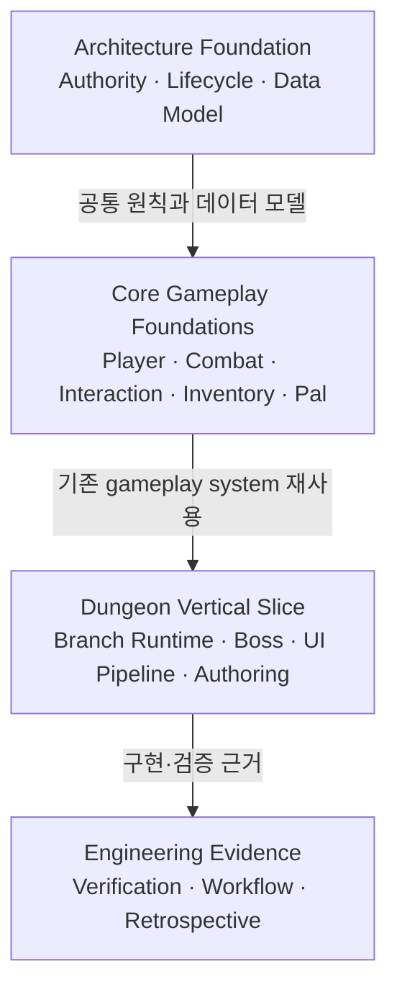

# Sonheim Engineering Wiki

> **Unreal Engine 5.5 / C++ 기반 서버 권위 멀티플레이 액션 어드벤처**
>
> 전투·포획·인벤토리·제작·상호작용 시스템을 서버 권위 구조로 구현하고, 이를 재사용해 **데이터 기반 분기형 Dungeon Vertical Slice**를 구성했습니다.

---

## 프로젝트 구조

아래 화살표는 **Runtime 호출 순서가 아니라 구현 계층과 재사용 관계**를 의미합니다.  
아래 계층은 위 계층에서 정의한 네트워크 원칙, 데이터 모델, gameplay system을 기반으로 구성됩니다.

```mermaid
flowchart TB
    A["Architecture Foundation<br/>Authority · Lifecycle · Data Model"]
    B["Core Gameplay Foundations<br/>Player · Combat · Interaction · Inventory · Pal"]
    C["Dungeon Vertical Slice<br/>Branch Runtime · Boss · UI Pipeline · Authoring"]
    D["Engineering Evidence<br/>Verification · Workflow · Retrospective"]

    A -->|"공통 원칙과 데이터 모델"| B
    B -->|"기존 gameplay system 재사용"| C
    C -->|"구현·검증 근거"| D
```

### Architecture Foundation

- [[2. Architecture Overview|2_Architecture_Overview]] — **Server Authority, RPC/Replication, 객체 수명과 상태 소유권**을 기준으로 Player·World·UI 시스템의 책임을 분리했습니다.
- [[3. Data & Content Architecture|3_Data_Content_Architecture]] — **DataTable / PrimaryDataAsset / GameplayTag / Soft Reference**를 데이터 성격에 따라 구분해 gameplay row와 콘텐츠 단위 asset을 관리합니다.

### Core Gameplay Foundations

- [[11. Player & Character Systems|11_Player_Character_Systems]] — Pawn·Controller·PlayerState의 수명을 분리하고, Health·Condition·Stat·Action State를 component와 source 기반 modifier로 구성했습니다.
- [[10. Combat, Skill & Animation|10_Combat_Skill_Animation]] — **FSkillData → FastArray Skill Spec → UBaseSkill → AnimNotify → AttackData → Damage Event**로 전투 실행 흐름을 구성하고, 고속 melee sweep의 누락·중복 판정을 보완했습니다.
- [[12. World Interaction Systems|12_World_Interaction_Systems]] — Item·Container·Portal·Lever를 `IInteractableInterface`로 통합하고, 물리적 공격/채집은 별도의 Damage pipeline으로 유지했습니다.
- [[8. Multiplayer Inventory & Crafting|8_Multiplayer_Inventory_Crafting]] — 개인 Inventory는 **Owner-only FastArray + Prediction/Reconciliation**, 공유 Container/Crafting은 **Subscriber와 Server-authoritative shared state**로 동기화합니다.
- [[9. Pal Capture & Partner Lifecycle|9_Pal_Capture_Partner_Lifecycle]] — Capture 판정·Reveal·Ownership·보관·소환·Partner AI를 하나의 lifecycle로 연결하고, 결과 판정과 presentation 시점을 분리했습니다.

### Dungeon Vertical Slice

- [[4. Branching Dungeon Runtime|4_Branching_Dungeon_Runtime]] — Stage별 C++ 분기 대신 **Event / Condition / Action / Transition**을 DataAsset에 정의하고 Server Runtime이 해석해 분기·실패·보상·기록을 진행합니다.
- [[7. Boss Encounter Runtime|7_Boss_Encounter_Runtime]] — `FBossPattern`과 `FBossStrike`에 Telegraph·공격 범위·Timing·Phase 조건을 정의해 공통 Boss executor가 패턴을 실행합니다.
- [[5. Multiplayer State & UI Pipeline|5_Multiplayer_State_UI_Pipeline]] — Dungeon의 authoritative state를 **Replicated Snapshot → Presenter → ViewData → LocalPlayer UI**로 변환해 gameplay lifecycle과 UMG lifecycle을 분리했습니다.
- [[6. Content Authoring & Validation|6_Content_Authoring_Validation]] — EditCondition·GameplayTag 제한·Data Validation·CallInEditor·Stage Graph 생성으로 데이터 기반 콘텐츠의 작성 오류를 실행 전에 검출합니다.

### Engineering Evidence

- [[13. Development Workflow & Verification|13_Development_Workflow_Verification]] — Authoring Validation, multiplayer scenario verification, Editor/viewport 확인을 분리하고 AgentMcp를 UE Editor 작업 자동화에 사용합니다.
- [[14. Development History & Retrospective|14_Development_History_Retrospective]] — 초기 gameplay foundation에서 Dungeon Vertical Slice까지 구조가 어떻게 확장·수정되었는지 ownership과 재사용 관점에서 정리합니다.

---

## 대표 구현 흐름

### 전투 / Gameplay

[[11. Player & Character Systems|11_Player_Character_Systems]]
→ [[10. Combat, Skill & Animation|10_Combat_Skill_Animation]]
→ [[9. Pal Capture & Partner Lifecycle|9_Pal_Capture_Partner_Lifecycle]]
→ [[7. Boss Encounter Runtime|7_Boss_Encounter_Runtime]]

- **Player & Character** — 행동 가능 상태와 Stat/Attribute의 소유 위치를 정의합니다.
- **Combat, Skill & Animation** — Skill 데이터가 Server 검증과 Animation timing을 거쳐 실제 Damage로 이어집니다.
- **Pal Capture & Partner** — 전투 대상의 상태를 Capture ownership과 Partner lifecycle로 확장합니다.
- **Boss Encounter** — 동일 Combat 기반 위에 Telegraph, Phase, Break/Exhaust와 Capture Window를 추가합니다.

### Multiplayer State / UI

[[2. Architecture Overview|2_Architecture_Overview]]
→ [[8. Multiplayer Inventory & Crafting|8_Multiplayer_Inventory_Crafting]]
→ [[5. Multiplayer State & UI Pipeline|5_Multiplayer_State_UI_Pipeline]]

- **Architecture** — Authority와 replication scope를 정하는 공통 기준입니다.
- **Inventory & Crafting** — 개인 소유 상태와 공유 월드 상태에 서로 다른 replication policy를 적용합니다.
- **State & UI Pipeline** — 복합 콘텐츠 상태를 Snapshot으로 복제하고 Client presentation model로 변환합니다.

### Content Runtime / Tooling

[[3. Data & Content Architecture|3_Data_Content_Architecture]]
→ [[4. Branching Dungeon Runtime|4_Branching_Dungeon_Runtime]]
→ [[6. Content Authoring & Validation|6_Content_Authoring_Validation]]
→ [[13. Development Workflow & Verification|13_Development_Workflow_Verification]]

- **Data & Content** — 콘텐츠를 어떤 데이터 표현으로 관리할지 결정합니다.
- **Dungeon Runtime** — Definition을 Server가 실행 가능한 gameplay flow로 해석합니다.
- **Authoring & Validation** — 잘못된 콘텐츠 조합을 Editor 단계에서 차단합니다.
- **Workflow & Verification** — 구현 이후 multiplayer scenario와 Editor 결과를 반복 검증합니다.

---

## 프로젝트 개요

[[1. Project Overview|1_Project_Overview]] — 전체 gameplay loop, 주요 시스템, Dungeon Vertical Slice와 저장소 구성을 요약합니다.

---

## Source

- [Sonheim](https://github.com/chungheonLee0325/Sonheim) — 전체 Unreal Engine 프로젝트
- [Sonheim.Source](https://github.com/chungheonLee0325/Sonheim.Source) — Source / Config / Docs 중심 코드 검토용
- [AgentMcp](https://github.com/chungheonLee0325/AgentMcp) — Unreal Editor automation / agent integration
