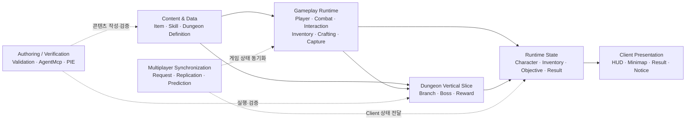

# Sonheim Engineering Wiki

> **Unreal Engine 5.5 / C++ 기반 멀티플레이 액션 어드벤처**
>
> 전투·포획·인벤토리·제작·상호작용 시스템을 구현하고, 이 기반 시스템을 재사용해 **분기형 Dungeon Vertical Slice**까지 확장했습니다.

---

## Project Overview

- [[1. Project Overview|1_Project_Overview]] — 전투·수집·제작·포획·성장이 서로 연결되는 gameplay loop와, 이 시스템들이 Dungeon 콘텐츠에서 어떻게 다시 조합되는지 전체 구조를 요약합니다.

---

## 프로젝트 구조


```mermaid
flowchart LR
    DATA["Content & Data<br/>Item · Skill · Dungeon Definition"]
    GAME["Gameplay Runtime<br/>Player · Combat · Interaction<br/>Inventory · Crafting · Capture"]
    DUNGEON["Dungeon Vertical Slice<br/>Branch · Boss · Reward"]
    STATE["Runtime State<br/>Character · Inventory · Objective · Result"]
    UI["Client Presentation<br/>HUD · Minimap · Result · Notice"]

    NET["Multiplayer Synchronization<br/>Request · Replication · Prediction"]
    TOOL["Authoring / Verification<br/>Validation · AgentMcp · PIE"]

    DATA --> GAME
    DATA --> DUNGEON
    GAME --> DUNGEON

    GAME --> STATE
    DUNGEON --> STATE
    STATE --> UI

    NET -. "게임 상태 동기화" .-> GAME
    NET -. "Client 상태 전달" .-> STATE

    TOOL -. "콘텐츠 작성·검증" .-> DATA
    TOOL -. "실행·검증" .-> DUNGEON
```

- **실선** — 콘텐츠 정의와 gameplay state가 실제 runtime에서 이어지는 관계
- **점선** — 여러 시스템에 걸쳐 적용되는 동기화·개발 도구
- **Dungeon Vertical Slice** — 기존 Combat·Interaction·Inventory·Capture를 별도 구현하지 않고 콘텐츠 흐름 안에서 재사용

---

## Architecture & Data

- [[2. Gameplay Architecture|2_Gameplay_Architecture]] — 상태를 **Pawn·PlayerState·Subsystem 등 실제 수명에 맞춰 배치**하고, Component·Interface로 기능을 조합하며 gameplay와 UI의 책임을 분리했습니다.
- [[3. Data & Content Architecture|3_Data_Content_Architecture]] — Item·Skill 같은 반복 데이터는 DataTable, Dungeon·Boss처럼 독립된 콘텐츠 정의는 DataAsset, 런타임 식별자는 GameplayTag로 관리합니다.

---

## Core Gameplay Systems

- [[4. Player & Character Systems|4_Player_Character_Systems]] — Player의 World body와 지속 데이터를 Pawn/PlayerState로 나누고, Health·Condition·Stat·행동 가능 상태를 component 단위로 관리합니다.
- [[5. Combat, Skill & Animation|5_Combat_Skill_Animation]] — Skill의 **정적 데이터·현재 상태·실행 로직을 분리**하고, Animation Notify 시점에 공격 판정과 Damage를 실행합니다. 빠른 melee는 frame 사이 이동을 보간해 판정 누락을 줄였습니다.
- [[6. World Interaction Systems|6_World_Interaction_Systems]] — 하나의 `IInteractableInterface`로 **아이템 획득, 상자 열기, 제작대 작업, 레버·포털 작동**을 같은 입력/UI 흐름에 연결하고, 각 Actor가 실제 행동만 다르게 구현합니다.
- [[7. Inventory & Crafting|7_Inventory_Crafting]] — Inventory·Container·Crafting Station의 Item 흐름을 연결하고, 개인 보관·공유 보관·협력 제작처럼 소유 범위가 다른 상태를 각각 관리합니다.
- [[8. Pal Capture & Partner Lifecycle|8_Pal_Capture_Partner_Lifecycle]] — Monster 포획 판정과 연출, 소유권 적용, 보관·선택·소환·Partner AI까지 하나의 lifecycle로 연결했습니다.

---

## Dungeon Vertical Slice

- [[9. Branching Dungeon Runtime|9_Branching_Dungeon_Runtime]] — Stage별 C++ 분기문 대신 **Event / Condition / Action / Transition을 데이터로 정의**하고, Runtime이 분기·Objective·시간 제한·실패·Reward를 진행합니다.
- [[10. Boss Encounter Runtime|10_Boss_Encounter_Runtime]] — 공격마다 예고 영역·타격 시점·범위·사거리·Phase 조건을 데이터로 정의하고, 공통 Boss Runtime이 Pattern을 실행합니다.
- [[11. Client State & Presentation Pipeline|11_Client_State_Presentation_Pipeline]] — Dungeon의 현재 상태를 화면용 ViewData로 변환해 HUD·Boss 정보·Minimap·Result를 구성하고, gameplay lifecycle과 Widget lifecycle을 분리합니다.

---

## Multiplayer Synchronization

- [[12. Multiplayer Synchronization|12_Multiplayer_Synchronization]] — Sonheim의 UE multiplayer 구현에서 **요청과 상태, 동기화 범위, Prediction/Reconciliation, 순간 연출**을 어떻게 구분했는지 Inventory·Skill·Capture·Dungeon 사례로 정리합니다.

> Sonheim은 Unreal RPC/Replication 기반 Listen Server 구현입니다. 외부 전용 게임 서버의 socket/packet 계층을 구현한 프로젝트와 동일하게 표현하지 않고, 실제 구현 범위와 그 안에서 적용한 상태 동기화 설계를 구분해 설명합니다.

---

## Content Authoring & Engineering

- [[13. Content Authoring & Validation|13_Content_Authoring_Validation]] — 잘못된 Stage 연결·필수 데이터 누락·Boss timing을 플레이 중에 찾지 않도록 Editor 입력 제한, Data Validation, CallInEditor 검사와 Stage Graph 생성을 추가했습니다.
- [[14. Development Workflow & Verification|14_Development_Workflow_Verification]] — Authoring Validation, multiplayer scenario test, PIE/viewport 확인을 나누고 반복 가능한 검증 workflow를 구성했습니다.
- [[15. Development History & Retrospective|15_Development_History_Retrospective]] — 초기 gameplay system에서 Dungeon Vertical Slice까지 기능이 확장되면서 실제로 ownership과 시스템 경계를 어떻게 수정했는지 정리합니다.

### AgentMcp

[AgentMcp](https://github.com/chungheonLee0325/AgentMcp)는 **coding agent가 Unreal Engine 5.5 Editor의 Blueprint·Animation·UMG·Asset을 조회/수정하고 PIE 결과까지 확인할 수 있게 만든 MCP 기반 Editor plugin**입니다.

```text
C++ / Asset Inspect
 → Editor Edit
 → Compile
 → PIE
 → Log / Viewport Capture
 → Review
 → Iterate
```

Sonheim에서는 Animation Blueprint·Montage·BlendSpace 구성, Blueprint Class Default 수정/검증, DataAsset·StringTable 작업, PIE 실행과 viewport capture에 사용했습니다.

---

## 코드 표기

Wiki의 코드 블록은 구현 구조를 설명하는 데 필요한 선언과 함수만 발췌하며, `UPROPERTY` metadata나 보조 필드는 일부 생략할 수 있습니다. 각 문서 하단의 **관련 코드** 링크에서 전체 구현을 확인할 수 있습니다.

---

## Source

- [Sonheim](https://github.com/chungheonLee0325/Sonheim) — 전체 Unreal Engine 프로젝트
- [Sonheim.Source](https://github.com/chungheonLee0325/Sonheim.Source) — Source / Config / Docs 중심 코드 검토용
- [AgentMcp](https://github.com/chungheonLee0325/AgentMcp) — Unreal Editor automation plugin
