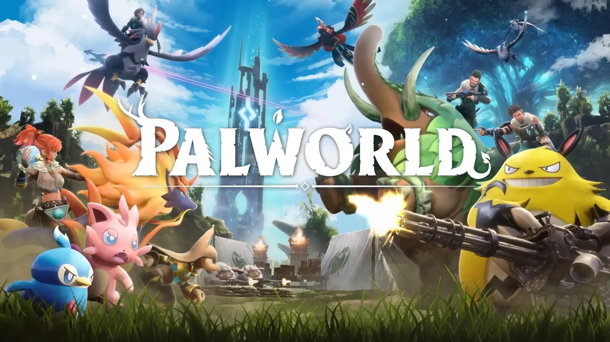

# Sonheim 프로젝트

 
## 1. 개요

Sonheim은 언리얼 엔진 5.5 기반의 3인칭 액션 어드벤처 게임 프로젝트입니다. 이 프로젝트는 팰월드(Palworld) 스타일의 몬스터("Pal") 수집 및 전투, 자원 관리, 온라인 멀티플레이 기능 구현을 목표로 하며, 컴포넌트 기반 및 데이터 주도 설계를 적극적으로 적용하여 개발되었습니다.

* **장르:** 3인칭 액션 어드벤처 (몬스터 수집, 오픈월드 요소 포함)
* **개발 기간:** (2025년 3월 ~ 2025년 3월)
* **개발 인원:** (프로그래밍밍 2)
* **참고 게임:** (팰월드, 포켓몬스터 아르세우스)

## 2. 주요 기능 및 특징

* **핵심 게임플레이 루프:**
    * 광활한 월드 탐험 및 자원 채집 (`BaseResourceObject`)
    * 다양한 "Pal" 몬스터 발견 및 팰 스피어를 이용한 포획 (`PalSphere`)
    * 플레이어 캐릭터 및 동료 Pal을 활용한 실시간 전투
    * 아이템 획득 및 인벤토리/장비 관리 (`InventoryComponent`)
    * 온라인 멀티플레이 세션 참여 및 협동 플레이 (`SessionUtil`)
    * 감시탑을 완성하여 바위산을 넘어 섬 탈출이 목표

* **플레이어 시스템 (`SonheimPlayer`):**
    * Enhanced Input 기반 3인칭 조작 (이동, 시점, 점프, 질주, 회피)
    * 무기 및 팰 스피어 기반의 공격/조준 시스템
    * 글라이더를 이용한 활강 이동
    * 상태 머신(`EPlayerState`) 기반 행동 제어
    * 팰 소유, 선택, 소환/회수 기능

* **Pal (몬스터) 시스템 (`BaseMonster`):**
    * 다양한 Pal 종류 구현 (Lamball, Gumoss, Foxparks 등) 및 데이터 테이블 관리 (`FAreaObjectData`)
    * FSM 기반 AI (`BaseAiFSM`): 전투, 파트너, 작업(벌목 등) 상태 구현
    * 스킬 룰렛(`BaseSkillRoulette`)을 통한 동적 스킬 선택
    * 파트너 시스템: 플레이어 소유 및 동행, 파트너 스킬 사용
    * 표정 변화 시스템 (`EFaceType`)

* **전투 및 스킬 시스템 (`BaseSkill`, `FAttackData`):**
    * 데이터 테이블 기반 스킬 시스템 (`FSkillData`)
    * 근접(`MeleeAttack`) 및 원거리(발사체 - `BaseElement`) 스킬 구현
    * 속성(`EElementalAttribute`) 시스템,상성 데미지 계산, 자속기 구현현
    * 히트 감지 시스템 (애니메이션 노티파이 연동, 다양한 충돌체 지원)
    * 히트스톱, 넉백 등 전투 피격 반응

* **아이템 및 인벤토리 시스템 (`InventoryComponent`, `FItemData`):**
    * 데이터 테이블 기반 아이템 관리 (`FItemData`)
    * 슬롯 기반 인벤토리 및 장비창 UI (`InventoryWidget`)
    * 아이템 획득, 사용, 장착, 해제 기능
    * 스탯 보너스 컴포넌트(`StatBonusComponent`)를 통한 장비 스탯 적용
    * 무기에 따른 공격 스킬 변경(애니메이션, 데미지, 속성 등)
    * 무기 스왑에 따른 동적 장비 스탯 적용용

* **온라인 멀티플레이 (`SessionUtil`):**
    * Steam 기반 세션 생성, 검색, 참여 지원
    * 플레이어 상태, 캐릭터 위치, 스킬 사용 등 핵심 게임플레이 요소 리플리케이션

* **UI 시스템 (UMG):**
    * 플레이어 HUD (체력, 스태미나, 레벨, 경험치, 팰 슬롯 등)
    * 인벤토리, 장비창, 스탯창, 아이템 툴팁
    * 몬스터 상태 UI (체력, 피아식별, 속성)
    * 플로팅 데미지 텍스트
    * 온라인 로비 UI (방 만들기, 방 찾기, 방 정보)

## 3. 사용 기술

* **Engine:** Unreal Engine 5.5
* **Language:** C++ (핵심 게임플레이 로직, 시스템)
* **Blueprint:** UI 로직, 애니메이션 블루프린트 상태 머신, 간단한 이벤트 처리, 감시탑 건설 기능
* **Key Systems & Modules:** Enhanced Input, UMG, Niagara, AIModule, LevelSequence, MovieScene, OnlineSubsystem (Steam, Null), NavigationSystem, Data Tables, Custom FSM, Custom Skill System

## 4. 프로젝트 구조
```
Sonheim/
├── Animation/      # 애니메이션 (AnimInstance, Notifies)
│   ├── Common/
│   ├── Monster/
│   └── Player/
├── AreaObject/     # 게임 월드 액터
│   ├── AI/         # 몬스터 AI (FSM, States)
│   ├── Attribute/  # 속성 컴포넌트 (Health, Stamina, Level, StatBonus 등)
│   ├── Base/       # 기본 AreaObject
│   ├── Monster/    # 몬스터 (Base, Variants, SkillRoulette)
│   ├── Player/     # 플레이어 (Character, Controller, State, Inventory)
│   ├── Skill/      # 스킬 (Base, Common, Monster)
│   └── Utility/    # 보조 유틸리티 (MoveUtil, RotateUtil, GhostTrail)
├── Element/        # 발사체/효과 액터 (Base, Derived)
├── GameManager/    # 게임 프레임워크 (GameInstance, GameMode, GameState)
├── GameObject/     # 아이템, 자원 등 게임 오브젝트
│   ├── Items/      # 아이템 (Base, Weapon)
│   └── ResourceObject/ # 자원 오브젝트 (Base)
├── ResourceManager/ # 게임 데이터 타입 정의 (SonheimGameType)
├── UI/             # UI (Widgets, FloatingDamageActor)
│   ├── Widget/     # UMG 위젯
│   └── ...
└── Utilities/      # 공용 유틸리티 (LogMacro, SessionUtil, SonheimUtility)
```

## 5. 설치 및 실행 방법

1.  **요구 사양:**
    * Unreal Engine 5.5 설치
    * Visual Studio 와 C++ 개발 도구 설치
    * (Steam 연동 테스트 시) Steam 클라이언트 설치 및 실행
2.  **빌드:**
    * 프로젝트 루트 폴더의 `Sonheim.uproject` 파일을 우클릭하여 "Generate Visual Studio project files" 실행
    * 생성된 `Sonheim.sln` 파일을 Visual Studio로 열기
    * 솔루션 구성을 `Development Editor`로 설정하고 'Sonheim' 프로젝트를 빌드
3.  **실행:**
    * Unreal Editor에서 `Sonheim.uproject` 파일 열기
    * (필요시) 콘텐츠 브라우저에서 메인 로비 레벨(`Content/_Maps/LobbyMap`) 또는 게임 레벨(`Content/_Maps/GameMap`) 열기
    * 에디터 상단의 'Play' 버튼 클릭하여 실행 (PIE - Play In Editor)
    * 온라인 테스트: 에디터 상단의 플레이 옵션에서 'Net Mode'를 'Play As Listen Server' 또는 'Play As Client'로 설정하고 플레이어 수를 조절하여 실행. 또는 독립 실행(Standalone)으로 여러 개 실행.

## 6. 주요 조작키

* **이동:** W, A, S, D
* **시점 조작:** 마우스 이동
* **공격/상호작용:** 마우스 좌클릭
* **조준/보조 액션:** 마우스 우클릭
* **점프/글라이더:** 스페이스 바 (공중에서 Space 홀드하면 글라이더 유지, V 로 글라이더 토글 가능)
* **질주:** Shift
* **회피:** Ctrl
* **재장전:** R
* **무기 전환:** 마우스 휠
* **파트너 스킬:** F
* **팰 소환/회수:** E
* **팰 전환:** 1, 3
* **팰 스피어 던지기:** Q (누르고 떼기)
* **메뉴:** Tab

## 7. 구현 상세 및 학습 내용

* **컴포넌트 기반 아키텍처:** `AAreaObject`를 중심으로 Health, Stamina, Condition, Level, StatBonus, Inventory, AI FSM 등 주요 기능을 `UActorComponent`로 분리하여 설계했습니다. 이를 통해 각 기능의 독립성을 높이고 코드 재사용 및 유지보수를 용이하게 했습니다. 각 컴포넌트는 델리게이트를 통해 상태 변화를 외부에 알리고 상호작용합니다 (예: `OnHealthChanged`, `OnStaminaChanged`).
* **데이터 주도 설계:** 게임의 핵심 데이터(캐릭터 스탯, 스킬 정보, 아이템 속성, 레벨 경험치 요구량 등)를 `UDataTable`로 관리하여, 코드 변경 없이 데이터 수정만으로 밸런스 조절 및 콘텐츠 확장이 가능하도록 구현했습니다. `USonheimGameInstance`에서 이 데이터들을 로드하고 접근 인터페이스를 제공합니다.
* **커스텀 AI FSM:** 언리얼의 비헤이비어 트리 대신 C++ 기반의 유한 상태 머신 (`UBaseAiFSM`, `UBaseAiState`)을 직접 구현하여 몬스터 AI 로직을 관리합니다. 상태별 진입(`Enter`), 실행(`Execute`), 종료(`Exit`) 로직을 명확히 분리하고, 상태 전환 로직을 FSM 내에서 관리하여 복잡한 AI 행동 패턴(전투, 파트너 모드, 작업 등)을 체계적으로 구현했습니다. 상태 정보는 네트워크를 통해 동기화됩니다.
* **모듈화된 스킬 시스템:** `UBaseSkill` 클래스를 기반으로 상속을 통해 다양한 종류의 스킬(근접 공격, 발사체, 회복 등)을 구현했습니다. 스킬 데이터는 데이터 테이블에서 로드하며, 애니메이션 몽타주 및 노티파이와 연동하여 정교한 타이밍 제어가 가능합니다. 스킬 사용 가능 여부(쿨다운, 거리, 스태미나)를 체크하는 로직도 포함되어 있습니다.
* **네트워크 동기화:** 언리얼 엔진의 리플리케이션 시스템을 활용하여 주요 액터(Player, Monster, Projectile)의 속성 및 상태(위치, HP, 스태미나, AI 상태, 장착 아이템 등)를 동기화하고, 스킬 사용, 데미지 처리 등 핵심 게임플레이 로직을 RPC(Remote Procedure Call)를 통해 구현하여 멀티플레이 환경을 지원합니다. 온라인 세션 관리를 위한 `SessionUtil` 클래스를 구현했습니다.
* **애니메이션 연동:** `AnimNotify` 및 `AnimNotifyState`를 적극적으로 사용하여 애니메이션 재생 중 특정 시점에 게임 로직(충돌 판정 활성화/비활성화, 스킬 효과 발동, 이동/회전 적용, 상태 변경 등)을 트리거하도록 구현했습니다. `BaseAnimInstance` 클래스에서 몽타주 재생 및 우선순위 관리 시스템을 구현했습니다.

## 8. 개발 중 겪었던 어려움 및 해결 과정

* **팰 포획 확률 로직 구현:** 초기에는 단순 확률로 포획을 처리했으나, 몬스터의 남은 체력 비율에 따라 포획 확률이 동적으로 변하는 로직을 구현하는 데 어려움이 있었습니다. 이를 해결하기 위해 `PalSphere` 클래스 내 `CheckPalCatch` 함수에서 몬스터의 현재 HP 비율을 가져와 포획률을 계산하고, `FMath::RandRange`를 사용하여 확률적으로 포획 성공/실패를 결정하도록 수정했습니다.
* **파트너 팰 동기화 문제:** 플레이어에게 팰이 부착되어 파트너 스킬을 사용하는 동안 위치 동기화가 불안정하거나 충돌 문제가 발생하는 경우가 있었습니다. `PartnerSkillMode` 상태 진입 시 팰의 충돌 및 물리 시뮬레이션을 비활성화하고, `AttachToComponent` 옵션을 조정하며, 상태 종료 시 원래대로 복원하는 과정을 반복 테스트하여 안정성을 확보했습니다.
* **AI 상태 전이 디버깅:** 특정 상황에서 몬스터 AI가 예상치 못한 상태로 전환되거나 멈추는 문제가 발생했습니다. 각 FSM과 State 클래스에 `FLog` 매크로를 활용한 상세 로그를 추가하고, 에디터에서 플레이하며 AI 상태 변화를 실시간으로 추적하여 상태 전이 조건의 논리 오류를 찾아 수정했습니다.

## 9. 향후 개선 방향

* **AI Perception 시스템 활용:** 현재 주석 처리된 `AIPerceptionComponent` 관련 코드를 활성화하고, 시야 및 청각 감지를 통해 더욱 현실적인 몬스터 감지 및 어그로 관리 시스템을 구현할 수 있습니다.
* **오브젝트 풀링:** 플로팅 데미지 액터 (`AFloatingDamageActor`), 발사체 (`ABaseElement` 파생 클래스) 등 자주 생성되고 파괴되는 액터에 대해 오브젝트 풀링을 적용하여 성능을 개선할 수 있습니다.
* **코드 리팩토링:**
    * 매직 넘버(하드코딩된 숫자 값)들을 상수나 Enum으로 정의하여 가독성과 유지보수성을 높입니다 (예: 스킬 ID, 스탯 값 등).
    * `// ToDo:` 주석으로 표시된 부분들을 검토하고 개선합니다 (예: `LevelComponent`의 스탯 보너스 적용 로직, `BaseMonster`의 파트너 소유권 설정 로직 등).
    * 클래스 간의 의존성을 줄이기 위해 인터페이스 사용을 고려하거나 델리게이트 활용을 확장합니다.
* **콘텐츠 확장:**
    * 데이터 테이블을 이용하여 새로운 Pal, 스킬, 아이템, 자원 등을 추가합니다.
    * 더 다양한 AI 행동 패턴 및 보스 몬스터의 페이즈 시스템을 구현합니다.
* **시스템 확장:**
    * 주석 처리된 `AbilityManagerComponent`를 구현하여 플레이어에게 특수 능력(예: 물 위 걷기, 높은 점프)을 부여하는 시스템을 만들 수 있습니다.
    * 건축 또는 제작 시스템을 추가합니다.
* **UI/UX 개선:** 현재 구현된 UI를 바탕으로 사용성 및 시각적 완성도를 높입니다.
* **최적화:** 프로파일링 도구를 사용하여 병목 현상을 식별하고 게임 성능을 개선합니다.

## 10. 팀원 및 역할

* **이충헌:** ( *플레이어 시스템, 기본 전투 메카닉, AI 프레임워크 구현, 아이템/인벤토리 시스템 구현, 자원 시스템, UI 시스템템* )
* **이도윤:** ( *몬스터 AI 및 스킬 구현, 온라인 시스템 및 세션 관리* )

---